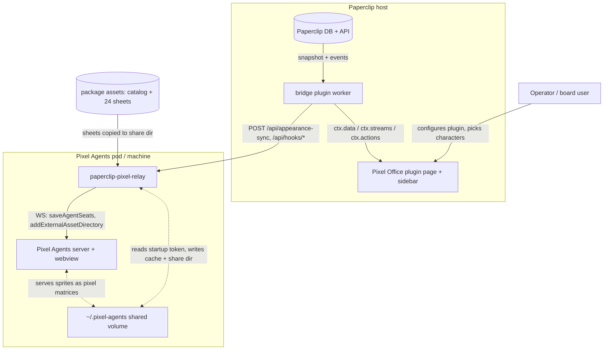
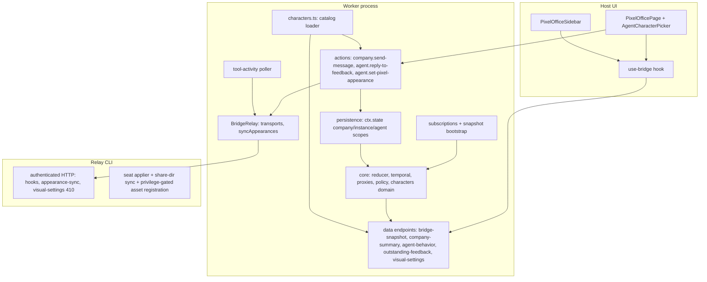

# Architecture Handbook — Paperclip ↔ Pixel Agents Bridge (`@decaf-ts/paperclip-pixels`)

## 00. Index

| Field | Value |
|---|---|
| Project | `@decaf-ts/paperclip-pixels` — Paperclip plugin + `paperclip-pixel-relay` companion CLI |
| Current version | 0.6.0 (`package.json`) |
| Owning team | with-ai engineering (CTO technical governance; delivery via Paperclip issues) |
| Last updated | 2026-09-01 |
| Repository | `paperclip-pixels` (this repo); Pixel Agents lives in the `pixel-agents/` submodule (fork, baseline `v1.4.1`) |

This handbook describes the real architecture of the bridge as it exists right
now. It is a living document: when the system changes, the affected section is
corrected in place — never appended as a dated snapshot. Per-ticket delivery
facts live in the domain records under
`workdocs/ai/project/specifications/` (authored by the Delivery Documentation
Specialist); this handbook references them and never restates them.

### Reading guidance

| Audience | Sections | Why |
|---|---|---|
| Engineering (plugin side) | 01, 04, 05, 07, 10 | Components, contracts, state model, integration points |
| Engineering (fork side) | 03, 05.6, 08, 10 | Relay↔Pixel Agents wire protocol, privilege gate, asset sharing |
| Security / compliance | 04, 07, 08, 09 | Trust boundaries, secrets, gating, risk register |
| Operators | 03, 06, 10 | Deployment topologies, endpoints, configuration |

### Contents

- [01. Introduction and Overview](#01-introduction-and-overview)
- [02. Glossary](#02-glossary)
- [03. System Context](#03-system-context)
- [04. Architecture Goals and Principles](#04-architecture-goals-and-principles)
- [05. Logical Architecture](#05-logical-architecture)
- [06. Deployment Architecture](#06-deployment-architecture)
- [07. Data Architecture](#07-data-architecture)
- [08. Security Architecture](#08-security-architecture)
- [09. Architecture Decisions and Risks](#09-architecture-decisions-and-risks)
- [10. Interfaces](#10-interfaces)

## 01. Introduction and Overview

The bridge makes Paperclip's organizational execution legible inside the
Pixel Agents graphical office: every
Paperclip agent appears as an animated pixel character whose activity reflects
the agent's real Paperclip state (runs, comments, approvals, issues), and each
agent's appearance is a per-agent, user-editable character definition. It is
implemented as a **Paperclip plugin** (public Plugin SDK only — no Paperclip
core changes) plus a small **relay sidecar CLI** (`paperclip-pixel-relay`)
that applies appearance and pushes bridge events into Pixel Agents.

Paperclip is authoritative for all business state (companies, agents,
projects, issues, runs, approvals, budgets). Pixel Agents is authoritative for
graphical representation (sprites, animation, layout). The bridge owns only
derived telemetry, behavioral proxies, and the per-agent appearance
assignment map — never business truth, never rendering decisions.

| Audience | Purpose |
|---|---|
| Plugin/fork engineers | Understand components, contracts, and invariants before changing them |
| Security reviewers | Locate trust boundaries, gates, and secrets handling |
| Operators | Deploy and configure the stack correctly per topology |
| New team members | One-document orientation into both sides of the bridge |

| Attribute | Description |
|---|---|
| Platform type | Paperclip host plugin (forked worker child process) + companion relay CLI |
| Primary technologies | TypeScript (ESM), React 19 (plugin UI via `@paperclipai/plugin-sdk/ui`), Node.js, Zod, Jest/Vitest, WebSocket (`ws`) |
| Core capabilities | Authoritative snapshot bootstrap + event subscription; temporal metrics & behavioral proxies; company intake / agent feedback actions (fail-closed new-work); per-agent character catalog, assignment, and picker; appearance + asset sync into Pixel Agents |
| Deployment models | Local all-in-one (loopback defaults); minikube reference stack (`deploy/k8s/`); docker-compose fallback (`deploy/docker/`) |
| Integration interfaces | Paperclip Plugin SDK (`ctx.*`), relay HTTP API, Pixel Agents WS + hook ingest, shared filesystem volume (`~/.pixel-agents`) |
| Data zones | Paperclip DB (authoritative, untouched); plugin `ctx.state` (derived + per-agent assignments); relay write-through cache (non-authoritative); static package assets (`assets/characters/`) |

## 02. Glossary

| Term | Definition |
|---|---|
| Paperclip | The agent-orchestration host. Authoritative for companies, agents, issues, runs, approvals, budgets. Exposes the plugin SDK. |
| Pixel Agents | The pixel-office visualization app (server + React/Canvas webview). Maintained as a **fork** in `pixel-agents/` (baseline tag `v1.4.1`, no upstream PRs). |
| Plugin SDK | `@paperclipai/plugin-sdk` — the only supported surface into Paperclip: `ctx.state`, `ctx.data`, `ctx.actions`, `ctx.streams`, `ctx.events`, `ctx.config`, `ctx.http`, capabilities-gated. |
| Worker | The plugin's server-side process (`src/worker.ts`), forked by the Paperclip host. Owns snapshot bootstrap, reduction, actions, data endpoints, appearance persistence and sync. |
| Core | Pure domain package (`src/core/`): raw projections, temporal windows, behavioral proxies, feedback policy, character catalog/assignment domain. No React, no SDK, no filesystem. |
| Relay | `bin/paperclip-pixel-relay.js` — the sidecar CLI. Authenticated HTTP surface for the worker; forwards hook events; applies appearances as `saveAgentSeats`; registers the shared asset directory. |
| Character sheet | One `char_<N>.png` sprite sheet (112×96: 3 direction rows × 7 frames of 16×32) loadable by Pixel Agents' unchanged `decodeCharacterPng`. |
| Catalog | `assets/characters/catalog.json` — the ordered character list (`id`, `name`, `palette`, `file`, `source`, `license` per entry). |
| Palette index | Integer sheet position in Pixel Agents' merged sprite array (bundled 0..5, external sheets appended in numeric order). Invariant: palette = filename suffix = merged-array position. |
| hueShift | Per-agent hue rotation (0–360°) applied on top of the sheet by the renderer (modulo 360). |
| Assignment | Frozen per-agent record `{ characterId, palette, hueShift, updatedAt }` keyed by Paperclip agent id. |
| Diverse-random default | Deterministic-random selection among least-used characters for unassigned agents, with a per-round hue shift on reuse (CEO decision 4). |
| Appearance sync | `POST /api/appearance-sync` — worker pushes the full assignment map to the relay, which applies it as `saveAgentSeats`. |
| External asset directory | Pixel Agents' existing mechanism for loading extra sprite sheets; the relay registers its share directory through it. |
| Privilege token | The Pixel Agents server startup token echoed in the `addExternalAssetDirectory` message; validated constant-time, fail-closed, before asset injection is accepted. |
| Write-through cache | `~/.pixel-agents/appearance-cache.json` — relay-local copy of the pushed map used only to re-apply seats after a relay restart. Never a source of truth. |
| New-work invariant | Only company/leadership intake may originate new work; individual-agent replies fail closed and route to intake. Structural (action path), never classifier-based. |
| Bridge contract | The versioned payload shapes (`schemaVersion`) exchanged worker↔UI (`src/ui/bridge-contract.ts`) and worker↔relay. |
| Behavioral proxy | Derived signal (`value`, `confidence`, `basis`) such as load, burstiness, friction — an operational proxy, never claimed emotion. |

## 03. System Context



- **Paperclip host** (authoritative): the worker consumes an authoritative
  startup snapshot and subscribes to 18 agent/issue/approval/budget/cost
  event types (`src/constants.ts`); all domain access goes through the public
  SDK behind the manifest's least-privilege capabilities. Direction:
  read-heavy inbound; the only writes are comments via the two intake/feedback
  actions.
- **Operator / board user**: configures the plugin per company (7 operator
  fields including `pixelAgentsUrl`, `pixelAgentsUiUrl`, `pixelAgentsTokenRef`),
  and edits each agent's character through the picker on the Pixel Office page.
- **Pixel Agents** (fork): receives hook-shaped bridge events on
  `POST /api/hooks/:id`, seat/appearance updates and the asset-directory
  registration over its websocket, and renders the office. Its startup token
  (`~/.pixel-agents/server.json`, mode 0600) doubles as the privilege token
  for asset injection.
- **Relay sidecar**: the worker's only channel to Pixel Agents. Same-host
  loopback by default (`127.0.0.1:8081`); in the k8s reference topology it
  runs as a second container in the Pixel Agents pod sharing an `emptyDir`
  volume, so `pixelAgentsUrl` must be set to the relay's cluster address.
- **Trust boundaries**: (1) UI never calls Paperclip HTTP directly — only the
  worker does, via the SDK; (2) the worker↔relay HTTP boundary is bearer-token
  authenticated (`RELAY_SHARED_SECRET`, ≥24 chars); (3) the relay↔Pixel Agents
  WS boundary is privileged by the server startup token; (4) plugin state is
  reached only through `ctx.state` capability checks.

## 04. Architecture Goals and Principles

| Goal | Description |
|---|---|
| Fidelity | Displayed entities reference canonical Paperclip IDs; run-level concurrency and multi-project activity are preserved; every proxy carries confidence + basis |
| Faithful observer | The bridge observes and translates; it is not an orchestration engine and not a renderer (PAPERCLIP_PIXELS-1 §42) |
| New-work safety | Individual-agent replies can never create Paperclip issues; all new work routes through company intake |
| Least privilege | Manifest requests only required capabilities; outbound HTTP only via SDK-gated `ctx.http.fetch` (one documented loopback exception — see 08) |
| No core changes | Paperclip is integrated with strictly through the public plugin SDK; all bridge changes live in this repo |
| Licensing safety | Only CC0 or generated assets; third-party *patterns* may be adopted, never unlicensed code or sprites |
| Determinism & testability | Pure domain core; seeded-random defaults; frozen data contracts; fail-closed validation everywhere |

Guiding principles:

1. **Paperclip is authoritative.** The bridge holds derived caches only;
   periodic reconciliation (default 5 min, plus reconnect/anomaly-triggered)
   repairs drift. Event delivery is treated as at-least-once and unordered
   (idempotent reducers, `eventId` dedupe).
2. **One source of truth per fact.** Per-agent appearance lives in plugin
   `ctx.state` agent scope and nowhere else; the relay is a stateless applier
   with a write-through cache; the catalog is static package data validated
   fail-closed at load.
3. **Fail closed.** Malformed persisted data, unknown characters, palette
   mismatches, missing privilege tokens, and unresolvable scopes all degrade
   to safe defaults or rejected writes — never to unvalidated rendering.
4. **Boundaries are structural, not advisory.** Security invariants (new-work
   intake, asset-injection gating, company scoping) are enforced by action
   paths and capability gates, not by classifiers or convention.

Recurring structural patterns: SDK-shaped scope helpers
(company/instance/agent) in `src/persistence.ts`; Zod-validated action
payloads with host-authenticated actor and server-side company-scope
resolution (`resolveCompanyScope`); register-handle-deps wiring in the worker
(`registerActions`, `ctx.data.register`, `ctx.streams.open`); pure
domain + thin IO adapter split (`src/core/domain/characters.ts` vs
`src/characters.ts`).

## 05. Logical Architecture



### 5.1 Core domain (`src/core/`)

Pure TypeScript, no SDK/React/filesystem imports. Owns the raw projection
(exact Paperclip IDs), `WindowedMetrics` over 5m/30m/2h/8h/24h windows,
`AgentBehaviorVector` proxies with `value/confidence/basis`, the feedback
classifier and new-work action policy, and — since the per-agent character
system — the catalog/assignment domain (`src/core/domain/characters.ts`).
Deterministic by construction so everything is unit-testable.

### 5.2 Worker (`src/worker.ts`, `src/actions.ts`, `src/persistence.ts`, `src/characters.ts`)

Forked child process of the host, one per plugin instance, multi-company.
Bootstraps each company from an authoritative snapshot, reduces the event
stream, serves `ctx.data` endpoints, registers `ctx.actions`, emits
`ctx.streams` events, persists derived state through `ctx.state`, and drives
the relay. Operator config arrives per company through `ctx.config`
(`onConfigChanged` reconfigures the relay and re-pushes appearances).

### 5.3 Plugin UI (`src/ui/`)

React 19 components registered into Paperclip's UI slots: the Pixel Office
page (office iframe, company overview, per-agent character picker) and the
sidebar entry. All data flows through `use-bridge` (snapshot + stream deltas)
and `usePluginAction`; the UI never contacts Paperclip or the relay directly.
While the bridge is stale/disconnected, state-changing actions pause.

### 5.4 Relay CLI (`bin/paperclip-pixel-relay.js`)

Zero-dependency Node CLI (ws excepted). Authenticates the worker with a
shared secret; forwards hook pushes to Pixel Agents with the real bearer
token; applies the pushed appearance map as `saveAgentSeats`; copies and
registers the extra character sheets. Stateless with respect to appearance
truth: it keeps only `appearance-cache.json` to re-apply seats after its own
restart.

### 5.5 Per-agent character system (WS3, PAPERCLIP_PIXELS-2)

The character system gives every Paperclip agent a stable, user-editable
pixel identity. Five cooperating pieces:

**a) Ordered 24-sheet catalog.** `assets/characters/catalog.json` lists 24
character sheets in a fixed order: entries 0–5 are Pixel Agents' bundled CC0
MetroCity-derived sheets (`pixel-agents:char-0..5`); entries 6–23
(`paperclip-pixels:char-6..23`) are deterministic hue-rotated derivatives of
those base sheets, generated by the committed, dependency-free
`scripts/generate-character-variants.mjs` (minimal PNG codec — 8-bit RGBA,
non-interlaced; fixed hue offsets 50°/140°/230° per base sheet; byte-identical
output for identical input; same 112×96 geometry). Every entry records its
`source` (bundled vs generated-from-which-base) and `license: CC0-1.0`, so
provenance is auditable per sheet. The catalog is validated fail-closed by
`parseCharacterCatalog` (unique ids, unique integer palette indexes,
non-empty) and loaded once per worker lifetime (`src/characters.ts`), with
`PIXEL_CHARACTER_CATALOG` as an operator override for odd installs. The
Agent-Pixels *pattern* (ordered catalog + integer index + per-agent map) is
adopted; its unlicensed code and sprites are not.

**b) Frozen per-agent assignment contract.** 
`agentId -> { characterId: string, palette: number, hueShift: number (0–360), updatedAt: string }`
— pure domain in `src/core/domain/characters.ts`, exported via
`src/core/index.ts`, mirrored in `src/ui/bridge-contract.ts`, consumed
unedited by the picker. Assignments persist through the plugin SDK's first
`scopeKind: "agent"` usage: `src/persistence.ts` stores each agent's record
under the `characters` namespace / `agent-character` state key (scopeId =
agent id), alongside the pre-existing company- and instance-scope bridge
state. The map round-trips through `ctx.state` and survives plugin restarts;
malformed stored values fail closed to a fresh default rather than reaching
the UI or relay. Because the state API has no list-operation, the worker
bulk-loads assignments from the authoritative agent roster it already holds.
The former file-based source of truth
(`~/.pixel-agents/paperclip-appearance.json`) is retired: the relay no longer
reads or writes it, and `POST /api/visual-settings` on the relay returns
**410** — appearance writes live only in plugin state, pushed to the relay via
`POST /api/appearance-sync`.

**c) Diverse-random default (CEO decision 4).** When an agent has no
assignment, `selectDefaultAssignment` picks deterministically-random among
the **least-used** catalog characters: the PRNG is mulberry32 seeded by an
FNV-1a hash of the agent id, so defaults spread across the catalog, are
stable across restarts, and are unit-testable. When every character is
already in use (reuse round `c ≥ 1`), the pick gets a per-round hue shift of
`45 + ((c - 1) * 47) % 315` degrees — always inside [45°, 359°], so a shift
can never wrap to 0° (identity) and collide pixel-identically with the
first-round user, and distinct until 315 reuse rounds. Explicit assignments
are never overwritten by defaults; defaults are materialized and persisted at
company bootstrap and at each reconcile for agents that appeared since.

**d) Privilege-gated asset sharing.** Pixel Agents must be able to *render*
the 18 extra sheets it does not bundle. On startup the relay copies exactly
the `palette ≥ 6` sheets into a share directory under the Pixel Agents home
(`~/.pixel-agents/paperclip-characters/`) — the volume both containers
already share — and registers that directory via Pixel Agents' existing
`addExternalAssetDirectory` WS message. That message must echo the server's
own startup token as `privilegeToken`; the fork validates it constant-time
and fails closed otherwise (FR-11 security prerequisite). Pixel Agents
appends external sheets after its bundled ones in numeric order, so a share
directory containing exactly `char_6..char_N` preserves the palette ==
filename-suffix == merged-array-position invariant. Re-registration on every
reconnect is safe (the server de-duplicates known paths). Bundled sheets are
deliberately not shared — a duplicate would shift every external sheet's
palette index.

**e) Per-agent picker UI.** `AgentCharacterPicker`
(`src/ui/components/character-picker.tsx`) on the plugin's Pixel Office page:
per-agent option rows (assigned character + hue summary vs "not yet
assigned"), visual tiles over all 24 sheets with a live `hue-rotate` preview,
hue slider + exact-number input (integer-clamped 0–360), per-agent drafts
retained across agent switches, and a dirty-gated per-agent save wired to the
`agent.set-pixel-appearance` action. Saves persist to `ctx.state` first;
relay application is reported separately (`applied: false` still means the
write succeeded — the next sync re-applies it). Placement on the plugin's own
page was a deliberate decision (CEO decision 1): **no paperclip core
changes** — the SDK `detailTab` slot remains a documented future option. The
old all-agents-in-one-list selector is deleted.

Appearance write path (worker-authoritative):

```mermaid
sequenceDiagram
    participant UI as Picker (Pixel Office page)
    participant WK as Worker (actions + ctx.state)
    participant ST as ctx.state (agent scope)
    participant RL as Relay (applier)
    participant PA as Pixel Agents fork
    UI->>WK: agent.set-pixel-appearance { companyId, agentId, characterId, palette, hueShift }
    WK->>WK: validate against package catalog (unknown id / palette mismatch / hue range → reject)
    WK->>ST: persist assignment (characters namespace, agent-character key)
    WK->>RL: POST /api/appearance-sync (full map + agent names, bearer shared secret)
    RL->>RL: validate entries against catalog; update write-through cache (0600, atomic rename)
    RL->>PA: WS saveAgentSeats { palette, hueShift } matched by agent name → seat
    PA-->>RL: seats applied (renderer hue-rotates modulo 360)
    WK-->>UI: { ok, assignment, applied } (applied:false ⇒ retried on next sync)
```

Read path: the picker reads the `visual-settings` data endpoint, served by
the worker from plugin state + the package catalog (characters with preview
data URLs, the assignment map, relay configuration state) — the worker no
longer proxies the relay's HTTP surface for visual settings.

### 5.6 Pixel Agents fork direction

The relay's event path still speaks Pixel Agents' current ingestion surface
(Claude-shaped hook bodies with synthetic team-metadata transcripts, plus WS
seat-driving for appearance). PAPERCLIP_PIXELS-2 restructures the fork side —
plugin host with contribution points, per-provider dispatch, and a first-class
appearance API that retires the impersonation hacks — with the bridge as its
first plugin. That work is specified and in delivery; see the domain record
`workdocs/ai/project/specifications/PAPERCLIP_PIXELS_2.md`. The WS3
assignment contract was shaped to flow through that future appearance API
unchanged.

## 06. Deployment Architecture

| Environment | Description | Management model |
|---|---|---|
| Local all-in-one | Paperclip, relay, and Pixel Agents on one machine; loopback defaults (`127.0.0.1:8081` relay, `:8080` Pixel Agents, `:3100` Paperclip API) | Manual (`npm`-installed plugin + `paperclip-pixel-relay` CLI) |
| minikube reference stack | Postgres + Paperclip host (plugin vendored and installed at first boot) + Pixel Agents pod with the relay as a second container | `deploy/k8s/` manifests + kustomization |
| docker-compose fallback | Same stack without k8s | `deploy/docker/docker-compose.bridge-stack.yml` |

Key topology fact: the relay must share the Pixel Agents home volume to read
the per-boot startup token and to expose the shared character directory —
hence "relay in the Pixel Agents pod, not the Paperclip one". Any topology
where they are separated must set `pixelAgentsUrl` explicitly per company
(the k8s stack requires the one-time `http://pixel-agents:8081` correction).
The plugin worker runs as a forked child of the Paperclip host, not as its
own pod. Rollback is trivial by construction: the bridge is a non-authoritative
observer — disabling the plugin removes the graphical surface without
touching business state. Full runbook detail lives in `deploy/README.md`.

## 07. Data Architecture

Storage strategy — one authoritative home per datum:

| Datum | Home | Notes |
|---|---|---|
| Business state (companies, agents, issues, runs, approvals, costs) | Paperclip DB | Untouched by the bridge; no schema changes |
| Derived bridge state (compact buckets, last-reconciled-at, leadership agent id, schema version) | plugin `ctx.state`, `bridge` namespace, company/instance scopes | Survives restarts; repaired by periodic reconciliation |
| Per-agent character assignments | plugin `ctx.state`, `characters` namespace, `agent-character` key, **agent scope** (scopeId = agent id) | Single source of truth; first SDK `scopeKind: "agent"` usage; frozen contract shape |
| Character catalog + sheets | Static package data (`assets/characters/`, shipped in the npm package `files`) | Validated fail-closed at load; per-entry source + license provenance |
| Appearance write-through cache | `~/.pixel-agents/appearance-cache.json` (relay-local, 0600, atomic tmp+rename) | Reapplies seats after relay restart only; never authoritative |
| Shared character sheets | `~/.pixel-agents/paperclip-characters/assets/characters/` | Relay-copied from the package; registered through the privilege-gated external-asset path |
| Synthetic transcripts | `~/.pixel-agents/paperclip-sessions/` | One tiny stable JSONL per Paperclip session for Pixel Agents' label/team metadata (0600) |
| Pixel Agents startup token | `~/.pixel-agents/server.json` (0600) | Read by the relay; doubles as the asset-injection privilege token |

Lifecycle and compliance posture: derived state is compact by design
(fixed 5-minute buckets, 288/agent/24h) and never duplicates canonical
issues/projects; raw payloads are not retained indefinitely; resolved secrets
are never persisted — only `*_token_ref` secret references, resolved at call
time. Appearance data is user-preference data (character choice per agent),
carries no personal or prompt content, and survives plugin upgrades through
`ctx.state`. Full entity/field detail belongs to the Design Specification
(not this handbook); per-change facts belong to the domain records.

## 08. Security Architecture

| Layer | Description | Key mechanisms |
|---|---|---|
| Host integration | All Paperclip access via the SDK behind the manifest's capability list | Least-privilege capabilities; host-authenticated actor; `resolveCompanyScope` asserts host-scoped company on every action |
| Action policy | New-work intake is structurally confined to company/leadership actions | `agent.reply-to-feedback` requires an existing work binding, returns `route-to-company` otherwise; no `issues.create` on the reply path |
| Plugin state | Scoped, capability-gated (`plugin.state.read/write`) | Zod/fail-closed validation on every load; agent scope per agent id |
| Worker↔relay HTTP | Same-operator sidecar boundary | Bearer shared secret (≥24 chars) on every route; 1 MB body cap; `x-content-type-options: nosniff` |
| Relay↔Pixel Agents WS | Privileged control channel | Server startup token authenticates the socket and the `addExternalAssetDirectory` privilege-token echo (constant-time check, fail closed) |
| Secrets | Operator-configured `pixelAgentsTokenRef` / `paperclipApiTokenRef` | Secret references only in config; resolved at call time; never logged, never persisted; cache/token files written 0600 with atomic rename |
| Outbound HTTP | Worker pushes routed through SDK-gated `ctx.http.fetch` (audited) | One documented exception: the relay push uses a narrowly-scoped raw `fetch` because the host SSRF filter categorically blocks the loopback sidecar destination |

Identity and access model: actions execute with the host-authenticated actor
(user or agent) from the action context — caller-supplied actor ids are never
trusted. The appearance action additionally validates its inputs server-side
against the worker's own package catalog (unknown character, palette
mismatch, out-of-range hue → rejected), so a crafted UI payload cannot render
a sheet other than the one picked.

Known, accepted local-attack-surface notes (recorded in the PAPERCLIP_PIXELS-2
domain record): the Pixel Agents server token is readable by any local
process that can read `~/.pixel-agents/server.json` (0600) — acceptable for
local tooling, to be revisited if a networked mode appears; the raw-fetch
loopback exception is scoped to the operator-configured relay destination.

## 09. Architecture Decisions and Risks

Full decision history with alternatives and board/CTO rationale lives in the
domain records (`workdocs/ai/project/specifications/PAPERCLIP_PIXELS_1.md`
and `..._2.md`, Decisions sections). The ADRs below record the decisions with
lasting architectural weight for the character system.

### ADR-01 — Assignment source of truth moves into plugin state

#### Context & Problem
Per-agent appearances were originally a palette index + hardcoded hueShift
driven by the relay impersonating a webview client, with assignments stored
in `~/.pixel-agents/paperclip-appearance.json` — outside Paperclip, outside
plugin state, unvalidated, and invisible to the plugin's serialization and
permission model.

#### Alternatives Considered

| Option | Description |
|---|---|
| Keep the file | Relay-owned JSON file; no SDK involvement |
| Database table | New persistence owned by the plugin package |
| Plugin `ctx.state` agent scope | SDK-supported `scopeKind: "agent"` scope, unused until WS3 |

#### Decision
**Plugin `ctx.state` agent scope (`characters` namespace, `agent-character`
key)** — the SDK already offered an agent-scoped state store; using it makes
assignments first-class plugin data: capability-gated, restart-safe,
serialized with other plugin config, and validatable on load.

#### Detailed Rationale
A single source of truth requires the authoritative owner to hold the data.
Paperclip owns agent identity; the plugin owns the agent-to-character mapping;
the relay is a renderer-side applier. Persisting in agent scope also gives
per-agent granularity for free (scopeId = agent id) and keeps the write path
auditable through the host's plugin-state capabilities.

#### Pros / Cons

| Pros | Cons |
|---|---|
| Restart-safe, capability-gated, SDK-supported | No list-all operation — roster-driven bulk load required |
| Fail-closed validation on load | Adds a worker↔relay push path (best-effort, re-applied on sync) |
| Retires an unvalidated file outside both trust domains | Relay keeps a (clearly non-authoritative) cache for restart re-apply |

#### SWOT Analysis

| Strengths | Weaknesses |
|---|---|
| Single authoritative home; deterministic contract | Bulk read depends on the roster the worker already holds |
| Opportunities | Threats |
| Flows unchanged into the fork's future appearance API | Misuse of the relay cache as truth (mitigated: 410 on writes, cache documented as write-through only) |

#### Summary
Assignments live in plugin `ctx.state` agent scope; the relay's file-based
source of truth is retired (`POST /api/visual-settings` → 410) and its cache
is explicitly a restart convenience.

### ADR-02 — Diverse-random default: least-used selection + strided hue shift on reuse

#### Context & Problem
Agents without an explicit assignment need a default character. Uniform
random collides (many agents on one sheet); a fixed round-robin is
predictable and unfair to later agents; hue-shift-everything wastes the
catalog's variety.

#### Alternatives Considered

| Option | Description |
|---|---|
| Uniform random | Simple; collides at scale |
| Fixed round-robin | Deterministic; order-dependent, no variety within a character |
| Least-used + seeded-random pick, hue-shift only on reuse | Deterministic-random spread with per-round shifts |

#### Decision
**Deterministic-random among least-used characters (mulberry32 seeded by
FNV-1a of the agent id), hue shift only on reuse:
`45 + ((round - 1) * 47) % 315`** — locked as CEO decision 4; the reuse
formula was corrected from `% 360` after a Tester finding showed round 46
wrapping to 0° (identity) and colliding pixel-identically with the first
user.

#### Detailed Rationale
Seeding on the agent id makes the default random across agents but stable per
agent — the property that makes it unit-testable and restart-stable. Restricting
candidates to the least-used set spreads defaults across the catalog. Applying
a shift only on reuse keeps first assignments pristine. The stride 47 is
coprime with the span 315, so shifts are distinct for 315 rounds and never
land on 0°, matching the renderer's modulo-360 hue rotation.

#### Pros / Cons

| Pros | Cons |
|---|---|
| Visually collision-free defaults, no coordination needed | Formula subtlety required a correctness fix (now pinned by tests) |
| Deterministic and unit-testable | Defaults persist once materialized (by design — never overwritten) |

#### SWOT Analysis

| Strengths | Weaknesses |
|---|---|
| Spread + stability + testability in one rule | None identified post-fix |
| Opportunities | Threats |
| Scales past catalog size via hue rounds | Catalog shrink can strand assignments (mitigated: stale ids are ignored in least-used counting; loads fail closed) |

#### Summary
Defaults are deterministic-random, least-used-first, and hue-shifted only on
reuse, with a wrap-safe stride formula.

### ADR-03 — Asset sharing rides the existing external-asset path, privilege-gated

#### Context & Problem
The 18 generated sheets must reach Pixel Agents' renderer. Pixel Agents
already supports external asset directories loaded server-side and shipped as
pixel matrices over WS, but the registration message was ungated — any
connected client could inject assets (FR-11 security prerequisite).

#### Alternatives Considered

| Option | Description |
|---|---|
| Ship sheets inside the fork | Couples catalog growth to fork releases; duplicates bundled sheets |
| API upload of sprite data | Invents a new surface; larger fork change |
| Shared directory + existing `addExternalAssetDirectory`, gated | Uses the existing path; ordering invariant preserved; one server-side gate added in the fork |

#### Decision
**Relay-copied share directory registered through `addExternalAssetDirectory`
with the server startup token echoed as `privilegeToken`; the fork validates
constant-time and fails closed.** Interim path until the fork's first-class
appearance API (PAPERCLIP_PIXELS-2 WS2/WS4) retires the remaining
impersonation mechanics.

#### Detailed Rationale
The relay and Pixel Agents already share `~/.pixel-agents`, so a directory is
zero invention. Copying exactly the `palette ≥ 6` sheets keeps the palette ==
suffix == merged-position invariant (external sheets append in numeric order
after the bundled 0..5). Gating on the startup token reuses the only secret
both sides already share, and failing closed preserves the security
prerequisite while the fuller fork API is built.

#### Pros / Cons

| Pros | Cons |
|---|---|
| No new wire surface; invariant-preserving | Interim — superseded by the fork appearance API |
| Fail-closed gating satisfies FR-11 | Token doubles as WS auth and privilege proof (accepted local-tooling tradeoff) |

#### SWOT Analysis

| Strengths | Weaknesses |
|---|---|
| Minimal change both sides; idempotent re-registration | Share dir is writable by the relay (same-operator boundary) |
| Opportunities | Threats |
| Same gate covers future plugin asset injection | Duplicate bundled sheets would shift all external indexes (mitigated: bundled entries are never copied) |

#### Summary
Asset injection uses the existing external-asset mechanism behind a
constant-time, fail-closed privilege gate, preserving the palette-index
invariant.

### Risk register

| ID | Risk Description | Impact | Likelihood | Mitigation | Owner | Status |
|---|---|---|---|---|---|---|
| R1 | Relay push fails (relay down/reconfigured) leaving persisted assignments unapplied | Low — visual lag only | Medium | `applied:false` reported; next reconcile/write/config-change re-pushes; relay cache reapplies after its restart | Engineering | Mitigated |
| R2 | Catalog shrink strands assignments pointing at removed ids | Low — ignored in least-used count; loads fail closed to defaults | Low | `countCharacterUsage` ignores unknown ids; `isAgentCharacterAssignment` rejects malformed shapes | Engineering | Mitigated |
| R3 | Pixel Agents startup token readable by any local process (0600 file) | Medium in a multi-user host; low for local tooling | Low | Accepted for local tooling (recorded in domain record); revisit if a networked mode appears | CTO | Accepted |
| R4 | Raw-`fetch` loopback exception widens outbound surface beyond `ctx.http.fetch` auditing | Low — destination is operator-configured sidecar | Low | Narrowly scoped to relay push; documented as a host SSRF-filter limitation (host gap exception list) | Engineering | Accepted |
| R5 | Renderer hueShift mod-360 wrap re-introduces collisions if formulas change | Medium — visual identity collisions | Low | Wrap-safe formula `45 + ((c-1)*47) % 315` pinned by unit tests (Tester-verified) | Engineering | Mitigated |
| R6 | Host plugin-SSE gap forces polling degradation | Low — UI latency | Certain (known host gap) | 20s polling fallback; documented exception, unchanged by WS3 | CTO | Tracked |

## 10. Interfaces

| ID | Interface | Participants | Protocol |
|---|---|---|---|
| IF001 | Plugin event subscription + snapshot bootstrap | Paperclip host → worker | SDK (`ctx.events`, `ctx.issues.*`, `ctx.agents.*`, …); 18 subscribed event types |
| IF002 | Worker data endpoints | UI → worker | SDK `ctx.data`: `bridge-snapshot`, `company-summary`, `agent-behavior`, `outstanding-feedback`, `visual-settings` |
| IF003 | Worker actions | UI → worker → Paperclip | SDK `ctx.actions`: `company.send-message`, `agent.reply-to-feedback`, `agent.set-pixel-appearance` (Zod-validated, host-scoped) |
| IF004 | Worker streams | Worker → UI | SDK `ctx.streams`: the shared `bridge` channel (carries company-scoped events, opened per company) and `behavior:<companyId>` channels |
| IF005 | Relay HTTP API | Worker → relay | Bearer shared secret; `POST /api/hooks/:id` (bridge events), `POST /api/appearance-sync` (assignment map), `GET /api/visual-settings` (debug read of the applier's cache), `POST /api/visual-settings` → **410 retired** |
| IF006 | Relay ↔ Pixel Agents WS | Relay → Pixel Agents | Server-token-authenticated socket: `webviewReady`, `saveAgentSeats` (palette + hueShift per seat), `addExternalAssetDirectory { path, privilegeToken }` (constant-time gated), `existingAgents`/`agentCreated`/`agentClosed` observation |
| IF007 | Shared filesystem volume | Relay ↔ Pixel Agents | `~/.pixel-agents`: `server.json` (token, read-only), `appearance-cache.json` (relay write), `paperclip-characters/` (relay write, server read), `paperclip-sessions/` (relay write) |
| IF008 | Worker ↔ Paperclip API (tool activity) | Worker → host API | `GET /api/heartbeat-runs/:runId/log` polling for real tool-call activity |

Non-trivial flows: the appearance write path (5.5) and the snapshot →
reduce → stream → UI pipeline (IF001–IF004) are the two sequences worth
reading before touching the bridge; both are diagrammed above. Wire-level
payload shapes are frozen in `src/ui/bridge-contract.ts` (UI) and the relay
source (HTTP/WS) and versioned via `schemaVersion` — breaking changes
increment the schema version rather than mutating shapes in place.
