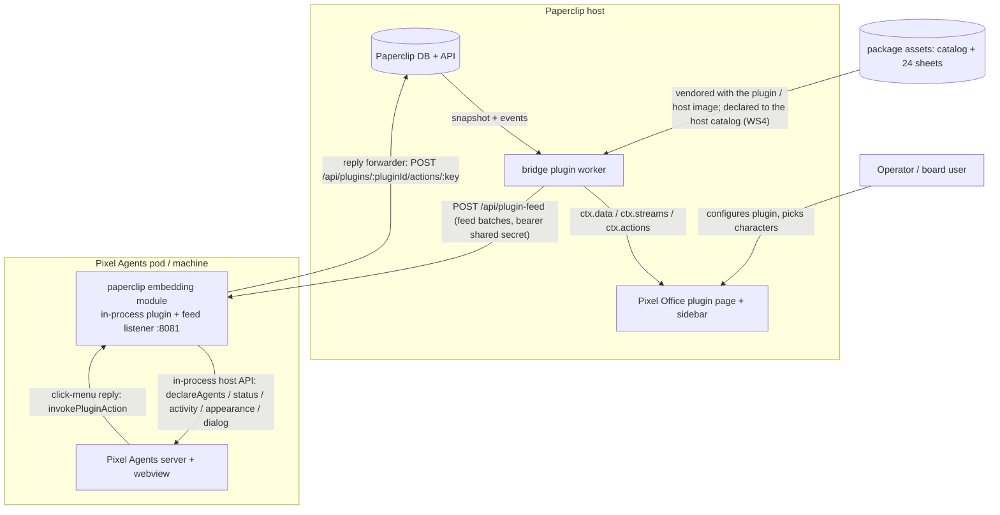
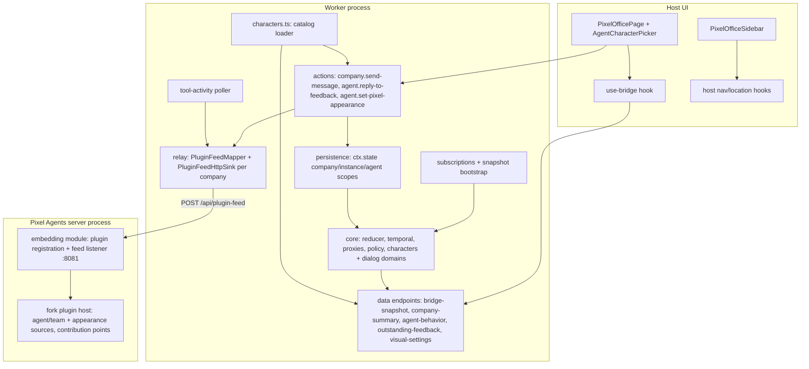

# Architecture Handbook — Paperclip ↔ Pixel Agents Bridge (`@decaf-ts/paperclip-pixels`)

## 00. Index

| Field           | Value                                                                                                                                                                                        |
|-----------------|----------------------------------------------------------------------------------------------------------------------------------------------------------------------------------------------|
| Project         | `@decaf-ts/paperclip-pixels` — Paperclip plugin + first-class Pixel Agents plugin module (embedding surface)                                                                                 |
| Current version | 0.6.0 (`package.json`)                                                                                                                                                                       |
| Owning team     | with-ai engineering (CTO technical governance; delivery via Paperclip issues)                                                                                                                |
| Last updated    | 2026-09-05                                                                                                                                                                                   |
| Repository      | `paperclip-pixels` (this repo); Pixel Agents lives in the `pixel-agents/` submodule (fork of upstream `v1.4.1`, local tag `fork-baseline-v1.4.1`, governed by its `FORK.md`/`DIVERGENCE.md`) |

This handbook describes the real architecture of the bridge as it exists right
now. It is a living document: when the system changes, the affected section is
corrected in place — never appended as a dated snapshot. Per-ticket delivery
facts live in the domain records under
`workdocs/ai/project/specifications/` (authored by the Delivery Documentation
Specialist); this handbook references them and never restates them.

### Reading guidance

| Audience | Sections | Why |
|---|---|---|
| Engineering (plugin side) | 01, 04, 05, 07, 10 | Components, contracts, state model, integration points |
| Engineering (fork side) | 03, 05.6, 08, 10 | Plugin feed wire protocol, plugin host + contribution points, privilege gate, asset sharing |
| Security / compliance | 04, 07, 08, 09 | Trust boundaries, secrets, gating, risk register |
| Operators | 03, 06, 10 | Deployment topologies, endpoints, configuration |

### Contents

- [01. Introduction and Overview](#01-introduction-and-overview)
- [02. Glossary](#02-glossary)
- [03. System Context](#03-system-context)
- [04. Architecture Goals and Principles](#04-architecture-goals-and-principles)
- [05. Logical Architecture](#05-logical-architecture)
- [06. Deployment Architecture](#06-deployment-architecture)
- [07. Data Architecture](#07-data-architecture)
- [08. Security Architecture](#08-security-architecture)
- [09. Architecture Decisions and Risks](#09-architecture-decisions-and-risks)
- [10. Interfaces](#10-interfaces)

## 01. Introduction and Overview

The bridge makes Paperclip's organizational execution legible inside the
Pixel Agents graphical office: every
Paperclip agent appears as an animated pixel character whose activity reflects
the agent's real Paperclip state (runs, comments, approvals, issues), and each
agent's appearance is a per-agent, user-editable character definition. It is
implemented as a **Paperclip plugin** (public Plugin SDK only — no Paperclip
core changes) plus a **first-class Pixel Agents plugin module**: an embedding
surface that registers the bridge through the fork's plugin host inside the
Pixel Agents server process and serves the plugin feed endpoint the Paperclip
worker pushes to. The former impersonation path — a `paperclip-pixel-relay`
sidecar CLI serializing events into Claude hook bodies — is retired
(PAPERCLIP_PIXELS-2 WS2). Since WS4 (bridge deepening) the agent's rendered
sprite itself is plugin-defined: the plugin declares its character catalog
through the fork's first-class appearance API and assigns each agent a sheet,
and a conversation-extract dialog pane (privacy-guarded, opt-in for fuller
extracts) feeds the office from real Paperclip conversation activity.

Paperclip is authoritative for all business state (companies, agents,
projects, issues, runs, approvals, budgets). Pixel Agents is authoritative for
graphical representation (sprites, animation, layout). The bridge owns only
derived telemetry, behavioral proxies, and the per-agent appearance
assignment map — never business truth, never rendering decisions.

| Audience | Purpose |
|---|---|
| Plugin/fork engineers | Understand components, contracts, and invariants before changing them |
| Security reviewers | Locate trust boundaries, gates, and secrets handling |
| Operators | Deploy and configure the stack correctly per topology |
| New team members | One-document orientation into both sides of the bridge |

| Attribute | Description |
|---|---|
| Platform type | Paperclip host plugin (forked worker child process) + first-class Pixel Agents plugin (embedding module in-process to the Pixel Agents server, feed sidecar on `:8081`) |
| Primary technologies | TypeScript (ESM), React 19 (plugin UI via `@paperclipai/plugin-sdk/ui`), Node.js, Zod, Jest/Vitest, HTTP (plugin feed) |
| Core capabilities | Authoritative snapshot bootstrap + event subscription; temporal metrics & behavioral proxies; company intake / agent feedback actions (fail-closed new-work); per-agent character catalog, assignment, and picker; first-class agent/team declaration, status/activity captions, click-menu replies inside Pixel Agents; plugin-defined per-agent sprite rendering through the WS4 appearance source with fail-closed palette fallback; conversation-extract dialog-pane feed (pre-redacted, opt-in for fuller extracts) |
| Deployment models | Local all-in-one (loopback defaults); minikube reference stack (`deploy/k8s/`); docker-compose fallback (`deploy/docker/`) |
| Integration interfaces | Paperclip Plugin SDK (`ctx.*`), plugin feed HTTP API (`POST /api/plugin-feed`), fork plugin-host API (in-process, incl. the WS4 appearance source), Paperclip performAction proxy (reply forwarder) |
| Data zones | Paperclip DB (authoritative, untouched); plugin `ctx.state` (derived + per-agent assignments); embedding-surface declared-agent cache (in-memory, non-authoritative); static package assets (`assets/characters/`); fork-side per-plugin sheet catalogs (server-resolved, webview-mirrored); dialog-pane lines (ephemeral, pre-redacted) |

## 02. Glossary

| Term | Definition |
|---|---|
| Paperclip | The agent-orchestration host. Authoritative for companies, agents, issues, runs, approvals, budgets. Exposes the plugin SDK. |
| Pixel Agents | The pixel-office visualization app (server + React/Canvas webview). Maintained as a **fork** in `pixel-agents/` (baseline upstream `v1.4.1`, local tag `fork-baseline-v1.4.1`; `FORK.md` no-upstream-PR policy, `DIVERGENCE.md` per-change divergence log). |
| Plugin SDK | `@paperclipai/plugin-sdk` — the only supported surface into Paperclip: `ctx.state`, `ctx.data`, `ctx.actions`, `ctx.streams`, `ctx.events`, `ctx.config`, `ctx.http`, capabilities-gated. |
| Worker | The plugin's server-side process (`src/worker.ts`), forked by the Paperclip host. Owns snapshot bootstrap, reduction, actions, data endpoints, appearance persistence and feed sync. |
| Core | Pure domain package (`src/core/`): raw projections, temporal windows, behavioral proxies, feedback policy, character catalog/assignment domain. No React, no SDK, no filesystem. |
| Relay | The worker-side push subsystem (`src/relay.ts`): one `PluginFeedMapper` + `PluginFeedHttpSink` per company, translating canonical bridge events into plugin feed operations and POSTing them to the embedding surface's `POST /api/plugin-feed`. |
| Embedding surface | The module that owns the Pixel Agents server process (`src/pixel-agents-plugin/embedding.ts`, bundled to `dist/pixel-agents-embedding.cjs`), loaded through the fork's generic `--plugin` loader: registers the Paperclip plugin in-process through the WS2-A1 host API and serves the feed endpoint on its own sidecar listener (default `127.0.0.1:8081`, fail-closed bearer auth). |
| Plugin host | The fork's in-process plugin registry (`pixel-agents/server/src/plugins/pluginHost.ts`): schema-validated manifest, register/start/stop/unregister lifecycle, the sanctioned agent/team data source, owner-routed action invocation, the four contribution points, and — since WS5 — the capability registry with priority-based override arbitration (§5.6). |
| Base plugin (`pixel-agents-base`) | The fork's built-in default plugin (`pixel-agents/server/src/plugins/basePlugin.ts`): the original Claude/hook runtime wrapped as delegation wrappers around the existing server modules (wrap, never relocate). Registered deterministically first inside `initPluginHost`, before any external `--plugin` module; its id is reserved, so no external module can register, re-register, or displace it. Baseline equivalence proves base-only output is unchanged. |
| Capability arbitration | The plugin host's capability-resolution layer (§5.6): each capability id resolves to the highest-priority explicit override, else the base plugin; a same-priority clash is a hard `CapabilityResolutionError` — the host never guesses. An override with `fallback: 'base'` dispatches wrap-and-delegate: the host exposes the base implementation, and the override can return `CAPABILITY_DELEGATE_TO_BASE` to fall back mid-call. |
| Plugin feed | The versioned wire contract (`src/pixel-agents-plugin/feed.ts`, `schemaVersion: 1`) between the worker's relay and the embedding surface: batches of `declareAgents` / `removeAgents` / `updateAgentStatus` / `updateAgentActivity` operations applied through the plugin's sanctioned agent/team source, plus since WS4 `assignAgentAppearance` (appearance source) and `dialogLines` (pre-redacted conversation extracts). No Claude-hook vocabulary exists on this wire. |
| Character sheet | One `char_<N>.png` sprite sheet (112×96: 3 direction rows × 7 frames of 16×32) loadable by Pixel Agents' unchanged `decodeCharacterPng`. |
| Catalog | `assets/characters/catalog.json` — the ordered character list (`id`, `name`, `palette`, `file`, `source`, `license` per entry). |
| Palette index | Integer seat position in the frozen WS3 catalog contract (bundled 0..5, generated sheets 6..23). Historically the merged sprite-array position (palette = filename suffix = merged-array position); since WS4 it is the **seat/fallback** index — the rendered sprite comes from the first-class appearance assignment (§5.7), and the palette colors the seat path and the built-in fallback. |
| hueShift | Per-agent hue rotation (0–360°) applied on top of the sheet by the renderer (modulo 360). |
| Assignment | Frozen per-agent record `{ characterId, palette, hueShift, updatedAt }` keyed by Paperclip agent id. |
| Diverse-random default | Deterministic-random selection among least-used characters for unassigned agents, with a per-round hue shift on reuse (CEO decision 4). |
| Appearance sync | The worker pushes the company's assignment map through the feed: since WS4 as `assignAgentAppearance` operations carrying the WS3 frozen `characterId` (the first-class appearance path, §5.7), alongside `declareAgents` upserts whose palette/hueShift remain the seat/fallback contract. |
| External asset directory | Pixel Agents' operator-granted mechanism for extra sprite content; the fork's privilege gate (WS1) governs every mutation of it. Since WS4 the grant doubles as the **appearance asset gate** boundary: the host refuses any `declareCharacterCatalog` sheet outside a granted directory (§5.6, §5.7). |
| Privilege token | The Pixel Agents server startup token echoed in the `addExternalAssetDirectory` message; validated constant-time, fail-closed, before asset injection is accepted. |
| Declared-agent cache | The embedding surface's in-memory `DeclaredAgentCache` (`feed-server.ts`) — the last roster the feed declared, so a plugin restart re-declares every agent. Never a source of truth; the worker's next reconcile re-declares regardless (declare is an idempotent upsert). |
| New-work invariant | Only company/leadership intake may originate new work; individual-agent replies fail closed and route to intake. Structural (action path), never classifier-based. |
| Bridge contract | The versioned payload shapes (`schemaVersion`) exchanged worker↔UI (`src/ui/bridge-contract.ts`) and worker↔embedding surface (`src/pixel-agents-plugin/feed.ts`). |
| Appearance source | The fork's first-class per-agent appearance API (WS4-A): `ctx.appearance.declareCharacterCatalog` (ordered sheet catalog) + `assignAgentAppearance` (integer index or null revert), manifest-gated by `sources.appearance`, privilege-gated by the appearance asset gate. The Agent-Pixels *pattern* (ordered catalog + integer index + per-agent assignment map), never its code or sprites. |
| `pluginCharactersLoaded` | Server broadcast carrying one plugin's resolved sheet catalog in declaration order. Per-plugin **snapshot** semantics: each message replaces the plugin's whole registry entry; `sheets: []` retracts it (plugin stop); sent once per `webviewReady` handshake **before** `existingAgents`. |
| `agentAppearance` | Server broadcast assigning (integer `sheetIndex` + `pluginId`) or reverting (`null`) one agent's plugin appearance; reconnects replay the current value via `existingAgents.agentMeta.pluginAppearance`. |
| Dialog pane | The bridge's `shell-panel` widget in the Pixel Agents office ("Paperclip conversation"), fed by `paperclip.dialog.lines` plugin messages — pre-redacted, truncated conversation extracts (comments, run edges, approval waits). Fuller extracts require the per-company `dialogPanePrivacyOptIn` (default OFF, CEO decision 2). |
| Behavioral proxy | Derived signal (`value`, `confidence`, `basis`) such as load, burstiness, friction — an operational proxy, never claimed emotion. |

## 03. System Context



- **Paperclip host** (authoritative): the worker consumes an authoritative
  startup snapshot and subscribes to 18 agent/issue/approval/budget/cost
  event types (`src/constants.ts`); all domain access goes through the public
  SDK behind the manifest's least-privilege capabilities. Direction:
  read-heavy inbound; the only writes are comments via the two intake/feedback
  actions (plus the reply forwarder's invocations of those same actions).
- **Operator / board user**: edits the plugin's global operator settings (8
  fields including `pixelAgentsUrl`, `pixelAgentsAllowedHttpHosts`,
  `pixelAgentsUiUrl`, `pixelAgentsTokenRef`, `dialogPanePrivacyOptIn`)
  on the host's auto-rendered settings form (Company Settings → Plugins →
  Paperclip Pixel Bridge; global-only — no per-agent values), and edits each
  agent's character through the picker on the Pixel Office page.
- **Pixel Agents** (fork): hosts the bridge as a **first-class plugin**. The
  embedding module registers it through the in-process plugin host at startup;
  the office renders declared agents (identity, team, seat, status, activity
  captions, and — since WS4 — the plugin-assigned sprite sheet with the seat
  hueShift as tint/fallback), backend-controlled click menus, and plugin
  widgets, including the bridge's conversation dialog pane (§5.8). Its startup
  token (`~/.pixel-agents/server.json`, mode 0600) remains the fork's own
  webview-auth and asset-injection privilege token — the bridge no longer
  reads it.
- **Embedding surface**: the worker's only channel to Pixel Agents. The feed
  listener binds `127.0.0.1:8081` by default; in the containerized
  topologies it runs inside the single pixel-agents container/pod, so
  `pixelAgentsUrl` must be set to the feed listener's cluster address.
- **Trust boundaries**: (1) UI never calls Paperclip HTTP directly — only the
  worker does, via the SDK; (2) the worker↔feed-endpoint HTTP boundary is
  bearer-token authenticated (shared secret configured as `pixelAgentsTokenRef`
  on the Paperclip side and `PAPERCLIP_PIXEL_FEED_TOKEN` on the embedding
  side, constant-time compared, fail-closed 401, token never in the URL; the
  worker side additionally enforces the https-when-token transport contract
  fail-closed at configure time and at runtime — with a token configured,
  `pixelAgentsUrl` (and, with its own token, the tool-activity poller's
  `paperclipApiBaseUrl`) must be a valid http(s) URL, and plain `http:` is
  accepted only for a trusted cleartext host: loopback, this package's own
  bundled deployment service names, or a host the operator explicitly
  declares in `pixelAgentsAllowedHttpHosts`);
  (3) the bridge holds **no** websocket to Pixel Agents — it is in-process
  through the host API; (4) plugin state is reached only through `ctx.state`
  capability checks.

## 04. Architecture Goals and Principles

| Goal | Description |
|---|---|
| Fidelity | Displayed entities reference canonical Paperclip IDs; run-level concurrency and multi-project activity are preserved; every proxy carries confidence + basis |
| Faithful observer | The bridge observes and translates; it is not an orchestration engine and not a renderer (PAPERCLIP_PIXELS-1 §42) |
| New-work safety | Individual-agent replies can never create Paperclip issues; all new work routes through company intake |
| Least privilege | Manifest requests only required capabilities; outbound HTTP only via SDK-gated `ctx.http.fetch` (one documented loopback exception — see 08) |
| No core changes | Paperclip is integrated with strictly through the public plugin SDK; all bridge changes live in this repo |
| Licensing safety | Only CC0 or generated assets; third-party *patterns* may be adopted, never unlicensed code or sprites |
| Determinism & testability | Pure domain core; seeded-random defaults; frozen data contracts; fail-closed validation everywhere |

Guiding principles:

1. **Paperclip is authoritative.** The bridge holds derived caches only;
   periodic reconciliation (default 5 min, plus reconnect/anomaly-triggered)
   repairs drift. Event delivery is treated as at-least-once and unordered
   (idempotent reducers, `eventId` dedupe).
2. **One source of truth per fact.** Per-agent appearance lives in plugin
   `ctx.state` agent scope and nowhere else; the embedding surface is a
   stateless applier with an in-memory declared-agent cache; the catalog is
   static package data validated fail-closed at load.
3. **Fail closed.** Malformed persisted data, unknown characters, palette
   mismatches, missing privilege tokens, and unresolvable scopes all degrade
   to safe defaults or rejected writes — never to unvalidated rendering.
4. **Boundaries are structural, not advisory.** Security invariants (new-work
   intake, asset-injection gating, company scoping) are enforced by action
   paths and capability gates, not by classifiers or convention.

Recurring structural patterns: SDK-shaped scope helpers
(company/instance/agent) in `src/persistence.ts`; Zod-validated action
payloads with host-authenticated actor and server-side company-scope
resolution (`resolveCompanyScope`); register-handle-deps wiring in the worker
(`registerActions`, `ctx.data.register`, `ctx.streams.open`); pure
domain + thin IO adapter split (`src/core/domain/characters.ts` vs
`src/characters.ts`).

## 05. Logical Architecture



### 5.1 Core domain (`src/core/`)

Pure TypeScript, no SDK/React/filesystem imports. Owns the raw projection
(exact Paperclip IDs), `WindowedMetrics` over 5m/30m/2h/8h/24h windows,
`AgentBehaviorVector` proxies with `value/confidence/basis`, the feedback
classifier and new-work action policy, the catalog/assignment domain
(`src/core/domain/characters.ts`), and — since WS4 — the conversation-extract
shaping domain (`src/core/domain/dialog.ts`: always-on secret redaction,
mode-dependent extract truncation, the shared dialog-line wire clamp).
Deterministic by construction so everything is unit-testable.

### 5.2 Worker (`src/worker.ts`, `src/actions.ts`, `src/persistence.ts`, `src/characters.ts`)

Forked child process of the host, one per plugin instance, multi-company.
Bootstraps each company from an authoritative snapshot, reduces the event
stream, serves `ctx.data` endpoints, registers `ctx.actions`, emits
`ctx.streams` events, persists derived state through `ctx.state`, and drives
the relay. Operator config arrives per company through `ctx.config`
(`onConfigChanged` reconfigures the relay and re-pushes appearances).

### 5.3 Plugin UI (`src/ui/`)

React 19 components registered into Paperclip's UI slots. All data flows
through `use-bridge` (snapshot + stream deltas) and `usePluginAction`; the UI
never contacts Paperclip or the relay directly. While the bridge is
stale/disconnected, state-changing actions pause. The plugin's UI surface
inventory:

| Surface | Manifest slot | Renders |
|---|---|---|
| Pixel Office page | `page` (`pixel-office-page`, route `pixel-office`) | `PixelOfficePage`: office iframe, company overview, per-agent character picker (§5.5e) |
| Sidebar entry | `sidebar` (`pixel-office-sidebar`) | `PixelOfficeSidebar`: single-line native row (below) |
| Plugin settings | none — no custom `settingsPage` slot | Host auto-renders the editable global config form from `instanceConfigSchema` (below) |

**Sidebar entry (single-line native row).** The sidebar renders one
`Pixel Office` row, pixel-identical to the host's own `SidebarNavItem` rows.
The plugin SDK does not export that host component, so its class strings are
replicated verbatim (`ROW_BASE`/`ROW_ACTIVE`/`ROW_INACTIVE` in
`src/ui/PixelOfficeSidebar.tsx` — same pill geometry, typography, hover and
active highlight), headed by a plugin-owned 16px inline-SVG pixel-grid icon
(licensing-safe, no third-party sprites). Active state derives from
`useHostLocation()` with the host NavLink's own prefix-match semantics
(`pathname === href || pathname.startsWith(href + "/")`), setting
`aria-current="page"` plus the active classes only on match; navigation goes
through `useHostNavigation().linkProps("/pixel-office")`. Testids
`pixel-office-sidebar` (wrapper) and `pixel-office-sidebar-link` (row) are
the stable RTL/e2e anchors. The obsolete two-line `<strong>`-headline block
(SAA-231 chrome) is deleted; no state-changing action lives on the sidebar.

**Settings surface (host auto-form, global-only).** The manifest declares no
custom `settingsPage` slot — a custom slot would suppress the host's
auto-rendered config form. Company Settings → Plugins → Paperclip Pixel
Bridge therefore auto-renders all 8 `instanceConfigSchema` operator fields
editable: `pixelAgentsUrl`, `pixelAgentsAllowedHttpHosts`, `pixelAgentsUiUrl`,
`pixelAgentsTokenRef`, `pixelAgentsRelayEnabled`, `paperclipApiBaseUrl`,
`paperclipApiTokenRef`, `dialogPanePrivacyOptIn` (the retired
`pixelAgentsProviderId` hook-path
field is gone; the per-company conversation-dialog-pane privacy opt-in —
default OFF, CEO decision 2 — gates the dialog pane's fuller extracts,
§5.8). The surface is global-only: per-agent
values (character + hue) live on the agent's own surface — the picker on the
Pixel Office page — never in settings. The former read-only custom "Pixel
Office settings" block (`PixelOfficeSettingsPage`, which suppressed the auto
form) is deleted along with its UI-bundle export.

### 5.4 Embedding surface + feed push (`src/pixel-agents-plugin/`, `src/relay.ts`)

The Pixel-Agents side of the bridge is a first-class plugin in two halves
(WS2-C):

- **Push side (in the Paperclip worker):** `src/relay.ts` owns one
  `PluginFeedMapper` + `PluginFeedHttpSink` per company. The mapper is a
  stateful translator from canonical `BridgeInputEvent`s, authoritative
  snapshots, and the WS3 appearance map into plugin feed operations — since
  WS4 including first-class `assignAgentAppearance` assignments (the WS3
  frozen `characterId` rides the wire; the embedding surface resolves it to
  a sheet index) and pre-redacted `dialogLines` conversation extracts
  (§5.8); the declaration's seat `palette` is cycled into the built-in 0–5
  range (`% 6`, §5.7) so the seat fallback stays valid without an external
  asset grant; the sink POSTs strictly ordered batches
  (`{ schemaVersion: 1, companyId, operations }`) to the embedding surface's
  `POST /api/plugin-feed`, fire-and-forget with `lastPushError` capture. The
  push rides the documented raw-`fetch` loopback exception (host SSRF-filter
  gap) unchanged. The destination is policed by the https-when-token
  transport contract ([SAA-557](/SAA/issues/SAA-557),
  security F1): `parseRelayConfig` throws `RelayTransportContractError` for
  an enabled relay with a token ref whose `pixelAgentsUrl` is unparseable,
  not an http(s) URL, or a cleartext `http:` URL to a host that is not
  trusted for cleartext — the single shared `isAllowedCleartextHost`
  decision accepts loopback (`localhost`, `127.0.0.0/8`, `::1`), this
  package's own bundled deployment service names (`pixel-agents`,
  `pixel-agents-relay`), and any host the operator explicitly declares in
  `pixelAgentsAllowedHttpHosts` (normalized; empty by default). The same
  contract mirrors onto the tool-activity poller's pair: with
  `paperclipApiTokenRef` configured, `paperclipApiBaseUrl` must be valid
  http(s) and cleartext `http:` is accepted only for the same trusted hosts
  — one operator declaration covers both pairs, and the save-time
  `onValidateConfig` gate and this runtime backstop consult the same
  decision so the two cannot drift.
  `BridgeRelay.configure()` fails secure on any rejection — the
  company's prior transport is disposed and its relay left disabled
  (warn-logged) instead of sending the bearer token in plaintext. Both raw
  fetches (feed push and heartbeat-log read) run with `redirect: "error"`
  so a bearer token is never re-sent to a cross-origin redirect
  destination. Loopback hosts keep plain `http:` for local dev.
- **Embedding side (in the Pixel Agents server process):**
  `src/pixel-agents-plugin/embedding.ts` (bundled to
  `dist/pixel-agents-embedding.cjs`, loaded by the fork's `--plugin` loader)
  registers the plugin through the real WS2-A1 host API, mounts the
  framework-agnostic feed handler on its own sidecar HTTP listener (default
  `127.0.0.1:8081`), and wires click-menu replies into the plugin's existing
  Paperclip actions through the reply forwarder. Since WS4 it also adopts the
  first-class appearance path (§5.7): at onStart it declares the plugin's
  WS3 character catalog through `ctx.appearance.declareCharacterCatalog`
  (best-effort — a host refusal, e.g. the asset gate rejecting an ungranted
  catalog directory, logs `paperclip_appearance_catalog_refused` and degrades
  to built-in palette rendering; a restart re-declares once the grant exists)
  and applies feed `assignAgentAppearance` operations; and it re-emits the
  worker's pre-redacted `dialogLines` operations through the plugin's
  declared `paperclip.dialog.lines` message type, feeding the dialog-pane
  shell-panel widget (§5.8). The feed endpoint is
  fail-closed by construction: shared-secret bearer auth (constant-time
  compare over SHA-256 digests), 401 on unauthenticated or wrong-token, a
  token never accepted via URL, a 1 MB body cap, `no-store`/`nosniff`
  headers, and the module **refuses to start** without
  `PAPERCLIP_PIXEL_FEED_TOKEN` configured. Configuration is environment
  variables (`PAPERCLIP_PIXEL_FEED_HOST/PORT/TOKEN`,
  `PAPERCLIP_PIXEL_API_BASE_URL/TOKEN`) because the embedding surface runs in
  the Pixel Agents server process, which has no Paperclip plugin-config
  channel. An in-memory `DeclaredAgentCache` backs the plugin's
  roster re-declaration on restart.

The retired `bin/paperclip-pixel-relay.js` companion CLI (Claude-hook
forwarding, `saveAgentSeats` seat-driving, share-directory asset
registration, `~/.pixel-agents` file exchange) is deleted; its dead `bin`
and `files` entries are removed from `package.json` and no deploy surface
references it.

### 5.5 Per-agent character system (WS3 + WS4, PAPERCLIP_PIXELS-2)

The character system gives every Paperclip agent a stable, user-editable
pixel identity. Five cooperating pieces (the WS4 first-class rendering
pipeline that carries them onto the screen is §5.7):

**a) Ordered 24-sheet catalog.** `assets/characters/catalog.json` lists 24
character sheets in a fixed order: entries 0–5 are Pixel Agents' bundled CC0
MetroCity-derived sheets (`pixel-agents:char-0..5`); entries 6–23
(`paperclip-pixels:char-6..23`) are deterministic hue-rotated derivatives of
those base sheets, generated by the committed, dependency-free
`scripts/generate-character-variants.mjs` (minimal PNG codec — 8-bit RGBA,
non-interlaced; fixed hue offsets 50°/140°/230° per base sheet; byte-identical
output for identical input; same 112×96 geometry). Every entry records its
`source` (bundled vs generated-from-which-base) and `license: CC0-1.0`, so
provenance is auditable per sheet. The catalog is validated fail-closed by
`parseCharacterCatalog` (unique ids, unique integer palette indexes,
non-empty) and loaded once per worker lifetime (`src/characters.ts`), with
`PIXEL_CHARACTER_CATALOG` as an operator override for odd installs. The
Agent-Pixels *pattern* (ordered catalog + integer index + per-agent map) is
adopted; its unlicensed code and sprites are not.

**b) Frozen per-agent assignment contract.** 
`agentId -> { characterId: string, palette: number, hueShift: number (0–360), updatedAt: string }`
— pure domain in `src/core/domain/characters.ts`, exported via
`src/core/index.ts`, mirrored in `src/ui/bridge-contract.ts`, consumed
unedited by the picker. Assignments persist through the plugin SDK's first
`scopeKind: "agent"` usage: `src/persistence.ts` stores each agent's record
under the `characters` namespace / `agent-character` state key (scopeId =
agent id), alongside the pre-existing company- and instance-scope bridge
state. The map round-trips through `ctx.state` and survives plugin restarts;
malformed stored values fail closed to a fresh default rather than reaching
the UI or relay. Because the state API has no list-operation, the worker
bulk-loads assignments from the authoritative agent roster it already holds.
The former file-based source of truth
(`~/.pixel-agents/paperclip-appearance.json`) is retired, and with WS2 the
entire relay-side HTTP/CLI surface that once served it is deleted:
appearance writes live only in plugin state, and since WS4 the worker pushes
the map through the plugin feed two ways — `declareAgents` upserts whose
palette/hueShift remain the seat/fallback contract, plus first-class
`assignAgentAppearance` operations carrying the `characterId` (§5.7), which
is what actually selects the rendered sprite sheet.

**c) Diverse-random default (CEO decision 4).** When an agent has no
assignment, `selectDefaultAssignment` picks deterministically-random among
the **least-used** catalog characters: the PRNG is mulberry32 seeded by an
FNV-1a hash of the agent id, so defaults spread across the catalog, are
stable across restarts, and are unit-testable. When every character is
already in use (reuse round `c ≥ 1`), the pick gets a per-round hue shift of
`45 + ((c - 1) * 47) % 315` degrees — always inside [45°, 359°], so a shift
can never wrap to 0° (identity) and collide pixel-identically with the
first-round user, and distinct until 315 reuse rounds. Explicit assignments
are never overwritten by defaults; defaults are materialized and persisted at
company bootstrap and at each reconcile for agents that appeared since.

**d) Extra-sheet rendering (WS4: first-class appearance path; merged-array
sharing retired).** Pixel Agents must be able to *render* the 18 extra
sheets it does not bundle. The WS3 interim arrangement — the operator grants
the catalog directory through `addExternalAssetDirectory` and the fork's
external loader merges the sheets into its bundled palette array, with the
plugin's palette indices pointing into that merged array — is **retired as
the rendering path** (WS4): rendering no longer depends on merged-array
indices. Its successor is the first-class appearance pipeline (§5.7): the
plugin declares its catalog through `ctx.appearance.declareCharacterCatalog`
and assigns per-agent sheet indices; the webview resolves the plugin's own
sheets and falls back to the built-in palettes on every error class. The
operator grant itself is **kept and re-purposed**: WS4-A re-uses exactly
those `externalAssetDirectories` grants as the `PluginAppearanceAssetGate`
privilege boundary — the host never reads a sheet outside a granted
directory — so the grant changes role from content channel to authorization
boundary. A deployment that wants the generated sheets rendered still
registers their directory through the fork's gated path (operator action,
e.g. the standalone server's tokened add message); without the grant the
catalog declaration is refused fail-closed and every agent keeps built-in
palette rendering. The catalog's `palette` field stays as the frozen WS3
seat/fallback index (it still colors the seat path and the fallback).

**e) Per-agent picker UI.** `AgentCharacterPicker`
(`src/ui/components/character-picker.tsx`) on the plugin's Pixel Office page:
per-agent option rows (assigned character + hue summary vs "not yet
assigned"), visual tiles over all 24 sheets with a live `hue-rotate` preview,
per-agent hueShift exposure via a range slider plus an exact-number input —
both bounded [0, 360], with below-floor, above-ceiling, and fractional
entries clamped into the integer domain as unsaved drafts (`clampHueShift`,
pinned by `e2e/paperclip/hue-shift.spec.ts`) — per-agent drafts
retained across agent switches, and a dirty-gated per-agent save wired to the
`agent.set-pixel-appearance` action. Saves persist to `ctx.state` first;
feed application is reported separately (`applied: false` still means the
write succeeded — the next sync re-applies it). Placement on the plugin's own
page was a deliberate decision (CEO decision 1): **no paperclip core
changes** — the SDK `detailTab` slot remains a documented future option. The
old all-agents-in-one-list selector is deleted.

Appearance write path (worker-authoritative):

```mermaid
sequenceDiagram
    participant UI as Picker (Pixel Office page)
    participant WK as Worker (actions + ctx.state)
    participant ST as ctx.state (agent scope)
    participant FS as Feed (PluginFeedMapper + sink)
    participant EMB as Embedding surface (feed endpoint)
    participant PA as Pixel Agents fork (plugin host)
    UI->>WK: agent.set-pixel-appearance { companyId, agentId, characterId, palette, hueShift }
    WK->>WK: validate against package catalog (unknown id / palette mismatch / hue range → reject)
    WK->>ST: persist assignment (characters namespace, agent-character key)
    WK->>FS: syncAppearances → declareAgents upserts (seat palette/hueShift) + assignAgentAppearance (characterId, WS4)
    FS->>EMB: POST /api/plugin-feed (batch, bearer shared secret)
    EMB->>PA: sanctioned sources: declareAgents (seat) + assignAgentAppearance (characterId → sheet index)
    PA-->>EMB: applied (agentAppearance broadcast; hueShift still tints plugin sheets, mod 360)
    WK-->>UI: { ok, assignment, applied } (applied:false ⇒ retried on next sync)
```

Read path: the picker reads the `visual-settings` data endpoint, served by
the worker from plugin state + the package catalog (characters with preview
data URLs, the assignment map, feed configuration state).

### 5.6 Pixel Agents fork plugin architecture

The bridge's Pixel-Agents side is now a **first-class plugin**: the fork
hosts a runtime plugin registry with contribution points (WS2), and the
bridge — formerly an impersonator of Claude hooks, synthetic team-metadata
transcripts, and `saveAgentSeats` seat-driving — registers through the real
host API (WS2-C) and is loaded in-process by the generic `--plugin` loader
(WS2-D). The WS1 foundation (provider registry, metrics channel, asset-dir
privilege gate) and the WS2 slice (plugin host, contribution points, loader)
are committed in the fork at `ade5601`; the WS4 appearance work (appearance
source + asset gate, webview consumption) sits uncommitted atop it pending
the workstream's single commit; everything below is verified against that
source.
Specification detail and per-change delivery facts live in the domain record
`workdocs/ai/project/specifications/PAPERCLIP_PIXELS_2.md` and the fork's
`DIVERGENCE.md` — referenced here, never restated.

**Fork governance.** `pixel-agents/` is a deliberate fork of upstream
`pixel-agents-hq/pixel-agents`, opened at upstream tag `v1.4.1` (commit
`3537e14`) and marked locally with the annotated tag `fork-baseline-v1.4.1`.
`FORK.md` states the policy: `origin` is reference-only — never pushed to, no
branches, no commits, no tags, no pull requests against upstream; divergence
is maintained unilaterally in the fork. `DIVERGENCE.md` is the discipline:
one row per fork-side change (date, area, summary, upstream reference, linked
specification), updated in the same change set as the fork-side edit.

**Runtime provider registry + per-provider dispatch.** The compile-time
provider list is gone. `server/src/providers/index.ts` owns a registry keyed
on `providerId` in registration order: `registerHookProvider` (idempotent
re-registration; a runtime-registered provider and a bundled one enter
identically — the bundled Claude provider loads through the same call at
startup), `unregisterHookProvider`, `listHookProviders` (the webview consent
gate iterates it at the `webviewReady` handshake, one ask per provider that
needs one), `primaryHookProvider` (first registered, where the runtime's
single `hooksEnabled` ref is still baked in), fail-closed `hookProviderById`
(an unknown id resolves to nothing and the caller writes nothing), and
`resolveAgentProvider` (`AgentState.providerId` affinity; unset or unknown
affinity means "no provider" — never a silent fallback to the primary).
`hookEventHandler.handleEvent(providerId, event)` resolves the sender through
the registry and dispatches through **that** provider only — a provider
receives its own events, never another's (no cross-provider leakage); unknown
ids and protocol-version mismatches are dropped fail-closed, and
session-router buffering carries the provider id alongside the buffered
event. A second provider registers exactly the way the WS1 test provider does
— no fork change beyond the provider module itself.

**Provider-agnostic metrics channel.** `server/src/metrics/metricsChannel.ts`
is the single path context-usage and tool metrics take from the runtime to the
wire: `agentContextUsage` and `agentToolMetric` events (shapes generated from
`core/asyncapi.yaml`; `providerId` is a required field on both) carrying
plain numbers plus the owning provider's id — the channel has zero references
to any concrete provider. Every record-shape detail (usage-block counters,
sidechain flags, model ids) is provider-private under
`providers/hook/claude/*`: `claudeContextUsage.ts` implements the
`HookProvider.parseContextUsage` contract, and the transcript path resolves
the parser per agent through the registry (`resolveAgentProvider`), so a
second provider's agents are parsed and metric-tagged by their own provider.
Since WS4 (fold-in of the WS1 accepted residual numbered R3 in the domain
record — not this handbook's risk-register R3) the transcript-path
**tool metrics** follow the same
agent-affinity rule at both the tool-start and tool-end emit sites: the
metric is tagged with the **owning agent's** provider
(`resolveAgentProvider(agent)`), never the module-level primary provider,
and the metric's status line is formatted by that same owning provider —
fail-closed on unset or unknown affinity (no parse, no emit, never the
primary's parser). `agentToolMetric.providerId` is now truthful for a second
registered provider's agents on the transcript path.

**Asset-directory privilege gate.** The whole `externalAssetDirectories`
mutation family (add + remove) is one gated trust boundary, fail-closed on
both surfaces. On the standalone SPA server path, a mutation message must
echo the server's out-of-band startup token as `privilegeToken`, compared
constant-time (`crypto.timingSafeEqual`, length-guarded; the transport
supplies the expected grant — unset means the gate fails closed); an add must
additionally name an absolute path. On refusal the server answers
point-to-point with a `clientMessageRejected` ack (`invalidPrivilegeToken` /
`invalidPayload`) — nothing is written, reloaded, or broadcast. On the VS
Code adapter the grants are host-side: the add path's grant is the native OS
directory dialog (the user physically picks the folder; client-asserted
`path`/`privilegeToken` fields are ignored fail-closed), and the remove
path's grant is a modal host confirmation naming the exact directory being
removed (`adapters/vscode/externalAssetDirectoryRemove.ts`); dismissal or
cancel leaves config, reloads, and broadcasts untouched. Since WS4 this same
grant list is the **appearance asset gate**: the plugin host asks the
embedding-surface-supplied `PluginAppearanceAssetGate` for the granted
directories before any `declareCharacterCatalog` sheet is read (next
paragraph) — one privilege boundary, two consumers, never widened.

**Appearance source (WS4-A).** `server/src/plugins/appearanceSource.ts` +
host wiring add the first-class per-agent appearance path to the plugin host,
manifest-gated by `sources.appearance` (present on every `PluginContext`,
every call refused fail-closed when undeclared or when the embedding surface
wired no asset gate). `ctx.appearance.declareCharacterCatalog(sheets)` takes
an ordered catalog (`{id?, file}` — absolute sheet paths; array position
defines the sheet's integer index; ≤ 32 sheets; ids match
`^[a-zA-Z0-9][a-zA-Z0-9._-]{0,63}$`, unique) and is **all-or-nothing**:
`validateCharacterCatalog` checks every sheet is absolute and inside one of
the gate's granted directories (pure resolved-path containment), then the
gate decodes each through the same `decodeCharacterPng` the bundled
`char_N.png` sprites use, under a 2 MB per-sheet ceiling
(`appearanceAssetGate.ts`; the standalone gate re-reads config on every call
so a grant added or removed through the privileged message takes effect on
the next declaration without a restart). Any invalid, ungranted, or
undecodable sheet refuses the whole call — nothing is decoded, nothing is
broadcast, the previous catalog stands, and agents keep built-in palette
rendering. On success the resolved catalog replaces the plugin's and
`pluginCharactersLoaded {pluginId, sheets: [{index, id?, sprites}]}` is
broadcast. `ctx.appearance.assignAgentAppearance(key, sheetIndex)` assigns
one of the plugin's declared agents an index into its **current** catalog (a
pre-declaration or out-of-range index is refused), persists the assignment
on `AgentState.pluginAppearance` (not durably — plugin agents re-declare on
start) and broadcasts `agentAppearance {id, pluginId, sheetIndex}`; `null`
reverts the agent to built-in palette rendering. Lifecycle: stopping a plugin
clears its catalog and broadcasts the empty-sheets retraction alongside the
removal of its agents; no post-onStart catalog diff is broadcast (the
declaration inside onStart already broadcast it). This is the Agent-Pixels
*pattern* — ordered catalog + integer index + per-agent assignment map;
its unlicensed code and sprites are not adopted.

**Plugin host (WS2-A1).** `server/src/plugins/` owns a runtime plugin
registry following the WS1 provider-registry precedent — keyed on id,
fail-closed on everything unregistered or malformed, no per-feature fork
changes for a new contributor. `PluginHost` exposes
`registerPlugin`/`startPlugin`/`stopPlugin`/`unregisterPlugin`
(`initPluginHost` wires the module-level default at standalone startup,
`disposeAll`/`dispose` on shutdown); plugins move through
registered → started → stopping → stopped, and every `PluginContext` method
is dead (fail-closed no-op/false) once the plugin leaves the started state.
Registration validates a **declarative manifest** (`manifest.ts`: id
`^[a-z0-9][a-z0-9-]{0,63}$`, version, `contributes` messages/actions/
menuItems/labelPolicy/widgets, `sources.agents`/`sources.characterEvents`)
— an invalid manifest never enters the registry; `PluginRegistrationError`
names every violation (unknown keys rejected in every section, id/version
must match the registration, handlers must cover exactly the declared
actions). The **sanctioned agent/team data source** (`PluginContext.agents`,
manifest-gated by `sources.agents`) is the replacement for everything the
bridge's impersonation hacks used to feed: `declareAgents` (idempotent
upsert by key — identity `key`+`name`, team metadata `teamName`/`isTeamLead`/
`leadKey`→numeric lead link/`teamUsesTmux`, seat `palette`/`hueShift`/
`seatId` persisted through the same adapter as `saveAgentSeats`),
`removeAgents`, `updateAgentStatus` (`active`/`waiting` + `awaitingInput`),
`updateAgentActivity` (one caption per agent through the existing
tool-bubble machinery, replayed on reconnect), and
`updateAgentLabelPolicy`. Plugin-declared agents carry `AgentState.pluginId`
(a synthetic jsonlFile, no provider affinity), are excluded from persistence
and the stale-external-agent transcript check, are re-declared by their
plugin on start, and — since WS4 — are exempt from the team-config removal
sweeper (`fileWatcher.scanTeamConfigsForRemovals` skips `pluginId`-bearing
agents): their `teamName` has no backing Claude team config by construction,
so the sweeper must never judge them; their lifecycle is owned by the plugin
host (removed when the plugin stops/unregisters). **Action routing** is owner-only: `invokeAction` resolves
the plugin through the registry and dispatches to that plugin's handler —
unknown plugin, unknown action, non-started plugin, handler throw, and
non-object result all fail closed; on the wire, the client message
`invokePluginAction` is privilege-gated like `setHooksEnabled` (plugin
actions run first-party code) and answered point-to-point with
`pluginActionResult`. The host offers **no work-creation primitive of its
own** — it can put characters, captions, and plugin messages on a screen; it
cannot create issues, tickets, runs, or any unit of work in any system (the
fail-closed new-work invariant, structurally upheld). Wire contract lives in
`core/asyncapi.yaml` (`pluginMessage`, `pluginActionResult`,
`invokePluginAction`) with `core/src/messages.ts` regenerated in sync.
Registration and lifecycle events are logged as structured single-line JSON
carrying ids/versions/counts only — never payloads, secrets, or prompts.
  (WS1 residual R2 folded in here: standalone Fastify request logs now redact
  `?token=`.)

**Capability path: base/default plugin + override arbitration (WS5,
Revision 2).** The fork's original Claude/hook runtime is now itself a
first-class default plugin: `server/src/plugins/basePlugin.ts` wraps the
existing server modules (providers registry, hook installer/consent,
transcript parser, persistence, UI/asset loaders) as delegation wrappers —
wrap, never relocate — and `initPluginHost` registers it as
`pixel-agents-base` deterministically first, before any external `--plugin`
module; the id is reserved (`registerPlugin`/`stopPlugin`/`unregisterPlugin`
refuse it), so it can never be displaced by re-registration. The baseline
equivalence suite (`server/__tests__/basePlugin.test.ts`) proves base-only
output is unchanged (no agents/widgets/messages/menu beyond the legacy
runtime's own). `manifest.ts` grows a stable capability vocabulary —
`CAPABILITY_IDS`: seven runtime capabilities (provider-selection,
hook-management, session-lifecycle, tool-activity, transcript-parsing,
persistence, ui-data) plus the six delivered contribution surfaces (menu,
label-policy, widgets, agents-source, appearance-source, action-routing) —
and an optional `capabilities` declaration (`id`, `implementation:
direct|override`, `overrides` target, `fallback: none|base`, `priority`)
validated fail-closed at registration: unknown id, duplicate/conflict,
override without a named target, fallback contradicting the implementation
mode, and a priority on a direct capability all reject. The host keeps a
capability registry (`registerCapability`/`getCapabilityImpl`/
`capabilityProviders`) plus an override-claims map (capability id →
priority → plugin id, recorded on successful registration, cleaned on
unregister): resolution elects the **highest-priority explicit override**
per capability and falls back to the base plugin, and a same-priority clash
is a hard `CapabilityResolutionError` — the host never guesses,
synthesizes, or silently elects. An override declaring `fallback: 'base'`
dispatches in **wrap-and-delegate** mode: the host exposes the base
implementation to the override, which can return `CAPABILITY_DELEGATE_TO_BASE`
to fall back mid-call (returning the symbol in any other mode is refused).
The Paperclip bridge (below) is the first override plugin; base-only vs
plugin-loaded behavior is pinned by the fork's guard suites
(`server/__tests__/guards/`: default-equivalence, override-isolation,
fallback-resolution, security fail-closed, transport-compatibility — all
importing the real bridge manifest cross-repo) and the arbitration suite
(`pluginCapabilityArbitration.test.ts`, all four dispatch modes).

```mermaid
sequenceDiagram
    participant OP as Operator (--plugin module / in-process code)
    participant HOST as Fork plugin host
    participant BASE as pixel-agents-base (reserved, registered first)
    participant OVR as Override plugin (e.g. paperclip)
    Note over HOST,BASE: initPluginHost: base registered first, id reserved
    OP->>HOST: registerPlugin(manifest + handlers)
    HOST->>HOST: validate manifest (incl. capabilities, fail-closed)
    HOST->>HOST: record override claims (capability → priority → plugin);<br/>same-priority clash → CapabilityResolutionError
    Note over HOST,OVR: capability dispatch
    HOST->>HOST: resolveCapability(id): highest-priority override,<br/>else base; ambiguity → hard error
    alt override with fallback: 'base' (wrap-and-delegate)
        HOST->>OVR: invokeCapability(impl, baseImpl)
        OVR-->>HOST: result or CAPABILITY_DELEGATE_TO_BASE
        HOST->>BASE: delegate (fallback-to-base)
    else direct base capability
        HOST->>BASE: invokeCapability(impl)
    end
```

**Plugin activity captions render honest frame sets (WS5-B).** A plugin
activity caption now maps to the tool name the render path reads:
reading-prefixed captions ride the wire as the real reading tool name (so
reading work renders reading frames), while writing/developing/task
captions keep the plugin id — a never-reading name — and deterministically
render typing frames (the SAA-448 callout-4 interim mapping; the fork has
no "developing" animation). A `waiting` status update also broadcasts
`agentToolsClear`, mirroring the hook-flow turn-end behavior; and a handler
result shaped `{ok: false, error}` collapses into the invocation outcome so
refusals reach the invoking client instead of masquerading as data.


**Contribution points (WS2-A2).** Four plugin-declared extension surfaces on
the host, all fail-closed, zero per-feature fork code for a new contributor:

- **Click menu.** `contributes.menuItems` — `{id, label, action, scope:
  'agent'|'global', order?, enabled?}` — where `action` must be one of the
  plugin's declared actions (cross-validated at registration). The client
  sends `requestAgentMenu {id}`; the server answers point-to-point with
  `agentMenu {id, items[]}` assembled by `PluginHost.assembleAgentMenu` from
  started plugins (character-scoped items only when the clicked character's
  `pluginId` names the contributor; sorted by `(order, pluginId, itemId)`;
  unknown agent → empty menu; malformed → `clientMessageRejected`).
  Assembly is backend-controlled and invocation rides the existing
  privileged `invokePluginAction` path — no new work-creation primitive
  anywhere.
- **Per-agent label policy.** `contributes.labelPolicy {mode:
  'always'|'never'|'hover'|'transient', durationMs?}` is the plugin's
  default for every agent it declares (a present-but-empty policy fails
  registration — `mode` is required); per-agent runtime override/revert goes
  through `updateAgentLabelPolicy` (null reverts to the manifest default,
  then to the global `alwaysShowLabels` fallback). The server evaluates the
  policy onto `AgentState.labelPolicy` and broadcasts `agentLabelPolicy`;
  reconnects replay it via `existingAgents.agentMeta.labelPolicy`;
  `durationMs` is the transient show-for-N-milliseconds TTL, bounded
  [100, 3,600,000]. The webview composes the policy with the global setting
  live (`webview-ui/src/office/engine/labelPolicy.ts`) and contributes no
  policy of its own.
- **Widget registry.** `contributes.widgets` — `{id, kind:
  'dom-overlay'|'shell-panel', binding: 'character-position'|'global',
  label?, messageTypes?}` — Phase-1 kinds only (anything else fails
  registration), with `messageTypes` restricted to the plugin's declared
  contributed message types. The server validates/stores registrations and
  pushes the `pluginWidgets` snapshot (on start/stop changes + once per
  `webviewReady` handshake); widget **data** rides the plugin's own
  `pluginMessage` envelope. The webview keeps a pure mirror registry
  (`webview-ui/src/office/widgets/widgetRegistry.ts`: wholesale replace on
  snapshot, fail-closed absorption keyed `${pluginId}:${messageType}`,
  200-entry cap) and a Phase-1 payload renderer (`widgetContent.ts`:
  `text`-tagged payloads verbatim, anything else compact JSON in the
  plugin's own field order). `AgentOverlays.tsx` renders
  `character-position` entries (the builtin tool overlay mounted as the
  registry's `webview-builtin` entry, plugin overlays stacked below the
  feet); `PluginPanels.tsx` renders the right-side shell-panel dock. **No
  canvas renderer is touched** — that is the widget work's phase-1 scope
  boundary (DOM-overlay + shell panels only; canvas effects later).
- **Character behavior hooks.** `AgentStateStore` derives typed
  `characterStatusChanged`/`characterActivityChanged` events from its
  central broadcast tap (reconnect replays never re-fire them);
  `ctx.characterEvents` (`onAdded`/`onRemoved`/`onStatusChange`/
  `onActivityChange`, manifest-gated by `sources.characterEvents`) delivers
  frozen read-only snapshots of **every** character in the office — not just
  the plugin's own. Listener throws are isolated per plugin, same-plugin
  re-entrancy is dropped (fail-closed against synchronous feedback loops),
  and all listeners are dropped at stop; host `dispose()` detaches the tap.

**Bridge as the first first-class plugin (WS2-C, extended WS4-C).** The
Paperclip bridge is
plugin id `paperclip` in the host registry (`src/pixel-agents-plugin/`): a
manifest declaring the agent/team source **and the appearance source**
(`sources: { agents: true, appearance: true }`), the two reply actions
(`reply-to-feedback`, `send-message`), two contributed messages (the
start announcement and — since WS4-C — `paperclip.dialog.lines` for the
dialog pane), the agent-scoped click-menu item `Reply…` (routes to
`reply-to-feedback`; the host cross-validates the item's `action` against
the declarations), and — since WS4-C — the `dialog-pane` shell-panel widget
(global binding, `messageTypes: [paperclip.dialog.lines]`; §5.8). The
  manifest still deliberately omits `labelPolicy` (default label behavior).
  Since WS5 its manifest also declares the override scope — exactly the six
  contribution-surface capabilities (agents-source, appearance-source,
  label-policy, menu, widgets, action-routing) as overrides of
  `pixel-agents-base` with `fallback: 'base'` and priorities 0–5
  (`PAPERCLIP_OVERRIDE_CAPABILITIES` in `src/pixel-agents-plugin/manifest.ts`)
  — so the bridge layers on the base plugin rather than replacing it, and
  every runtime capability (the legacy Claude/hook behaviors) deliberately
  resolves to the base.
The push/embedding halves and the
feed wire are §5.4; replies route through the **existing** Paperclip intake
actions — the reply forwarder invokes the host's sanctioned performAction
proxy (`POST /api/plugins/:pluginId/actions/:key`), where the real
`agent.reply-to-feedback` / `company.send-message` handlers run with
server-side company scoping and human-attribution gates; there is no
issue-creation code anywhere on the path, and without
`PAPERCLIP_PIXEL_API_TOKEN` every reply fails closed with
`forwarderNotConfigured`. The three impersonation hacks are retired from
`src/` with no counterpart by construction: (1) the Claude-hook wire format
(`src/pixel-agents-provider/` deleted); (2) synthetic team-metadata
transcripts (replaced by per-agent unique `teamName` through `declareAgents`
— same no-grouping semantics, no fake transcript); (3) WS seat-driving
(`saveAgentSeats`/`POST /api/appearance-sync` deleted; the seat rides
`declareAgents` palette/hueShift upserts and — since WS4 — the sprite rides
`assignAgentAppearance`). The Paperclip-side `dialogPanePrivacyOptIn`
operator field (default OFF, CEO decision 2) gates the conversation dialog
pane's fuller extracts behind a per-company privacy opt-in (§5.8).

**Generic `--plugin` loader (WS2-D).** The standalone CLI gained a
completely generic startup embedding surface: after `initPluginHost` and
before the HTTP server accepts its first `webviewReady` handshake, each
repeatable `--plugin <module>` operand is resolved against the working
directory, dynamically imported, and its `register(host, context)` export
(named or default; `context` carries the shared `AgentStateStore`) is
awaited — the module registers plugin(s) through the public host API
exactly like in-process code and may start whatever else it needs (e.g. its
own sidecar listener). Fail-closed: a module that cannot be loaded, exports
no register function, or throws during registration aborts startup (exit 1)
— an operator who asked for a plugin never gets a silently plugin-less
  server. The loader has zero plugin-specific knowledge; which modules load is
  pure operator configuration. Since WS5 the built-in base/default plugin is
  registered inside `initPluginHost` **before** this loop runs — an operator
  who loads no `--plugin` module still gets the full base runtime, and every
  capability not overridden downstream resolves to it. Since WS4 the
  standalone CLI wires the default
asset gate into the host at this point
(`initPluginHost({ store, appearanceAssets: createStandaloneAppearanceAssetGate() })`),
so `--plugin` modules get the appearance source with the operator's
external-asset grants as the privilege boundary.

**Webview appearance consumption (WS4-B).** The webview renders a
plugin-assigned agent with the plugin's own sprites, fail-closed to the
built-in palettes on every error class. The sprite layer
(`webview-ui/src/office/sprites/spriteData.ts`) keeps a per-plugin sheet
store with the same snapshot semantics as the broadcast — every
`pluginCharactersLoaded` message replaces that plugin's whole catalog,
`sheets: []` retracts it, and each sheet is structurally gated against the
exact decoded shape the bundled `characterSpritesLoaded` entries carry
(unusable entries are dropped). The appearance-aware
`getCharacterSprites(palette, hueShift, appearance?)` resolves an assigned
agent's plugin sheet through the **same** walk/typing/reading mapping and
hue-shift machinery as bundled palettes, cached under a
`plugin:<pluginId>:<sheetIndex>:<hueShift>` namespace that is invalidated
when the plugin's catalog is replaced; an assignment that does not resolve
(not declared, retracted, out of range, undelivered) falls through to the
built-in palette branch — a coherent built-in rendering, never a missing
sprite or a crash, and the built-in palette-count/diversity logic is
untouched. The pure classifier
`webview-ui/src/office/engine/agentAppearance.ts` (mirroring `labelPolicy.ts`)
shape-gates both the live `agentAppearance` payload (accept / revert on
explicit `null` / refuse) and each `existingAgents.agentMeta.pluginAppearance`
entry; `OfficeState.addAgent`/`setAgentAppearance` store only what the
office can honor, so re-assignment updates the character in place and a
late replay re-applies the server's authoritative value (absent meta means
"no appearance in force" → revert). Handshake ordering makes this work on
the first frame: the server sends each plugin's catalog snapshot during the
`webviewReady` handshake **before** `existingAgents`, so restored agents
resolve their plugin sprites immediately (both the direct path and the
layout-buffered pending path carry `pluginAppearance`). Appearance is per
exact agent id and never inherited by teammates or sub-agents; the webview
invents no client-side editor or alias. Standalone e2e asserts the rendered
source through test-hook evidence (`getCharacters().appearance.resolved`)
rather than pixel-guessing (`e2e/tests/standalone/pluginAppearance.spec.ts`
driving a fixture plugin through the real host appearance source).

### 5.7 First-class appearance pipeline, end to end (WS4-C adoption)

The bridge adopts the fork's WS4-A appearance API so a Paperclip agent's
rendered sprite is the plugin's own sheet, not a bundled palette entry. The
plugin-side pieces (`src/pixel-agents-plugin/appearance.ts`):

- **Catalog declaration.** `loadPluginCharacterSheets()` loads the committed
  WS3 catalog (`assets/characters/`, CC0) as WS4-A sheet declarations —
  absolute file paths (the gate requires absolute paths inside granted
  directories), ordered by the catalog's own array order, ids sanitized to
  the host's sheet-id pattern (`pixel-agents:char-0` →
  `pixel-agents-char-0`; cosmetic, since indices are positional and
  assignment resolution uses catalog order). The embedding surface calls
  `ctx.appearance.declareCharacterCatalog` with them at onStart —
  **best-effort fail-closed**: a missing/malformed catalog logs
  `paperclip_appearance_catalog_unavailable`, a host refusal (e.g. the asset
  gate rejecting an ungranted catalog directory) logs
  `paperclip_appearance_catalog_refused`, and either way the bridge keeps
  running on built-in palette rendering; a plugin restart re-declares once
  the grant exists. A refusal never propagates out of onStart.
- **Assignment translation.** The feed's `assignAgentAppearance
  {key, characterId}` operations carry the WS3 frozen `characterId`;
  `createFeedAppearanceApplier` resolves it to a positional sheet index in
  the declared catalog and calls the host source's
  `assignAgentAppearance(key, index)`; `characterId: null` passes through as
  the revert. An unresolvable id (version skew, unknown character) is
  logged (`paperclip_appearance_unresolved_character`) and skipped — the
  agent keeps its current appearance and one bad assignment never breaks
  the rest of the batch. The worker's mapper emits the operation only when
  the characterId changed (diffing against the last pushed value, like every
  other feed op).
- **hueShift stays the tint/fallback layer.** The seat hueShift still rides
  `declareAgents` and the webview applies it on top of plugin sheets exactly
  as for bundled palettes (modulo 360); the seat `palette` remains the
  frozen WS3 fallback index that governs whenever no plugin appearance is in
  force — since WS5 the feed mapper cycles it into the built-in range
  (`palette % 6`) on the declaration, because the embedding host's
  declaration validator accepts only built-in indices without an external
  asset grant (the 24-sheet catalog ships in the Paperclip image, never in
  the pixel-agents image) and catalog entries 0–5 are exactly the built-in
  sheets, so `char_N` falls back to its built-in counterpart.

End-to-end flow (declaration at startup, assignment per write/sync):

```mermaid
sequenceDiagram
    participant FS as Feed (worker mapper + sink)
    participant EMB as Embedding surface (appearance.ts)
    participant GATE as Appearance asset gate (grants = operator externalAssetDirectories)
    participant HOST as Fork plugin host (appearance source)
    participant WV as Webview (sprite store + renderer)
    Note over EMB: onStart (plugin start / restart)
    EMB->>EMB: loadPluginCharacterSheets() — catalog → declarations (absolute paths, ordered)
    EMB->>HOST: ctx.appearance.declareCharacterCatalog(sheets)
    HOST->>GATE: grantedDirectories() + decodeCharacterSheet(file) per sheet
    Note over HOST,GATE: all-or-nothing: ungranted/undecodable/oversized (>2MB) sheet<br/>refuses the whole call, previous catalog stands
    HOST->>WV: broadcast pluginCharactersLoaded {pluginId, sheets} (snapshot)
    Note over FS,EMB: worker write / reconcile / config change
    FS->>EMB: POST /api/plugin-feed — assignAgentAppearance {key, characterId}
    EMB->>HOST: assignAgentAppearance(key, sheetIndex) — characterId resolved via catalog order
    HOST->>WV: broadcast agentAppearance {id, pluginId, sheetIndex}
    WV->>WV: classify (accept / null-revert / refuse); store; renderer resolves sheet<br/>— unresolvable assignment falls back to built-in palette
```

**Wire contract recap** (`core/asyncapi.yaml`, `core/src/messages.ts`
regenerated in sync): `pluginCharactersLoaded` carries one plugin's resolved
catalog with per-plugin **snapshot semantics** (each message replaces the
plugin's registry entry; `sheets: []` retracts on plugin stop; broadcast on
declare/stop and once per `webviewReady` handshake **before**
`existingAgents`); `agentAppearance {id, pluginId?, sheetIndex}` assigns or
(`sheetIndex: null`) reverts one agent; `existingAgents.agentMeta.
pluginAppearance {pluginId, sheetIndex}` replays assignments on reconnect.

**Fail-closed chain, error class by error class:** catalog missing/malformed
plugin-side → palette rendering, bridge otherwise unaffected; catalog
directory not operator-granted → host gate refuses the declaration → palette
rendering until granted + restarted; sheet undecodable or over the 2 MB
ceiling → whole declaration refused, previous catalog stands; unknown
`characterId` on the wire → assignment skipped, agent keeps its appearance;
feed pushed against an embedding surface that wired no appearance sink →
batch rejected whole (sink-presence is part of feed validation — the pusher
sees the gap); assignment before declaration / out-of-range index / unknown
agent key server-side → refused, nothing broadcast; malformed payload in the
webview → classifier refuses, nothing stored; assignment that does not
resolve in the sprite store (late-declaring plugin, retracted catalog,
out-of-range) → built-in palette branch, never a missing sprite. Bundled
palettes 0–5 always render.

### 5.8 Dialog-pane conversation feed (WS4-C, CEO decision 2 guardrails)

The office's right-side shell-panel dock hosts the bridge's
**"Paperclip conversation"** widget (manifest `contributes.widgets`:
`shell-panel`, global binding, message type `paperclip.dialog.lines`; the
webview's Phase-1 widget renderer reads only `text`). It shows what the
office is *talking about* — a lossy summary surface, never a log sink.

**What feeds it.** The worker's feed mapper composes one line per
conversation-worthy event it already sees (no new host surface, no new
capabilities): `issue.comment.created` → an author-prefixed extract (author
label: the agent's appearance-map name, else its last declared name, else
the raw agent id; user comments are "Human"; question comments carry a
`(question)` marker); run edges → "X started/finished/failed/cancelled a
run" (start lines append the issue title when known; falling edges only
when the mapper actually knew the run — a phantom
edge is not conversation); approval waits → "X is waiting for an approval".
The `dialogLines` feed operation carries the composed lines; the embedding
surface re-emits each through `ctx.emit(paperclip.dialog.lines, {text})` —
it only re-emits what arrived, it composes nothing.

**Guardrails (CEO decision 2; PAPERCLIP_PIXELS-1 NFR-7).** Whatever the
pane shows, the raw sensitive prompt never leaves this plugin unredacted —
both layers below run plugin-side, in the Paperclip worker, before anything
rides the wire (pure domain `src/core/domain/dialog.ts`):

1. **Secret redaction — always on, both modes.** Bearer/Basic credential
   forms, credential assignments (`api_key=…`, `"db_password": …`), and long
   credential-shaped runs (JWTs, hex/base64 keys) are replaced with
   `[redacted]` before any truncation decision. Opt-in never disables
   redaction.
2. **Extract truncation — mode-dependent.** With the per-company
   `dialogPanePrivacyOptIn` toggle OFF (the default) a comment body ships
   as a ≤ 120-char excerpt; with the toggle ON a fuller but still bounded
   ≤ 480-char excerpt ships. Neither mode ever ships a full unbounded
   prompt, and every composed line (author prefix + text) is clamped to the
   shared 600-char wire cap.

**Where the toggle is parsed and enforced.** Parsed strict-true in
`parseRelayConfig` (`src/relay.ts`): only an explicit `=== true` opts in —
missing, absent, false, or wrong-typed values all mean OFF, and the worker's
config validation rejects non-boolean values outright. The parsed value is
carried into the company's `PluginFeedMapper` as `dialogPrivacyOptIn` at
relay-configure time; because it participates in the relay's
config-unchanged check, a toggle change rebuilds the mapper so the new mode
applies to every later event. Enforcement is at compose time in the mapper
(`dialogExtract(body, optIn)` per comment) — the guardrail travels with the
data, not with the renderer. The feed apply side adds defense in depth:
`feed-server.ts` re-clamps every line to 600 chars, caps batches at 8
dialog lines, rejects empty/malformed lines, and rejects the whole batch
when no dialog sink is wired (fail-closed 400, so a pusher misconfiguration
is visible instead of silently dropping lines). Acceptance is pinned by
`test/dialog-guardrail.test.ts` (core + feed layers, fail-on-old-code
intent: a pre-guardrail implementation shipping full bodies fails every
truncation and secret-absence assertion) and `test/dialog-pane-registration.test.ts`
(mapper behavior under both toggle states, manifest/widget registration,
relay/worker config plumbing).

## 06. Deployment Architecture

| Environment | Description | Management model |
|---|---|---|
| Local all-in-one | Paperclip, the embedding surface, and Pixel Agents on one machine; loopback defaults (`127.0.0.1:8081` feed listener, `:8080` Pixel Agents, `:3100` Paperclip API) | Manual (`npm`-installed plugin; Pixel Agents started with `--plugin <embedding module>`) |
| minikube reference stack | Postgres + Paperclip host (plugin vendored and installed at first boot) + a single-container Pixel Agents pod with the bridge embedding module loaded in-process (feed listener `:8081`) | `deploy/k8s/` manifests + kustomization |
| docker-compose fallback | Same stack without k8s | `deploy/docker/docker-compose.bridge-stack.yml` |

Key topology fact: the bridge's Pixel-Agents side runs **in-process** in the
Pixel Agents container/pod — `Dockerfile.pixel-agents` vendors
`dist/pixel-agents-embedding.cjs` (built from `src/pixel-agents-plugin/embedding.ts`
by `npm run build` at the repo root, before any image is built) and starts
the CLI with `--plugin /opt/paperclip-pixel-embedding/pixel-agents-embedding.cjs`;
the feed listener (`:8081`) is container-to-container and not published to
the host. Deployments that want the plugin's 24-sheet catalog rendered (not
just bundled palettes 0–5) grant the catalog directory to Pixel Agents
through the fork's privilege-gated `addExternalAssetDirectory` path — the
same operator grant that since WS4 doubles as the appearance asset gate
boundary (§5.6/§5.7); without it the catalog declaration is refused
fail-closed and every agent renders a bundled palette. The feed endpoint's
shared secret is set once as
`PAPERCLIP_PIXEL_FEED_TOKEN` on the pixel-agents side and configured on the
Paperclip side as the plugin's `pixelAgentsTokenRef` secret; the reply
forwarder additionally needs `PAPERCLIP_PIXEL_API_TOKEN` (a board API key)
and an allowlisted in-network hostname (`PAPERCLIP_ALLOWED_HOSTNAMES`).
Any topology where the worker and the feed listener are separated must set
  `pixelAgentsUrl` explicitly per company. Transport-contract consequence
  ([SAA-557](/SAA/issues/SAA-557), security F1, reconciled in WS5): with a
  feed token configured, a cleartext `http:` `pixelAgentsUrl` is accepted
  only for a trusted cleartext host — loopback, this package's own bundled
  deployment service names (`pixel-agents`, `pixel-agents-relay`, so the
  documented compose/k8s stack URLs such as `http://pixel-agents:8081` work
  as-is), or a host the operator explicitly declares in
  `pixelAgentsAllowedHttpHosts` (the field exists for a separate-container
  topology that reaches the feed under a different internal service name).
  Anything else is rejected at configure time
  (`RelayTransportContractError`, relay disabled fail-secure, warn-logged);
  deployments that want no cleartext exception at all front the feed
  listener with TLS and use an `https:` URL. The same trusted-host decision
  covers the tool-activity poller's `paperclipApiBaseUrl` when its own
  token is configured. The plugin
worker runs as a forked
child of the Paperclip host, not as its own pod. Rollback is trivial by
construction: the bridge is a non-authoritative observer — disabling the
plugin removes the graphical surface without touching business state. Full
runbook detail lives in `deploy/README.md`.

**E2E verification stack.** The canonical Playwright suite lives at the repo
root under `e2e/` (relocated from `tests/e2e/` so the new WS0 specs import
its fixtures/helpers from their final location). It runs against the
disposable compose stack `paperclip-pixels-e2e`
(`deploy/docker/docker-compose.bridge-stack.yml` plus the checked-in
`docker-compose.e2e-override.yml`, which publishes Postgres at 15432 and
points `PAPERCLIP_PUBLIC_URL` at the docker bridge gateway) — not against a
developer instance. The WS0 specs pin the quick-win surfaces:
`e2e/paperclip/sidebar-entry.spec.ts` (native single-line row, host class
replication, navigation to the page),
`e2e/paperclip/settings-editable.spec.ts` (no `settingsPage` slot in the
contribution; auto-rendered editable 7-field global form; the suite's own
edits are browser-local and never saved), and `e2e/paperclip/hue-shift.spec.ts` (per-agent picker
selection, [0, 360]-bounded hue controls, clamping, per-agent draft
  retention). Rebuild/redeploy and suite-run instructions live in
  `deploy/README.md`.

**WS5 verification surface (final hardening + visual validation).** Three
layers pin the WS5 behavior. (1) *Deployed-stack Playwright*
(`e2e/paperclip/`): `character-activity.spec.ts` proves FR-19 as accepted
under the run-edge realization — a real run driven through the Paperclip
API seats the character in typing frames with the run caption, the run's
end returns it to idle; the teammate-blue name label and the
reading-vs-typing frame-set choice are asserted through
`window.__pixelAgentsTestHooks`, never pixel screenshots. The specs' feed
wiring is applied idempotently to the seed company by
`e2e/helpers/plugin-config.ts` (the same routes the settings UI uses;
skip-with-reason when the runner env lacks the token/URL).
`company-switch.spec.ts` drives the host's real sidebar company switcher
and asserts the office re-scopes with no cross-company leakage (agents,
labels, feed), restoring the canonical single-company state afterwards.
`stale-disconnect.spec.ts` (opt-in `PAPERCLIP_PIXEL_E2E_STALE=1`, ~4-minute
disruptive run) pins the deterministic staleness contract
(`hasSnapshot && !streamConnected && > 90s` silence; the snapshot probe
502s while the worker is disabled) and records that the office iframe
stays mounted while the Paperclip worker is down — the pixel-agents-side
plugin host is decoupled from the Paperclip plugin worker, so the gates
that truly pause while stale are the Pixel Office page's own. (2)
*Unit-level isolation*: `test/company-switch-isolation.test.ts` pins the
worker's per-company `CompanyRuntime` isolation — one
`BridgeRuntime.companies` map with a separate store, per-agent
assignments, and relay mapper/sink per company; no company B event,
snapshot, or appearance assignment leaks into company A's bridge snapshot
or feed batch. (3) *The fork's standalone suite*
(`pixel-agents/e2e/tests/standalone/`), split by boot configuration:
**base-only** (no `--plugin` — `defaultViewEquivalence.spec.ts` proves
every plugin-host contribution surface resolves to the host default and
the base-only half of the FR-20 fail-closed new-work gate: empty
`requestAgentMenu` items, `unknownPlugin` refusal on a privileged reply
attempt) vs **plugin-loaded** (fixture modules through `--plugin` —
`pluginActivity.spec.ts` (FR-19 standalone: reading/typing frames,
status→activity propagation, waiting-on-human stops work, label-policy
show/hide), `pluginAppearance.spec.ts` (WS4-B), and
`pluginHostHardening.spec.ts` (NFR-7 restart/reconnect/dedupe on the
plugin-host surface: a kill + respawn mid-stream rehydrates exactly once —
no duplicate characters, appearance re-applied,
`pluginCharactersLoaded`-before-`existingAgents` ordering preserved; a
duplicate appearance assignment through the plugin-host source does not
duplicate a character or double-apply the sheet)). The standalone suite
boots the real `dist/cli.js`, so the bundle must be rebuilt after any
`server/`/`core/` change — a stale build silently asserts against old
server code and can false-green.

## 07. Data Architecture

Storage strategy — one authoritative home per datum:

| Datum | Home | Notes |
|---|---|---|
| Business state (companies, agents, issues, runs, approvals, costs) | Paperclip DB | Untouched by the bridge; no schema changes |
| Derived bridge state (compact buckets, last-reconciled-at, leadership agent id, schema version) | plugin `ctx.state`, `bridge` namespace, company/instance scopes | Survives restarts; repaired by periodic reconciliation |
| Per-agent character assignments | plugin `ctx.state`, `characters` namespace, `agent-character` key, **agent scope** (scopeId = agent id) | Single source of truth; first SDK `scopeKind: "agent"` usage; frozen contract shape |
| Character catalog + sheets | Static package data (`assets/characters/`, shipped in the npm package `files` and vendored by `deploy/docker/build-plugin-bundle.sh` into the host image) | Validated fail-closed at load; per-entry source + license provenance |
| Declared-agent roster cache | Embedding surface, in-memory `DeclaredAgentCache` (`src/pixel-agents-plugin/feed-server.ts`) | Backs the plugin's on-start re-declaration; never authoritative — the worker's next reconcile re-declares everyone (declare is an idempotent upsert) |
| Plugin-declared sheet catalogs | Fork plugin host (server memory, resolved + decoded) + webview per-plugin sheet store (snapshot mirror) | Decoded through the appearance asset gate (grants = operator external asset directories); snapshot semantics; retracted when the plugin stops, re-declared on start (§5.7) |
| Per-agent plugin appearance assignment | Fork server, `AgentState.pluginAppearance` (in-memory, not persisted — plugin agents re-declare on start) | Server-evaluated index into the owning plugin's current catalog; replayed on reconnect via `existingAgents.agentMeta.pluginAppearance`; unset = built-in palette rendering |
| Dialog-pane lines | Ephemeral: composed in the worker's feed mapper, re-emitted by the embedding surface, rendered by the shell-panel widget | Pre-redacted/truncated plugin-side per the privacy toggle (§5.8); never persisted in any store |
| Pixel Agents startup token | `~/.pixel-agents/server.json` (0600) | Fork-owned: authenticates webview sockets and the `addExternalAssetDirectory` privilege echo; no longer read by the bridge (the relay that read it is retired) |

Lifecycle and compliance posture: derived state is compact by design
(fixed 5-minute buckets, 288/agent/24h) and never duplicates canonical
issues/projects; raw payloads are not retained indefinitely; resolved secrets
are never persisted — only `*_token_ref` secret references, resolved at call
time. Appearance data is user-preference data (character choice per agent),
carries no personal or prompt content, and survives plugin upgrades through
`ctx.state`. Full entity/field detail belongs to the Design Specification
(not this handbook); per-change facts belong to the domain records.

## 08. Security Architecture

| Layer | Description | Key mechanisms |
|---|---|---|
| Host integration | All Paperclip access via the SDK behind the manifest's capability list | Least-privilege capabilities; host-authenticated actor; `resolveCompanyScope` asserts host-scoped company on every action |
| Action policy | New-work intake is structurally confined to company/leadership actions | `agent.reply-to-feedback` requires an existing work binding, returns `route-to-company` otherwise; no `issues.create` on the reply path — including the click-menu reply route, which forwards into those same actions through the performAction proxy |
| Plugin state | Scoped, capability-gated (`plugin.state.read/write`) | Zod/fail-closed validation on every load; agent scope per agent id |
| Worker↔feed-endpoint HTTP | Same-operator sidecar boundary (`POST /api/plugin-feed`) | Bearer shared secret (`pixelAgentsTokenRef` ↔ `PAPERCLIP_PIXEL_FEED_TOKEN`); constant-time compare over SHA-256 digests; 401 fail-closed; token never in the URL; 1 MB body cap; `no-store` + `nosniff`; embedding module refuses to start without a token; https-when-token on `pixelAgentsUrl` enforced at config save (`onValidateConfig`) and fail-closed at runtime (`parseRelayConfig` throws `RelayTransportContractError` → relay disposed and disabled; with a token the URL must be valid http(s) and cleartext `http:` is accepted only for a trusted host — loopback, the bundled deployment service names, or an operator-declared `pixelAgentsAllowedHttpHosts` entry; the same shared decision covers the poller's `paperclipApiBaseUrl`/`paperclipApiTokenRef` pair); both raw fetches run `redirect: "error"` so a bearer token is never re-sent to a cross-origin redirect destination |
| Bridge ↔ Pixel Agents runtime | In-process, no network hop | The embedding module registers through the plugin-host API inside the server process — the bridge holds no websocket and no fork-side secret; `invokePluginAction` is privilege-gated like `setHooksEnabled` (plugin actions run first-party code) |
| Secrets | Operator-configured `pixelAgentsTokenRef` / `paperclipApiTokenRef`; embedding env `PAPERCLIP_PIXEL_FEED_TOKEN` / `PAPERCLIP_PIXEL_API_TOKEN` | Secret references only in Paperclip config, resolved at call time; never logged, never persisted; the feed token is required (fail-closed startup), the reply-forwarder API token is optional (replies fail closed `forwarderNotConfigured` without it) |
| Outbound HTTP | Worker pushes routed through SDK-gated `ctx.http.fetch` (audited) | One documented exception: the feed push uses a narrowly-scoped raw `fetch` because the host SSRF filter categorically blocks the loopback sidecar destination |
| Dialog-pane conversation feed (WS4-C) | Conversation extracts leave the plugin only pre-redacted and truncated — the raw sensitive prompt never rides the wire; fuller extracts are per-company opt-in | Always-on secret redaction (bearer/basic/assignment/credential-shaped-run patterns → `[redacted]`); mode-dependent truncation (toggle OFF ≤ 120 chars, ON ≤ 480); shared 600-char composed-line clamp; `dialogPanePrivacyOptIn` parsed strict-true in `parseRelayConfig` (anything but `=== true` is OFF) and boolean-validated by the worker, mapper rebuilt on toggle change; feed apply side re-clamps (≤ 8 lines/batch, 600-char re-clamp, fail-closed 400 when no dialog sink) as defense in depth |

Identity and access model: actions execute with the host-authenticated actor
(user or agent) from the action context — caller-supplied actor ids are never
trusted. The appearance action additionally validates its inputs server-side
against the worker's own package catalog (unknown character, palette
mismatch, out-of-range hue → rejected), so a crafted UI payload cannot render
a sheet other than the one picked.

Known, accepted local-attack-surface notes (recorded in the PAPERCLIP_PIXELS-2
domain record): the Pixel Agents server token is readable by any local
process that can read `~/.pixel-agents/server.json` (0600) — a fork-level
fact (webview auth + asset-injection privilege) the bridge no longer reads
or amplifies; acceptable for local tooling, to be revisited if a networked
mode appears; the raw-fetch loopback exception is scoped to the
operator-configured feed destination.

## 09. Architecture Decisions and Risks

Full decision history with alternatives and board/CTO rationale lives in the
domain records (`workdocs/ai/project/specifications/PAPERCLIP_PIXELS_1.md`
and `..._2.md`, Decisions sections). The ADRs below record the decisions with
lasting architectural weight for the character system.

### ADR-01 — Assignment source of truth moves into plugin state

#### Context & Problem
Per-agent appearances were originally a palette index + hardcoded hueShift
driven by the relay impersonating a webview client, with assignments stored
in `~/.pixel-agents/paperclip-appearance.json` — outside Paperclip, outside
plugin state, unvalidated, and invisible to the plugin's serialization and
permission model.

#### Alternatives Considered

| Option | Description |
|---|---|
| Keep the file | Relay-owned JSON file; no SDK involvement |
| Database table | New persistence owned by the plugin package |
| Plugin `ctx.state` agent scope | SDK-supported `scopeKind: "agent"` scope, unused until WS3 |

#### Decision
**Plugin `ctx.state` agent scope (`characters` namespace, `agent-character`
key)** — the SDK already offered an agent-scoped state store; using it makes
assignments first-class plugin data: capability-gated, restart-safe,
serialized with other plugin config, and validatable on load.

#### Detailed Rationale
A single source of truth requires the authoritative owner to hold the data.
Paperclip owns agent identity; the plugin owns the agent-to-character mapping;
the relay is a renderer-side applier. Persisting in agent scope also gives
per-agent granularity for free (scopeId = agent id) and keeps the write path
auditable through the host's plugin-state capabilities.

#### Pros / Cons

| Pros | Cons |
|---|---|
| Restart-safe, capability-gated, SDK-supported | No list-all operation — roster-driven bulk load required |
| Fail-closed validation on load | Adds a worker↔relay push path (best-effort, re-applied on sync) |
| Retires an unvalidated file outside both trust domains | Relay keeps a (clearly non-authoritative) cache for restart re-apply |

#### SWOT Analysis

| Strengths | Weaknesses |
|---|---|
| Single authoritative home; deterministic contract | Bulk read depends on the roster the worker already holds |
| Opportunities | Threats |
| Flows into the fork's sanctioned agent/team source unchanged (palette/hueShift ride `declareAgents`) | Misuse of the embedding-surface cache as truth (mitigated: cache documented as restart convenience only; worker reconcile re-declares) |

#### Summary
Assignments live in plugin `ctx.state` agent scope; the relay's file-based
source of truth is retired (`POST /api/visual-settings` → 410) and its cache
is explicitly a restart convenience.

### ADR-02 — Diverse-random default: least-used selection + strided hue shift on reuse

#### Context & Problem
Agents without an explicit assignment need a default character. Uniform
random collides (many agents on one sheet); a fixed round-robin is
predictable and unfair to later agents; hue-shift-everything wastes the
catalog's variety.

#### Alternatives Considered

| Option | Description |
|---|---|
| Uniform random | Simple; collides at scale |
| Fixed round-robin | Deterministic; order-dependent, no variety within a character |
| Least-used + seeded-random pick, hue-shift only on reuse | Deterministic-random spread with per-round shifts |

#### Decision
**Deterministic-random among least-used characters (mulberry32 seeded by
FNV-1a of the agent id), hue shift only on reuse:
`45 + ((round - 1) * 47) % 315`** — locked as CEO decision 4; the reuse
formula was corrected from `% 360` after a Tester finding showed round 46
wrapping to 0° (identity) and colliding pixel-identically with the first
user.

#### Detailed Rationale
Seeding on the agent id makes the default random across agents but stable per
agent — the property that makes it unit-testable and restart-stable. Restricting
candidates to the least-used set spreads defaults across the catalog. Applying
a shift only on reuse keeps first assignments pristine. The stride 47 is
coprime with the span 315, so shifts are distinct for 315 rounds and never
land on 0°, matching the renderer's modulo-360 hue rotation.

#### Pros / Cons

| Pros | Cons |
|---|---|
| Visually collision-free defaults, no coordination needed | Formula subtlety required a correctness fix (now pinned by tests) |
| Deterministic and unit-testable | Defaults persist once materialized (by design — never overwritten) |

#### SWOT Analysis

| Strengths | Weaknesses |
|---|---|
| Spread + stability + testability in one rule | None identified post-fix |
| Opportunities | Threats |
| Scales past catalog size via hue rounds | Catalog shrink can strand assignments (mitigated: stale ids are ignored in least-used counting; loads fail closed) |

#### Summary
Defaults are deterministic-random, least-used-first, and hue-shifted only on
reuse, with a wrap-safe stride formula.

### ADR-03 — Asset sharing rides the existing external-asset path, privilege-gated

#### Context & Problem
The 18 generated sheets must reach Pixel Agents' renderer. Pixel Agents
already supports external asset directories loaded server-side and shipped as
pixel matrices over WS, but the registration message was ungated — any
connected client could inject assets (FR-11 security prerequisite).

#### Alternatives Considered

| Option | Description |
|---|---|
| Ship sheets inside the fork | Couples catalog growth to fork releases; duplicates bundled sheets |
| API upload of sprite data | Invents a new surface; larger fork change |
| Shared directory + existing `addExternalAssetDirectory`, gated | Uses the existing path; ordering invariant preserved; one server-side gate added in the fork |

#### Decision
**External asset directories stay the only sheet-injection mechanism, and
every mutation of them is privilege-gated: `addExternalAssetDirectory` must
echo the server startup token as `privilegeToken`; the fork validates
constant-time and fails closed.** The WS3-era automation (the relay CLI
copying the `palette ≥ 6` sheets into a share directory and registering it)
was retired with the relay CLI in WS2; the gated path itself remains the
fork's mechanism, now exercised by operator registration (§5.5d).

#### Detailed Rationale
A directory of sheets is zero invention — the renderer already loads
external directories server-side and ships them as pixel matrices. Loading
exactly the `palette ≥ 6` sheets keeps the palette == suffix ==
merged-position invariant (external sheets append in numeric order after the
bundled 0..5). Gating on the startup token reuses the only secret the
standalone server can already share out-of-band, and failing closed preserves
the security prerequisite (FR-11) for every user of the path.

#### Pros / Cons

| Pros | Cons |
|---|---|
| No new wire surface; invariant-preserving | No automated registrar ships with the plugin since the relay retirement — extra-sheet rendering needs a one-time operator registration |
| Fail-closed gating satisfies FR-11 | Token doubles as WS auth and privilege proof (accepted local-tooling tradeoff) |

#### SWOT Analysis

| Strengths | Weaknesses |
|---|---|
| Minimal change both sides; idempotent re-registration | Registration is a manual deploy step for the generated sheets |
| Opportunities | Threats |
| Same gate covers any future plugin asset injection | Duplicate bundled sheets would shift all external indexes (mitigated: bundled entries are never registered) |

#### Summary
Asset injection uses the existing external-asset mechanism behind a
constant-time, fail-closed privilege gate, preserving the palette-index
invariant; the bridge's automated share-dir registrar was retired with the
relay CLI, leaving registration to the operator through the same gated path.
**Partially superseded by ADR-04 (WS4):** the *sharing* mechanism (external
loader merging sheets into the bundled array) is retired as the rendering
path; the *gate* decision stands — the same grants now serve as the
appearance asset gate's authorization boundary.

### ADR-04 — Plugin sprite rendering moves to the first-class appearance path (WS4)

#### Context & Problem
WS3 rendered the 18 generated sheets by *position*: the operator granted the
catalog directory, the fork's external loader merged the sheets into its
bundled palette array, and the plugin's palette indices pointed into that
merged array. That couples the plugin's rendering to the host's array
layout (a stray extra sheet shifts every index), offers the plugin no
first-class way to say "this agent renders *my* sheet", and leaves
appearance as a seat concern rather than a plugin concern.

#### Alternatives Considered

| Option | Description |
|---|---|
| Keep merged-array sharing | Zero fork change; but index-coupled, host-layout-dependent, no plugin ownership of appearance |
| Plugin ships sprite *data* over the feed | New wire surface for megabytes of pixel data; bypasses the asset gate |
| **First-class appearance source: ordered catalog + integer index + per-agent assignment (WS4-A), operator grants re-used as the asset gate** | Chosen |

#### Decision
The fork's plugin host gains `ctx.appearance` (`declareCharacterCatalog` +
`assignAgentAppearance`, manifest-gated by `sources.appearance`), and the
bridge adopts it (WS4-C): the plugin declares its WS3 catalog at onStart and
assigns each agent by frozen `characterId`. The WS1 external-asset-directory
grants — unwidened — become the `PluginAppearanceAssetGate` boundary: the
host never reads a sheet outside a granted directory, decodes through the
shared `decodeCharacterPng` under a 2 MB ceiling, all-or-nothing. The merged
array stops being the rendering path; the catalog `palette` field survives
as the frozen seat/fallback index.

#### Detailed Rationale
The Agent-Pixels *pattern* (ordered catalog + integer index + per-agent
assignment map) is adopted — pattern only, never its unlicensed code or
sprites. Re-using the WS1 grants keeps exactly one asset-injection privilege
boundary with two consumers, so no new grant surface is created. Snapshot
wire semantics (`pluginCharactersLoaded` replace-per-plugin,
`agentAppearance` assign/revert, handshake ordering before `existingAgents`)
make the client state idempotent and replay-safe, and every failure class
degrades to built-in palette rendering rather than to a broken frame.

#### Pros / Cons

| Pros | Cons |
|---|---|
| Plugin owns its agents' sprites; indices are plugin-local, not host-layout-dependent | Still requires the one-time operator grant of the catalog directory |
| One privilege boundary (WS1 grants), unwidened, two consumers | Catalog re-declaration needs a plugin restart after a grant is added |
| Fail-closed palette fallback on every error class | 24 decoded sheets add wire weight to the handshake (bounded: ≤ 32-sheet catalog cap, 2 MB/sheet ceiling) |

#### SWOT Analysis

| Strengths | Weaknesses |
|---|---|
| Positional indices stable per plugin; snapshot semantics keep clients consistent | Gate refusal surfaces only as palette rendering + a log line (operator must know to grant) |
| Opportunities | Threats |
| Any plugin can ship appearance with zero per-feature fork code | A granted directory with junk files only fails per-sheet (all-or-nothing declaration keeps the previous catalog) |

#### Summary
Rendering moved from merged-array palette sharing to a first-class
catalog+index appearance API behind the unchanged WS1 operator grants;
merged-array sharing is retired (workaround ledger below).

### ADR-05 — Dialog pane ships only pre-redacted extracts; fuller extracts are opt-in (WS4)

#### Context & Problem
The office should show what the conversation is about, but comment bodies
are sensitive prompts (PAPERCLIP_PIXELS-1 NFR-7). A pane that renders full
bodies would put prompt content on a summary surface and onto the Pixel
Agents wire by default.

#### Alternatives Considered

| Option | Description |
|---|---|
| Full comment bodies in the pane | Rejected: ships sensitive prompts by default |
| No dialog pane at all | Rejected: the office loses conversation legibility the events already carry |
| **Always-redacted extracts, truncation tiered by a per-company opt-in (default OFF) — CEO decision 2** | Chosen |

#### Decision
Two plugin-side layers in pure domain code (`src/core/domain/dialog.ts`),
both applied before anything rides the wire: (1) always-on secret redaction
(bearer/basic/assignment/credential-shaped-run patterns) in **both** modes —
opt-in never disables it; (2) mode-dependent truncation — toggle OFF ships a
≤ 120-char excerpt, ON ships ≤ 480; every composed line clamps to 600. The
per-company `dialogPanePrivacyOptIn` parses strict-true; a toggle change
rebuilds the company's mapper; the feed apply side re-clamps as defense in
depth.

#### Detailed Rationale
Enforcing in the worker (the plugin's own trust domain) rather than in any
renderer means the guardrail travels with the data — no downstream consumer
can render what was never shipped. Strict-true parsing makes the failure
mode conservative: every malformed or absent value means OFF. The feed-side
re-clamp means even a buggy pusher cannot ship an unbounded payload through
the pane.

#### Pros / Cons

| Pros | Cons |
|---|---|
| Sensitive prompts never leave the plugin unredacted, in either mode | OFF-mode extracts are deliberately terse (an excerpt, not the conversation) |
| Redaction survives opt-in; both modes bounded | Pattern-based redaction can false-positive on long non-secrets (acceptable on a summary surface) |

#### SWOT Analysis

| Strengths | Weaknesses |
|---|---|
| Guardrail is structural (compose-time), not renderer goodwill | Redaction patterns need maintenance as credential shapes evolve |
| Opportunities | Threats |
| Toggle gives companies an explicit, auditable privacy dial | A future feed producer bypassing the mapper would skip shaping (mitigated: feed-server re-clamp + dialog-sink validation reject the gap) |

#### Summary
The dialog pane is a lossy, always-redacted summary surface; only an
explicit per-company opt-in unlocks fuller (still bounded) extracts.

### ADR-06 — The Claude/hook runtime becomes the base plugin; overrides arbitrate by explicit priority (WS5)

#### Context & Problem
Revision 2 (board directive, recorded in the PAPERCLIP_PIXELS_2 domain
record §R2) redefined the plugin target: the original Claude/hook behavior
is modeled as a first-class default/base plugin and the Paperclip bridge is
an override layer on top — superseding the earlier "bridge as the first
plugin" framing. The host needed a way to name every behavior the legacy
runtime exhibits, resolve each one without guessing, and let the bridge
specialize exactly its contribution surfaces without ever suppressing
baseline behavior.

#### Alternatives Considered

| Option | Description |
|---|---|
| Keep the legacy runtime as ambient server code; plugins add contribution points only | Rejected: baseline behavior is unnameable, so an override layer cannot express what it replaces or inherits |
| Relocate the legacy runtime into the plugin wholesale | Rejected: large churn with zero behavioral gain; the modules already work where they are |
| Implicit/residual fallback (unoverridden behavior "just is" whatever remains) | Rejected: the host would guess; conflicts would resolve silently |
| **Wrap the legacy runtime as the reserved default plugin `pixel-agents-base`; declare capabilities explicitly and arbitrate by priority (board §R2.5/§5.3/§7.1)** | Chosen |

#### Decision
A stable capability vocabulary (`CAPABILITY_IDS`: 7 runtime + 6
contribution-surface ids) with fail-closed manifest declarations
(`direct` vs `override`, explicit `overrides` target, `fallback:
none|base`, explicit `priority`); the legacy runtime wrapped — never
relocated — as delegation wrappers (`basePlugin.ts`) under the reserved id
`pixel-agents-base`, registered first inside `initPluginHost`; and host
arbitration that elects the highest-priority explicit override per
capability with base fallback, where a same-priority clash is a hard
`CapabilityResolutionError`. The bridge declares exactly the six
contribution-surface capabilities as overrides with `fallback: 'base'`,
realized additively through the existing contribution points — no
suppression of baseline surfaces.

#### Detailed Rationale
Wrapping instead of relocating keeps the change provably behavior-neutral:
the baseline equivalence suite asserts base-only output is unchanged, and
the cross-repo guard suites (default-equivalence, override-isolation,
fallback-resolution, security fail-closed, transport-compatibility) pin
that an override cannot suppress or mutate undeclared capabilities.
Explicit priority with hard-fail ambiguity means the host never elects
silently — two plugins claiming the same capability at the same priority
is a registration-time error, not a coin flip. Wrap-and-delegate
(`CAPABILITY_DELEGATE_TO_BASE`) gives an override the base implementation
through a host-owned surface only, so delegation is auditable and no
reach-around exists. Operators can reason about runtime behavior from
configuration alone: what is loaded, what each plugin declares, and what
falls back to base are all readable without reading code.

#### Pros / Cons

| Pros | Cons |
|---|---|
| Base-only installations provably unchanged; the override layer is purely additive | Capability vocabulary must be extended deliberately when a new behavior class appears |
| Ambiguity fails closed at registration; no silent election | Priority integers are arbitrary — operators must be told the winning rule (highest wins) |
| Delegation to base is host-mediated and auditable | One more registry to keep fail-closed (claims cleaned on unregister) |

#### SWOT Analysis

| Strengths | Weaknesses |
|---|---|
| Every legacy behavior is nameable and resolvable; the structure upholds base-only equivalence by construction | The reserved-id and registry invariants add host surface that must stay guarded |
| Opportunities | Threats |
| Future override plugins (beyond Paperclip) reuse the same arbitration unchanged | A plugin declaring a bogus high priority could starve a legitimate override (mitigated: declarations are operator-loaded configuration, and clashes hard-fail) |

#### Summary
The legacy runtime is the reserved default plugin; capabilities are
declared explicitly and arbitrated by priority with base fallback; the
Paperclip bridge overrides exactly its six contribution surfaces and
delegates everything else. Full decision history and board/CTO rationale
live in the PAPERCLIP_PIXELS_2 domain record (Revision 2).

### Workaround ledger (retired workarounds vs. documented host exceptions)

Interim mechanisms are retired when a first-class path replaces them; the
surviving host gaps are **exceptions, not precedents** — each is documented,
scoped, and tracked, and none licenses a new workaround of the same shape.

| Item | Kind | Status | Replaced by / bounded by |
|---|---|---|---|
| Claude-hook impersonation (`POST /api/hooks/claude` wire format) | Workaround | **Retired (WS2-C)** | First-class plugin feed + host API (§5.4, §5.6) |
| Synthetic team-metadata transcripts (transcript-hack agent grouping) | Workaround | **Retired (WS2-C; ledger-confirmed WS4)** | Per-agent unique `teamName` through `declareAgents` (`bridgeTeamName`), with the team-removal sweeper exempting plugin agents (§5.6) |
| `saveAgentSeats` seat-driving + `POST /api/appearance-sync` | Workaround | **Retired (WS2-C)** | Appearances ride the sanctioned sources: seat via `declareAgents`, sprite via `assignAgentAppearance` (WS4) |
| WS3 interim external-asset-directory *sharing* (external loader merges sheets; plugin palette indices point into the merged array) | Workaround | **Retired as the rendering path (WS4)** | First-class appearance pipeline (§5.7); the operator grant itself is **kept** and re-purposed as the appearance asset gate's authorization boundary |
| Plugin SSE 501 → 20s polling fallback | Host gap exception | **Kept — exception, not precedent** ([SAA-315](/SAA/issues/SAA-315) app gap) | Host lacks plugin stream SSE on the stock image; UI polls every 20s (risk R6); the fix is an upstream Paperclip change, not more plugin-side machinery |
| Relay raw-`fetch` loopback bypass of `ctx.http.fetch` | Host gap exception | **Kept — exception, not precedent** | Host SSRF filter categorically blocks the loopback/sidecar feed destination (no allowlist exists); bypass is scoped to the feed push (and the heartbeat-log poller's sibling), non-http(s) refused, policed by the https-when-token contract ([SAA-557](/SAA/issues/SAA-557)) so cleartext + token is trusted-host-only (loopback, the bundled deployment service names, or an operator-declared `pixelAgentsAllowedHttpHosts` entry; risk R4) |

### Risk register

| ID | Risk Description | Impact | Likelihood | Mitigation | Owner | Status |
|---|---|---|---|---|---|---|
| R1 | Feed push fails (embedding surface down/reconfigured) leaving persisted assignments unapplied | Low — visual lag only | Medium | `applied:false` reported; next reconcile/write/config-change re-pushes; the embedding surface's declared-agent cache re-declares on plugin restart | Engineering | Mitigated |
| R2 | Catalog shrink strands assignments pointing at removed ids | Low — ignored in least-used count; loads fail closed to defaults | Low | `countCharacterUsage` ignores unknown ids; `isAgentCharacterAssignment` rejects malformed shapes | Engineering | Mitigated |
| R3 | Pixel Agents startup token readable by any local process (0600 file) | Medium in a multi-user host; low for local tooling | Low | Fork-level fact (webview auth + asset gate); the bridge no longer reads it; accepted for local tooling (recorded in domain record); revisit if a networked mode appears | CTO | Accepted |
| R4 | Raw-`fetch` loopback exception widens outbound surface beyond `ctx.http.fetch` auditing | Low — destination is operator-configured sidecar | Low | Narrowly scoped to feed push; documented as a host SSRF-filter limitation (host gap exception list) | Engineering | Accepted |
| R5 | Renderer hueShift mod-360 wrap re-introduces collisions if formulas change | Medium — visual identity collisions | Low | Wrap-safe formula `45 + ((c-1)*47) % 315` pinned by unit tests (Tester-verified) | Engineering | Mitigated |
| R6 | Host plugin-SSE gap forces polling degradation | Low — UI latency | Certain (known host gap) | 20s polling fallback; documented exception, not a precedent (workaround ledger above) | CTO | Tracked |
| R7 | Catalog directory not operator-granted in a deployment — the plugin's `declareCharacterCatalog` is refused and every agent keeps built-in palette rendering | Low — visual fallback only; bundled palettes 0–5 always render | Medium (deploy-dependent) | One-time operator grant of the catalog directory through the fork's privilege-gated `addExternalAssetDirectory` path (now the appearance asset gate boundary, §5.7); plugin restart re-declares once granted; refusal is logged (`paperclip_appearance_catalog_refused`) | Engineering | Tracked |
| R8 | Containerized topology pairs the feed token with a cleartext service-name feed URL | Medium — bridge feed stops for affected companies (warn-logged; the token is never sent in plaintext) | Low | **Resolved in WS5** ([SAA-557](/SAA/issues/SAA-557) reconcile): the https-when-token gate now trusts loopback, this package's own bundled deployment service names (`pixel-agents`, `pixel-agents-relay` — the documented compose/k8s stack URLs work as-is), and operator-declared `pixelAgentsAllowedHttpHosts` entries for any other internal name; anything else still fails closed at configure time, and deployments wanting no cleartext exception front the listener with TLS | Engineering | Resolved |
| R9 | Dialog-pane guardrail regression ships sensitive prompt content to the Pixel Agents wire | High — privacy/secret exposure | Low | Guardrails are structural compose-time layers (always-on redaction + both-mode truncation + 600-char clamp), strict-true toggle parsing, feed-side re-clamp and sink validation; pinned fail-on-old-code by `test/dialog-guardrail.test.ts` + `test/dialog-pane-registration.test.ts` ([SAA-620](/SAA/issues/SAA-620) acceptance green) | Engineering | Mitigated |

## 10. Interfaces

| ID | Interface | Participants | Protocol |
|---|---|---|---|
| IF001 | Plugin event subscription + snapshot bootstrap | Paperclip host → worker | SDK (`ctx.events`, `ctx.issues.*`, `ctx.agents.*`, …); 18 subscribed event types |
| IF002 | Worker data endpoints | UI → worker | SDK `ctx.data`: `bridge-snapshot`, `company-summary`, `agent-behavior`, `outstanding-feedback`, `visual-settings` |
| IF003 | Worker actions | UI → worker → Paperclip | SDK `ctx.actions`: `company.send-message`, `agent.reply-to-feedback`, `agent.set-pixel-appearance` (Zod-validated, host-scoped) |
| IF004 | Worker streams | Worker → UI | SDK `ctx.streams`: the shared `bridge` channel (carries company-scoped events, opened per company) and `behavior:<companyId>` channels |
| IF005 | Plugin feed endpoint | Worker → embedding surface | `POST /api/plugin-feed` (sidecar listener, default `127.0.0.1:8081`): bearer shared secret (constant-time SHA-256 digest compare, 401 fail-closed, never token-in-URL, 1 MB cap); batches `{ schemaVersion: 1, companyId, operations }` of `declareAgents` / `removeAgents` / `updateAgentStatus` / `updateAgentActivity` / `assignAgentAppearance` (WS4: frozen `characterId`, resolved to a sheet index against the declared catalog) / `dialogLines` (WS4: pre-redacted extracts, ≤ 8 lines/batch, 600-char lines), all-or-nothing validated incl. sink-presence (a batch carrying appearance/dialog ops against a sink-less embedding surface is rejected whole); worker side enforces https-when-token at configure time (with a token, `pixelAgentsUrl` must be a valid http(s) URL and plain `http:` is accepted only for a trusted cleartext host — loopback, the bundled deployment service names, or a `pixelAgentsAllowedHttpHosts` entry — otherwise `RelayTransportContractError` disables the relay; the poller's `paperclipApiBaseUrl` follows the same contract with its own token) |
| IF006 | Fork plugin-host API (bridge ↔ Pixel Agents runtime) | Embedding surface ↔ plugin host, in-process | WS2-A1/A2 + WS4-A host API: `registerPlugin`/`startPlugin`, `PluginContext.agents` (sanctioned agent/team source), `PluginContext.appearance` (WS4-A appearance source: `declareCharacterCatalog` / `assignAgentAppearance`, manifest-gated by `sources.appearance`, privilege-gated by `PluginAppearanceAssetGate` — grants = operator external asset directories), `ctx.characterEvents`; wire contract `pluginMessage` / `pluginActionResult` / `invokePluginAction` (privilege-gated) / `requestAgentMenu`→`agentMenu` / `agentLabelPolicy` / `pluginWidgets` / `pluginCharactersLoaded` (per-plugin snapshot) / `agentAppearance` (assign/revert) (`core/asyncapi.yaml`) |
| IF007 | Click-menu reply forwarder | Embedding surface → Paperclip API | `POST /api/plugins/:pluginId/actions/:key` (the host's sanctioned performAction proxy) invoking the plugin's existing `agent.reply-to-feedback` / `company.send-message` handlers; bearer board API key (`PAPERCLIP_PIXEL_API_TOKEN`); without it replies fail closed `forwarderNotConfigured`; no issue-creation code on the path |
| IF008 | Worker ↔ Paperclip API (tool activity) | Worker → host API | `GET /api/heartbeat-runs/:runId/log` polling for real tool-call activity |

Non-trivial flows: the appearance write path (5.5), the first-class
appearance pipeline (5.7), the dialog-pane feed (5.8), the feed push (5.4),
and the snapshot → reduce → stream → UI pipeline (IF001–IF004) are the
sequences worth reading before touching the bridge; all are diagrammed
above.
Wire-level payload shapes are frozen in `src/ui/bridge-contract.ts` (UI),
`src/pixel-agents-plugin/feed.ts` (feed), and the fork's
`core/asyncapi.yaml` (plugin host), each versioned via `schemaVersion` —
breaking changes increment the schema version rather than mutating shapes in
place.
