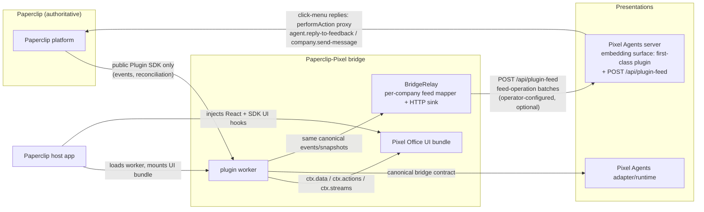
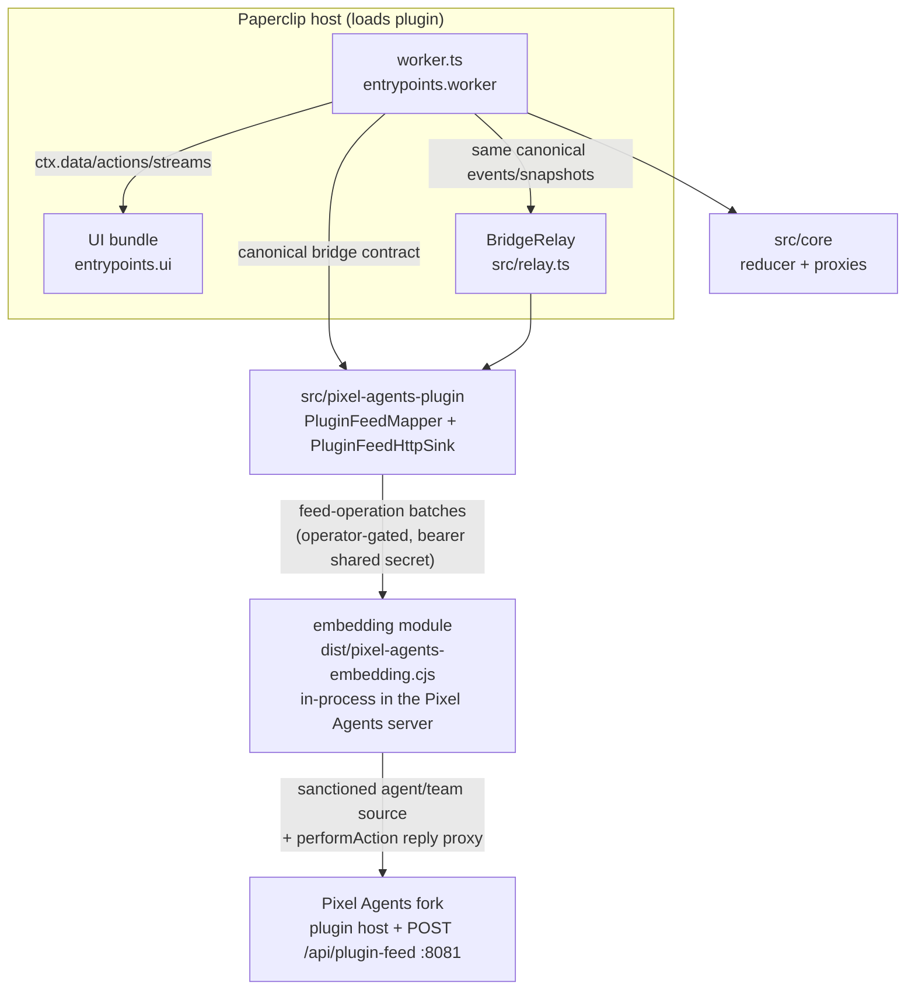
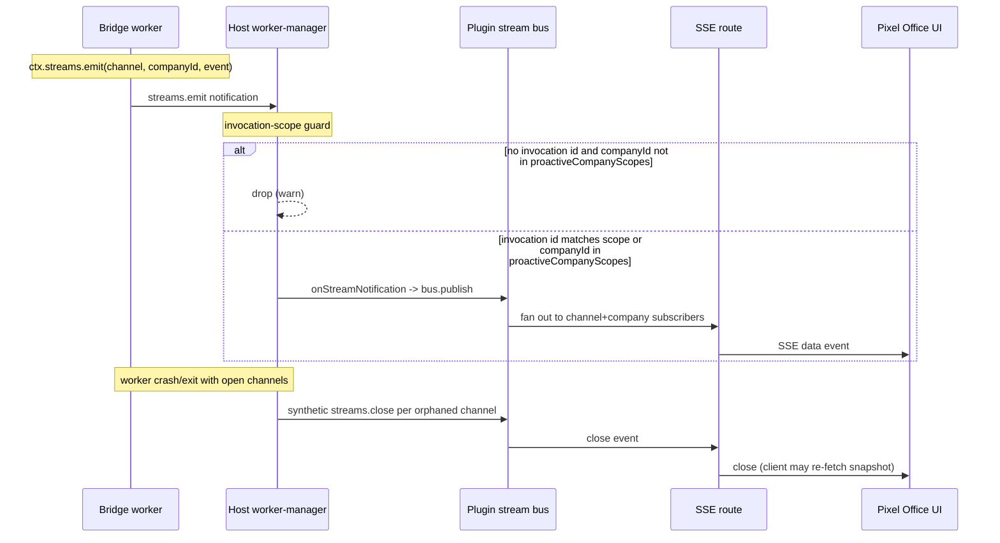
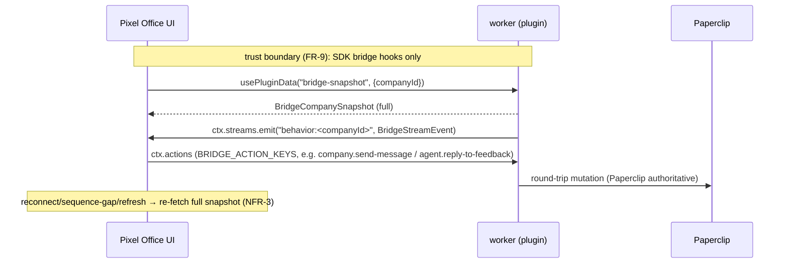
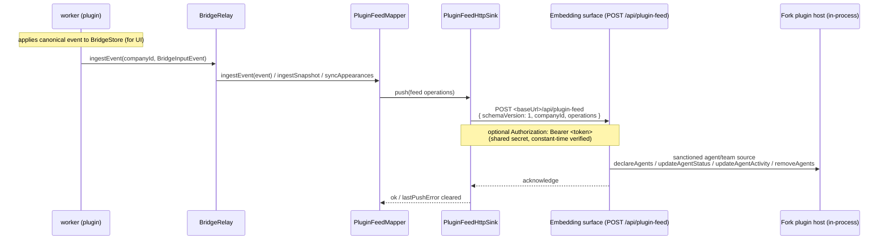

# Architecture Handbook — Paperclip ↔ Pixel Agents Bridge

This is the project-level **architecture handbook** for the Paperclip-Pixel
bridge. It covers the original translation layer (`PAPERCLIP_PIXELS-1`) and
the bridge plugin packaging + provider→Pixel-Agents relay glue
(`PAPERCLIP_PIXELS-2`). It is a living document: it is kept current
with the system as it actually is, never a dated snapshot, and never carries
a version number. It describes the system as a whole at the architecture
level — components, data flow, integration points, trust boundaries, build &
deploy, and the architectural decisions behind them.

It is **connective tissue, not a restatement**. The locked functional/
non-functional requirements, the canonical bridge contract, the per-phase
delivery plan, and the per-ticket domain records are owned elsewhere and
referenced here, not duplicated:

- **Specification domain record (normative for V1):** [`workdocs/ai/project/specifications/PAPERCLIP_PIXELS_1.md`](./specifications/PAPERCLIP_PIXELS_1.md) — referenced below as _the spec_; its numbered sections (§9 contract, §14 manifest, §15 protocol, §16 streams, §26 surfaces, §27 Paperclip UI example, §28 security, §29 performance, §30 failure handling) are the authoritative detail.
- **PAPERCLIP_PIXELS-2** is specified in the domain record
  [`workdocs/ai/project/specifications/PAPERCLIP_PIXELS_2.md`](./specifications/PAPERCLIP_PIXELS_2.md)
  (Pixel Agents plugin-architecture fork plus the paperclip-plugin-side
  character/menu/settings/assets workstreams WS0–WS5, delivered under
  [SAA-447](/SAA/issues/SAA-447)). The per-agent character system, the plugin
  UI surfaces (sidebar row, host auto-rendered settings form, character
  picker), the WS4 first-class appearance pipeline (plugin-declared sheet
  catalogs → privilege-gated host sync → webview rendering with palette
  fallback), the WS4 dialog-pane conversation feed and its privacy
  guardrails, the fork plugin architecture, and the workaround ledger are
  documented in the companion handbook
  [`workdocs/ai/architecture-handbook.md`](../architecture-handbook.md);
  this handbook keeps the translation-layer + relay architecture below.
  The earlier bundling + in-plugin `BridgeRelay` portion predates that record: it
  was delivered as the SAA-229 gate-reviewed commit and is documented here at
  the architecture level. **Superseded (WS2, PAPERCLIP_PIXELS-2):** the
  Claude-hook impersonation path is retired. The relay no longer serializes
  events into the real Claude hook JSON body for `POST /api/hooks/claude`;
  the bridge is now a **first-class Pixel Agents plugin** — the worker pushes
  plugin feed operations to an embedding module loaded in-process in the
  Pixel Agents server through the fork's generic `--plugin` loader, and
  click-menu replies route back through the plugin's existing Paperclip
  intake/feedback actions. See §"Bridge Relay subsystem" below and companion
  handbook §5.6 for the plugin host, the four contribution points, and the
  retirement of the three impersonation hacks.
- **Delivery plan:** [`workdocs/ai/project/plan.md`](./plan.md).
- **Project constitution / locked invariants:** project-root [`AGENTS.md`](../../../AGENTS.md).

Source-level JSDoc (per-file/class/function) is owned by Code Documentation
Specialist; per-ticket domain records (specification/bug/incident/release/test)
are owned by Delivery Documentation Specialist. This handbook references both;
it does not replace them.

---

## 00. Index

| Field | Value |
| --- | --- |
| Project | Paperclip ↔ Pixel Agents translation layer (`PAPERCLIP_PIXELS-1`) + bridge plugin packaging & relay glue (`PAPERCLIP_PIXELS-2`) |
| Owning team | Paperclip engineering (CTO governance) |
| Specification | `PAPERCLIP_PIXELS-1` — see spec domain record linked above; `PAPERCLIP_PIXELS-2` — see spec domain record linked above (character system + plugin UI surfaces in the companion `workdocs/ai/architecture-handbook.md`) |
| Lifespan | Always current; updated in place as the system changes |
| Diagrams | Inline Mermaid (simple flows); no PlantUML assets required yet |

**Table of contents**

- 01. Introduction and Overview
- 02. Glossary
- 03. System Context
- 04. Architecture Goals and Principles
- 05. Logical Architecture (incl. Bridge Relay subsystem — PAPERCLIP_PIXELS-2)
- 06. Deployment Architecture (build pipeline + deploy bundle flow)
- 08. Security Architecture (FR-9 trust boundary + relay outbound boundary)
- 09. Architecture Decisions and Risks
- 10. Interfaces (manifest UI surface + bridge contract + relay config & plugin feed endpoint)

Sections 07 (Data Architecture) and the optional Operational/Observability and
System-Component-Equivalency sections are intentionally omitted at this stage:
the bridge owns no authoritative data store (§07 belongs to the Design
Specification's entity docs and the spec's §13/§39.3 state guidance), and there
is no production operational maturity or predecessor system to map yet. They
will be added when the system has real content for them, not as stubs.

**Reading guidance**

| Audience | Sections | Why |
| --- | --- | --- |
| Engineering (plugin/UI) | 05, 06, 08, 10 | How the UI is built, bundled, wired, and kept inside the trust boundary |
| Engineering (core/adapter) | 03, 04, 05 | System shape, invariants, package boundaries |
| Security / compliance | 04, 08 | Trust boundary, least-privilege manifest, input validation |
| Integration partners | 03, 10 | External boundaries and the host-discovered UI surface |

---

## 01. Introduction and Overview

The Paperclip-Pixel bridge is a read-mostly translation layer that observes
Paperclip's authoritative organizational/business state, derives temporal
metrics and behavioral proxies from observed events, and exposes them to two
presentations — an embedded **Paperclip plugin UI** (the Pixel Office) and a
**Pixel Agents** visual runtime — through one canonical bridge contract. The
bridge is information-rich and presentation-poor: it supplies business context
and never dictates rendering. Paperclip remains the sole source of truth for
all business state; the bridge owns only a derived, restart-safe cache.

**Purpose of this document**

| Audience | Purpose |
| --- | --- |
| New engineers | Understand the system shape and where their package fits |
| Reviewers / security | Verify the trust boundary, least-privilege manifest, and build/deploy flow |
| Integration partners | See the external boundaries and the host-discovered UI surface |

**System summary**

| Attribute | Description |
| --- | --- |
| Platform type | Paperclip host plugin (worker + embedded UI) plus a standalone Pixel Agents adapter |
| Primary technologies | TypeScript, pnpm/npm workspaces, `@paperclipai/plugin-sdk`, React (UI bundle, host-injected), esbuild (worker + UI bundling via SDK-blessed presets), `tsc` (type declarations), Docker (deploy) |
| Core capabilities | Raw event projection, rolling-window temporal metrics, behavioral proxies with confidence/provenance, company intake + individual-agent feedback, live UI updates, optional in-plugin relay of canonical events to the bridge's first-class plugin embedding surface inside a Pixel Agents server (`PAPERCLIP_PIXELS-2`), including WS4 first-class per-agent appearance assignments and the privacy-guarded conversation-extract dialog-pane feed |
| Deployment models | Host image reusing the published Paperclip base + a self-contained, pre-built plugin `dist/` (no runtime dep vendoring); standalone Pixel Agents CLI image with the bridge embedding module loaded via the fork's `--plugin` loader |
| Integration interfaces | Public Paperclip Plugin SDK only (`ctx.data`/`ctx.actions`/`ctx.streams`/`ctx.events`/`ctx.state`); host-mounted UI bundle; optional operator-configured outbound HTTP to the embedding surface's `POST /api/plugin-feed` |
| Data zones | Paperclip (authoritative, external) · bridge derived cache (`ctx.state`, restart-safe) · host UI runtime (React, host-injected) · operator-configured Pixel Agents server (outbound relay target) |

---

## 02. Glossary

| Term | Definition |
| --- | --- |
| Bridge | The Paperclip-Pixel translation layer as a whole |
| Worker | The plugin's host-loaded script (`entrypoints.worker` → `dist/worker.js`); runs in the host plugin process |
| UI bundle | The host-loaded browser bundle (`entrypoints.ui` → `dist/ui/index.js`) mounted into declared UI slots |
| Pixel Office | The bridge's embedded Paperclip UI surface (page + sidebar slots) |
| Bridge contract | The canonical, versioned (`schemaVersion: 1`) data/action/stream shapes the worker serves and the UI/adapter consume (spec §9) |
| `ctx.data` / `ctx.actions` / `ctx.streams` / `ctx.events` / `ctx.state` | Public Plugin SDK surfaces the worker exposes to the UI; the only permitted path across the trust boundary (FR-9) |
| Behavior channel | The company-scoped stream channel `behavior:<companyId>` over which the worker pushes `BridgeStreamEvent` deltas |
| Invocation-scope guard | The host worker-manager resolves every worker→host message to an invocation scope before acting on it; a stream notification that does not resolve to a valid company scope is dropped before it reaches the stream bus |
| `proactiveCompanyScopes` | The set of companies a worker is authorized to act on outside a host-issued invocation; seeded at worker start so background `streams.emit` notifications pass the invocation-scope guard |
| Host | The Paperclip application that loads the plugin worker and mounts the UI bundle |
| Slot | A host UI extension point (`page` or `sidebar`) declared in the manifest and bound to a named export of the UI bundle |
| Bridge relay | The optional in-plugin subsystem (`BridgeRelay`, `PAPERCLIP_PIXELS-2`) that pushes canonical bridge events to the Pixel Agents side, one `PluginFeedMapper` + `PluginFeedHttpSink` per company |
| `instanceConfigSchema` | The operator-editable, company-scoped plugin config schema (manifest) the relay reads; fields `pixelAgentsUrl`, `pixelAgentsUiUrl`, `pixelAgentsTokenRef` (a `secret-ref` binding, never a plaintext value), `pixelAgentsRelayEnabled`, `paperclipApiBaseUrl`, `paperclipApiTokenRef`, `dialogPanePrivacyOptIn` (default OFF) |
| `PluginFeedMapper` | Per-company stateful translator in `src/pixel-agents-plugin/feed-mapper.ts` that maps canonical `BridgeInputEvent`s / snapshots / appearance maps into plugin feed operations (`declareAgents`, `removeAgents`, `updateAgentStatus`, `updateAgentActivity`, `assignAgentAppearance` — WS4, `dialogLines` — WS4), shaped by per-company mapper options (`dialogPrivacyOptIn`) |
| `PluginFeedHttpSink` | Ordered HTTP sink in `src/pixel-agents-plugin/feed-sink.ts` that POSTs feed-operation batches (`{ schemaVersion: 1, companyId, operations }`) to the embedding surface's `POST /api/plugin-feed`, optionally with a bearer token |
| Dialog pane | The bridge's Pixel Agents shell-panel widget ("Paperclip conversation") fed by pre-redacted, truncated conversation extracts (`dialogLines` feed ops → `paperclip.dialog.lines` plugin messages); fuller extracts require the per-company `dialogPanePrivacyOptIn` (default OFF, CEO decision 2). Guardrail detail lives in companion handbook §5.8 |
| Embedding surface | `src/pixel-agents-plugin/embedding.ts` (bundled to `dist/pixel-agents-embedding.cjs`): the module the deployed Pixel Agents server loads through the fork's generic `--plugin` loader — registers the Paperclip plugin in-process through the fork's plugin host and serves the feed endpoint on its own sidecar listener (default `127.0.0.1:8081`, fail-closed bearer auth) |

---

## 03. System Context



**External systems and boundaries**

- **Paperclip (authoritative).** All business state lives here. The bridge
  reaches it through the public Plugin SDK only — events, SDK client calls,
  and authoritative reconciliation reads. No direct DB, private routes, or
  host internals (NFR-8, locked decision 10).
- **Paperclip host app.** Loads the worker from `entrypoints.worker` and
  mounts the UI bundle from `entrypoints.ui` into the declared slots. The
  host injects React and the SDK UI hooks at runtime; the UI bundle ships
  neither (see §06/§08).
- **Pixel Agents.** Consumes the canonical bridge contract through a
  minimal source-level adapter; owns all visual/spatial state. The bridge
  supplies business context only.
- **Pixel Agents server (feed target, `PAPERCLIP_PIXELS-2` WS2).** An
  operator-configured outbound HTTP target: the embedding surface running
  in-process in the Pixel Agents server (registered through the fork's
  plugin host via the generic `--plugin` loader), serving
  `POST /api/plugin-feed` on its own sidecar listener (default
  `127.0.0.1:8081`, fail-closed bearer auth). When the relay is enabled for
  a company, the worker's `BridgeRelay` POSTs feed-operation batches —
  `declareAgents` / `removeAgents` / `updateAgentStatus` /
  `updateAgentActivity`, with palette/hueShift seats riding the declarations
  — which the embedding surface applies through the plugin's sanctioned
  agent/team source. Click-menu replies flow back through the plugin's
  registered actions to the Paperclip performAction proxy (the existing
  intake/feedback actions only — never direct issue creation). The retired
  impersonation path — Claude-hook JSON serialization against
  `/api/hooks/claude` — is gone (WS2-C; see companion handbook §5.6).

**Trust boundaries.** There are two trust boundaries: (1) all Paperclip
domain access routes through the worker bridge; UI components never call
Paperclip HTTP routes directly (FR-9, §28.2); (2) the relay's outbound
HTTP is operator-gated per company and pushes only mapped bridge envelopes
— the worker never accepts inbound requests from the Pixel Agents server
(detail in §08).

---

## 04. Architecture Goals and Principles

| Goal | Description |
| --- | --- |
| Paperclip fidelity | Displayed entities reference canonical Paperclip IDs; Paperclip stays authoritative for every mutation |
| Presentation-poor bridge | Expose derived telemetry and behavioral proxies, never business truth or fictional psychology |
| Upstream neutrality | Public/exposed APIs only; no direct DB, private routes, or Pixel Agents core hacks (NFR-8) |
| Restart-safe derived state | Compact time buckets persist in `ctx.state` so metrics survive restart even without retrospective event history |
| Live, eventually-consistent UI | Full snapshot on mount/company-switch/reconnect/sequence-gap/refresh; stream deltas otherwise (NFR-3) |

**Locked guiding principles** (from `AGENTS.md` §"Architecture Invariants",
spec §2; not relaxed without CTO approval):

1. Paperclip is the sole source of truth for organizational/business state.
2. Pixel Agents owns visual/spatial state; its core is agent/platform agnostic.
3. The bridge is information-rich and presentation-poor.
4. No clone-per-run policy — concurrent runs are preserved as run-level data.
5. At-least-once / unordered event model; idempotent reducers with `eventId`
   dedupe plus periodic authoritative reconciliation (default 5 min).
6. Single trust boundary — UI never calls Paperclip HTTP routes directly.
7. Least-privilege manifest — request only required capabilities.
8. Public/exposed APIs only.

**Recurring structural patterns**

- **Worker-bridge-UI split.** Worker owns all Paperclip access; UI is a thin,
  host-mounted view that talks to the worker only through SDK bridge hooks.
- **Snapshot + delta.** Authoritative snapshot on (re)mount/company-switch;
  streamed deltas otherwise; always re-fetchable after disconnect (FR-13).
- **Externalized host runtime.** The UI bundle externalizes React and the SDK
  UI hooks so the host injects them — the bundle never ships its own copy and
  stays inside the trust boundary.
- **Company-scoped streams.** Live deltas flow on `behavior:<companyId>`, one
  channel per company, opened explicitly by the worker per company.

---

## 05. Logical Architecture

One published npm package, `@decaf-ts/paperclip-pixels`, at the repo root
(spec §7, §8 recommended a three-workspace-package split; superseded — three
packages with `workspace:*` references plain npm couldn't resolve, for no
benefit, since only one was ever published. `paperclip/` is a git submodule
kept as reference-only material — never modified, never a build dependency.
`pixel-agents/` is a git submodule maintained as a deliberate **fork**
(baseline upstream tag `v1.4.1`, local tag `fork-baseline-v1.4.1`) under the
fork's `FORK.md` no-upstream-PR policy, with every fork-side change logged in
its `DIVERGENCE.md`; it is modified unilaterally in the fork and is never a
build dependency). Internally, three logical subsystems:

1. **`src/core/`** — snapshot loader, event normalizer + idempotent reducer,
   entity/run/concurrency projection, temporal windows, behavioral proxy
   calculator, feedback classifier, action policy / new-work gate,
   reconciliation. **Must not import React, the Pixel Agents renderer, or
   Paperclip UI code.**
2. **`src/{worker,manifest,actions,relay,snapshot,subscriptions,persistence}.ts`,
   `src/ui/`** — manifest/capabilities, event subscriptions, authoritative
   snapshot bootstrap, SDK client calls, `ctx.state` persistence,
   `ctx.data`/`ctx.actions`/`ctx.streams` handlers, the embedded Pixel Office
   UI surface (worker + UI bundle), and — as of `PAPERCLIP_PIXELS-2` — the
   in-plugin `BridgeRelay` (`src/relay.ts`) that pushes feed operations to
   the embedding surface inside the Pixel Agents server.
3. **`src/pixel-agents-plugin/`** — the bridge as a **first-class Pixel
   Agents plugin** (WS2-C): the embeddable module the fork's `--plugin`
   loader starts inside the Pixel Agents server process (plugin manifest +
   reply actions registered through the real WS2-A1 host API, the
   `POST /api/plugin-feed` handler with fail-closed bearer auth, and the
   reply forwarder into the existing Paperclip intake/feedback actions),
   plus the push-side primitives (`PluginFeedMapper`, `PluginFeedHttpSink`,
   the feed wire contract) consumed by `BridgeRelay` — plain relative
   imports within the same `src/` tree. The retired
   `src/pixel-agents-provider/` (Claude-hook wire format) is deleted.



**UI wiring subsystem (this layer's focus).** The plugin UI is built and
exposed as two artifacts from this package's `src/`:

- **Worker** — bundled by esbuild (`scripts/build.mjs` using
  `createPluginBundlerPresets` from `@paperclipai/plugin-sdk/bundlers`) into
  a self-contained `dist/worker.js` (+ `dist/manifest.js`). It inlines
  `src/core`, `src/pixel-agents-plugin`, `@paperclipai/plugin-sdk`,
  `@paperclipai/shared`, and `zod`, externalizing only `node:*` built-ins, so
  the forked worker process never has to resolve them from an install
  location at runtime. It implements the bridge handlers, the company-scoped
  stream, and — as of `PAPERCLIP_PIXELS-2` — owns the `BridgeRelay` (see
  "Bridge Relay subsystem" below). The same `npm run build` also emits
  `dist/pixel-agents-embedding.cjs` — a self-contained CJS bundle of
  `src/pixel-agents-plugin/embedding.ts` (everything inlined except node
  built-ins) that the deployed Pixel Agents server loads through the fork's
  `--plugin` loader; it never runs in a Paperclip plugin worker, so it uses
  plain esbuild options rather than the SDK presets.
- **UI bundle** — bundled by esbuild (`scripts/build-ui.mjs`) from
  `src/ui/index.tsx` to `dist/ui/index.js`. Re-exports the two slot
  components: `PixelOfficePage` (page slot) and `PixelOfficeSidebar`
  (sidebar slot). The bundle talks to the worker only through the SDK
  bridge hooks (`usePluginData`, `usePluginStream`) and the bridge contract
  in `src/ui/bridge-contract.ts` — never to Paperclip directly (FR-9).

The bridge contract the UI consumes is defined UI-side in
`src/ui/bridge-contract.ts` (the UI's view of the canonical contract, spec
§9/§15/§16/§29.3): `BridgeCompanySnapshot` served by the worker's
`bridge-snapshot` data handler, `BridgeStreamEvent` envelopes pushed on the
`behavior:<companyId>` channel, `BRIDGE_DATA_KEYS.snapshot = "bridge-snapshot"`,
`BRIDGE_ACTION_KEYS`, and `behaviorChannel(companyId)` → `` `behavior:${companyId}` ``.

The worker side of that contract (this layer): `worker.ts` opens **both**
channels per company on company setup — the company-scoped behavior channel
(`ctx.streams.open(behaviorChannel(companyId), companyId)`) and the shared
`bridge` channel (`ctx.streams.open(STREAM_CHANNELS.bridge, companyId)`) —
so the SDK's per-process channel→company map is populated for every channel
the worker emits on. That map is what stamps a non-empty `companyId` onto
each outgoing stream notification, which the host invocation-scope guard
requires (see "Host-side stream delivery path" below). The worker then
emits deltas on the behavior channel via
`ctx.streams.emit(behaviorChannel(change.companyId), uiEvent)`, and pushes
a `company.summary.changed` event on that same channel whenever an applied
event or an authoritative reconciliation actually changes the company
summary — so live gauges (open-issue count, active-run count, …) update
without a manual refresh. Stream channels are therefore **company-scoped**,
not a single global channel.

### Host-side stream delivery path

The stream is not a direct worker→UI pipe. Between the worker's
`ctx.streams.emit` and the UI's `usePluginStream` subscription sits the
**host plugin worker-manager**, an in-memory **plugin stream bus**, and an
**SSE route**. The full chain is:



**Invocation-scope guard.** Every worker→host message is resolved to an
invocation scope before the host acts on it; stream notifications
(`streams.open`/`streams.emit`/`streams.close`) are no exception. A
notification resolves to a valid company scope when it either echoes a
host-issued invocation id (bound to that invocation's single company) **or**
is a *proactive* (background) notification whose `companyId` is in the
worker's `proactiveCompanyScopes` set. A proactive notification with an
empty `companyId`, or one referencing a company outside that set, is dropped
with a warning before it ever reaches the stream bus — so it never fans out
to SSE. The guard never widens access beyond the plugin's configured
companies; it only decides whether a given background emit is admitted.

**Proactive company scopes.** `proactiveCompanyScopes` is the set of
companies a worker may act on outside a host-issued invocation (timers,
reconcile passes, event-driven emits). The host seeds it at worker start
from the plugin's configured companies, before any `setup()`-time
worker→host call can fire, so background stream emits reference an
authorized company and pass the guard. The bridge plugin auto-serves every
company in the instance and carries **no per-company operator config**, so
its configured-companies set would otherwise come out empty and every
background behavior/bridge emit would be dropped at the guard — live deltas
would never flow and the UI would only update on manual refresh. The host
image therefore seeds the bridge plugin's proactive scopes from **all
served companies** at worker start (see §06). A plugin that emits on a
stream channel from a background loop must, in general, (a) pass a
non-empty `companyId` on the channel and (b) be configured (or seeded) for
that company, or the emit is dropped at the guard.

**Stream bus and SSE delivery.** Admitted notifications are forwarded to an
in-memory pub/sub bus (`PluginStreamBus`) keyed by `(pluginId, channel,
companyId)`. The UI subscribes with `usePluginStream(channel)` from
`@paperclipai/plugin-sdk/ui`, which opens an `EventSource` on
`GET /api/plugins/:pluginId/bridge/stream/:channel?companyId=<companyId>`;
the route enforces board-org and company access and fans bus events out as
SSE with event types `message`, `open`, and `close`. Multiple UI clients may
subscribe to the same `(pluginId, channel, companyId)` tuple concurrently,
and a client never receives events for another company.

**Crash cleanup.** The worker-manager tracks open channels per worker. If
the worker process exits or crashes with channels still open, the host emits
a synthetic `streams.close` for each orphaned channel so connected SSE
clients are notified instead of hanging; the UI then re-fetches a full
snapshot on reconnect (NFR-3, FR-13). This host-side path is the connective
tissue the spec's §16 stream contract depends on; the contract itself
(envelope shapes, `behaviorChannel`, `BRIDGE_STREAM_EVENT_TYPES`) lives in
the spec record and `src/ui/bridge-contract.ts`.

### Bridge Relay subsystem (PAPERCLIP_PIXELS-2)

`src/relay.ts` adds an optional, operator-gated, **per-company** relay that
forwards the same canonical events and snapshots the worker already produces
for the UI to the bridge's embedding surface inside the Pixel Agents server.
It is additive to the UI bridge: enabling/disabling the relay never changes
what the UI receives.

**Shape.** `BridgeRelay` owns a `Map<companyId, CompanyRelay>`, where each
`CompanyRelay` is a `PluginFeedMapper` wired to a `PluginFeedHttpSink`
(from `src/pixel-agents-plugin/`). The mapper is a stateful translator from
canonical `BridgeInputEvent`s, authoritative snapshots, and the per-agent
appearance map into plugin feed operations; the sink POSTs strictly ordered
batches — `{ schemaVersion: 1, companyId, operations }` of `declareAgents` /
`removeAgents` / `updateAgentStatus` / `updateAgentActivity`, plus since WS4
`assignAgentAppearance` (per-agent character assignment by frozen
`characterId`; the embedding surface resolves it to a sheet index in the
catalog it declared through the fork's first-class appearance source) and
`dialogLines` (pre-redacted conversation extracts; companion handbook §5.8)
— to `<baseUrl>/api/plugin-feed`, optionally with a bearer `Authorization` header,
fire-and-forget with `lastPushError` capture. The mapper is constructed with
per-company options (`dialogPrivacyOptIn`), so the dialog guardrail mode is
fixed per company at configure time. The sink's outbound push is
routed through the **SDK-gated `ctx.http.fetch`** (declared `http.outbound`
capability; host-managed tracing/audit applies) and adapted to the sink's
injectable `FeedFetchLike` so the plugin package stays free of node globals —
the Node global `fetch` is never used. There is no Claude-hook vocabulary on
this wire: no `hook_event_name`, no `session_id`, no synthetic transcripts,
no `saveAgentSeats` (the three retired impersonation hacks; WS2-C).

**Config source.** Configuration is operator-set, **company-scoped** plugin
config, read via `ctx.config.get(companyId)` and declared in the manifest's
`instanceConfigSchema` (`relayConfigSchema` in `src/manifest.ts`). The worker
env is scrubbed by the host, so env vars are not available — config is the
only path. Fields: `pixelAgentsUrl` (required to enable; the embedding
surface's feed-listener base URL; must be `https:` when a token is
configured — an unparseable or non-http(s) value is rejected outright, and
plain `http:` is then accepted only for loopback hosts
(`localhost`, `127.0.0.0/8`, `::1`), enforced fail-closed at configure
time by `parseRelayConfig`), `pixelAgentsTokenRef` (optional `secret-ref` binding resolving
to the feed shared secret, resolved at `configure` time via
`ctx.secrets.resolve` — declared `secrets.read-ref`; the raw token is never
persisted or logged), `pixelAgentsRelayEnabled` (default on when a URL is
set), plus `pixelAgentsUiUrl`, `paperclipApiBaseUrl`, `paperclipApiTokenRef`
and the privacy opt-in `dialogPanePrivacyOptIn` (default OFF — the retired
`pixelAgentsProviderId` hook-path field is gone). The privacy opt-in parses
**strict-true**: `parseRelayConfig` maps only an explicit `=== true` to ON —
missing, absent, `false`, or wrong-typed values all mean OFF (the redacted
default), and the worker's config validation rejects non-boolean values;
because the parsed flag participates in the relay's config-unchanged check,
a toggle change rebuilds the company's mapper so the new guardrail mode
applies to every later event. The relay enables itself as
soon as a non-empty URL is present unless explicitly disabled. If
`pixelAgentsTokenRef` resolution fails, the relay stays disabled for that
company (fail-securely); a stored config that violates the https-when-token
transport contract (feed token + a `pixelAgentsUrl` that is unparseable,
not http(s), or cleartext `http:` to a non-loopback host)
is rejected the same way at configure time — `parseRelayConfig` throws
`RelayTransportContractError` and `BridgeRelay.configure()` disposes the
company's prior transport and leaves its relay disabled with a warning
([SAA-557](/SAA/issues/SAA-557), security F1).

**Lifecycle wiring** (`src/worker.ts`):

- **`setup()`** — constructs one module-level `BridgeRelay` (the host forks
  one worker process per plugin instance). Each bootstrapped company calls
  `relay.configure(companyId, companyConfig)` then
  `relay.ingestSnapshot(companyId, snapshot)` to declare every agent through
  the sanctioned source. The worker declares `multiCompanyConfig: true` to opt
  in to per-company `onConfigChanged` delivery instead of single-tenant
  collapse/restart.
- **Event loop** — every canonical `BridgeInputEvent` the worker applies to
  its `BridgeStore` is also forwarded via `relay.ingestEvent(companyId, bridgeEvent)`,
  a no-op when the company has no relay configured.
- **Reconciliation job** — `relay.ingestSnapshot(...)` is re-fed after each
  authoritative reconciliation so the feed mapper resyncs and re-declares
  agents that appeared since the last pass; `relay.syncAppearances(...)`
  re-applies the per-agent appearance map at bootstrap, resync, and each
  assignment write — seat palette/hueShift ride the declarations, and since
  WS4 each agent's frozen `characterId` rides a first-class
  `assignAgentAppearance` operation (emitted on change, so the agent's
  rendered sprite tracks the assignment; companion handbook §5.7).
- **`onConfigChanged(newConfig, { companyId })`** — reconfigures only the
  affected company's relay (disposes the prior mapper + sink, rebuilds from the
  new config; disables itself if the URL is gone). Errors are caught and
  logged — a config change must never crash the worker.
- **`onValidateConfig(config)`** — validates `pixelAgentsUrl` is an
  http(s) URL, **rejects `http:` when `pixelAgentsTokenRef` is configured**
  (cleartext must never carry a token; the only save-time exceptions are the
  bundled sidecar hostnames `localhost`, `127.0.0.1`, `::1`, and
  `pixel-agents-relay`), `pixelAgentsTokenRef` a `secret_ref` binding or
  non-empty string, `pixelAgentsRelayEnabled` a boolean, and — since WS4 —
  `dialogPanePrivacyOptIn` a boolean when present.
  `parseRelayConfig` re-enforces the contract at runtime, fail-closed: with
  a token configured, `pixelAgentsUrl` must be a valid http(s) URL and
  cleartext `http:` is accepted only for loopback hosts
  (`localhost`, `127.0.0.0/8`, `::1`) — anything else throws
  `RelayTransportContractError`, and `BridgeRelay.configure()` catches it to
  dispose the company's relay and leave it disabled.
- **`onHealth()`** — reports `companies` (bootstrapped) and `relayCompanies`
  (active relay count) in `details`.
- **`onShutdown()`** — `relay.disposeAll()` disposes every company mapper + sink.

**First-class plugin path (WS2).** The receiving end is the embedding
surface: `src/pixel-agents-plugin/embedding.ts`, bundled to
`dist/pixel-agents-embedding.cjs` and loaded by the fork's generic
`--plugin <module>` startup loader inside the Pixel Agents server process.
It registers the Paperclip plugin through the real WS2-A1 host API
(manifest + reply actions + roster re-declaration on start), serves
`POST /api/plugin-feed` on its own sidecar listener (default
`127.0.0.1:8081`; fail-closed bearer auth — constant-time SHA-256 digest
compare, 401 on unauthenticated or wrong-token, token never in the URL, and
the module refuses to start without `PAPERCLIP_PIXEL_FEED_TOKEN`), and wires
click-menu replies through the `HttpReplyForwarder` into the plugin's
**existing** Paperclip actions via the host's performAction proxy
(`agent.reply-to-feedback` / `company.send-message` only — no
issue-creation code anywhere on the path; without
`PAPERCLIP_PIXEL_API_TOKEN` replies fail closed with
`forwarderNotConfigured`). The plugin host, the four contribution points,
and the `--plugin` loader are documented in companion handbook §5.6; the
fork-side wire contract lives in the fork's `core/asyncapi.yaml`.

---

## 06. Deployment Architecture

### Build pipeline

The plugin is built from the repo root with a single `npm run build`, which
orders two stages (`prebuild` runs `rimraf ./dist` first):

```text
node scripts/build.mjs && node scripts/build-ui.mjs
```

1. **`node scripts/build.mjs`** — bundles the **worker + manifest** with
   esbuild using the SDK-blessed presets from
   `@paperclipai/plugin-sdk/bundlers` (`createPluginBundlerPresets`):
   - Entries: `src/worker.ts` → `dist/worker.js`, `src/manifest.ts` →
     `dist/manifest.js` (ESM, sourcemap on, `minify: false`).
   - **Inlined** into each bundle: `src/core`, `src/pixel-agents-plugin`,
     `@paperclipai/plugin-sdk`, `@paperclipai/shared` (consumed as TS
     source), and `zod`. The forked worker process therefore never has to
     resolve these from an install location at runtime — the bundle is
     self-contained.
   - **Externalized:** `node:*` built-ins only (per the plugin loader
     contract). The worker loads in plain Node with no `tsx` loader.
   - The same script additionally bundles the **embedding module**:
     `src/pixel-agents-plugin/embedding.ts` →
     `dist/pixel-agents-embedding.cjs` (plain esbuild options, CJS so the
     fork CLI's dynamic import resolves it trivially, everything inlined
     except node built-ins — this bundle never runs in a Paperclip plugin
     worker, so no SDK preset applies).
   - `tsc -p tsconfig.json` is no longer the worker build step. It is kept
     for type declarations (`build:types` runs `--emitDeclarationOnly`) and
     typechecking (`typecheck` runs `--noEmit`). The worker `tsconfig.json`
     excludes `src/ui`, declares no JSX mode, and — as of this diff — adds
     `"types": ["node"]` (plus the `@types/node` devDependency) so
     `tsc --noEmit` passes against Node globals like `fetch`.
2. **`node scripts/build-ui.mjs`** — bundles the UI with esbuild:
   - Entry: `src/ui/index.tsx` → output `dist/ui/index.js` (ESM, `browser`
     platform, `es2022` target, sourcemap on).
   - **`jsx: "automatic"` is set explicitly** because esbuild would otherwise
     auto-discover the worker `tsconfig.json`, which excludes `src/ui` and
     declares no `jsx` mode. Automatic JSX runtime imports from
     `react/jsx-runtime`.
   - **Externalized:** `react`, `react-dom`, `react/jsx-runtime`, and
     `@paperclipai/plugin-sdk/ui`. The host injects these at runtime, so the
     bundle ships no copy of React and reaches Paperclip only through the
     worker bridge (FR-9, §28.2). This mirrors the SDK reference pattern in
     `paperclip/packages/plugins/examples/plugin-kitchen-sink-example/scripts/build-ui.mjs`.

The plugin `package.json` (the repo-root `package.json` — there is no other)
exposes a `paperclipPlugin` field
(`{ "manifest": "./dist/manifest.js", "worker": "./dist/worker.js" }`) so the
host loader can locate the built artifacts, and points `exports`/`types` at
`src/*.ts` (types resolve from source). `npm run build:worker` rebuilds only
the worker/manifest bundles, `npm run build:ui` rebuilds only the UI bundle,
and `npm run typecheck:ui` (`tsc -p tsconfig.test.json --noEmit`)
type-checks the UI sources against the test tsconfig. `esbuild` is a root
devDependency.

### Deploy bundle flow

Deployment builds two Docker images from the repo root after the plugin is
built (per `deploy/README.md`):

```bash
npm run build
docker build -t paperclip-pixel-host:local -f deploy/docker/Dockerfile.paperclip-pixel-host .
docker build -t pixel-agents:local         -f deploy/docker/Dockerfile.pixel-agents .
```

- **Host image** (`Dockerfile.paperclip-pixel-host`) is built FROM the
  **published, completely unpatched** Paperclip base
  (`ghcr.io/paperclipai/paperclip:latest`) and only adds the self-contained
  bridge plugin plus a bootstrap entrypoint. It does not rebuild the plugin —
  it consumes the already-built `dist/`.

  **(Historical — no longer applies.)** An earlier revision of this image
  applied two build-time patches (`saa316-stream-bus.patch`,
  `saa320-proactive-scopes.patch`, both now deleted) to wire Paperclip's
  `createPluginStreamBus()` and seed proactive plugin-worker scopes — purely
  so the plugin's *own* embedded dashboard page could get live SSE push
  updates from its worker instead of polling. That machinery was unrelated to
  the Paperclip↔Pixel Agents bridge itself (which pushes over plain
  `ctx.http.fetch`, never touches the stream bus) and added a real, if
  disclosed, Paperclip source patch for a cosmetic UI feature. Removed in
  favor of the plugin's own polling-based `useBridge` refresh (§29.3), which
  was always the fallback path anyway. `GET /api/plugins/:id/bridge/stream/:channel`
  now returns 501 on this image, same as any stock Paperclip install. If the
  live-push UX is wanted back, the right fix is a genuine small upstream PR to
  Paperclip wiring `bridgeDeps.streamBus` natively — not a build-time patch.

- **Plugin bundling** is performed by `deploy/docker/build-plugin-bundle.sh`,
  which assembles a self-contained copy of the plugin at a target directory.
  Because the worker/manifest bundles are esbuild-bundled (inlining
  `core`/`pixel-agents-plugin`/`sdk`/`shared`/`zod`), the script just copies
  the root `package.json`, the **whole `dist/` tree** (`cp -R .../dist`), and
  — since WS2-D — the **`assets/characters/` catalog** the worker reads at
  runtime. No vendoring of dependency files under `node_modules/`, no
  separate `zod` install, no exports-rewriting step. The layout produced is
  just:
  ```text
  <target>/
    package.json   (the @decaf-ts/paperclip-pixels root package.json)
    dist/          (worker.js, manifest.js, ui/index.js -- all self-contained)
    assets/characters/  (catalog.json + char_*.png — the WS3 catalog)
  ```
  Because `dist/` contains `worker.js`, `manifest.js`, and `ui/index.js`,
  the UI bundle ships inside the same `dist/` as the worker — the host finds
  it via the manifest's `entrypoints.ui` (`"./dist/ui"`). No separate UI
  shipping step is needed. The Dockerfile correspondingly only `COPY`s the
  root `package.json` + `dist/` + `assets/characters/` (nothing from
  `paperclip/` or `pixel-agents/` beyond their own Dockerfile stages).
- **Pixel Agents image** (`Dockerfile.pixel-agents`) builds the standalone
  CLI from the `pixel-agents` submodule (which ships no Dockerfile of its
  own) **and vendors the bridge embedding module**: it `COPY`s
  `dist/pixel-agents-embedding.cjs` (built by the repo-root `npm run build`
  — which must therefore run before either image is built) and starts the
  CLI with `--plugin /opt/paperclip-pixel-embedding/pixel-agents-embedding.cjs`,
  exposing `8080` (UI/WS) and `8081` (plugin feed). The retired
  `bin/paperclip-pixel-relay.js` sidecar vendoring is gone.

> Repo layout note: the project-root `docs/` directory is a gitignored
> publish output (the `npm run drawings`/`uml` scripts copy
> `workdocs/{drawings,uml,assets,resources}` into it). Source-tracked
> project documentation therefore lives under `workdocs/ai/project/`
> (this handbook, the spec record, and the plan), not under `docs/`.

---

## 08. Security Architecture

| Layer | Description | Key mechanisms |
| --- | --- | --- |
| Trust boundary (UI ↔ worker) | All Paperclip domain access routes through the worker; the UI never calls Paperclip HTTP routes directly (FR-9, §28.2) | UI bundle externalizes React + SDK UI hooks; UI reaches the worker only via `ctx.data`/`ctx.actions`/`ctx.streams` |
| Relay outbound boundary (`PAPERCLIP_PIXELS-2`) | The relay's outbound HTTP to the embedding surface is operator-gated per company, push-only, routed through the SDK-gated `ctx.http.fetch` (declared `http.outbound`), and carries only plugin feed batches; the worker never accepts inbound from that server | `instanceConfigSchema` gates `pixelAgentsUrl`/`pixelAgentsRelayEnabled`; relay disabled by default when no URL; `onValidateConfig` enforces http(s) URL + rejects `http:` with a token (bundled sidecar names excepted), and `parseRelayConfig` re-enforces the contract at runtime (with a token the URL must be valid http(s) and cleartext `http:` is loopback-only; otherwise `RelayTransportContractError` disables the relay fail-closed); bearer token is operator-bound via a `secrets.read-ref`-gated secret reference, never a plaintext config value; the feed endpoint mirrors the gate fail-closed (constant-time digest compare, 401, no token-in-URL, refuses to start without `PAPERCLIP_PIXEL_FEED_TOKEN`) |
| Least-privilege manifest | Request only required capabilities (FR-10, §14, §28.1) | `capabilities` array in `manifest.ts`; read-only visualization needs no mutation caps; feedback needs no `issues.create` |
| Conversation-extract boundary (WS4-C) | Dialog-pane lines leave the worker only pre-redacted and truncated — raw sensitive prompts never ride the relay wire in either privacy mode | Always-on secret redaction + mode-dependent truncation (OFF ≤ 120 / ON ≤ 480 chars, 600-char line clamp) in pure domain code (`src/core/domain/dialog.ts`), applied at mapper compose time; `dialogPanePrivacyOptIn` parsed strict-true and mapper-rebuilt on change; feed apply side re-clamps and validates fail-closed (full guardrail detail: companion handbook §5.8) |
| Input validation | All `ctx.data`/`ctx.actions`/`ctx.streams` payloads validated with Zod; host-authenticated actor identity, not user-supplied actor IDs (FR-11, §28.4) | Zod schemas on every handler; `onValidateConfig` validates relay config fields |
| Secrets | No resolved secrets in plugin state — retain references, resolve at call time; never log secrets/full sensitive prompts by default (FR-12, §28.3, NFR-7) | `ctx.state` holds references only; the relay token is resolved per company from the operator-bound `pixelAgentsTokenRef` (`ctx.secrets.resolve`, `secrets.read-ref`), lives only in memory for the sink's lifetime, and is never logged or persisted |

### FR-9 trust boundary (UI ↔ worker)

The UI bundle and the worker communicate **only** through the public Plugin
SDK bridge surfaces. Concretely, in this diff:

- `src/ui/bridge-contract.ts` defines the UI-side contract: the snapshot
  data key (`bridge-snapshot`), the action keys (`BRIDGE_ACTION_KEYS`), and
  the company-scoped stream channel (`behaviorChannel(companyId)` →
  `` `behavior:${companyId}` ``).
- `src/ui/use-bridge.ts` consumes the snapshot and stream **only** through
  `usePluginData` / `usePluginStream` from `@paperclipai/plugin-sdk/ui` —
  never a Paperclip HTTP route. It fetches a full snapshot on mount,
  company switch, reconnect, detected sequence gap, and explicit refresh,
  and marks state visibly stale while the stream is disconnected (§30.1),
  blocking state-changing actions while stale.
- `scripts/build-ui.mjs` externalizes `react`, `react-dom`,
  `react/jsx-runtime`, and `@paperclipai/plugin-sdk/ui`, so the host
  injects them at runtime and the bundle ships no own copy of React — it
  has no path to Paperclip except the worker bridge.
- `worker.ts` is the sole origin of streamed deltas: it opens
  `behaviorChannel(companyId)` per company and emits `BridgeStreamEvent`
  envelopes through `ctx.streams.emit`.

There is no `fetch`/HTTP client in the UI bundle for Paperclip routes; the
build externalization and the SDK-hook-only data path make that boundary
structural, not merely conventional.

### Relay outbound boundary (PAPERCLIP_PIXELS-2)

The `BridgeRelay` introduces a second, narrower boundary: an **outbound**
HTTP path from the worker to an operator-configured Pixel Agents server.

- **Operator-gated, per company.** The relay is disabled by default; it
  enables itself only when a company's `instanceConfigSchema` config sets a
  non-empty `pixelAgentsUrl` (unless `pixelAgentsRelayEnabled` is explicitly
  `false`). Each company is configured independently; enabling company A's
  relay never affects company B.
- **Push-only, through the gated HTTP surface.** The worker only POSTs
  feed-operation batches to `<baseUrl>/api/plugin-feed`; it never opens a
  listener and never accepts inbound requests from that server. There is no
  inbound surface to attack from the Pixel Agents server side. The push is
  routed through the SDK-gated `ctx.http.fetch` behind the declared
  `http.outbound` capability — the host's capability validator and outbound
  tracing/audit cover it; the Node global `fetch` is never used.
- **Config is the only path.** The worker env is scrubbed by the host, so
  env vars are unavailable inside the plugin; the relay reads its URL/token
  only from operator plugin config via `ctx.config.get(companyId)`. The bearer
  token is operator-bound as a `pixelAgentsTokenRef` secret reference, resolved
  at `configure` time via `ctx.secrets.resolve` (`secrets.read-ref`), sent only
  on the outbound feed POST, lives only in memory, and is never logged or
  persisted.
- **Validated config.** `onValidateConfig` enforces that `pixelAgentsUrl` is
  an http(s) URL — and **rejects `http:` when a token ref is configured**
  (cleartext must never carry a bearer token; the only save-time exceptions
  are the bundled sidecar hostnames `localhost`, `127.0.0.1`, `::1`, and
  `pixel-agents-relay`). `parseRelayConfig` re-enforces the contract at
  runtime, fail-closed: with a token configured, `pixelAgentsUrl` must be a
  valid http(s) URL and cleartext `http:` is accepted only for loopback
  hosts (`localhost`, `127.0.0.0/8`, `::1`) — anything else throws
  `RelayTransportContractError`, which
  `BridgeRelay.configure()` catches to dispose the company's relay and leave
  it disabled (the previous transport is never kept). It also enforces the
  token ref is a `secret_ref` binding or non-empty string, and the enable
  flag is boolean — rejecting malformed operator input before it reaches the
  relay. The receiving feed endpoint enforces its own half of the boundary
  fail-closed: bearer shared secret compared constant-time over SHA-256
  digests, 401 on unauthenticated/wrong-token, a token never accepted via
  URL, and the embedding module refuses to start without
  `PAPERCLIP_PIXEL_FEED_TOKEN` configured.
- **Failure isolation.** `onConfigChanged` and `setup()` catch and log relay
  errors; a relay misconfiguration or push failure must never crash the
  worker or break the UI bridge. `PluginFeedHttpSink.lastPushError` surfaces
  the most recent push error per company (cleared on a successful push) for
  health/observability.

### New-work invariant (security-critical)

New work enters through company/leadership intake only. Individual-agent
conversations are feedback channels bound to existing work; the reply handler
does not hold or invoke `issues.create`. The UI **fails closed**: text that
appears to introduce new work triggers no mutation and offers a deliberate
"Send to company" / "Open company intake" path. The hard guarantee is the
action path, not a language classifier (spec §5.2/§17/§18, `AGENTS.md`
§"Security-Critical Invariant"). See the spec domain record for the full
statement.

---

## 09. Architecture Decisions and Risks

### ADR-01 — UI bundle via esbuild with externalized host runtime

**Context & problem.** The Pixel Office UI is React, but it must load inside
the Paperclip host, which already provides React and the SDK UI hooks. Shipping
a second React copy would duplicate the runtime and risk version/context
mismatch. The worker build (`tsc`) excludes `src/ui` and has no JSX config, so
it cannot produce the UI bundle.

**Alternatives considered**

| Option | Description |
| --- | --- |
| `tsc` for the UI too | Rejected: worker `tsconfig.json` excludes `src/ui` and declares no `jsx` mode; reusing it would require a separate UI tsconfig and still would not externalize the host runtime |
| esbuild, bundling React in | Rejected: duplicates the host's React, risks context mismatch, and gives the bundle an independent runtime path that weakens the FR-9 boundary |
| **esbuild, externalizing React + SDK UI hooks** | Chosen |

**Decision.** **esbuild with `react`, `react-dom`, `react/jsx-runtime`, and
`@paperclipai/plugin-sdk/ui` externalized** — the host injects them at runtime.
`jsx: "automatic"` is set explicitly (the worker tsconfig that esbuild might
auto-discover excludes `src/ui` and has no JSX mode).

**Pros / Cons**

| Pros | Cons |
| --- | --- |
| No duplicated React; host is the single runtime | UI build is a second tool beyond `tsc` |
| Structural FR-9 boundary — bundle has no Paperclip path except the worker | Requires `esbuild` devDependency |

**Summary.** Externalization makes the trust boundary structural and keeps the
host the single React provider. Mirrors the SDK kitchen-sink reference.

### ADR-02 — Company-scoped behavior stream channel

**Context & problem.** Behavior deltas must not leak across companies, and the
UI must be able to subscribe per company and re-fetch a full snapshot on
company switch (NFR-3).

**Decision.** **One stream channel per company: `behavior:<companyId>`.** The
worker opens it explicitly on company setup
(`ctx.streams.open(behaviorChannel(companyId), companyId)`) and emits deltas
to the company-scoped channel; the UI subscribes via
`usePluginStream(behaviorChannel(companyId), { companyId })` and resets state
on company switch. (Previously a single global `behavior` channel was used;
this diff makes it company-scoped.)

**Summary.** Company-scoping prevents cross-company bleed and aligns the stream
with the per-company snapshot lifecycle.

### ADR-03 — Route-based sidebar link, not plugin-id-based

**Context & problem.** The page slot declares `routePath: "pixel-office"`, and
the sidebar should navigate to the page without depending on the internal
plugin id.

**Decision.** The sidebar links to `/${PIXEL_OFFICE_PAGE_ROUTE}`
(`pixel-office`) via the host's `useHostNavigation().linkProps`, not to a
plugin-id path. The route segment is a shared constant (`PIXEL_OFFICE_PAGE_ROUTE`)
mirrored in both plugin core (`src/constants.ts`) and the UI
(`src/ui/bridge-contract.ts`).

### ADR-04 — Self-contained esbuild worker/manifest bundle (PAPERCLIP_PIXELS-2)

**Context & problem.** The forked plugin worker process loads in plain Node
(no `tsx` loader). With bare `tsc` output, the worker had to resolve
`@paperclip-pixel/core`, `@paperclipai/plugin-sdk`, `@paperclipai/shared`, and
`zod` from an install location at runtime — which the deploy bundle could only
satisfy by vendoring those packages as real files under `node_modules/` and
rewriting `@paperclipai/shared`'s TS-source exports to point at built dist JS.
That vendoring was fragile (CJS/ESM `import` condition patching for core,
shared exports rewriting, an isolated `zod` npm install) and left residual
worker-runtime defects (see `deploy/README.md` "Known limitations").

**Alternatives considered**

| Option | Description |
| --- | --- |
| Keep `tsc` + runtime vendoring | Rejected: fragile, package-shape-dependent, breaks when upstream `shared` exports point at TS source |
| Bundle with a hand-rolled esbuild config | Rejected: reinvents the SDK-blessed externalization rules (what to inline vs externalize as `node:*`) |
| **esbuild via `createPluginBundlerPresets` from `@paperclipai/plugin-sdk/bundlers`** | Chosen |

**Decision.** Bundle the worker and manifest with esbuild using the
SDK-blessed presets (`scripts/build.mjs` → `createPluginBundlerPresets`).
Runtime deps (`@paperclip-pixel/core`, `@paperclipai/plugin-sdk`,
`@paperclipai/shared` consumed as TS source, `zod`,
`src/pixel-agents-plugin`) are **inlined**; only `node:*`
built-ins are externalized. `tsc` is demoted to type declarations
(`build:types`) and typechecking (`typecheck`), adding `"types": ["node"]` +
`@types/node` so Node globals like `fetch` typecheck. Since WS2-D the same
script also emits the self-contained `dist/pixel-agents-embedding.cjs`
(plain esbuild, CJS, node built-ins external) for the fork's `--plugin`
loader.

**Pros / Cons**

| Pros | Cons |
| --- | --- |
| Forked worker loads in plain Node with no runtime resolution | Worker build is now esbuild, not `tsc` (separate type-declaration step needed for consumers) |
| Deploy bundle collapses to `package.json` + `dist/` — no vendoring, no exports rewriting, no isolated `zod` install | Bundled worker is larger and less debuggable than `tsc` output (sourcemaps mitigate) |
| Externalization rules come from the SDK presets, not hand-maintained | — |

**Summary.** Self-contained bundles remove the fragile runtime vendoring and
make the deploy shape `package.json` + `dist/` only.

### ADR-05 — In-plugin per-company BridgeRelay (PAPERCLIP_PIXELS-2)

**Context & problem.** The bridge already produces canonical events/snapshots
for the UI. To also drive the Pixel Agents office, those same events must
reach the bridge's embedding surface inside the Pixel Agents server — without
a second event pipeline, without an inbound listener, and without breaking
the per-company model.

**Alternatives considered**

| Option | Description |
| --- | --- |
| Separate relay process outside the plugin | Rejected: duplicates event subscription/bootstrap, splits the canonical pipeline, second deployable to operate (the retired `paperclip-pixel-relay` CLI was exactly this) |
| Push from the UI bundle | Rejected: violates FR-9 (UI has no Paperclip path) and only fires while the UI is open |
| **In-plugin `BridgeRelay` fed the same canonical events** | Chosen |

**Decision.** Add `BridgeRelay` in `src/relay.ts`, constructed once in
`setup()`, owning one `PluginFeedMapper` + `PluginFeedHttpSink` per company
(from `src/pixel-agents-plugin/`). The worker forwards every canonical
`BridgeInputEvent`, each authoritative snapshot, and the per-agent appearance
map to the relay alongside applying them to its `BridgeStore`; the relay is a
no-op for companies with no config. Config is operator-set, company-scoped
plugin config (`instanceConfigSchema`), not env (host scrubs env).
`multiCompanyConfig: true` opts into per-company `onConfigChanged` so config
edits reconfigure only the affected company without a worker restart.

**Pros / Cons**

| Pros | Cons |
| --- | --- |
| One canonical event pipeline; relay is additive and no-op when disabled | Adds an outbound HTTP path (second boundary, see §08) requiring operator config |
| Feed operations are thin wrappers around the sanctioned agent/team source — no impersonation vocabulary on the wire | The embedding surface needs its own env-configured shared secret (`PAPERCLIP_PIXEL_FEED_TOKEN`) mirrored into `pixelAgentsTokenRef` |
| Per-company config + lifecycle hooks; failures are isolated and logged | — |

**Summary.** The relay reuses the canonical pipeline, is operator-gated per
company, and speaks the first-class plugin feed (WS2) — the earlier
Claude-hook serialization and its upstream-dispatch dependency are retired.

### ADR-06 — Background stream emits and the host invocation-scope guard

**Context & problem.** Live UI deltas flow as worker `ctx.streams.emit`
notifications, but the host worker-manager does not blindly forward them: it
resolves every worker→host message to an *invocation scope* first, and drops
any stream notification that does not resolve to a valid company scope. A
notification is admitted when it echoes a host-issued invocation id (bound to
that invocation's company) **or** when it is a proactive background emit whose
`companyId` is in the worker's `proactiveCompanyScopes`. The bridge plugin
does its real work outside any host-issued invocation — event-driven
`onEvent` processing and periodic reconciliation both emit on the behavior
channel in the background — so its live deltas depend entirely on the
proactive path. Two failure modes follow: (1) an emit with an empty
`companyId` on the channel is dropped (the SDK stamps `companyId` from a
per-process channel→company map, which is only populated for channels the
worker explicitly opened with a `companyId`); and (2) the worker's
`proactiveCompanyScopes` is seeded from the plugin's *configured* companies,
and the bridge plugin auto-serves every company with no per-company operator
config, so that set is empty and every background emit is dropped at the
guard. With both, live gauges only update on manual refresh.

**Alternatives considered**

| Option | Description |
| --- | --- |
| Emit on a single global `behavior` channel with no `companyId` | Rejected: drops at the guard (empty `companyId`), and leaks across companies (ADR-02) |
| Drive all emits from inside a host-issued invocation only | Rejected: background reconcile/event work is the whole point of live updates; the UI would go stale between invocations |
| Open only the behavior channel per company | Rejected: the shared `bridge` channel also carries company-scoped events; without opening it per company its notifications carry an empty `companyId` and drop at the guard |
| **Open both channels per company + seed proactive scopes from served companies** | Chosen |

**Decision.** (a) The worker opens **both** the company-scoped
`behavior:<companyId>` channel and the shared `bridge` channel per company on
company setup, so the SDK's channel→company map stamps a non-empty
`companyId` on every notification. (b) The host image seeds the bridge
plugin's `proactiveCompanyScopes` from **all served companies** at worker
start (a build-time patch, §06), since the plugin has no per-company operator
config to seed it from. Background behavior/bridge emits then carry a valid
`companyId` that is in the proactive set, so they pass the guard and reach
`bus.publish` → SSE. (c) The worker emits `company.summary.changed` on the
behavior channel only when a summary actually changes (reconcile or
event), avoiding delta spam.

**Pros / Cons**

| Pros | Cons |
| --- | --- |
| Background emits reach the UI; live gauges update without a manual refresh | Proactive scopes are seeded by a build-time host-image patch, not a plugin-declared mechanism — temporary coupling to the upstream host image |
| Both channels are company-scoped at the guard; no cross-company bleed (ADR-02) | Revert/replace logic is needed once upstream ships a plugin-driven scopes mechanism |
| Emit-on-change avoids redundant SSE traffic | The guard's drop is silent (warn-logged); a misconfigured scope surfaces as "UI not updating", not an error |

**Summary.** Live background deltas require both a non-empty `companyId` on
the channel and a seeded proactive scope; opening both channels per company
and seeding scopes from served companies makes the bridge's background emits
survive the host invocation-scope guard. The host-side seeding is a
temporary build-time patch pending an upstream plugin-driven scopes
mechanism.

**Risk register**

| ID | Risk | Impact | Likelihood | Mitigation | Owner | Status |
| --- | --- | --- | --- | --- | --- | --- |
| R1 | UI bundle accidentally imports a Paperclip HTTP client, breaking FR-9 | High | Low | Externalize React + SDK UI hooks; UI reaches worker only via SDK bridge hooks; policy tests (§31.5) | Engineering | Mitigated by build externalization |
| R2 | Stream channel not company-scoped → cross-company bleed | High | Low | Company-scoped `behavior:<companyId>` channel opened per company; UI resets on company switch | Engineering | Mitigated |
| R3 | Host lacks `ui.sidebar.register` capability → sidebar slot rejected | Medium | Low | Manifest declares `ui.sidebar.register` alongside `ui.page.register` | Engineering | Mitigated |
| R4 | Worker bundle accidentally externalizes an inlined dep → runtime resolution failure in the forked worker | High | Low | SDK-blessed `createPluginBundlerPresets` owns the inline/externalize rules; build logs the inlined/externalized lists | Engineering | Mitigated by SDK presets (PAPERCLIP_PIXELS-2) |
| R5 | Relay push failure or misconfiguration crashes the worker / breaks the UI bridge | High | Low | `setup()`/`onConfigChanged` catch+log relay errors; relay is no-op when disabled; UI bridge is independent of relay | Engineering | Mitigated by failure isolation (PAPERCLIP_PIXELS-2) |
| R6 | Relay enabled for the wrong company / cross-company event bleed | High | Low | Per-company `Map<companyId, CompanyRelay>`; `onConfigChanged` is per-company; `multiCompanyConfig: true` | Engineering | Mitigated (PAPERCLIP_PIXELS-2) |
| R7 | Background `streams.emit` dropped by the host invocation-scope guard → UI gauges only update on manual refresh | High | Medium | Worker opens both channels per company so `companyId` is stamped on every notification; host image seeds the bridge plugin's `proactiveCompanyScopes` from served companies at worker start (ADR-06, §06) | Engineering | Mitigated by dual-channel open + proactive-scope seeding |
| R8 | Stored company config pairs the feed token with a cleartext `http:` `pixelAgentsUrl` to a non-loopback host (e.g. the documented containerized service-name topology `http://pixel-agents:8081` + `pixelAgentsTokenRef`) — the bearer token would travel unencrypted | High — credential disclosure on the feed wire | Low | Runtime fail-closed enforcement in `parseRelayConfig` ([SAA-557](/SAA/issues/SAA-557), security F1): `RelayTransportContractError` at configure time; `configure()` disposes the prior transport and leaves the relay disabled (warn-logged); `http:` stays allowed for loopback hosts so local dev is unaffected. Affected service-name topologies need TLS fronting or an explicit exception decision (adjudication pending with Security Engineer) | Engineering / Security Engineer | Mitigated — deployment remediation tracked |

---

## 10. Interfaces

### IF001 — Manifest UI surface (host-discovered)

The host discovers the UI through the plugin manifest (`src/manifest.ts`,
spec §14/§19/§26/§27):

- **`entrypoints`**
  - `worker`: `"./dist/worker.js"`
  - `ui`: `"./dist/ui"` — the host loads the UI bundle from this directory.
- **`ui.slots`** — the two slots the host mounts:

| Slot type | id | displayName | exportName | routePath |
| --- | --- | --- | --- | --- |
| `page` | `pixel-office-page` | Pixel Office | `PixelOfficePage` | `pixel-office` |
| `sidebar` | `pixel-office-sidebar` | Pixel Office | `PixelOfficeSidebar` | — |

The host loads the UI bundle from `entrypoints.ui` and mounts the named export
matching each slot's `exportName`. The bundle's entry
(`src/ui/index.tsx`) re-exports exactly those two names. Slot ids, export
names, and the page route are shared constants in `src/constants.ts`
(`UI_SLOT_IDS`, `UI_EXPORT_NAMES`, `PIXEL_OFFICE_PAGE_ROUTE = "pixel-office"`),
mirrored UI-side in `src/ui/bridge-contract.ts`.

**Capabilities required for these slots** (least-privilege, FR-10):
`ui.page.register` and `ui.sidebar.register` (the latter added in this diff).
Read-only visualization requests no mutation capabilities; feedback requests
no `issues.create`.

### IF002 — Worker ↔ UI bridge contract



- **Data (snapshot):** worker serves `BridgeCompanySnapshot` on the
  `bridge-snapshot` data key (`BRIDGE_DATA_KEYS.snapshot`). The UI fetches a
  full snapshot on mount, company switch, reconnect, detected sequence gap,
  and explicit refresh (NFR-3, FR-13).
- **Stream (deltas):** worker pushes `BridgeStreamEvent` envelopes on the
  company-scoped `behavior:<companyId>` channel, opened per company. Every
  payload carries `schemaVersion: 1` (NFR-6). Delivery is not a direct
  worker→UI pipe — the host worker-manager invocation-scope guard, the
  plugin stream bus, and the SSE route sit between them; see §05
  "Host-side stream delivery path" and ADR-06 for that path and the
  proactive-scope seeding that lets background emits survive the guard.
- **Actions:** UI invokes worker actions by `BRIDGE_ACTION_KEYS`
  (spec §15/§17/§18), e.g. `company.send-message` (the sole new-work intake
  path) and `agent.reply-to-feedback` (bound to existing work; cannot create
  issues). All payloads are Zod-validated; actor identity is
  host-authenticated (FR-11).
- **Disconnect safety:** while the stream is disconnected the UI marks state
  visibly stale and blocks state-changing actions (§30.1); a full snapshot is
  always re-fetchable (FR-13).

The full canonical contract shapes (`RawAgentProjection`, `WindowedMetrics`,
`AgentBehaviorVector`, `AgentFeedback`, etc.) are defined in the spec domain
record (§9) and the `src/core` contract; this handbook references them
rather than restating field lists.

### IF003 — Relay operator config (`instanceConfigSchema`, PAPERCLIP_PIXELS-2)

The manifest (`src/manifest.ts`) declares a company-scoped
`instanceConfigSchema` (`relayConfigSchema`) that the host renders as an
operator-editable config form and validates. The worker reads it per company
via `ctx.config.get(companyId)` and through the delivered `newConfig` in
`onConfigChanged`.

| Field | Type | Required | Default | Notes |
| --- | --- | --- | --- | --- |
| `pixelAgentsUrl` | string (`format: uri`) | to enable | — | Base URL of the embedding surface's feed listener (e.g. `http://pixel-agents:8081`); must be `https:` when a token ref is configured (an unparseable or non-http(s) URL is likewise rejected with a token; plain `http:` only for loopback hosts when a token is set); relay enables itself when set |
| `pixelAgentsUiUrl` | string (`format: uri`) | no | — | Browser URL of the company's Pixel Agents instance (the embedded office iframe), regardless of relay state |
| `pixelAgentsTokenRef` | string (`format: secret-ref`) | no | — | `secret_ref` binding resolved to the feed shared secret via `ctx.secrets.resolve`; the same value the embedding side sets as `PAPERCLIP_PIXEL_FEED_TOKEN`; never a plaintext value |
| `pixelAgentsRelayEnabled` | boolean | no | on when URL set | Explicit on/off |
| `paperclipApiBaseUrl` | string | no | loopback default | Paperclip API base for the tool-activity poller (`GET /api/heartbeat-runs/:runId/log`) |
| `paperclipApiTokenRef` | string (`format: secret-ref`) | no | — | Board API key (secret ref) for the tool-activity poller |
| `dialogPanePrivacyOptIn` | boolean | no | `false` | Per-company opt-in for the conversation dialog pane (WS4 conversation-extract feed); default OFF — when off, the pane shows only a redacted/truncated extract, never full sensitive prompts (CEO decision 2) |

The retired `pixelAgentsProviderId` hook-path field is gone (WS2-C).
`onValidateConfig` enforces the URL is http(s) and rejects `http:` +
`pixelAgentsTokenRef` for anything but the bundled sidecar hostnames
(`localhost`, `127.0.0.1`, `::1`, `pixel-agents-relay`), so a bearer token
never travels over cleartext; the token ref is a `secret_ref` binding or
non-empty string when present, and the enable flag is a boolean. Since
[SAA-557](/SAA/issues/SAA-557) the contract is also enforced fail-closed at
configure time: `parseRelayConfig` throws `RelayTransportContractError` for
an enabled relay with a token ref whose `pixelAgentsUrl` is unparseable,
not an http(s) URL, or a cleartext `http:` URL to a non-loopback host
(`localhost`, `127.0.0.0/8`, `::1` stay allowed for local dev), and
`BridgeRelay.configure()` fails secure on the rejection —
the company's prior transport is disposed and its relay left disabled
(warn-logged). A cleartext service-name URL such as the containerized
topology's `http://pixel-agents:8081` therefore only works **without** a
token ref; with a token it needs TLS fronting or an explicit exception
decision (adjudication pending with Security Engineer).
The relay is disabled by default; it activates only when a company has a
non-empty `pixelAgentsUrl` (unless explicitly disabled), and stays disabled if
the token ref fails to resolve (fail-secure).

### IF004 — Plugin feed endpoint (relay outbound, PAPERCLIP_PIXELS-2 WS2)

When enabled for a company, the relay POSTs feed-operation batches to the
operator-configured embedding surface inside the Pixel Agents server:



- **Endpoint:** `POST <pixelAgentsUrl>/api/plugin-feed` — the embedding
  surface's own sidecar listener (default `127.0.0.1:8081`; env
  `PAPERCLIP_PIXEL_FEED_HOST/PORT/TOKEN`).
- **Batch:** `{ schemaVersion: 1, companyId, operations }` — thin, honest
  wrappers around the sanctioned host sources, applied in order and
  validated all-or-nothing: `declareAgents` / `removeAgents` /
  `updateAgentStatus` / `updateAgentActivity` (agent/team source), and since
  WS4 `assignAgentAppearance` (appearance source, frozen `characterId`) and
  `dialogLines` (pre-redacted extracts, ≤ 8 lines/batch, 600-char lines).
  Sink presence is part of validation: a batch carrying appearance or dialog
  operations against an embedding surface that wired no such sink is
  rejected whole (fail-closed 400) so the pusher sees the gap. No
  Claude-hook vocabulary exists on this wire (the three impersonation hacks
  are retired; WS2-C).
- **Auth:** optional bearer token resolved per company from the
  `pixelAgentsTokenRef` secret reference (`ctx.secrets.resolve`), sent as
  `Authorization: Bearer <token>` only on the outbound POST; never logged.
  The receiving side compares constant-time over SHA-256 digests, answers
  401 fail-closed, never accepts a token via URL, and refuses to start
  without `PAPERCLIP_PIXEL_FEED_TOKEN`. Pushes flow through the SDK-gated
  `ctx.http.fetch` (declared `http.outbound`).
- **Replies:** click-menu selections ride the fork's privileged
  `invokePluginAction` path to the plugin's registered actions, which the
  `HttpReplyForwarder` routes into the plugin's **existing** Paperclip
  actions via the performAction proxy (`POST /api/plugins/:pluginId/actions/:key`
  → `agent.reply-to-feedback` / `company.send-message`) — never direct issue
  creation; without `PAPERCLIP_PIXEL_API_TOKEN` replies fail closed with
  `forwarderNotConfigured`.
- **Snapshots:** `ingestSnapshot` re-declares every agent at bootstrap and
  after each authoritative reconciliation; `syncAppearances` re-applies the
  per-agent appearance map — seat palette/hueShift ride the declarations,
  and each agent's `characterId` rides a first-class `assignAgentAppearance`
  operation (WS4; companion handbook §5.7).
- **Health:** `onHealth()` reports `companies` (bootstrapped) and
  `relayCompanies` (active relay count); `PluginFeedHttpSink.lastPushError`
  exposes the most recent per-company push error (cleared on success).
- **Fork-side contract:** the plugin host, the four contribution points
  (click menu, label policy, widgets, character behavior hooks), the
  `--plugin` loader, and the `core/asyncapi.yaml` wire contract are
  documented in companion handbook §5.6 "Pixel Agents fork plugin
  architecture" and the PAPERCLIP_PIXELS-2 domain record.
