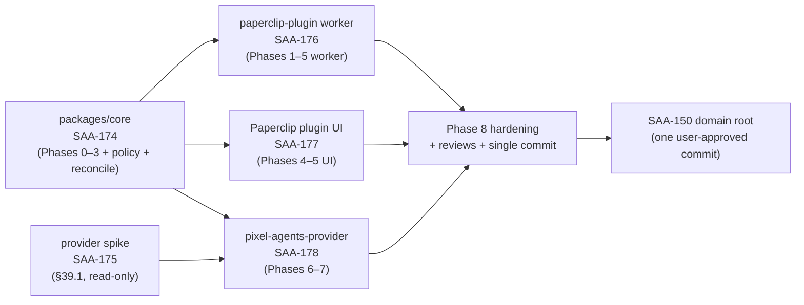

# Delivery Plan — PaperClip Pixels

## Domain Roots Index

| Specification | Domain root | Record | Status snapshot | Current milestone |
| --- | --- | --- | --- | --- |
| `PAPERCLIP_PIXELS-1` — Paperclip ↔ Pixel Agents translation layer | [SAA-150](/SAA/issues/SAA-150) | `workdocs/ai/project/specifications/PAPERCLIP_PIXELS_1.md` | `blocked` (observed 2026-09-01T03:22:52Z) | Implementation children done; outstanding: [SAA-214](/SAA/issues/SAA-214) e2e via Pixel Agents UI |
| `PAPERCLIP_PIXELS-2` — Pixel Agents plugin architecture (fork) + paperclip plugin character/settings/assets | [SAA-447](/SAA/issues/SAA-447) | `workdocs/ai/project/specifications/PAPERCLIP_PIXELS_2.md` | `blocked` — closing (observed 2026-09-05T17:30:00Z; blocked only on the completion documentation milestone [SAA-770](/SAA/issues/SAA-770); every direct child done incl. WS5 [SAA-457](/SAA/issues/SAA-457) and the board-directive arc [SAA-715](/SAA/issues/SAA-715)/[SAA-716](/SAA/issues/SAA-716) + Phases 1–4 [SAA-717](/SAA/issues/SAA-717)–[SAA-720](/SAA/issues/SAA-720)) | Revision 2 (board directive 2026-09-05) recorded via [SAA-715](/SAA/issues/SAA-715); re-plan [SAA-716](/SAA/issues/SAA-716) done with Phases 1–4 ([SAA-717](/SAA/issues/SAA-717)–[SAA-720](/SAA/issues/SAA-720)); Phase 5 record content via [SAA-721](/SAA/issues/SAA-721); FR-19 run-edge CTO ruling via [SAA-741](/SAA/issues/SAA-741); the Phase 1–5 change sets are now **committed** through the WS5 gate ([SAA-457](/SAA/issues/SAA-457), closed `done` with visual-validation specs green on the deployed stack) — fork `8ca80d3` atop `c634c15`/`ade5601`/`a063063`, plugin repo `f6929c1` atop `6ac209a`/`bea90da`/`f92c058`/`4489e28`/`c47aefa`, trees clean, **nothing pushed**; final completion pass via [SAA-770](/SAA/issues/SAA-770): the four CEO-resolved callouts verified folded, Snapshot refreshed, §R2.7 evidence map on record — formal §R2.7 checklist check is the parent owner's (CEO) at domain-root close; carried items: unpushed gate commits (separate explicit approval), stale live-relay docs (top-level README fold-in; `AGENTS.md` — CTO), specification key formalization, pre-existing guard-suite test-typeconfig hygiene |

- **Specification (V1):** `PAPERCLIP_PIXELS-1` — Paperclip ↔ Pixel Agents translation
  layer.
- **Specification domain root (V1):** [SAA-150](/SAA/issues/SAA-150) (status
  `blocked`; see Domain Roots Index).
- **Constitution:** `AGENTS.md` (project root).
- **Specification record:** `workdocs/ai/project/specifications/PAPERCLIP_PIXELS_1.md`.
- **Implementation phases:** 0–8 (spec §36).
- **Definition of Done:** spec §37.
- **Status convention:** snapshots are point-in-time observations; Paperclip is
  authoritative for all lifecycle fields. This plan is reconciled against
  Paperclip via the `reconcile-delivery-plan` skill.

This plan reflects the CTO decomposition already created as Paperclip children
under [SAA-150](/SAA/issues/SAA-150) (phases 0–8, spec §36). Implementation
children are **non-blocking for decomposition** — they are already created and
may proceed against the locked spec plus decaf-ts conventions. Both this plan
and the project-root `AGENTS.md` should exist before the implementation children
complete, but they do not gate decomposition itself.

## Phase Overview (spec §36)

| Phase | Name | Owning package / track |
| --- | --- | --- |
| 0 | Contract lock (canonical bridge contract, `schemaVersion: 1`) | `packages/core` |
| 1 | Read-only raw projection (snapshot loader + event normalizer + idempotent reducer) | `packages/core` + `packages/paperclip-plugin` worker |
| 2 | Temporal metrics (rolling windows 5m/30m/2h/8h/24h) | `packages/core` |
| 3 | Behavioral proxies (load, sustained load, burstiness, friction, failure pressure, context switching, collaboration, momentum; confidence + provenance) | `packages/core` |
| 4 | Paperclip plugin UI bridge (worker `ctx.data`/`ctx.actions`/`ctx.streams`; embedded UI surface; live updates) | `packages/paperclip-plugin` worker + Paperclip plugin UI |
| 5 | Company intake / individual-agent feedback interaction (new-work gate, fail-closed routing) | `packages/paperclip-plugin` worker + Paperclip plugin UI + `packages/core` (policy) |
| 6 | Pixel Agents adapter (current `AgentEvent` mapping; rich sidecar) | `packages/pixel-agents-provider` |
| 7 | Rich graphical use | `packages/pixel-agents-provider` |
| 8 | Hardening + reviews (restart/duplicate/out-of-order/disconnect/company-switch safety) | cross-cutting |

## Work Tracks (Paperclip children under SAA-150)

### Back-End — `packages/core` (Phases 0–3 + feedback + policy + reconciliation)

- **Child:** [SAA-174](/SAA/issues/SAA-174) — _Implement packages/core —
  Paperclip↔Pixel bridge translation core (PAPERCLIP_PIXELS-1)_.
- **Status snapshot:** `done`.
- **Scope:** canonical bridge contract lock (Phase 0, `schemaVersion: 1`); raw
  read-only projection + event normalizer + idempotent reducer (Phase 1);
  rolling-window temporal metrics (Phase 2); behavioral proxies with confidence
  + provenance (Phase 3); feedback classifier; action policy / new-work gate;
  periodic authoritative reconciliation (default 5 min, plus on reconnect /
  sequence anomaly / impossible transition). Must not import React, the Pixel
  Agents renderer, or Paperclip UI code.
- **Blocks:** the worker, UI, and provider tracks (they consume the core
  contract).

### Back-End — `packages/paperclip-plugin` worker (Phases 1–5 worker side)

- **Child:** [SAA-176](/SAA/issues/SAA-176) — _Implement packages/paperclip-plugin
  worker — Paperclip plugin manifest+SDK wiring (PAPERCLIP_PIXELS-1)_.
- **Status snapshot:** `done`.
- **Blocked by:** [SAA-174](/SAA/issues/SAA-174) (core).
- **Scope:** manifest / least-privilege capabilities; event subscriptions;
  authoritative snapshot bootstrap; SDK client calls; `ctx.state` persistence;
  `ctx.data` / `ctx.actions` / `ctx.streams` handlers (Phases 1–5 worker side);
  Zod validation on all handlers; host-authenticated actor identity; no resolved
  secrets in plugin state.

### Front-End — Paperclip plugin UI (Phases 4–5 UI)

- **Child:** [SAA-177](/SAA/issues/SAA-177) — _Implement Paperclip plugin UI —
  bridge rendering + company intake + fail-closed feedback (PAPERCLIP_PIXELS-1)_.
- **Status snapshot:** `done`.
- **Blocked by:** [SAA-174](/SAA/issues/SAA-174) (core).
- **Scope:** embedded Pixel UI surface; bridge rendering from `ctx.streams`
  (snapshot + deltas); full snapshot re-fetch on mount / company-switch /
  reconnect / sequence-gap / refresh; company/CEO intake action; individual-agent
  feedback UI with **fail-closed** new-work routing ("Send to company"). UI
  never calls Paperclip HTTP routes directly — all domain access routes through
  the worker bridge.

### Back-End (read-only) — Pixel Agents provider-registration research spike

- **Child:** [SAA-175](/SAA/issues/SAA-175) — _Research spike: Pixel Agents
  provider-registration boundary (PAPERCLIP_PIXELS-1 §39.1)_.
- **Status snapshot:** `done`.
- **Scope:** read-only reassessment of the Pixel Agents provider-registration
  boundary (§39.1). Pixel Agents currently ships only `HookProvider`; provider
  registry is source-level. Determine whether the standalone adapter needs a
  minimal source-level registration or an external wrapper; prefer a small
  upstreamable provider change over a hard fork. Output is a finding/recommendation
  that unblocks the provider package.

### Back-End — `packages/pixel-agents-provider` (Phases 6–7)

- **Child:** [SAA-178](/SAA/issues/SAA-178) — _Implement packages/pixel-agents-provider
  — Pixel Agents bridge adapter + sidecar (PAPERCLIP_PIXELS-1)_.
- **Status snapshot:** `done`.
- **Blocked by:** [SAA-174](/SAA/issues/SAA-174) (core) and
  [SAA-175](/SAA/issues/SAA-175) (spike).
- **Scope:** consume the bridge contract; map only semantically valid current
  events to current `AgentEvent` semantics without fabricated tool claims;
  retain richer behavior in a sidecar; integrate at the smallest possible
  source-level adapter (Phases 6–7); never fake tool-hook semantics where no
  correspondence exists.

### Cross-cutting — Phase 8 hardening + reviews + the single commit

- **Phase 8:** restart-, duplicate-event-, out-of-order-event-, disconnect-,
  and company-switch-safety (NFR-4); performance validation (NFR-1–NFR-3);
  observability review (§32); versioning tests (§33.1).
- **Reviews (§37 Definition of Done):**
  - Security Engineer review (least-privilege manifest, trust boundary, no
    resolved secrets, host-authenticated actor, new-work invariant).
  - QA independent verification (policy tests §31.5, contract tests §31.3,
    Pixel Agents non-regression §31.4, fidelity/behavioral acceptance §37).
  - Code Documentation Specialist review (operational docs
    `docs/DESIGN_SPEC.md`, `docs/BRIDGE_CONTRACT.md`, `docs/SOURCES.md` per §8).
- **Single commit:** the domain root [SAA-150](/SAA/issues/SAA-150) owns exactly
  one user-approved commit through `git-ops`, including all code, tests, and
  documentation. Implementation/milestone children never commit independently.

## Dependency Graph

## Acceptance Criteria (spec §37 Definition of Done)

Tracked as unchecked outcomes in the specification record
`workdocs/ai/project/specifications/PAPERCLIP_PIXELS_1.md` until verified:

- [ ] **Paperclip fidelity:** all displayed companies/agents/projects/issues
      reference canonical Paperclip IDs; concurrent runs preserved and
      queryable; multi-project activity preserved; events deduplicated;
      reconciliation repairs intentional test drift; Paperclip remains
      authoritative for every mutation.
- [ ] **Behavioral fidelity:** workload differentiates short burst from
      sustained load; context switching accounts for project/issue movement;
      blocking/approvals/failures contribute to friction; every proxy includes
      confidence and provenance/basis; UI never presents inferred
      stress/satisfaction as ground truth.
- [ ] **Interaction:** new work can enter through company/CEO intake;
      individual-agent feedback appears graphically; replies can continue
      existing work context; individual-agent reply handler cannot create new
      work; new-work-looking replies can be routed to company intake explicitly.
- [ ] **Pixel Agents:** existing functionality remains intact; no clone-per-run
      rule imposed; current supported activity events mapped without fabricated
      tool claims; rich sidecar data retained for future behaviors.
- [ ] **Reliability:** restart-, duplicate-event-, out-of-order-event-,
      disconnect-, and company-switch-safe.
- [ ] **Security:** least-privilege manifest; no resolved secrets persisted; UI
      uses worker bridge for Paperclip access; action context uses
      host-authenticated actor identity.

## Open Items For The Parent Owner

- Formalize the specification key (`PAPERCLIP_PIXELS`) by setting the project
  `shortname` or `SPECIFICATION_KEY` env so future domain records resolve
  deterministically (see specification record Risks).
- Resolve the Pixel Agents provider-registration boundary via the
  [SAA-175](/SAA/issues/SAA-175) spike before the provider package
  ([SAA-178](/SAA/issues/SAA-178)) proceeds (§39.1).
- Configure a leadership agent for CEO intake; migrate to first-class CEO Chat
  when available (§39.4 — roadmap, not a V1 dependency).

## Change Log

| Date | Author | Change |
| --- | --- | --- |
| 2026-08-22 | Delivery Documentation Specialist ([SAA-179](/SAA/issues/SAA-179)) | Created the delivery plan from the CTO decomposition (phases 0–8, spec §36) and cross-linked the Paperclip implementation children under [SAA-150](/SAA/issues/SAA-150). Repository edit left uncommitted for the parent domain root's single user-approved commit per `git-ops`. |
| 2026-09-01 | Delivery Documentation Specialist ([SAA-449](/SAA/issues/SAA-449)) | Added the `PAPERCLIP_PIXELS-2` domain-root index entry ([SAA-447](/SAA/issues/SAA-447), record `workdocs/ai/project/specifications/PAPERCLIP_PIXELS_2.md`, initialize complete; CEO decomposes WS0–WS5 next) and refreshed status snapshots from Paperclip ([SAA-150](/SAA/issues/SAA-150) `blocked`; SAA-174–SAA-178 `done`). Repository edit left uncommitted for the parent domain root's single user-approved commit per `git-ops`. |
| 2026-09-01 | Delivery Documentation Specialist ([SAA-479](/SAA/issues/SAA-479)) | `completion` pass for the WS3 backend ([SAA-469](/SAA/issues/SAA-469)): folded implementation facts, decisions (CEO decision 4 diverse-random default locked; hue-shift reuse formula corrected after [SAA-474](/SAA/issues/SAA-474)), artifacts, and verification evidence into `workdocs/ai/project/specifications/PAPERCLIP_PIXELS_2.md`; refreshed the `PAPERCLIP_PIXELS-2` index row (in delivery; live-stack render check rides [SAA-456](/SAA/issues/SAA-456) verification gates). Repository edit left uncommitted for the parent domain root's single user-approved commit per `git-ops`. |
| 2026-09-01 | Delivery Documentation Specialist ([SAA-487](/SAA/issues/SAA-487)) | `completion` pass for the WS3 frontend ([SAA-470](/SAA/issues/SAA-470)): folded implementation facts, decisions (CEO decision 1 — character-UI placement locked to the plugin's Pixel Office page, no core change), artifacts (`src/ui/components/character-picker.tsx` new; `character-selector.tsx` deleted), and verification evidence (116/116 UI tests, typecheck clean, 12 Tester reverse-probes) into `workdocs/ai/project/specifications/PAPERCLIP_PIXELS_2.md`; refreshed the `PAPERCLIP_PIXELS-2` index row. Repository edit left uncommitted for the parent domain root's single user-approved commit per `git-ops`. |
| 2026-09-01 | Delivery Documentation Specialist ([SAA-518](/SAA/issues/SAA-518)) | `completion` pass for the WS1 webview leaf ([SAA-463](/SAA/issues/SAA-463)): folded implementation facts, decisions (CEO decision 3 — non-reporting providers show nothing rather than a fake gauge, resolving the pending context-gauge board decision), artifacts (`pixel-agents/webview-ui/` de-hardcoded provider iteration + fail-closed metrics consumption; Tester coverage via [SAA-494](/SAA/issues/SAA-494)), and verification evidence (webview suite 130/130 green, tsc/lint clean, fork policy audit HEAD steady at upstream `v1.4.1`) into `workdocs/ai/project/specifications/PAPERCLIP_PIXELS_2.md`; refreshed the `PAPERCLIP_PIXELS-2` index row (WS1 parent [SAA-455](/SAA/issues/SAA-455) commit gate pending). Repository edit left uncommitted for the parent domain root's single user-approved commit per `git-ops`. |
| 2026-09-01 | Delivery Documentation Specialist ([SAA-530](/SAA/issues/SAA-530)) | `verification` pass for the WS1 parent ([SAA-455](/SAA/issues/SAA-455)): folded the QA commit-gate sign-off ([SAA-526](/SAA/issues/SAA-526) PASS with findings), the F1/F2 security-fix change set ([SAA-524](/SAA/issues/SAA-524)/[SAA-529](/SAA/issues/SAA-529)), and the commit-gate companions ([SAA-525](/SAA/issues/SAA-525)/[SAA-527](/SAA/issues/SAA-527)/[SAA-528](/SAA/issues/SAA-528)) into `workdocs/ai/project/specifications/PAPERCLIP_PIXELS_2.md`; clarified the final-diff fingerprint (gate-signed `7e63f6b6…` predates the [SAA-527](/SAA/issues/SAA-527) doc pass; commit approval must reference the final-tree `b597c07b…`, re-verified independently); refreshed the `PAPERCLIP_PIXELS-2` index row. Repository edit left uncommitted for the parent domain root's single user-approved commit per `git-ops`. |
| 2026-09-01 | Delivery Documentation Specialist ([SAA-540](/SAA/issues/SAA-540)) | `completion` pass for the WS2-A1 plugin host core ([SAA-533](/SAA/issues/SAA-533)): folded the plugin-host facts (manifest-validated registration, `PluginHost` lifecycle, `PluginMessage`/`PluginActionResult`/`InvokePluginAction` wire contract, sanctioned agent/team source, no work-creation primitive, R2 token-redaction fold-in), Tester evidence ([SAA-537](/SAA/issues/SAA-537), 87 tests zero defects), and executor re-verification into `workdocs/ai/project/specifications/PAPERCLIP_PIXELS_2.md`; checked the "Provider neutrality" criterion (WS1 parent [SAA-455](/SAA/issues/SAA-455) closed `done` with single commit `c634c15`); recorded the corrected CTO flag — the [SAA-532](/SAA/issues/SAA-532) deliverables (test file + divergence row) are uncommitted, absent from the WS1 commit; refreshed the `PAPERCLIP_PIXELS-2` index row. Repository edit left uncommitted for the parent domain root's single user-approved commit per `git-ops`. |
| 2026-09-03 | Delivery Documentation Specialist ([SAA-624](/SAA/issues/SAA-624)) | `completion` documentation pass for the WS4-C leaf ([SAA-588](/SAA/issues/SAA-588)): folded the appearance-API adoption + decision-2-guardrailed dialog-pane feed, Tester [SAA-620](/SAA/issues/SAA-620) results (3 new suites, 2 production bugs fixed, ladder green), and commit read-backs (fork `ade5601` incl. both [SAA-532](/SAA/issues/SAA-532) deliverables and both duplicate WS2-B test pairs; plugin repo `f92c058`/`4489e28`) into `workdocs/ai/project/specifications/PAPERCLIP_PIXELS_2.md`; checked the "Plugin architecture" and "Click menu & reply" criteria; resolved the [SAA-532](/SAA/issues/SAA-532) fold-in and duplicate-test-pair risks; corrected the snapshot to the observed blocked state (SAA-459/SAA-457); refreshed the `PAPERCLIP_PIXELS-2` index row. Repository edit left uncommitted for the parent domain root's single user-approved commit per `git-ops`. |
| 2026-09-05 | Delivery Documentation Specialist ([SAA-721](/SAA/issues/SAA-721)) | Revision 2 Phase 5 record pass for the specification root [SAA-447](/SAA/issues/SAA-447): folded the Phase 1–4 completion evidence ([SAA-717](/SAA/issues/SAA-717)–[SAA-720](/SAA/issues/SAA-720), Tester verdicts [SAA-724](/SAA/issues/SAA-724)/[SAA-725](/SAA/issues/SAA-725), hardening [SAA-727](/SAA/issues/SAA-727)) into `workdocs/ai/project/specifications/PAPERCLIP_PIXELS_2.md` as Revision 2 Phase 5 (capability matrix, override rules, operator configuration guidance, migration notes); refreshed the `PAPERCLIP_PIXELS-2` index row to the observed state (parent blocked only on WS5 [SAA-457](/SAA/issues/SAA-457); phases 1–4 done, uncommitted for the CTO-owned commit gates). Repository edit left uncommitted for the parent domain root's single user-approved commit per `git-ops`. |
| 2026-09-05 | Delivery Documentation Specialist ([SAA-770](/SAA/issues/SAA-770)) | Final `completion` pass for the specification root [SAA-447](/SAA/issues/SAA-447): refreshed `workdocs/ai/project/specifications/PAPERCLIP_PIXELS_2.md` — verified the four CEO-resolved callouts folded, refreshed the Paperclip Snapshot (all direct children done incl. WS5 [SAA-457](/SAA/issues/SAA-457); gate commits fork `8ca80d3` / plugin `f6929c1`, unpushed), annotated §R2.7/§R2.11, added the final Execution Log entry and Result completion paragraph, bumped `updatedAt`; refreshed the `PAPERCLIP_PIXELS-2` index row. Repository edits left uncommitted for the parent domain root's single user-approved commit per `git-ops`. |
