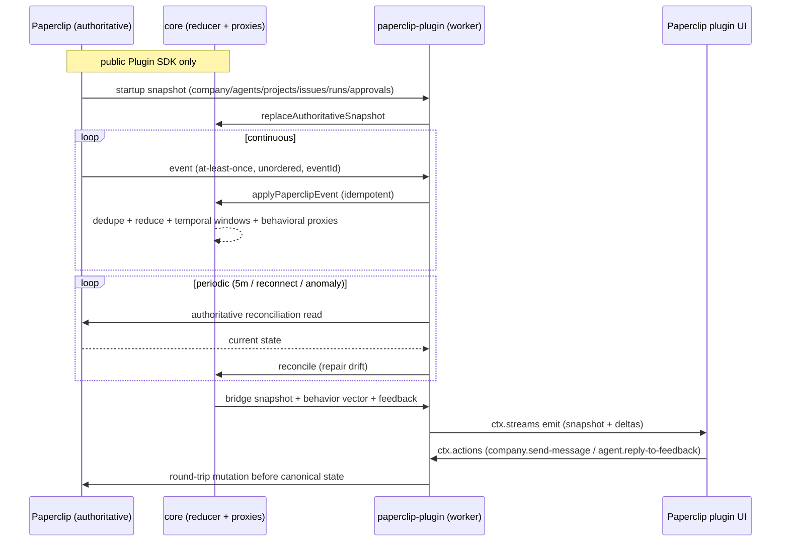

# PAPERCLIP_PIXELS-1: Paperclip ↔ Pixel Agents Translation Layer

## Paperclip Snapshot

| Field | Value |
| --- | --- |
| Task type | `specification` |
| Status | blocked (pending CTO decomposition after initialize completed) |
| Priority | medium |
| Assignee | CTO (Chief Technology Officer) |
| Parent | none (domain root) |
| Blocked by | SAA-172 (done — initialize complete) |
| Observed at | 2026-08-22T12:44:00Z |

Paperclip is authoritative for all lifecycle fields in this snapshot. The full
implementation-grade design specification is user-authored and lives in the
parent issue description ([SAA-150](/SAA/issues/SAA-150), sections 1–42); it is
treated as locked for V1. This record is the durable, linked summary of that
specification plus the CTO technical-governance review recorded through the
`initialize` milestone [SAA-172](/SAA/issues/SAA-172).

## Overview

A loss-minimizing translation layer between Paperclip and Pixel Agents. The
integration makes Paperclip operational state legible and useful inside the
Pixel Agents graphical environment without turning Pixel Agents into a second
source of business truth, and without reducing Paperclip's richer model to a
binary `working / idle` character state.

- **Paperclip** is authoritative for companies, agents, projects, issues,
  comments, runs, approvals, goals, budgets/costs, and organizational execution.
  Its plugin SDK exposes stable worker-side APIs through `PluginContext`.
- **Pixel Agents** is authoritative for graphical representation: character
  identity/appearance, spatial presentation, office layout, animations, visual
  activity, and environmental behavior. Its core is agent/platform agnostic,
  with provider normalization feeding a shared runtime and renderer.
- **The bridge** owns derived telemetry and behavioral proxies — not business
  state and not fictional psychology.

Final architectural principle (§42): _A faithful observer and policy-aware
translator of Paperclip organizational reality, not an alternative orchestration
engine and not a renderer._

## Problem Statement

Today, Paperclip's rich organizational model has no first-class graphical
representation inside Pixel Agents. The existing Agent Pixels reference performs
a comparatively thin role/status-to-activity mapping and must not become the
product base. A richer, fidelity-preserving bridge is required so that:

- companies can observe agent execution, concurrency, friction, and momentum
  graphically;
- clients can route new work through company/leadership intake rather than
  dispatching tasks directly to individual agents;
- individual agents can surface contextual feedback bound to existing work;
- neither upstream project is forced into a rewrite as the other evolves.

## Stakeholders And Ownership

| Role | Owner | Responsibility |
| --- | --- | --- |
| Product | Product Manager | Scope and acceptance (parent spec is user-authored and locked for V1) |
| Technical | CTO | Architecture, feasibility, security, and operational governance review |
| Documentation | Delivery Documentation Specialist | Domain record structure, links, status snapshots |
| Verification | QA | Independent validation of policy and fidelity invariants |
| Implementation | Executor (TBD via decomposition) | Implementation facts, artifacts, self-verification |

## Business Value And Success Measures

| Measure | Baseline | Target | Measurement method |
| --- | --- | --- | --- |
| Paperclip fidelity | No graphical bridge | All displayed entities reference canonical Paperclip IDs; concurrent runs preserved | Contract + policy tests (§31) |
| Behavioral fidelity | Binary working/idle only | Burst vs sustained load distinguished; every proxy carries confidence + basis | Core unit tests (§31.1) |
| New-work safety | N/A | Individual-agent reply cannot create a Paperclip issue | Policy tests (§31.5) |
| Reliability | N/A | Restart-, duplicate-, out-of-order-, disconnect-, company-switch-safe | Hardening phase (Phase 8) |

## Scope

### In Scope

- A 3-package monorepo: `core` (domain logic + behavioral proxies), `paperclip-plugin` (Paperclip host integration), `pixel-agents-provider` (Pixel Agents adapter).
- Raw Paperclip projection preserving exact IDs, run-level concurrency, and multi-project activity.
- Temporal metrics over rolling windows (5m / 30m / 2h / 8h / 24h).
- Behavioral proxies (load, sustained load, burstiness, friction, failure pressure, context switching, collaboration, momentum, optional stress/engagement proxies) with confidence and provenance.
- Events-first runtime: startup snapshot + continuous events + periodic authoritative reconciliation (default 5 min; also on reconnect / sequence anomaly / impossible transition).
- Canonical bridge contract (raw + metrics + behavioral + feedback) with `schemaVersion: 1`.
- Company/CEO intake via leadership agent sessions; individual-agent feedback replies bound to existing work; fail-closed new-work routing.
- Paperclip plugin manifest with least-privilege capabilities; worker→UI bridge via `ctx.data` / `ctx.actions` / `ctx.streams`.
- Minimal Pixel Agents adapter mapping current `AgentEvent` semantics, retaining richer behavior in a sidecar.
- Implementation phases 0–8 (§36) and the Definition of Done (§37).

### Out Of Scope

(Per §3 Non-Goals.)

- Replacing Paperclip's orchestration engine.
- Reimplementing Paperclip task/comment/approval/budget/governance semantics inside Pixel Agents.
- Giving Pixel Agents direct database access to Paperclip.
- An artificial "one active run = one cloned character" rule.
- Inferring actual mental states or emotions from telemetry.
- A full RPG personality simulator.
- Requiring unreleased Paperclip roadmap features or unreleased Pixel Agents provider types.
- Requiring an upstream merge before the integration can function.
- Mirroring every Paperclip administration/settings screen inside Pixel Agents.
- Making incidental direct conversations with non-leadership agents into task-creation surfaces.
- Using a natural-language classifier as the sole authorization boundary for task creation.

## Functional Requirements

| ID | Requirement | Priority | Acceptance evidence |
| --- | --- | --- | --- |
| FR-1 | Preserve raw Paperclip facts (companies, agents, projects, issues, runs, approvals, costs) with exact IDs before deriving interpretations | Must | Raw projection contract (§9.1); contract tests (§31.3) |
| FR-2 | Maintain run-level concurrency and multi-project activity without imposing a clone-per-run renderer policy | Must | `AgentExecutionState` (§10); concurrency tests |
| FR-3 | Compute rolling-window temporal metrics (5m/30m/2h/8h/24h) from observed events | Must | `WindowedMetrics` (§9.2); core unit tests (§31.1) |
| FR-4 | Derive behavioral proxies, each with `value`, `confidence`, and `basis` provenance | Must | `AgentBehaviorVector` (§9.3); signal-confidence tests |
| FR-5 | Treat Paperclip event delivery as at-least-once and unordered; idempotent reducers + periodic authoritative reconciliation | Must | `EventDeduper` (§12.3) + reconciliation (§12.4); duplicate/out-of-order tests |
| FR-6 | Expose company/CEO intake as the sole path that may originate unrestricted new-work intent | Must | `company.send-message` action (§15, §17); policy test 2 (§31.5) |
| FR-7 | Surface individual-agent semantic feedback bound to existing work; reject replies lacking an existing work context | Must | `AgentFeedback` (§9.4) + fail-closed gate (§18.1); policy tests 1, 3 |
| FR-8 | Never create a Paperclip issue from the individual-agent reply path; route new-work-looking replies to company intake | Must | `agent.reply-to-feedback` returns `route-to-company` (§18.3); policy test 1 |
| FR-9 | Route all Paperclip domain access through the worker bridge; UI never calls Paperclip HTTP routes directly | Must | Trust boundary (§28.2) |
| FR-10 | Request only required manifest capabilities; read-only visualization needs no mutation caps; agent feedback needs no `issues.create` | Must | Least-privilege manifest (§14, §28.1) |
| FR-11 | Validate all `ctx.data` / `ctx.actions` payloads (Zod); rely on host-authenticated actor identity, not user-supplied actor IDs | Must | Input validation (§28.4); protocol action context (§15) |
| FR-12 | Persist compact derived state via `ctx.state`; never store resolved secrets | Must | Plugin state (§13); secrets (§28.3) |
| FR-13 | Push live updates via `ctx.streams`; UI can always re-fetch a full snapshot after reconnect | Must | Live UI updates (§16) |
| FR-14 | Map current Pixel Agents `AgentEvent` semantics without fabricated tool claims; retain richer behavior in a sidecar | Must | Pixel Agents adapter (§7.3, §21); Pixel Agents tests (§31.4) |
| FR-15 | Label stress/satisfaction/engagement as operational proxies, never as factual emotion | Must | Behavioral model (§11.11–11.12); policy test 5 |

## Non-Functional Requirements

| ID | Area | Requirement | Verification |
| --- | --- | --- | --- |
| NFR-1 | Performance | Reducer work O(1)/O(log n) for common events; fixed 5m buckets retained 24h = 288 buckets/agent | Performance tests (Phase 8) |
| NFR-2 | Performance | Behavior-vector publishing throttled 250–1000 ms; longer windows emit only on rounded-value/semantic change | Throttle tests |
| NFR-3 | Performance | Full snapshot on mount/company-switch/reconnect/sequence-gap/refresh; stream deltas otherwise | UI snapshot tests (§29.3) |
| NFR-4 | Reliability | Restart-, duplicate-event-, out-of-order-event-, disconnect-, company-switch-safe | Hardening (Phase 8); policy tests 6–7 |
| NFR-5 | Security | Least-privilege manifest; no resolved secrets persisted; worker-bridge trust boundary; host-authenticated actor | Security section of DoD (§37); policy tests |
| NFR-6 | Compatibility | Every serialized bridge payload carries `schemaVersion: 1`; breaking changes increment it | Versioning tests (§33.1) |
| NFR-7 | Observability | Structured bridge log events + metrics; never log secrets or full sensitive prompts by default | Observability review (§32) |
| NFR-8 | Upstream neutrality | Use public/exposed APIs only; no direct DB access, private routes, or invasive Pixel Agents core hacks | Source-verification matrix (§40); guardrails (§38) |

## Architecture And Interfaces

Three packages (§7, §8):

1. **`packages/core` (`@paperclip-pixel/core`)** — snapshot loader, event normalizer + idempotent reducer, entity/run/concurrency projection, temporal windows, behavioral proxy calculator, feedback classifier, action policy / new-work gate, reconciliation. **Must not import React, the Pixel Agents renderer, or Paperclip UI code.** No rendering decisions.
2. **`packages/paperclip-plugin`** — manifest/capabilities, event subscriptions, authoritative snapshot bootstrap, SDK client calls, `ctx.state` persistence, `ctx.data`/`ctx.actions`/`ctx.streams` handlers, embedded Pixel UI surface.
3. **`packages/pixel-agents-provider`** — consumes the bridge contract, maps only semantically valid current events to current `AgentEvent` semantics, retains richer behavior in a sidecar, integrates at the smallest possible source-level adapter, never fakes tool-hook semantics where no correspondence exists.

Data flow: Paperclip (authoritative) → public Plugin SDK only → `core` (raw + metrics + semantics) → canonical bridge contract → { Paperclip plugin package (worker + embedded UI), Pixel Agents adapter } → { Paperclip UI plugin page, Pixel Agents runtime/UI }.

Ownership boundaries (§6): Paperclip owns all business state; the bridge owns derived temporal metrics and behavioral proxies; Pixel Agents owns character appearance/animation/layout/spatial/visual-personality. The bridge supplies business context only and never dictates rendering.

Canonical bridge contract (§9): `RawAgentProjection` / `RawRunProjection` / `RawIssueRef` (raw), `WindowedMetrics` over `TimeWindow = "5m"|"30m"|"2h"|"8h"|"24h"` (metrics), `AgentBehaviorVector` of `BehavioralSignal { value; confidence; basis[] }` (behavior), and `AgentFeedback` with `AgentFeedbackKind` union and `existingWorkContext` flag (feedback).

Data acquisition (§12): startup snapshot (company → agents → projects → open issues → orchestration state → approvals → bridge state → subscriptions → complete snapshot); events-first runtime via `ctx.events.on(...)`; `eventId`-based dedupe; periodic reconciliation (default 5 min) plus on reconnect / sequence anomaly / impossible transition / UI request after long inactivity. Not poll-based.

## Data, Security, And Privacy

- **Data model / migration:** No Paperclip schema migration; the bridge owns a derived cache only. Bridge payloads carry `schemaVersion: 1` (§33.1). Persist compact time buckets in `ctx.state` (instance/company/project/agent/run scopes) so 24h metrics survive restart even when Paperclip lacks retrospective event history (§39.3).
- **Authorization and threat considerations:** Single trust boundary — all Paperclip domain access routes through the worker bridge; UI components never call Paperclip HTTP routes directly (§28.2). New-work authorization is structural (action path), never a language-model classifier alone (§5.2). Action context uses host-authenticated actor identity, not user-supplied actor IDs (§15, §28.4). This is a security-critical invariant — see _New-work invariant_ below.
- **Sensitive-data handling and retention:** Never store resolved secrets in plugin state (retain references, resolve at call time) (§28.3). Do not retain raw payloads indefinitely; use ring buffers/compact buckets. Never log secrets or full sensitive prompts by default (§32). Do not duplicate canonical issues/projects in plugin state.

### Security-critical invariant: new-work intake

All new work enters through company/leadership intake only (locked decisions §5/§7/§17/§18). The user is a client of the company, not a direct task dispatcher to arbitrary individual agents. Individual-agent conversations are feedback channels that may report progress, ask questions, expose blockers, request clarification, or accept replies in the context of existing work, but they must **never silently create new Paperclip work objects**. If text entered in an individual-agent interaction appears to introduce new work, the UI must **fail closed** — no mutation occurs and a deliberate "Send to company" / "Open company intake" path is offered. The structural boundary is enforced by separate APIs/capabilities/action paths: only the company/CEO intake action may originate unrestricted new-work intent; individual-agent reply actions require an existing `issueId`/`runId`/`taskKey` binding and the reply handler does not hold or invoke `issues.create` for arbitrary text. A language model or heuristic may _suggest_ new work, but the hard guarantee comes from the action path, not the classifier.

## Dependencies And Blockers

- Parent [SAA-150](/SAA/issues/SAA-150) is blocked by this `initialize` milestone [SAA-172](/SAA/issues/SAA-172); on completion the parent resumes to decompose implementation. Intended parent state after initialization: `blocked` (decomposition pending).
- The `delivery-docs` mapping must live on the parent domain root SAA-150. Delivery Documentation Specialist cannot write another agent's issue documents (platform denies cross-agent issue-document mutation), so [SAA-172](/SAA/issues/SAA-172) was transiently `blocked` on [SAA-173](/SAA/issues/SAA-173) (assigned to CTO, who owns SAA-150) to materialize the `delivery-docs` issue document. SAA-173 is `done`; the `delivery-docs` mapping now exists on SAA-150 and resolves to real files (verified by read-back). SAA-150 is unblocked for decomposition.
- External: Paperclip plugin SDK (`@paperclipai/plugin-sdk`) types are the normative integration surface — compile against installed types, not future-looking prose (§4.1, §38).
- External: Pixel Agents currently ships only `HookProvider`; provider registry is source-level (§4.2, §39.1). The standalone adapter may initially require a minimal source-level registration or external wrapper — the main integration boundary to reassess first.
- None blocking initialization beyond the above parent-blocker relationship.

## Delivery And Rollback

1. Implement in phases 0–8 (§36): contract lock → read-only projection → temporal metrics → behavioral proxies → Paperclip plugin UI bridge → company intake / feedback interaction → Pixel Agents adapter → rich graphical use → hardening.
2. No Paperclip data migration; bridge state is derived and restart-safe. Bridge schema versioning (`schemaVersion`) governs compatibility (§33).
3. Rollback: the bridge is a non-authoritative observer; disabling/removing the plugin removes the graphical surface without affecting Paperclip business state. Disconnect-safe behavior (§30) marks state visibly stale and blocks state-changing actions while disconnected.

## Observability And Operations

- **Telemetry and logs (§32):** `bridge.snapshot.loaded`, `bridge.event.received`, `bridge.event.duplicate`, `bridge.reconciliation.started`, `bridge.reconciliation.changed`, `bridge.behavior.changed`, `bridge.feedback.created`, `bridge.feedback.replied`, `bridge.new_work.rerouted`, `bridge.paperclip.action.failed`, `bridge.pixel_adapter.disconnected`. Never log secrets or full sensitive prompts by default.
- **Metrics:** `paperclip_events_total`, `paperclip_duplicate_events_total`, `reconciliations_total`, `reconciliation_drift_entities`, `behavior_recomputations_total`, `feedback_outstanding`, `agent_reply_reroutes_total`, `pixel_adapter_connected`.
- **Alerting and thresholds:** none defined for V1; reconciliation drift and adapter disconnect are the primary operational signals.
- **Operational documentation:** `docs/DESIGN_SPEC.md`, `docs/BRIDGE_CONTRACT.md`, `docs/SOURCES.md` (§8 layout) — to be produced during implementation.

## Acceptance Criteria

(From §37 Definition of Done. Outcomes pending implementation; unchecked until verified.)

- [ ] **Paperclip fidelity:** all displayed companies/agents/projects/issues reference canonical Paperclip IDs; concurrent runs preserved and queryable; multi-project activity preserved; events deduplicated; reconciliation repairs intentional test drift; Paperclip remains authoritative for every mutation.
- [ ] **Behavioral fidelity:** workload differentiates short burst from sustained load; context switching accounts for project/issue movement; blocking/approvals/failures contribute to friction; every proxy includes confidence and provenance/basis; UI never presents inferred stress/satisfaction as ground truth.
- [ ] **Interaction:** new work can enter through company/CEO intake; individual-agent feedback appears graphically; replies can continue existing work context; individual-agent reply handler cannot create new work; new-work-looking replies can be routed to company intake explicitly.
- [ ] **Pixel Agents:** existing functionality remains intact; no clone-per-run rule imposed; current supported activity events mapped without fabricated tool claims; rich sidecar data retained for future behaviors.
- [ ] **Reliability:** restart-, duplicate-event-, out-of-order-event-, disconnect-, and company-switch-safe.
- [ ] **Security:** least-privilege manifest; no resolved secrets persisted; UI uses worker bridge for Paperclip access; action context uses host-authenticated actor identity.

## Verification Plan

| Check | Command or method | Expected result | Owner |
| --- | --- | --- | --- |
| Domain record schema | `node <skill-root>/scripts/validate-domain-record.mjs workdocs/ai/project/specifications/PAPERCLIP_PIXELS_1.md` | Pass | Delivery Documentation Specialist |
| task-metadata agreement | Read-back of parent `task-metadata` document | `taskType: specification` | Delivery Documentation Specialist |
| delivery-docs mapping resolves | Read-back of parent `delivery-docs` document | Paths resolve to real files | Delivery Documentation Specialist |
| New-work policy | Policy tests (§31.5): individual-agent reply cannot create an issue; new-work only in intake paths; reply without existing context fails closed | Pass (release blockers) | QA / Executor |
| Event idempotency | Duplicate-event + out-of-order + reconciliation-drift tests | Pass | QA / Executor |
| Fidelity | Contract tests (§31.3) over fixtures | Pass | QA / Executor |
| Pixel Agents non-regression | Vitest/Playwright per Pixel Agents style (§31.4) | Existing behavior unchanged; adapter cannot corrupt unrelated sessions | QA / Executor |

## Risks And Open Questions

| Item | Impact | Owner | Mitigation or resolution condition |
| --- | --- | --- | --- |
| Pixel Agents dynamic provider loading (§39.1) | Standalone adapter may need source-level registration or external wrapper | CTO / Executor | Reassess first at implementation start; prefer small upstreamable provider change over hard fork |
| Rich behavior transport (§39.2) | Current `AgentEvent` is compact; richer vector kept as sidecar | CTO / Executor | Keep sidecar; consume directly when a future behavior/provider API ships |
| Historical data after restart (§39.3) | Paperclip may not expose enough retrospective history to rebuild 24h metrics | Executor | Persist compact time buckets in `ctx.state`; expose confidence |
| CEO identity (§39.4) | No universal first-class CEO identifier today | Product Manager / CTO | Configure a leadership agent; migrate to first-class CEO Chat when available (roadmap, not a V1 dependency) |
| Subjective behavior (§39.5) | Telemetry cannot prove satisfaction/stress | Product Manager | Product copy must preserve the proxy distinction |
| **Specification key configuration gap** | Project `shortname` is null and `SPECIFICATION_KEY` env is unset; the `maintain-domain-docs` resolution order (env → shortname) does not formally include `urlKey` | CTO | This record uses `PAPERCLIP_PIXELS` (CTO-approved, derived from project urlKey `paperclip-pixels` normalized to uppercase with non-alphanumeric runs replaced by `_`) per the `initialize` milestone governance direction. Recommend formalizing the key by setting the project `shortname` or `SPECIFICATION_KEY` env so future domain records resolve deterministically without a per-ticket governance decision. |
| Project-root `AGENTS.md` missing | No project-root constitution to record invariants against | CTO | Report to CTO; create via a CTO-approved `governance` milestone if project invariants are needed |
| Project plan `workdocs/ai/project/plan.md` missing | No central plan to reconcile against | CTO / Product Manager | Create/seed the plan; reconcile via `reconcile-delivery-plan` when decomposition begins |

## Paperclip Work Breakdown

Internal children are tracked only in Paperclip and do not own separate domain
records. Decomposition into implementation children is the parent owner's next
step after this `initialize` milestone completes (intended parent state `blocked`
→ resumes to decompose).

| Paperclip child | Work item | Priority | Status snapshot | Blocked by |
| --- | --- | --- | --- | --- |
| [SAA-172](/SAA/issues/SAA-172) | Document initialize: SAA-150 Paperclip Pixel bridge | medium | done | none |
| [SAA-173](/SAA/issues/SAA-173) | Create delivery-docs mapping: SAA-150 Paperclip Pixel bridge (assigned CTO) | medium | done | none |
| _(implementation children TBD by CTO/Product Manager decomposition)_ | Phases 0–8 (§36) | — | not started | SAA-150 |

## Decisions

| Date | Owner | Decision | Rationale |
| --- | --- | --- | --- |
| 2026-08-22 | User (parent spec §2) | 16 locked decisions stand for V1 (Paperclip sole source of truth; Pixel Agents owns visual state; bridge information-rich/presentation-poor; no clone policy; new work via company intake only; individual-agent conversations are feedback channels; fail-closed new-work; actions round-trip through Paperclip; visual actions local; public APIs only; Agent Pixels is reference not base; temporal history retained; no fictional psychology; at-least-once/unordered event model; survive future richness; upstream contributions optional) | Implementation-grade baseline; locked unless an upstream API makes one technically impossible |
| 2026-08-22 | CTO | Technical governance review **approved** (architecture §7, repo layout §8, bridge contract §9, data acquisition/idempotency/reconciliation §12, security §28, performance §29, failure handling §30, testing §31) | No architectural objections; all §2 locked decisions stand for V1 |
| 2026-08-22 | CTO | 3-package monorepo (`core` / `paperclip-plugin` / `pixel-agents-provider`); `core` owns domain logic + behavioral proxies and must not import React, Pixel Agents renderer, or Paperclip UI | Correct separation of concerns |
| 2026-08-22 | CTO | At-least-once / unordered event model: `eventId` dedupe + periodic authoritative reconciliation (default 5 min, plus on reconnect/sequence anomaly/impossible transition); not poll-based | Matches Paperclip's plugin spec |
| 2026-08-22 | CTO | Trust boundary: all Paperclip domain access routes through the worker bridge; UI never calls Paperclip HTTP routes directly | Single policy enforcement point; auditable; future-compatible |
| 2026-08-22 | CTO | Least privilege: manifest requests only required capabilities; read-only visualization needs no mutation caps; individual-agent feedback needs no issue-creation cap | Minimize blast radius |
| 2026-08-22 | CTO | New-work invariant (§5/§7/§17/§18): new work enters through company/leadership intake only; individual-agent conversations are feedback channels that never silently create Paperclip work; UI fails closed with a "Send to company" path | Security-critical invariant |
| 2026-08-22 | CTO | No fictional psychology (§13): "stress/satisfaction/engagement" never asserted as facts; only operational proxies with explicit confidence | Avoid false claims about subjective states |
| 2026-08-22 | CTO | Input validation: all `ctx.data`/`ctx.actions` handlers validate with a schema library (Zod); no secrets in plugin state | Defend untrusted UI input |
| 2026-08-22 | CTO | Performance: fixed 5-minute time buckets (288/agent/24h), throttled behavior-vector publishing (250–1000 ms), snapshot+delta UI model | Predictable, interactive, bounded |
| 2026-08-22 | CTO | Specification key `PAPERCLIP_PIXELS` resolved from project urlKey (`paperclip-pixels`) because `shortname` is null and `SPECIFICATION_KEY` env is unset | Governance direction in `initialize` milestone; key matches `^[A-Z][A-Z0-9_]{0,31}$`; recommend formalizing via shortname/env |

## Execution Log

### 2026-08-22T12:34:33Z - Delivery Documentation Specialist

- Created the initial specification domain record `workdocs/ai/project/specifications/PAPERCLIP_PIXELS_1.md` from the `maintain-domain-docs` bundled specification template (no local `<docs-root>/specifications/specification_template.md` exists; Local Template Precedence fell back to the bundled template).
- Populated overview, problem statement, scope (in/out from §3), functional/non-functional requirements, architecture + Mermaid sequence diagram, security/data/privacy, delivery/rollback, observability, acceptance criteria (from §37 Definition of Done), verification plan, risks/open questions, work breakdown, decisions, and this execution log from the user-authored parent spec [SAA-150](/SAA/issues/SAA-150) (sections 1–42) and the CTO technical-governance review supplied in milestone [SAA-172](/SAA/issues/SAA-172).
- Verified parent `task-metadata`: `schemaVersion: 2`, `taskType: specification`, `jiraIssue: none`, `jiraIssueId: none`. Jira gate disabled (`JIRA_ENABLED=false`); no Jira workflow invoked.
- Allocated specification identity locally: `PAPERCLIP_PIXELS-1` (no existing domain records; `max(existing refs) + 1 = 1`).
- Reported gaps: project-root `AGENTS.md` is missing (only `paperclip/AGENTS.md` submodule file exists, which is not the project constitution); `workdocs/ai/project/plan.md` is missing; project `shortname` is null and `SPECIFICATION_KEY` env is unset (specification key resolved via CTO-approved urlKey derivation — see Risks).
- Repository edits left uncommitted for the parent ticket executor to include in the domain root's single user-approved commit per `git-ops`.

## Changed Artifacts

| Path | Purpose |
| --- | --- |
| `workdocs/ai/project/specifications/PAPERCLIP_PIXELS_1.md` | Specification domain record (this file) |
| _(parent issue document `delivery-docs`)_ | Delivery-docs mapping on [SAA-150](/SAA/issues/SAA-150) — created by CTO via [SAA-173](/SAA/issues/SAA-173) (cross-agent document-write boundary); read-back verified |

## Verification Evidence

| Time | Executor | Check | Result | Evidence |
| --- | --- | --- | --- | --- |
| 2026-08-22T12:34:33Z | Delivery Documentation Specialist | Read-back of parent `task-metadata` | Pass | `taskType: specification`; `jiraIssue: none`; `jiraIssueId: none` |
| 2026-08-22T12:34:33Z | Delivery Documentation Specialist | Domain-record frontmatter scan for SPEC_REF allocation | Pass | No existing domain records → ref `1` |
| 2026-08-22T12:35:00Z | Delivery Documentation Specialist | `node <skill-root>/scripts/validate-domain-record.mjs workdocs/ai/project/specifications/PAPERCLIP_PIXELS_1.md` | Pass | `Valid domain record` (exit 0) |
| 2026-08-22T12:35:00Z | Delivery Documentation Specialist | Parent `delivery-docs` document read-back | Pass | Mapping resolves to `AGENTS.md`, `workdocs/ai/project/plan.md`, `workdocs/ai/project/specifications/PAPERCLIP_PIXELS_1.md` (created on SAA-150 by CTO via [SAA-173](/SAA/issues/SAA-173); revision 1) |

## Result

Initialization complete: the specification domain record `PAPERCLIP_PIXELS-1`
exists and is populated from the locked parent spec, with the CTO technical
governance review recorded. Acceptance criteria remain unchecked (implementation
not started). The parent [SAA-150](/SAA/issues/SAA-150) should resume after this
milestone completes to decompose implementation children (phases 0–8, §36). Open
items for the parent owner: formalize the specification key (shortname/env),
decide whether a project-root `AGENTS.md` and `workdocs/ai/project/plan.md`
should be created, and reassess the Pixel Agents provider-registration boundary
first at implementation start (§39.1).

**Current state:** initialization is complete. The `delivery-docs` mapping was
materialized on SAA-150 by the CTO via [SAA-173](/SAA/issues/SAA-173) (the
platform denies Delivery Documentation Specialist cross-agent issue-document
writes); read-back verified. [SAA-172](/SAA/issues/SAA-172) is `done`, which
unblocks [SAA-150](/SAA/issues/SAA-150) for decomposition. Open items for the
parent owner: formalize the specification key (shortname/env), decide whether a
project-root `AGENTS.md` and `workdocs/ai/project/plan.md` should be created,
and reassess the Pixel Agents provider-registration boundary first at
implementation start (§39.1).
