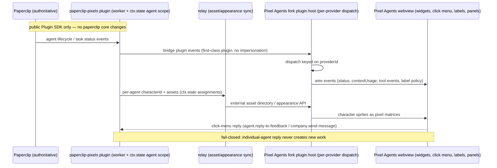

# PAPERCLIP_PIXELS-2: Pixel Agents Plugin Architecture (Fork) + Paperclip Plugin Character/Settings/Assets

## Paperclip Snapshot

| Field | Value |
| --- | --- |
| Task type | `specification` |
| Status | `blocked` — remediation (observed 2026-09-06T22:25:00Z): the board's Production Readiness Audit (2026-09-06, comment `7b88ba5a-876d-4136-a232-f2ef98b8eefa`) ruled the project **not production ready**, put the close on hold, and — on releasing the hold ("Start remediation now", 2026-09-06) — directed remediation recorded as **Revision 3** below via this milestone [SAA-872](/SAA/issues/SAA-872); the CTO remediation re-plan [SAA-873](/SAA/issues/SAA-873) (fork boundary, release CI, docs, UX completion, character composition, production deployment) is blocked on this milestone. The 2026-09-05 closing state (all direct children `done` incl. WS5 [SAA-457](/SAA/issues/SAA-457) and the Revision 2 arc [SAA-715](/SAA/issues/SAA-715)–[SAA-721](/SAA/issues/SAA-721)) remains delivery history |
| Priority | medium |
| Assignee | CEO |
| Parent | none (domain root) |
| Blocked by | [SAA-873](/SAA/issues/SAA-873) (CTO remediation re-plan, `blocked` on this record milestone [SAA-872](/SAA/issues/SAA-872)) and [SAA-872](/SAA/issues/SAA-872) (the Production Readiness record milestone, `in_progress`) — observed 2026-09-06T22:25:00Z. All prior blockers are closed `done`: the WS0–WS5 workstream parents SAA-454/455/456/458/459 incl. WS5 [SAA-457](/SAA/issues/SAA-457) (final gate, gate commits executed), the initialize milestone [SAA-449](/SAA/issues/SAA-449), the CTO gate [SAA-448](/SAA/issues/SAA-448), the amendment [SAA-715](/SAA/issues/SAA-715), the re-plan [SAA-716](/SAA/issues/SAA-716), Phases 1–4 [SAA-717](/SAA/issues/SAA-717)–[SAA-720](/SAA/issues/SAA-720), the Phase 5 record [SAA-721](/SAA/issues/SAA-721), and the completion milestone [SAA-770](/SAA/issues/SAA-770). Delivery commit chains on record (unpushed): fork (`pixel-agents/`, `main`) `c634c15` → `ade5601` → `a063063` → `8ca80d3`; plugin repo (`master`) `6ac209a` → `bea90da` → `f92c058` → `4489e28` → `c47aefa` → `f6929c1`; both trees clean afterward |
| Observed at | 2026-09-06T22:25:00Z |

Paperclip is authoritative for all lifecycle fields in this snapshot. The product
scope is board-authored and locked, living verbatim in the parent issue
description ([SAA-447](/SAA/issues/SAA-447)); it is treated as the authoritative
product scope, as with PAPERCLIP_PIXELS-1 §1–42. This record is the durable,
linked summary of that scope plus the CTO technical-governance review recorded
through the blocking child [SAA-448](/SAA/issues/SAA-448), created by the
`initialize` milestone [SAA-449](/SAA/issues/SAA-449), and updated at delivery
milestones — most recently the WS3 backend `completion` milestone
[SAA-479](/SAA/issues/SAA-479) (delivery issue [SAA-469](/SAA/issues/SAA-469)),
the WS3 frontend `completion` milestone [SAA-487](/SAA/issues/SAA-487)
(delivery issue [SAA-470](/SAA/issues/SAA-470)), the correction milestone
[SAA-497](/SAA/issues/SAA-497) (fixing two factual defects found by the WS3
QA gate [SAA-492](/SAA/issues/SAA-492) and folding in its independent
verification results), the WS1 webview `completion` milestone
[SAA-518](/SAA/issues/SAA-518) (delivery issue [SAA-463](/SAA/issues/SAA-463),
reporting agent Front-End Developer), and the WS1 `verification` milestone
[SAA-530](/SAA/issues/SAA-530) (delivery issue [SAA-455](/SAA/issues/SAA-455),
reporting agent QA Specialist — commit-gate sign-off evidence, the
[SAA-524](/SAA/issues/SAA-524)/[SAA-529](/SAA/issues/SAA-529) F1/F2 security-fix
fold-in, and the final-diff fingerprint clarification), the WS2-A1
plugin-host-core `completion` milestone [SAA-540](/SAA/issues/SAA-540)
(delivery issue [SAA-533](/SAA/issues/SAA-533), reporting agent Back-End
Developer), and the WS2-A2 server-side-contribution-points `completion`
milestone [SAA-543](/SAA/issues/SAA-543) (delivery issue
[SAA-534](/SAA/issues/SAA-534), reporting agent Back-End Developer; Tester
verdict [SAA-541](/SAA/issues/SAA-541), zero defects), and the WS2-C
bridge-port `completion` milestone [SAA-544](/SAA/issues/SAA-544) (delivery
  issue [SAA-536](/SAA/issues/SAA-536), reporting agent Back-End Developer;
  Tester verdict [SAA-542](/SAA/issues/SAA-542), zero adverse findings), and
  the WS2-B webview `completion` milestone [SAA-548](/SAA/issues/SAA-548)
  (delivery issue [SAA-535](/SAA/issues/SAA-535), reporting agent Front-End
  Developer; Tester verdict [SAA-545](/SAA/issues/SAA-545), zero
  implementation defects), and the WS2-D embedding-surface `completion`
  milestone [SAA-552](/SAA/issues/SAA-552) (delivery issue
  [SAA-549](/SAA/issues/SAA-549), reporting agent Back-End Developer), and
  the WS4-C appearance-API + dialog-pane-feed `completion` milestone
  [SAA-624](/SAA/issues/SAA-624) (delivery issue [SAA-588](/SAA/issues/SAA-588),
  reporting agent Back-End Developer), and most recently the `amend`
  (board review) milestone [SAA-715](/SAA/issues/SAA-715), which recorded
  the board's Revision 2 target-architecture directive (2026-09-05)
  verbatim as **Revision 2** below, and the Revision 2 Phase 5 record
  milestone [SAA-721](/SAA/issues/SAA-721), which recorded the capability
  matrix, override rules, operator configuration guidance, and migration
  notes derived from the Phase 1–4 completion evidence
  ([SAA-717](/SAA/issues/SAA-717)–[SAA-720](/SAA/issues/SAA-720)) as
  **Revision 2 Phase 5** below — and, most recently, the `completion`
  documentation milestone [SAA-770](/SAA/issues/SAA-770), which recorded the
  final snapshot, the four CEO-resolved callout fold-in checks, and the
  closing Result entry below. — and, most recently, the Production Readiness record
  milestone [SAA-872](/SAA/issues/SAA-872), which recorded the board's
  2026-09-06 Production Readiness Audit (verdict: **not production ready**)
  and its remediation directive as **Revision 3** below.

## Revision 2 — Board Directive: Base-Plugin / Host / Paperclip-Override Architecture (2026-09-05)

Amendment recorded through the milestone [SAA-715](/SAA/issues/SAA-715).
Provenance: board architectural review comment on the parent
[SAA-447](/SAA/issues/SAA-447) (comment
`5628530d-93cb-4a88-a578-ffe418662768`, posted 2026-09-05T02:53:52Z,
board-authored). The directive redefines the target architecture for the
Pixel Agents plugin refactor and is recorded faithfully below: the board's
wording is preserved for the desired end state, non-goals, architecture,
all seven core contracts, the five-phase implementation strategy, the
functional requirements, the acceptance criteria, the risks, and the
delivery notes. (The source comment's fenced block carried flattened line
breaks; the rendering below restores line and list breaks only — no word is
changed, reordered, or omitted. Verified against the source comment by
read-back; see Verification Evidence.)

> The original Claude/hook-based behavior must remain the baseline runtime,
> expressed as a first-class default plugin. Paperclip-specific behavior
> must be implemented as an additional plugin layer that overrides selected
> capabilities without breaking the baseline.
>
> This specification defines:
>
> - the target architecture
> - the compatibility and override contracts
> - the migration path
> - the acceptance criteria required for delivery

### R2.1 Desired End State (board §2)

The system must satisfy all of the following:

- The original Pixel Agents behavior remains the default.
- The original behavior is modeled as a plugin.
- Paperclip-specific behavior is implemented as a separate plugin.
- The Paperclip plugin can override selected capabilities.
- Any capability not overridden falls back to the base/default plugin.
- If only the base plugin is loaded, the system behaves like the
  pre-refactor Pixel Agents runtime.
- Existing Claude-hook installation and communication behavior remains the
  default unless explicitly overridden.

### R2.2 Non-Goals (board §3)

This effort does not aim to:

- replace the default runtime behavior with Paperclip-specific behavior
- remove Claude-hook support from the baseline path
- make plugin behavior implicitly authoritative over default behavior
- change installation or communication defaults without explicit
  configuration
- allow Paperclip-specific logic to leak into unrelated baseline paths
- introduce ambiguous override behavior

### R2.3 Target Architecture (board §4)

The architecture has three layers:

1. Base/default plugin
2. Plugin host arbitration layer
3. Paperclip override plugin

**Base/Default Plugin (board §4.1).** The base plugin represents the
original Pixel Agents behavior. It must implement the legacy Claude/hook
runtime semantics and serve as the fallback for all capabilities not
overridden by downstream plugins.

**Plugin Host (board §4.2).** The host is not the business logic. It is
the capability resolution layer. It must:

- register plugins in deterministic order
- resolve capabilities using explicit priority
- fall back to the base plugin when no override exists
- fail closed when no implementation exists
- prevent implicit cross-plugin coupling

**Paperclip Override Plugin (board §4.3).** The Paperclip plugin is a
specialization layer. It may override only declared capabilities and must
delegate everything else back to the base plugin.

It may provide:

- bridge mapping
- Paperclip-specific UI surfaces
- appearance and labeling overrides
- Paperclip-specific policy behavior
- any compatibility shims needed to adapt Paperclip state to the default
  runtime

### R2.4 Core Contracts (board §5 — board wording preserved)

**5.1 Default Compatibility Contract.** When the Paperclip plugin is not
loaded, the runtime must behave identically to the legacy Pixel Agents
experience.

This includes:

- hook installation and removal
- consent flows
- provider selection
- session lifecycle
- tool-activity derivation
- transcript parsing
- existing UI behavior
- persistence behavior

**5.2 Override Contract.** When the Paperclip plugin is loaded, it may
override only explicitly declared capabilities.

The override contract must guarantee:

- deterministic precedence
- explicit fallback to the base plugin
- no mutation of undeclared capabilities
- no silent replacement of unrelated behavior

**5.3 Capability Resolution Contract.** Each capability must resolve in
the following order:

1. Highest-priority explicit override
2. Base/default implementation
3. Fail closed if no implementation exists

The host must not guess, synthesize, or implicitly redirect behavior.

**5.4 Transport Contract.** The default transport must remain the original
Claude/hook-based path.

Any alternate transport introduced for Paperclip must be:

- explicitly enabled
- configuration-driven
- isolated from the default path
- documented as an override, not a replacement

**5.5 UI Contract.** The default UI must remain equivalent to the
pre-refactor behavior.

Plugin UI additions must be:

- additive
- explicitly declared
- isolated from baseline surfaces
- unable to suppress default views unless explicitly configured to do so

**5.6 Data Contract.** Persistent state must distinguish:

- base/default plugin state
- override/plugin-specific state
- shared runtime state

Plugin-specific state must not overwrite baseline state unless the
capability contract explicitly allows it.

**5.7 Security Contract.** All plugin behavior must fail closed.

The system must prevent:

- implicit privilege escalation through plugin loading
- hidden transport changes
- unauthorized work creation paths
- direct mutation outside declared interfaces
- cross-plugin state corruption

### R2.5 Implementation Strategy (board §6)

The work should proceed in five phases.

**Phase 1: Extract the Base Plugin.** Move the original behavior into a
base plugin without changing runtime output.

Deliverables:

- a base/default plugin
- baseline behavior matching the pre-refactor runtime
- compatibility tests proving equivalence

**Phase 2: Add Host-Level Arbitration.** Introduce a plugin host that
resolves capabilities by priority and fallback.

Deliverables:

- plugin registration
- capability lookup
- deterministic override order
- fail-closed behavior

**Phase 3: Implement the Paperclip Plugin.** Create the
Paperclip-specific plugin on top of the default plugin.

Deliverables:

- bridge-specific overrides
- Paperclip UI integrations
- policy and appearance specializations
- explicit fallback to baseline behavior

**Phase 4: Add Compatibility Guards.** Lock the baseline behavior through
tests.

Deliverables:

- default-behavior equivalence tests
- override-isolation tests
- fallback tests
- transport compatibility tests
- security tests

**Phase 5: Stabilize and Document.** Document the runtime contract and the
operational model.

Deliverables:

- capability matrix
- override rules
- operator configuration guidance
- migration notes

### R2.6 Functional Requirements (board §7)

**7.1 Plugin Registration.** Plugins must declare:

- identity
- version
- capabilities
- override scope
- fallback behavior

Registration must fail closed when:

- required metadata is missing
- capability declarations conflict
- overrides are ambiguous
- the plugin is malformed

**7.2 Capability Dispatch.** The host must dispatch each capability
independently.

It must support:

- direct implementation
- override
- wrap-and-delegate
- fallback to base implementation

**7.3 Base Runtime Preservation.** The base/default plugin must implement
the legacy runtime behavior as-is.

It must preserve:

- default hook install behavior
- default provider behavior
- default communication behavior
- default UI defaults
- default parsing and lifecycle behavior

**7.4 Paperclip Specialization.** The Paperclip plugin may specialize the
runtime for Paperclip needs.

It may override:

- bridge translation
- UI contribution points
- appearance and policy handling
- Paperclip-specific action routing

It may not:

- silently alter baseline behaviors outside its scope
- replace the baseline runtime without explicit configuration

### R2.7 Acceptance Criteria (board §8 — board wording preserved)

The implementation is complete only when all of the following are true:

- [ ] The legacy Pixel Agents behavior is available as the default plugin.
- [ ] The default plugin reproduces the pre-refactor behavior.
- [ ] The Paperclip plugin layers on top of the default plugin.
- [ ] Unoverridden behavior falls back to the base plugin.
- [ ] Default installation and communication behavior remain unchanged
      unless explicitly overridden.
- [ ] The system passes compatibility, regression, and security tests.
- [ ] Operators can reason about runtime behavior from configuration alone.

### R2.8 Risks (board §9)

**9.1 Behavioral Drift.** The extracted base plugin may diverge from the
legacy runtime.

Mitigation:

- snapshot tests
- equivalence tests
- side-by-side verification

**9.2 Override Leakage.** Paperclip-specific behavior may spill into the
baseline path.

Mitigation:

- strict capability scoping
- explicit host arbitration
- tests for non-overridden behavior

**9.3 Configuration Ambiguity.** Multiple modes may be enabled without
clear precedence.

Mitigation:

- deterministic priority rules
- single source of truth for mode selection
- fail-closed validation

**9.4 Hidden Coupling.** The base plugin may begin depending on
Paperclip-specific assumptions.

Mitigation:

- hard separation between base and specialization layers
- dependency rules enforced in review and tests

### R2.9 Delivery Notes (board §10)

The correct implementation sequence is:

1. extract the original runtime into a base plugin
2. introduce the host arbitration layer
3. implement the Paperclip override plugin
4. prove baseline equivalence with tests
5. enable Paperclip-specific behavior only through explicit configuration

This is a compatibility-preserving migration, not a wholesale replacement.

### R2.10 Superseded Content In This Record

The directive redefines the target architecture. The following prior
statements in this record are **superseded** by Revision 2. Per amendment
policy the superseded content is kept in place below as history and is not
deleted:

- **"The paperclip bridge becomes the first plugin"** — stated in Overview
  item 1 ("Port the paperclip bridge to be the first first-class plugin"),
  Scope, and Architecture And Interfaces. Superseded by the three-layer
  architecture (R2.3): the original Claude/hook behavior is the first-class
  **default/base plugin** (board §4.1), and the Paperclip plugin is an
  additional **override plugin** layered on top of the default plugin
  (board §4.3).
- **Host framed as a contribution-point registry** — the Architecture And
  Interfaces framing of the host (server-side registration plus manifest
  plus contribution points). The authoritative host definition is now the
  **capability resolution layer** of board §4.2 together with the
  Capability Resolution Contract (board §5.3): deterministic registration
  order, explicit-priority resolution, fallback to the base plugin,
  fail-closed when no implementation exists, and no implicit cross-plugin
  coupling.
- **WS0–WS5 as the forward delivery path** — the Delivery And Rollout
  sequencing. The forward migration path for the refactor is now the
  five-phase strategy (R2.5) and the delivery notes (R2.9). The delivered
  workstream content (WS0–WS4 closed `done`; recorded throughout this
  record) remains delivery history.

### R2.11 Relationship To Delivered Work — Open Items For The Parent Owner

The directive arrives after workstreams WS0–WS4 of the prior decomposition
closed `done` (fork commits `c634c15`/`ade5601`/`a063063`; plugin-repo
`f92c058`/`4489e28`/`c47aefa` — see the Paperclip Snapshot) and while WS5
([SAA-457](/SAA/issues/SAA-457)) remains blocked. How the delivered fork
plugin host, contribution points, and bridge plugin map onto the
base-plugin / host-arbitration / Paperclip-override layers — including what
Phase 1 (extract the base plugin) and Phase 2 (host-level arbitration)
require relative to the landed WS1/WS2 surfaces — is not adjudicated by
this record; it is owned by the implementation re-plan
[SAA-716](/SAA/issues/SAA-716) under the parent owner, per the board
directive's five-phase strategy (R2.5) and delivery notes (R2.9).

> **Resolution note (2026-09-05, [SAA-770](/SAA/issues/SAA-770)).** The
> re-plan [SAA-716](/SAA/issues/SAA-716) adjudicated the mapping as Revision 2
> Phases 1–5 (recorded above and in the Snapshot); WS5
> ([SAA-457](/SAA/issues/SAA-457)) closed `done` and both delivery commits
> (`8ca80d3` fork / `f6929c1` plugin repo, unpushed) were executed through
> the SAA-457 commit gate. This "open items" framing is therefore resolved as
> recorded here and kept as history.

## Revision 2 Phase 5 — Stabilize And Document (record milestone)

Recorded through the Phase 5 record milestone [SAA-721](/SAA/issues/SAA-721),
woken on blocker resolution after the Phase 1–4 tickets
[SAA-717](/SAA/issues/SAA-717) (extract the base plugin),
[SAA-718](/SAA/issues/SAA-718) (host-level capability arbitration),
[SAA-719](/SAA/issues/SAA-719) (Paperclip override plugin), and
[SAA-720](/SAA/issues/SAA-720) (compatibility guards) all closed `done`. This
section supplements the board's Revision 2 wording (§R2.1–R2.9, preserved
verbatim above) with the operator-facing runtime contract and operational
model the board's Phase 5 strategy (R2.5) calls for — the capability matrix,
override rules, operator configuration guidance, and migration notes. All
content below reflects only delivered, evidenced work from Phases 1–4
(executor completion comments on SAA-717–SAA-720; independent Tester verdict
[SAA-724](/SAA/issues/SAA-724) on Phase 2 and guard-suite authoring
[SAA-725](/SAA/issues/SAA-725) with the QA-reviewed hardening
[SAA-727](/SAA/issues/SAA-727) on Phase 4; the QA phase verdict on
[SAA-720](/SAA/issues/SAA-720)), read back by the documentation specialist
against both working trees at recording time — no forward-looking promises.

### Phase 5.1 Capability Matrix

The stable capability vocabulary is `CAPABILITY_IDS` in
`pixel-agents/server/src/plugins/manifest.ts` — 13 ids, every one resolvable
without guessing (board §5.3). The base column names the `pixel-agents-base`
delegation wrapper (Phase 1: wrap, never relocate — the facade registers, the
legacy server modules stay in place); the override column names the Paperclip
override plugin's declared override scope (`paperclip` v0.6.0, plugin repo
`src/pixel-agents-plugin/manifest.ts`, Phase 3).

| Capability id | Base implementation (`pixel-agents-base`, all declared `direct`, `fallback: 'none'`) | Delivered override (Paperclip plugin) |
| --- | --- | --- |
| `provider-selection` | Providers registry (`server/src/providers/index.ts`) | not declared — resolves to base (deliberate) |
| `hook-management` | Hook installer + consent flow (`configPersistence.ts`, `claude.ts`/`claudeHookInstaller.ts`); install/uninstall/areInstalled delegation asserted at the spied `claudeProvider` boundary with expected arguments in both the no-plugin and plugin-loaded configurations (guard-pinned after [SAA-727](/SAA/issues/SAA-727)) | not declared — resolves to base (deliberate) |
| `session-lifecycle` | Runtime descriptor owned by the embedding surface (`cli.ts` owns the `AgentRuntime`) — delegated, never synthesized | not declared — resolves to base (deliberate) |
| `tool-activity` | Runtime-derived tool-activity (same embedding-surface descriptors) | not declared — resolves to base (deliberate) |
| `transcript-parsing` | Transcript parser (`transcriptParser.ts`) | not declared — resolves to base (deliberate) |
| `persistence` | `AgentStateStore` + `configPersistence` | not declared — resolves to base (deliberate) |
| `ui-data` | Default UI/asset loaders | not declared — resolves to base (deliberate) |
| `agents-source` | Host-owned per-plugin additive source (`ctx.agents`, manifest `sources.agents`) | declared override — `overrides: 'pixel-agents-base'`, `fallback: 'base'`, priority 0 (bridge translation/agents source) |
| `appearance-source` | Host-owned per-plugin additive source (`ctx.appearance`, manifest `sources.appearance` — the WS4-A catalog/assignment API) | declared override — `overrides: 'pixel-agents-base'`, `fallback: 'base'`, priority 1 (appearance specialization) |
| `label-policy` | Host default — additive aggregation of manifest `contributes.labelPolicy` (override/revert, server-evaluated onto `AgentState.labelPolicy`) | declared override — `overrides: 'pixel-agents-base'`, `fallback: 'base'`, priority 2 |
| `menu` | Host default — additive aggregation of manifest `contributes.menuItems` (`(order, pluginId, itemId)` sort) | declared override — `overrides: 'pixel-agents-base'`, `fallback: 'base'`, priority 3 (reply menu item) |
| `widgets` | Host default — additive snapshot semantics (`pluginWidgets`) | declared override — `overrides: 'pixel-agents-base'`, `fallback: 'base'`, priority 4 (conversation-feed/dialog-pane widget) |
| `action-routing` | Host default — owner-routed, privilege-gated `invokePluginAction` | declared override — `overrides: 'pixel-agents-base'`, `fallback: 'base'`, priority 5 (Paperclip-specific reply-forwarder routing) |

Arity note (Phases 2/3 as delivered): `menu`, `label-policy`, `widgets`, and
`action-routing` are host-arbitrated capabilities whose host default is
additive aggregation; `agents-source` and `appearance-source` remain per-plugin
additive host-owned sources — a single-winner swap would break the multi-plugin
office model. The Paperclip plugin therefore declares its six overrides through
the manifest `capabilities` contract **without registering replacement
capability implementations**: they are realized through the manifest
`contributes` (menuItems/widgets/actions/messages) and the sanctioned
`ctx.agents`/`ctx.appearance` sources, which the host aggregates additively —
registering replacements would suppress baseline UI (board §5.5) and is
infeasible against the host's `getBaseCapabilityImpl` for contribution points.
The seven runtime capabilities are deliberately **not** declared, so the host
resolves them to `pixel-agents-base` (board §5.1/§5.2/§5.3) — verified against
the real manifest by the Phase 4 override-isolation guards.

### Phase 5.2 Override Rules (operator-checkable)

**Declared scope.** A plugin may declare capabilities only from
`CAPABILITY_IDS` (the 13 ids above). Declaration shape:
`{ id, implementation: 'direct' | 'override', overrides?, fallback?: 'none' | 'base', priority? }`.
`priority` is a non-negative bounded integer, valid only on `override`
(rejected on `direct`). The base plugin declares all 13 as `direct` with
`fallback: 'none'`. An override must name its target
(`overrides: 'pixel-agents-base'`). Legacy manifests without a `capabilities`
block still validate (backward compatible).

**Resolution order** (`PluginHost.resolveCapability`, Phase 2 — deterministic:
identical registrations always elect the same provider):

```
resolveCapability(cap):
  1. groups registered providers for cap into direct (base) and override
  2. no provider                -> CapabilityResolutionError (fail closed)
  3. >1 direct provider         -> CapabilityResolutionError (conflict)
  4. no override                -> base/direct provider   (mode: direct)
  5. override(s): max priority; >1 at max -> CapabilityResolutionError (ambiguous)
  6. winner override: mode = fallback:'base' ? wrap-and-delegate : override
     invoke: override impl; if wrap-and-delegate and it returns CAPABILITY_DELEGATE_TO_BASE
             -> call base impl (fallback-to-base)
```

**Precedence.** Highest-priority explicit override wins (board §5.3). Two
plugins overriding the same capability at the same priority are rejected as
ambiguous; a non-base plugin declaring `direct` once the base plugin is
registered is rejected. The base plugin id `pixel-agents-base` is reserved:
`initPluginHost` registers it deterministically first (before any external
`--plugin` module loads), and `registerPlugin`/`stopPlugin`/`unregisterPlugin`
all refuse the id — an external module can never register, re-register, or
displace it.

**Fallback.** A capability with no override resolves to the base/direct
provider. An override declared with `fallback: 'base'` runs in
wrap-and-delegate mode: its implementation runs first and may hand back the
`CAPABILITY_DELEGATE_TO_BASE` sentinel, causing the host to invoke the base
implementation (`invokeCapability`/`getBaseCapabilityImpl`). An override
reaches the base implementation only through the host's declared capability
interface — never a handler-to-handler or store reach-around (board §4.2, no
implicit cross-plugin coupling).

**Fail-closed semantics — registration (board §7.1).** Manifest validation
rejects: missing metadata (identity/version/capability fields), unknown
capability id, duplicate or conflicting declaration, an override without a
named override target (ambiguous), contradictory fallback shapes
(`direct` with `fallback: 'base'`; `override` with `fallback: 'none'`), and
unknown keys. The `--plugin` module loader aborts startup (exit 1) when a
module cannot be loaded, exports no `register`, or throws during registration —
an operator who asked for a plugin never gets a silently plugin-less server.

**Fail-closed semantics — resolution (board §5.3/§5.7).** No provider →
`CapabilityResolutionError` (the host must not guess, synthesize, or implicitly
redirect behavior); more than one direct provider → conflict error; ambiguous
max-priority ties → error. The host exposes no work-creation primitive; the
Paperclip worker instance-config manifest carries no `issues.create`/
`issues.update` capability; plugin reply actions route only to the existing
Paperclip feedback/send-message actions, and the new-work gate routes
materially-new text to company intake — there is no unauthorized work-creation
path (guard-pinned against the real manifest with a spied `forwardReply`
boundary).

### Phase 5.3 Operator Configuration Guidance (board §8)

Runtime behavior is decidable from configuration alone, in three steps:

**1. Base-plugin-only mode (the default).** Start the Pixel Agents server with
no `--plugin` operands. `initPluginHost` registers `pixel-agents-base`
deterministically first and nothing else loads, so the runtime behaves
identically to the pre-refactor legacy experience — hook installation and
removal, consent flows, provider selection, session lifecycle, tool-activity
derivation, transcript parsing, existing UI behavior, and persistence
(board §5.1). With only the base plugin loaded there is no observable change:
no agents, no widgets, no menu contributions, no contributed messages
(pinned by the Phase 1 baseline equivalence suite, 19/19, and the Phase 4
default-equivalence guards, 11/11 — both configurations included).

**2. Adding the Paperclip override plugin.** Start the server with
`--plugin <module>` pointing at the embedding bundle
(`dist/pixel-agents-embedding.cjs`; the deploy surfaces wire this: the
`Dockerfile.pixel-agents` CMD, `docker-compose.bridge-stack.yml` /
`docker-compose.e2e-override.yml`, and `deploy/k8s/pixel-agents.yaml`). The
plugin registers as `paperclip` v0.6.0 through the real host API and overrides
exactly the six declared capabilities (Phase 5.1) — the seven runtime
capabilities still resolve to `pixel-agents-base`. UI contributions stay
additive (the reply menu item and the dialog-pane widget join the baseline
surfaces; nothing is suppressed — board §5.5), and plugin state is namespaced
(`STATE_NAMESPACES.bridge` / `.characters`), distinct from baseline state
(board §5.6).

**3. Enabling the alternate transport explicitly.** The feed
relay/embedding-sidecar transport is an explicitly-enabled,
configuration-driven override transport, isolated from the default Claude/hook
path (board §5.4):

- `PAPERCLIP_PIXEL_FEED_HOST` — bind host (default `127.0.0.1`)
- `PAPERCLIP_PIXEL_FEED_PORT` — bind port (default `8081`, the sidecar feed
  listener serving `POST /api/plugin-feed`)
- `PAPERCLIP_PIXEL_FEED_TOKEN` — **required** shared-secret bearer token:
  `parseEmbeddingEnv` throws and `register()` aborts startup before any
  plugin/host action when it is missing ("refuses to start without a
  shared-secret bearer token"); the endpoint answers 401 on
  unauthenticated/wrong-token requests and never accepts a token in the URL
  (constant-time SHA-256-digest compare)
- `PAPERCLIP_PIXEL_API_BASE_URL` + `PAPERCLIP_PIXEL_API_TOKEN` — Paperclip API
  target for the reply forwarder; without them replies fail closed
  (`forwarderNotConfigured`, nothing is sent)
- `PAPERCLIP_ALLOWED_HOSTNAMES` — must include the Paperclip host (compose:
  `paperclip`; k8s: `paperclip.paperclip-pixels.svc.cluster.local`), otherwise
  the reply forwarder's in-network target hostname is 403-rejected by the host
  allowlist

With the plugin loaded but the transport not configured, startup aborts
fail-closed and the default Claude/hook path (base `hook-management`) stays
untouched; the provider registry is identical before and after plugin load,
Claude stays the primary provider, and there is no provider collision
(transport-compatibility guards, 8/8).

### Phase 5.4 Migration Notes

What moved in each phase (all changes uncommitted in the working trees at
recording time — fork `pixel-agents/` atop HEAD `a063063`, plugin repo atop
HEAD `c47aefa` — for the CTO-owned single user-approved commit per ticket per
`git-ops`; the `paperclip/` submodule is untouched throughout):

- **Phase 1 — extract the base plugin ([SAA-717](/SAA/issues/SAA-717)).**
  Moved: the original Claude/hook runtime became the first-class default
  plugin `pixel-agents-base` (`server/src/plugins/basePlugin.ts` new —
  delegation wrappers over the providers registry, hook installer + consent
  flow, transcript parser, persistence, UI/asset loaders; wrap, never
  relocate); `manifest.ts` gained the capability vocabulary + fail-closed
  validation; `pluginHost.ts` gained the capability registry,
  `registerBasePlugin`, and reserved-id guards; `plugins/index.ts` registers
  base first; `cli.ts` documents the ordering. Equivalence evidence:
  baseline equivalence suite `basePlugin.test.ts` 19/19 (base registers first;
  every capability id has a registered implementation; base-only output
  unchanged; reserved-id non-displacement; all §7.1 fail-closed cases reject);
  full server suite 51 files / 862 tests; `tsc --noEmit` (main + test project)
  and eslint/prettier clean. DIVERGENCE.md row 2026-09-05. Capability dispatch
  was intentionally not wired in Phase 1 (Phase 2 owns resolution).
- **Phase 2 — host-level arbitration ([SAA-718](/SAA/issues/SAA-718)).**
  Moved: `pluginHost.ts` gained `resolveCapability`/`invokeCapability`/
  `getBaseCapabilityImpl`/`CapabilityResolutionError`/
  `CAPABILITY_DELEGATE_TO_BASE` (the resolution order in Phase 5.2);
  `manifest.ts` gained the `priority` field with fail-closed validation;
  ambiguous overrides (same capability, same priority) and non-base `direct`
  declarations are rejected; `menu`/`label-policy`/`widgets`/`action-routing`
  were re-expressed as host-arbitrated capabilities with additive host
  defaults, while `agents-source`/`appearance-source` remain per-plugin
  additive host-owned sources. Equivalence evidence: arbitration suite
  `pluginCapabilityArbitration.test.ts` 16/16 across all four dispatch modes
  and the fail-closed paths; full server suite 52 files / 878 tests (from 862);
  typecheck + eslint clean; outward client snapshot shapes (`pluginWidgets`,
  menu assembly, `agentLabelPolicy`) unchanged; independent Tester verdict
  [SAA-724](/SAA/issues/SAA-724): PASS, no defects.
- **Phase 3 — Paperclip override plugin ([SAA-719](/SAA/issues/SAA-719)).**
  Moved: the bridge was re-expressed as the override plugin with a declared
  override scope — plugin repo only (`src/pixel-agents-plugin/manifest.ts`,
  `types.ts`, `index.ts`): exactly six overrides with explicit fallback to
  base (Phase 5.1), the seven runtime capabilities deliberately undeclared.
  Verified against the real Phase 2 host validator
  (`validatePluginManifest(createPaperclipPluginManifest())` → `ok: true`) and
  the non-overridden capabilities were shown to resolve to `pixel-agents-base`.
  Transport isolation demonstrated (§5.4): `parseEmbeddingEnv({})` throws
  fail-closed, so `register()` aborts before any plugin/host action.
  Equivalence evidence: plugin-repo vitest 21 files / 438 tests; jest UI 116 +
  domain 150; `npm run typecheck` and eslint on the changed files clean.
- **Phase 4 — compatibility guards ([SAA-720](/SAA/issues/SAA-720)).** Moved:
  test-only guard suites in `pixel-agents/server/__tests__/guards/` (5 suites
  + `guardTestUtils.ts`, 890 lines) locking the board contracts against the
  real shipped Paperclip override manifest (`paperclip` v0.6.0):
  default-equivalence 11 (§5.1), override-isolation 7 (§9.2 — exact-six
  override assertion; all seven runtime capabilities resolve to base with the
  plugin loaded), fallback-resolution 11 (§5.2/§5.3 — deterministic
  resolution, priority-only precedence stable across registration orders,
  wrap-and-delegate hand-back, genuine fail-closed cases), transport
  compatibility 8 (§5.4), security fail-closed 18 (§5.7 — malformed-manifest
  shapes, base-id displacement, work-creation allow-list, state isolation).
  Equivalence evidence: authored by Tester ([SAA-725](/SAA/issues/SAA-725),
  52/52), hardened after the line-by-line QA review filed three test-quality
  findings as [SAA-727](/SAA/issues/SAA-727) (hook-install behavioral
  delegation, a tautological state-isolation test, a mislabeled fail-closed
  test — all fixed test-only and verified in code), final **55/55 green**
  (5 files, exit 0), independently re-run twice by QA; no application-code
  defects found in the Phase 1–3 baseline.

**WS5 visual-suite disposition.** The prior plan's visual chain
([SAA-457](/SAA/issues/SAA-457), blocked on the e2e environment — stack
redeploy interrupted 2026-09-04) was re-anchored to the Revision 2
architecture: the [SAA-694](/SAA/issues/SAA-694) authoring brief now includes
default-view equivalence (base plugin only) alongside the override-plugin
visual specs, noted on [SAA-692](/SAA/issues/SAA-692). The visual chain
completes on its own tickets as UI-level evidence riding on the phase work —
it is not part of the five Phase 4 guard categories and does not block them.

**Residual open item (pre-existing, flagged by the Phase 4 QA verdict for
Phase 5 stabilization).** `tsc --noEmit -p server/tsconfig.test.json`
surfaces `rootDir` errors from the cross-repo guard imports (inherent to
importing the real manifest from `src/pixel-agents-plugin/`) and three
pre-existing `TS2322` manifest-shape errors in the security suite's
fail-closed-registration tests; runtime guards are unaffected (vitest
transform). Test-typeconfig hygiene is an implementation change outside this
documentation milestone's scope — recorded here for the parent owner.

**Board §R2.7 acceptance criteria — evidence now on record.** Phase-level
evidence exists for every criterion (1 legacy behavior as the default plugin —
Phase 1; 2 default plugin reproduces pre-refactor behavior — Phase 1
equivalence suite + Phase 4 default-equivalence guards; 3 Paperclip plugin
layers on top — Phase 3; 4 unoverridden behavior falls back to base — Phase 2
arbitration suite + Phase 4 override-isolation/fallback guards; 5 default
installation/communication unchanged unless explicitly overridden — Phase 3
transport isolation + Phase 4 transport guards; 6 compatibility, regression,
and security tests pass — Phase 4 suites plus the unchanged legacy suites; 7
operators can reason about runtime behavior from configuration alone — Phase
5.3 above). The formal checking of the §R2.7 checklist remains the parent
owner's at domain-root close — **as of this revision the two prior waits are
resolved**: WS5 ([SAA-457](/SAA/issues/SAA-457)) closed `done` 2026-09-05 with
its visual-validation specs green on the deployed stack, and both CTO/CEO-gate
commits were executed (fork `8ca80d3`, plugin repo `f6929c1` — unpushed, clean
trees); the checklist above is left unchecked because the §R2.7 formal check
is the parent owner's act at domain-root close, not an executor claim.

## Revision 3 — Board Production Readiness Audit: Remediation Directive (2026-09-06)

Amendment recorded through the milestone [SAA-872](/SAA/issues/SAA-872).
Provenance: board Production Readiness Audit comment on the parent
[SAA-447](/SAA/issues/SAA-447) (comment
`7b88ba5a-876d-4136-a232-f2ef98b8eefa`, posted 2026-09-06, board-authored)
instructing: "needs improvements. follow the guide bellow. put the task on hold
until i tell you to start it;". The hold was released on 2026-09-06 when the
board accepted the go-signal confirmation ("Start remediation now"), and this
milestone records the audit as Revision 3. The board's audit is recorded
faithfully below: readiness verdict, findings, target architecture, migration
plan, and remediation sequence are reproduced in the board's wording — nothing
reinterpreted, softened, or omitted, including the board's inline amendments
(marked `=>` or appended in the source) and original spellings. (The source
comment's fenced block carried flattened line breaks; the rendering below
restores line and list breaks only — no word is changed, reordered, or omitted,
and the audit's own title line is subsumed by this section's heading. Verified
against the source comment by read-back; see Verification Evidence. A
repository-local rendering of the same audit text exists uncommitted at
`workdocs/ai/project/production-readiness-audit-2026-09-06.md` and is
whitespace-normalized identical to the source.)

Naming note (the board's own words, both preserved in place below): the
recommended target shape provisionally labels the shared contract
`@decaf-ts/paperclip-pixels-contract`, while the board's migration plan step 1
states the restructured `./common` "will be your `paperclip-pixels-common`
(not contracts)" — the migration-plan wording is the board's packaging
amendment for the same neutral contract package (common knows no other
package; the plugins know only common, never each other).

### Scope and guardrails

This audit covers the outer Paperclip Pixels repository, its `pixel-agents/`
submodule fork, and the checked-in Docker/Kubernetes reference deployment.
`paperclip/` was inspected only as a plugin-SDK reference and was not
modified. No tracked files were modified during the audit.

### Verification performed

The outer package needs its documented post-install linker when working from
this checkout because it links the Paperclip SDK reference packages into local
`node_modules`. After that linker ran:

| Check | Result |
| --- | --- |
| `npm run typecheck` | Passed |
| `npm run lint` | Passed with three obsolete ESLint-disable warnings |
| `npm run test:all` | Passed: 16 domain suites / 150 tests, 22 worker suites / 495 tests, 11 UI suites / 116 tests |
| `npm run build` | Passed, with an esbuild warning about `import.meta` in CJS output |
| `npm pack --dry-run` | Passed; package contains 80 files, 989.7 kB compressed / 5.4 MB unpacked |
| `pixel-agents npm run check-types` | **Failed** |
| `pixel-agents` webview tests | Passed: 28 suites / 321 tests |

Outer UI tests emit React `act(...)` warnings. The intentional raw-snapshot
error-boundary regression test also logs a stack trace. Neither currently
fails the suite, but both make CI noisier than a release-quality gate should
be.

### Readiness verdict

The project is **not production ready**. The bridge has a solid tested core,
but the Pixel Agents fork cannot pass its normal typecheck in isolation, the
release automation is stale, public documentation contradicts the runtime
architecture, and the requested Paperclip UX is only partially implemented.

| Area | Assessment | Evidence |
| --- | --- | --- |
| Bridge core | Good foundation | Idempotent reducer, reconciliation, bounded temporal metrics, operational-proxy provenance, fail-closed new-work/reply policy, shared-secret feed auth, 761 passing automated tests. |
| Paperclip plugin UX | Partial | One `Pixel Office` page and sidebar exist. The page embeds Pixel Agents and includes an agent picker, overview, and intake/feedback controls. |
| Pixel Agents fork | Blocking | `npm run check-types` imports outer `src/pixel-agents-plugin/*` from fork tests. This crosses `rootDir`, makes the fork non-self-contained, and exposes additional strict guard-test type errors. |
| CI/release | Blocking | Root workflows still invoke removed/nonexistent `build:prod`, `coverage`, and documentation scripts, and do not validate the fork, images, or live integration. |
| Documentation | Blocking | Root README and User/Developer guides still describe the retired Claude-hook relay and state Pixel Agents lacks plugin loading, while the current deployment uses the fork's `--plugin` module and `POST /api/plugin-feed`. |
| Deployment | Development reference only | Compose/minikube manifests use local images, `imagePullPolicy: Never`, a checked-in development auth secret, manual per-company configuration, no immutable registry images, TLS/mTLS, NetworkPolicies, HA, backup/restore runbook, or production observability. |
| Assets/customization | Partial and materially below requested scope | Local package has only 24 whole character sheets plus palette/hue selection. It has no face, hair, skin, clothing, or accessory composition model; it also lacks the reference office layouts, floors, walls, furniture, and brand assets. |

### Product-requirement gap analysis

#### Paperclip UI

Implemented today:

- A native plugin `page` and `sidebar` slot named `Pixel Office`.
- An iframe displaying the Pixel Agents browser UI.
- Per-agent selection of a full character sheet and hue shift.
- Company overview, company intake, feedback replies, stale-state gating, and
  operational proxy display.

Missing from the requested experience:

- Native `Office` menu with `Design/View` and `Configuration` children,
  matching host typography/icons and a red/green connection indicator.
- Fullscreen office viewing.
- A dedicated configuration page with bounded, configurable rolling relay
  communications (default requested: last 100) and agent communication/
  operational metrics.
- A `Character` tab on each native Paperclip agent detail page, with metrics
  beside customization.
- Native chart integration for the bridge's metrics.
- Paperclip-hosted office-layout configuration.

The installed Paperclip SDK does support `detailTab` slots scoped to `agent`,
so an agent Character/metrics tab is achievable through the public plugin API
without modifying Paperclip. The current manifest simply does not declare or
render it.

#### Character assets and appearance

The current appearance API is a reliable whole-sheet assignment model: it
validates a catalog, preserves assignments, deterministically spreads defaults
over agents, synchronizes palette/hue state, and has extensive unit coverage.
It is not a granular character composer.

The Agent-Pixels reference contains character sprites plus floors, walls,
furniture, branding, and layout JSON. This repository contains only
`assets/characters/catalog.json` and `char_0.png` through `char_23.png`.
Before porting third-party assets, establish the applicable licence or obtain
permission, record provenance, and include an asset inventory/checksum test.

#### Bridge and transport

Strengths:

- One package unifies the Paperclip worker, UI, relay mapper, feed endpoint,
  and Pixel Agents embedding module; this is simpler than three published
  components.
- At-least-once/unordered event assumptions, dedupe, periodic reconciliation,
  secret references, and policy separation are correct production-oriented
  choices.
- The feed rejects unauthenticated requests and new-work entry is structurally
  confined to company intake.

Gaps:

- No production measurement/SLO suite for latency, queue pressure, retries,
  delivery loss, relay history, or sustained resource use. use @decaf-ts/utils performance test utils for the effect.
- The external end-to-end suite depends on an already deployed shared stack;
  it is not a self-contained CI gate.
- Cleartext HTTP is permitted for configured internal host names. Production
  deployments should use TLS/mTLS or a mesh-authenticated private channel. => via config. dont make it mandatory, just make it the default for production deployments
- The build warns that `import.meta` is used in CJS output while the package
  advertises Node `>=20`; add a Node 20 artifact/runtime test before release. => move t node 24

### Architecture decision: converge on two plugins, not a third bridge service

#### Recommendation

**Yes: converge on two installable/runtime plugins.** This should mean one
Paperclip plugin and one Pixel Agents plugin, connected by a small versioned
wire contract. It must **not** mean moving every line of integration code into
the Paperclip plugin or making the Pixel Agents fork import Paperclip-plugin
source.

The current runtime has already retired the old third process (the
`paperclip-pixel-relay` Claude-hook sidecar). In effect, it now has two runtime
surfaces:

1. the Paperclip plugin worker/UI, which observes Paperclip and pushes feed
   operations; and
2. the Pixel Agents embedding module, loaded by Pixel Agents' generic
   `--plugin` host, which authenticates and applies those operations and sends
   approved actions back.

However, they are packaged together in the outer npm package and their tests
currently cross-import source files. That packaging does not create a clean
two-plugin ownership boundary, and it is the direct cause of the fork's failed
standalone typecheck.

#### Recommended target shape

```text
Paperclip host
  └── @decaf-ts/paperclip-pixels             [Paperclip plugin]
        - Paperclip SDK worker, UI, persistence, metrics, policy
        - snapshot/event normalization and reconciliation
        - outbound feed mapper and retry/observability client
        - Agent detail Character/metrics tab and Office pages
                         │ HTTPS/mTLS or explicitly configured internal HTTP
                         │ @decaf-ts/paperclip-pixels-contract (schemas only)
                         ▼
Pixel Agents host
  └── @decaf-ts/pixel-agents-paperclip-plugin [Pixel Agents plugin]
        - plugin manifest and lifecycle
        - authenticated feed endpoint and idempotent operation application
        - agent/appearance/layout source implementation
        - Pixel Agents UI contributions and reverse-action forwarding
```

`@decaf-ts/paperclip-pixels-contract` may be a small independently versioned
library or generated AsyncAPI/Zod artifacts. It is **not** a third deployed
service or plugin. It contains only stable DTOs, validation, operation ids,
error codes, protocol compatibility rules, and test fixtures; it must not
import Paperclip or Pixel Agents runtime code.

#### What belongs where

| Concern | Paperclip plugin | Pixel Agents plugin | Shared contract only |
| --- | --- | --- | --- |
| Paperclip events, snapshots, metrics, reconciliation | Owns | Never imports | DTOs only |
| New-work / feedback authorization | Owns and enforces | May request an action, never creates work | Request/result schema |
| Feed authentication and operation application | Sends/retries | Owns endpoint, dedupe, acknowledgement | Envelope and error schema |
| Agent declaration, sprites, layout and animations | Provides intent/metrics | Owns visual/spatial implementation | Declarative operation schema |
| Character selection UI | Owns Paperclip detail/page UI and persisted preference | Owns rendering and asset validation | Appearance DTO |
| Pixel Agents menus/widgets/VS Code compatibility | Never imports | Owns | Stable capability declarations |
| Reverse actions (CEO intake/replies) | Validates and performs via Plugin SDK | Presents/forwards only | Action request/result schema |

#### Why this is the highest-value simplification

- It removes the invalid fork-to-outer-source import path and restores a clean
  `npm ci` / typecheck / package workflow for the fork.
- Each artifact has one host, one lifecycle, one permission model, one release
  unit, and one test harness.
- It preserves upstreamability: the generic Pixel Agents plugin host remains
  Paperclip-agnostic; Paperclip-specific code remains outside the upstream
  core and can be distributed as its own plugin.
- It lets installations upgrade either side deliberately, with explicit
  protocol compatibility rather than accidental source-tree coupling.
- It eliminates the temptation to recreate the retired relay as a third
  daemon. Retries, batching, back-pressure, and observability belong in the
  Paperclip worker's outbound transport; HTTP receipt/application belongs in
  the Pixel Agents plugin.

#### What should *not* be moved wholesale into the Paperclip plugin

Moving all bridge code into the Paperclip package would be counterproductive
if it absorbs the Pixel Agents plugin implementation. The Pixel Agents side
must remain independently installable and testable because it owns the
server/plugin-host lifecycle, UI renderer, asset privilege gate, action
surface, and VS Code/standalone compatibility. Bundling that code into the
Paperclip plugin would either reintroduce source coupling or require Paperclip
to ship code that it cannot run.

Likewise, the pure domain metric reducer can physically live with the
Paperclip plugin rather than being published as a general bridge package. Only
the serializable input/output contract should be shared. This avoids a false
three-component architecture while retaining testability.

#### Risks and required controls

| Risk | Control |
| --- | --- |
| Paperclip and Pixel Agents versions drift | Protocol `schemaVersion`, compatibility matrix, consumer-driven contract tests, and reject/diagnose unsupported versions. - ignored we control versioning | 
| Two artifacts release non-atomically | Semver ranges plus a tested upgrade order; Pixel Agents plugin accepts the previous compatible schema during rolling upgrades. |
| Protocol package becomes a backdoor dependency | Keep it runtime-host-neutral; forbid imports of SDK, React, Pixel Agents server, and filesystem APIs. |
| Duplicate security enforcement | Preserve the hard boundary: Paperclip authorizes work creation; Pixel Agents forwards authenticated requests but cannot create work directly. |
| Larger operational burden | Ship a single Helm chart/Compose profile that deploys the two plugins together, with independent health and protocol-compatibility checks. |

#### Migration plan
1. restructure repo to:
   - ./pixel-agents: remaisn as is;
   - ./paperclip: remais as is;
   - ./common: independent contracts package - this will be your `paperclip-pixels-common` (not contracts)
   - ./plugins/paperclip: idependent paperclip plugin package;
   - ./plugins/pixel-agents: independent pixel agents plugin
   - common doesnt know any other package; plguins only know common, have no connection to each other
2. Extract only DTOs, Zod validation, fixture builders, and compatibility tests
   to the neutral contract package.
3. Make both clean-clone CI pipelines pass independently, then add an
   integration matrix covering Paperclip-plugin N/N-1 against Pixel
   Agents-plugin N/N-1.
4. Remove the temporary combined-package entry only after a documented,
   tested migration path exists for Compose, Kubernetes, and current users.

### Highest-value remediation sequence

1. **Repair the fork boundary.** Move bridge/fork contract fixtures and types
   into a neutral, published contract package (or duplicate test fixtures);
   remove all fork imports of `../../../../src`; fix strict test typings; make
   `npm ci && npm run check-types && npm test && npm run package` succeed from
   a clean fork clone.
2. **Replace release CI.** Add one actual gate for the outer repository:
   submodules, typecheck, lint, build, all tests, fork checks, package smoke,
   image build, integration contract tests, SBOM/audit, and provenance-aware
   npm/container publishing. => Default to decaf-ts reusable actions when possible. i'll provide auth keys after implementation;
3. **Correct public docs.** Delete retired relay instructions, reconcile
   README/tutorials/architecture/runbooks, and add supported Docker,
   Kubernetes, configuration, chart, control, security, and troubleshooting
   documentation.
4. **Complete the Paperclip UX through public slots.** Add agent `detailTab`
   support; separate Design/View and Configuration screens; add a connection
   badge, fullscreen iframe control, bounded communications log, and native
   host-styled operational charts.
5. **Implement true character composition.** Define face/hair/skin/clothes/
   accessories schemas, asset layering and directional variants, a migration
   path from whole sheets, previews, validation, and sync contracts. Port
   external assets. license/provenance review accepted internally;
6. **Make deployment production-grade.** Publish immutable images, externalize
   secrets, add TLS/mTLS and NetworkPolicies, configure ingress and backups,
   add health/metrics/logging/alerts, remove committed dev secrets, and make
   initial company configuration declarative.

### Useful repository locations

- Current manifest: `src/manifest.ts`
- Current combined office page: `src/ui/PixelOfficePage.tsx`
- Character picker: `src/ui/components/character-picker.tsx`
- Relay: `src/relay.ts`
- Pixel Agents embedding: `src/pixel-agents-plugin/embedding.ts`
- Docker/Kubernetes reference deployment: `deploy/`
- Fork plugin host: `pixel-agents/server/src/plugins/`
- Legacy synchronization script: `scripts/sync-pixel-agents-legacy.mjs`

### R3.8 Board Inline Amendments (indexed verbatim)

The board amended its own audit inline (marked `=>` or appended in the
source). Each amendment is preserved in place in the verbatim body above and
indexed here for the remediation re-plan:

- Bridge and transport, gap 3 (cleartext HTTP): "=> via config. dont make it
  mandatory, just make it the default for production deployments"
- Bridge and transport, gap 4 (artifact/runtime test): "=> move t node 24" —
  the artifact/runtime test targets Node 24, not the Node 20 named in the
  original sentence
- Risks and required controls, "Paperclip and Pixel Agents versions drift"
  row: "- ignored we control versioning"
- Highest-value remediation sequence, item 2 (Replace release CI): "=> Default
  to decaf-ts reusable actions when possible. i'll provide auth keys after
  implementation;"
- Highest-value remediation sequence, item 5 (Implement true character
  composition): "license/provenance review accepted internally;" (appended to
  "Port external assets.")
- Migration plan, step 1 (contract package naming): "./common: independent
  contracts package - this will be your `paperclip-pixels-common` (not
  contracts)" — amending the target shape's provisional
  `@decaf-ts/paperclip-pixels-contract` label (see the naming note above)

### R3.9 Superseded Content In This Record

The audit redefines the target packaging and records the retirement of the
Claude-hook relay in the current runtime. The following prior statements in
this record are **superseded** by Revision 3. Per amendment policy the
superseded content is kept in place below as history and is not deleted:

- **Claude-hook path as the default transport** — Revision 2's
  desired-end-state bullet "Existing Claude-hook installation and
  communication behavior remains the default unless explicitly overridden"
  (R2.1) and the Transport Contract premise "The default transport must
  remain the original Claude/hook-based path" (R2.4 §5.4). The audit records
  that "The current runtime has already retired the old third process (the
  `paperclip-pixel-relay` Claude-hook sidecar)" and that documentation still
  describing the retired relay is a blocking-level defect (workstream 3 of the
  remediation sequence corrects the public docs accordingly).
- **The combined single outer npm package as the end-state packaging** — the
  as-built strength quoted by the audit itself ("One package unifies the
  Paperclip worker, UI, relay mapper, feed endpoint, and Pixel Agents
  embedding module; this is simpler than three published components").
  Revision 3's target shape converges on two installable plugins joined by
  the neutral contract package; the combined-package entry becomes a
  temporary transition artifact removed only after a documented, tested
  migration path exists for Compose, Kubernetes, and current users
  (migration plan step 4). The Revision 2 Phase 5.3 operator guidance remains
  valid for the as-built runtime until that migration lands.
- **The 2026-09-05 closing expectation** — the Result paragraph's "On this
  milestone's completion the parent closes `done`" (Completion,
  [SAA-770](/SAA/issues/SAA-770)). The board's audit verdict **not production
  ready** supersedes that close; the domain root remains open pending the
  remediation re-plan [SAA-873](/SAA/issues/SAA-873). See the
  post-completion amendment appended to Result below.

### R3.10 Relationship To Delivered Work — Next Step

The audit arrives after the Revision 2 five-phase migration closed at the
evidence level (2026-09-05, [SAA-770](/SAA/issues/SAA-770); gate commits fork
`8ca80d3` / plugin repo `f6929c1`, unpushed). How the delivered fork plugin
host, base plugin, override plugin, and bridge surfaces map onto the two-plugin
target shape — and how the six remediation workstreams decompose into
implementation tickets — is not adjudicated by this record; it is owned by the
CTO remediation re-plan [SAA-873](/SAA/issues/SAA-873), which is blocked on
this record milestone [SAA-872](/SAA/issues/SAA-872) and starts from this
Revision 3. Per the milestone directive, the board's audit is recorded
faithfully: findings, architecture, and acceptance language are the board's
wording, unsoftened and unomitted.


## Overview

Phase 2 of the Paperclip ↔ Pixel Agents integration. PAPERCLIP_PIXELS-1
([SAA-150](/SAA/issues/SAA-150), record at
`workdocs/ai/project/specifications/PAPERCLIP_PIXELS_1.md`) delivered the
translation-layer bridge, which is working and updating Pixel Agents characters.
Plugin development then surfaced structural limitations on the Pixel Agents side
that this specification addresses on both sides:

1. **Pixel Agents becomes a plugin-oriented fork.** A plugin host (matching the
   paperclip plugin side) with contribution points for character behavior,
   character/office widgets, a backend-controlled click menu, panels/overlays,
   and label policy; plus de-hardcoding of claude-specific features into
   provider-extensible mechanisms. Pixel Agents is a fork from now on — no
   upstream PRs.
   _Amended by Revision 2 (2026-09-05): the board directive redefines the
   plugin target — the original Claude/hook behavior is modeled as the
   first-class default/base plugin, and the Paperclip plugin is an override
   layer on top; the "bridge as the first plugin" framing is superseded (see
   Revision 2 §R2.3 and §R2.10). The fork policy and the de-hardcoding
   direction are not addressed by the directive and remain as recorded._
2. **The paperclip bridge plugin gains a per-agent character system** following
   the [Agent-Pixels](https://github.com/gcampton/Agent-Pixels) per-agent
   character-definition pattern (ordered catalog + per-agent assignment,
   defaulting to random), a single-line native-style menu entry, a global-only
   settings page, per-agent settings on the agent's own surface, and per-agent
   asset sharing with Pixel Agents (shared volumes / API calls) — with **no
   paperclip core changes**.
3. **Testing is strengthened**, including Playwright visual validation that
   task-lifecycle statuses reach the UI, names are correct, and character
   behavior is consistent with activity (reading/writing/developing).

## Problem Statement

The working bridge exposed these limitations (board scope
[SAA-447](/SAA/issues/SAA-447); codebase facts verified by direct inspection in
the CTO review [SAA-448](/SAA/issues/SAA-448)):

- **No extension surface in Pixel Agents.** The webview is a React 19 shell over
  a Canvas 2D game loop with **no plugin, widget, or extension system anywhere
  in the UI**. The server has a provider abstraction (`HookProvider`), but the
  registry is a compile-time array with exactly one entry (`claudeProvider`) and
  `HookEventHandler.handleEvent` ignores the `providerId` parameter.
- **Claude-hardcoded features.** The context gauge is computed exclusively by
  parsing Claude JSONL transcripts (`server/src/contextUsage.ts`), so
  hooks-only agents (Paperclip agents) get no gauge; tool display leans on
  Claude JSONL record shapes; `'claude'` keys are hardcoded in
  `App.tsx`/`clientMessageHandler.ts`.
- **Click and label behavior are rigid.** Clicking a character only focuses the
  terminal — no menu, so a "reply" option for stuck/requesting agents is
  impossible. Labels offer only hover/selected plus one global always-show
  boolean; plugins cannot control when a label shows or for how long.
- **The plugin's character UI definition is wrong.** Appearance is
  palette-index (0–5) + `hueShift` (hardcoded `0`), driven by the relay
  impersonating a webview client; assignments live outside plugin state in
  `~/.pixel-agents/paperclip-appearance.json`; the catalog has only 6 fixed
  sheets. The board wants the Agent-Pixels per-agent character-definition
  pattern, ideally a tab in each agent's configuration screen.
- **Plugin chrome does not match host conventions.** The menu entry is a
  two-line block among single-line native items; the custom settings page is
  read-only and suppresses the host's auto config form, making the 7 operator
  fields uneditable; per-agent settings are mixed into global surfaces.
- **Testing does not visually validate the pipeline.** No Playwright coverage
  asserts that task-lifecycle statuses reach the UI, that names render
  correctly, or that character behavior matches activity.

## Stakeholders And Ownership

| Role | Owner | Responsibility |
| --- | --- | --- |
| Product | Board / Product Manager | Scope is board-authored and locked ([SAA-447](/SAA/issues/SAA-447) description) |
| Technical | CTO | Technical-governance review, architecture, risks ([SAA-448](/SAA/issues/SAA-448) — approved with conditions) |
| Documentation | Delivery Documentation Specialist | Domain record structure, links, status snapshots (this record) |
| Verification | QA | Independent validation, including Playwright visual-validation sign-off |
| Implementation | Executors (TBD via CEO decomposition of WS0–WS5) | Implementation facts, artifacts, self-verification |
| Parent owner | CEO | Decomposes implementation children under [SAA-447](/SAA/issues/SAA-447) after this milestone |

## Business Value And Success Measures

| Measure | Baseline | Target | Measurement method |
| --- | --- | --- | --- |
| Extensibility | No plugin/widget/extension system in Pixel Agents UI | Plugin host with behavior/widget/menu/panel/label contribution points; bridge ported as first plugin | Plugin-host contract tests; bridge as first-class plugin |
| Provider neutrality | Single compile-time Claude provider; `providerId` ignored | Per-provider dispatch + provider-agnostic context/tool metrics channel | Provider dispatch tests; gauge/tool events for hooks-only agents |
| Character fidelity | Palette-index + hardcoded hueShift via relay impersonation | Per-agent character definition (Agent-Pixels pattern), diverse-random default, serialized in plugin state | Plugin-state round-trip tests; visual validation |
| Host-convention fit | Two-line menu entry; read-only settings suppressing auto form | Single-line native menu entry; editable global-only settings | UI review; Playwright |
| Visual verification | No visual lifecycle validation | Playwright asserts status→UI through task lifecycle, correct names, activity-consistent behavior | Playwright suite green |
| Fork hygiene | Submodule at upstream v1.4.1, zero divergence, informal policy | Baseline tag + divergence log + no-upstream-PR policy recorded | Fork governance artifacts |

## Scope

### In Scope

Board scope, mapped bullet-by-bullet (full change inventory in the CTO review,
[SAA-448](/SAA/issues/SAA-448) Deliverable 2):

**Pixel Agents fork side (`pixel-agents/`):**

- Plugin-oriented architecture matching the paperclip plugin side: a plugin host
  (server-side registration, manifest, `asyncapi.yaml` message-contract
  extension) with contribution points for:
  - character behavior hooks (in `AgentRuntime`/`AgentStateStore`);
  - character widgets with plugin-supplied metadata (generalize
    `ToolOverlay.tsx` + `office/projection.ts` into a widget registry bound to
    character positions);
  - backend-controlled, plugin-extensible click menu (new context-menu system in
    `OfficeCanvas.tsx`) — e.g. a reply option when agents are stuck or
    requesting information/action;
  - office-level widgets, panels/modals/overlays (e.g. full agent dialog pane
    showing the conversation extract; scrum/task visualization);
  - label policy control (per-agent visibility mode + show duration/TTL, beyond
    the current hover/selected + global always-show boolean).
- De-hardcode claude-specific features: per-provider dispatch keyed on
  `providerId` with runtime registration; provider-agnostic context-usage and
  tool-event wire events; Claude JSONL file parsing becomes the Claude
  provider's private implementation.
- Fork policy: baseline tag at `v1.4.1`, divergence log, no upstream PRs;
  upstream may be read/cherry-picked but never PR'd.
- Port the paperclip bridge to be the first first-class plugin (replacing
  hook-impersonation, synthetic team-metadata transcripts, WS seat-driving).

**Paperclip plugin side (this repo, `@decaf-ts/paperclip-pixels`):**

- Per-agent character definition following the Agent-Pixels pattern: ordered
  character catalog (expanded beyond the current 6 CC0 sheets), per-agent
  assignment map stored in plugin `ctx.state` scopeKind `"agent"`
  (SDK-supported, currently unused), diverse-random default, `hueShift` exposed
  in the UI, serializable alongside other plugin configs (e.g. the Pixel Agents
  office layout).
- Character-definition UI integrated in each agent's configuration screen
  (ideally a tab) — placement subject to the board decision below; interim
  compliant option is a per-agent editor on the plugin's Pixel Office page.
- Single-line menu entry matching the style of native menu entries exactly
  (`PixelOfficeSidebar.tsx` only).
- Settings page shows only global configurations; per-agent
  settings/values/configs move to the agent's own surface. Recommended: drop the
  custom `settingsPage` slot so the host auto form renders exactly the global
  fields (restores editability of the 7 operator fields).
- Per-agent character assets (sprites, etc.) sent/shared with Pixel Agents via
  shared volumes / API calls (existing `addExternalAssetDirectory` /
  `loadExternalCharacterSprites` path or the fork's new first-class appearance
  API) so Pixel Agents always represents the agent as the user defined it.
- **No paperclip core changes** — strictly the plugin (unlike the Pixel Agents
  side).

**Testing:**

- Playwright visual-validation suite asserting: task-lifecycle statuses reach
  the UI (todo → in_progress → in_review/done mapped to character activity —
  **accepted 2026-09-05 as realized through run edges**, CTO ruling
  [SAA-740](/SAA/issues/SAA-740): a live agent run is the in_progress state
  made visible — rising run edge (`issue.checked_out`/`agent.run.started`) →
  active + typing frames + "Task: <title>" caption, falling edge
  (`agent.run.finished|failed|cancelled`) → idle, caption closed;
  todo/in_review/done with no live run render as idle, the honest no-work
  state — see Decisions, 2026-09-05),
  the rendered name is correct (blue label = agent name), character behavior is
  consistent with activity (reading → reading frames; writing/developing →
  typing frames), label show/hide behavior, and the click-menu reply
  round-trip. Runs in the plugin's existing Playwright setup (`e2e/paperclip/`)
  against a deployed stack, plus the fork's standalone-webview e2e for fork
  features.
- Keep domain (16 Jest suites), worker (Vitest), and UI (Jest/jsdom) suites
  green; retire the duplicated stale copy at `tests/e2e/`.
- Final hardening pass: restart/reconnect/dedupe regression (extends
  PAPERCLIP_PIXELS-1 Phase 8 behavior).

### Out Of Scope

- **Paperclip core changes** — hard board constraint. The one pending exception
  (an `AgentDetail.tsx` plugin outlet for an agent-config-screen tab) is now
  **resolved**: CEO decision 1 (reported via [SAA-470](/SAA/issues/SAA-470))
  locked character-UI placement to the plugin's Pixel Office page — no core
  change, no `AgentDetail` edit; the SDK `detailTab` slot remains a documented
  future option.
- Adopting Agent-Pixels code or sprite assets (unlicensed repo — pattern only;
  see NFR-3).
- Upstream contributions to Pixel Agents (fork policy; supersedes
  PAPERCLIP_PIXELS-1 NFR-8 on the Pixel Agents side).
- Canvas-level renderer effects in phase 1 of the widget work (constrain to
  DOM-overlay widgets + shell panels; canvas effects later).
- A factually-grounded "developing" animation: Pixel Agents has only
  idle/walk/type states today. The fork may add states later once sprite sheets
  exist; interim mapping is developing → typing frames.
- A precise context gauge for Paperclip agents: Paperclip does not expose
  per-run model token usage. **Resolved** — CEO decision 3 (reported via
  [SAA-463](/SAA/issues/SAA-463), locked on [SAA-455](/SAA/issues/SAA-455)):
  providers that do not emit context usage show **nothing** rather than a fake
  gauge; the webview consumption is fail-closed, so a non-reporting provider
  keeps its agents at `contextTokens 0` and the gauge never renders.

## Functional Requirements

| ID | Requirement | Priority | Acceptance evidence |
| --- | --- | --- | --- |
| FR-1 | Pixel Agents plugin host: server-side registration, plugin manifest, `asyncapi.yaml` message-contract extension | Must | Plugin-host contract tests; bridge registers as a plugin |
| FR-2 | Character behavior hook contribution points in `AgentRuntime`/`AgentStateStore` | Must | Plugin-host tests |
| FR-3 | Character widget registry (generalizing `ToolOverlay.tsx` + `office/projection.ts`) bound to character positions, consuming plugin-supplied metadata | Must | Widget rendering tests; standalone-webview e2e |
| FR-4 | Backend-controlled, plugin-extensible character click menu with a reply option for stuck/requesting agents, wired to the plugin's existing `agent.reply-to-feedback` / `company.send-message` actions; the fail-closed new-work invariant is preserved (no direct issue creation) | Must | Policy tests (PAPERCLIP_PIXELS-1 §31.5 lineage); Playwright click-menu round-trip |
| FR-5 | Full agent dialog pane showing the conversation extract, behind the board-selected privacy guardrail (redaction/truncation, opt-in toggle, or role gate — **locked as CEO decision 2: per-company opt-in toggle, default OFF**, reported via [SAA-536](/SAA/issues/SAA-536); `dialogPanePrivacyOptIn`, default `false`, added to the manifest `instanceConfigSchema`) | Should | Playwright pane spec; privacy review |
| FR-6 | Modal/panel/overlay registry in the React shell (e.g. scrum/task visualization consuming Paperclip issue data through the bridge) | Should | Panel registry tests; standalone-webview e2e |
| FR-7 | Label policy: per-agent visibility mode + show duration/TTL controllable by plugins (beyond hover/selected + global always-show) | Must | Label policy tests; Playwright label show/hide spec |
| FR-8 | Per-provider dispatch keyed on `providerId` with runtime registration (replacing the compile-time one-entry array; `hookEventHandler` no longer ignores `providerId`) | Must | Provider dispatch tests |
| FR-9 | Provider-agnostic metrics channel: context-usage (`contextUsage {used, max}`) and tool events as first-class wire events; Claude JSONL parsing becomes Claude-provider-private; de-hardcode `'claude'` keys in `App.tsx`/`clientMessageHandler.ts` | Must | Wire-contract tests; hooks-only agent receives gauge/tool events |
| FR-10 | Fork governance: baseline tag at `v1.4.1`, divergence log, no-upstream-PR policy recorded | Must | Fork governance artifacts in `pixel-agents/` |
| FR-11 | Privilege-gate `addExternalAssetDirectory` before any plugin asset injection is enabled | Must (security prerequisite) | Security review; gating tests |
| FR-12 | First-class external-provider appearance API in the fork (per-agent `characterId` + assets); retire the three impersonation hacks (Claude-hook wire format, synthetic team-metadata transcripts, WS seat-driving) | Must | Appearance API tests; bridge no longer impersonates |
| FR-13 | Per-agent character definition (Agent-Pixels pattern): expanded catalog (CC0-sourced or generated sheets only), per-agent assignment map in `ctx.state` scopeKind `"agent"`, diverse-random default (random among least-used characters, hue-shift on reuse — pending board confirmation), `hueShift` exposed in the UI, serializable alongside other plugin configs | Must | Plugin-state round-trip tests; picker UI tests; Playwright |
| FR-14 | Character-definition UI placement per board decision: per-agent editor on the plugin's Pixel Office page (interim, no core change) or an `AgentDetail` tab (requires one minimal core change) | Must (placement decision pending) | Board decision recorded; implemented placement verified — **placement locked as CEO decision 1** (plugin's Pixel Office page, no core change; [SAA-470](/SAA/issues/SAA-470)); picker delivered and tested |
| FR-15 | Menu entry single-line, matching native menu-entry style exactly | Must | UI review; Playwright |
| FR-16 | Settings page shows only global configurations; custom `settingsPage` slot dropped so the host auto form renders the global fields editable; read-only status block stays on the plugin page; per-agent settings move to the agent's surface | Must | Settings UI tests |
| FR-17 | Per-agent character assets shared with Pixel Agents via the external-asset-directory path (interim) and the fork appearance API (final), so Pixel Agents always represents the agent as user-defined | Must | Asset sync tests; visual validation |
| FR-18 | No paperclip core changes (except the FR-14 board-decision exception if approved) | Must | Diff review of the single commit |
| FR-19 | Playwright visual-validation suite: task-lifecycle statuses reach the UI, rendered names correct, character behavior consistent with activity, label behavior, click-menu reply round-trip — **accepted 2026-09-05 under the run-edge realization** (CTO [SAA-740](/SAA/issues/SAA-740)): in_progress = a live agent run made visible through run-edge events (active + typing frames + caption), no live run = idle; the issue status field is deliberately not consumed (see Decisions and Risks, 2026-09-05) | Must | Playwright suite green on deployed stack |
| FR-20 | Existing domain/worker/UI suites stay green; duplicated stale copy at `tests/e2e/` retired | Must | Suite runs green |

## Non-Functional Requirements

| ID | Area | Requirement | Verification |
| --- | --- | --- | --- |
| NFR-1 | Security | Privilege-gate `addExternalAssetDirectory` before plugin asset injection; preserve the fail-closed new-work invariant in the click-menu reply (route through existing intake/feedback actions, never direct issue creation); note the widened local attack surface (Pixel Agents server token readable by any local process, `~/.pixel-agents/server.json` mode 0600 — acceptable for local tooling) | Security review (SAA-448 callout 7); policy tests |
| NFR-2 | Privacy | PAPERCLIP_PIXELS-1 NFR-7 stands: never expose full sensitive prompts by default. The dialog pane ships only behind the board-selected guardrail (redaction/truncation, per-company opt-in, or role gate) | Privacy review; Playwright pane spec |
| NFR-3 | Licensing | Agent-Pixels is unlicensed — adopt the *pattern* only (ordered catalog + integer index + per-agent assignment map + diverse-random default); never its code or sprite assets; new sheets CC0-sourced or generated (current 6 are CC0 MetroCity-derived) | Asset provenance review |
| NFR-4 | Boundary | No paperclip core changes; known host gaps remain documented exceptions, untouched: plugin SSE streams 501 on this host build (degrades to 20s polling, [SAA-315](/SAA/issues/SAA-315)) and the host SSRF filter forces the relay's documented raw-`fetch` loopback bypass (`src/relay.ts`) | Diff review; exception list unchanged |
| NFR-5 | Fork governance | PAPERCLIP_PIXELS-1 NFR-8 (upstream neutrality) is **superseded on the Pixel Agents side**: we own security/bugfix maintenance; fork baseline tag + divergence log maintained; upstream read/cherry-pick only, never PR'd | Fork governance artifacts |
| NFR-6 | Renderer scope | Phase-1 widget work constrained to DOM-overlay widgets + shell panels; canvas-level effects deferred | Architecture review |
| NFR-7 | Reliability | Restart/reconnect/dedupe regression extended from PAPERCLIP_PIXELS-1 Phase 8 to the new plugin-host surfaces | Hardening suite |
| NFR-8 | Observability | Structured logging for plugin-host registration, dispatch, and appearance sync; never log secrets or full sensitive prompts | Observability review |

## Architecture And Interfaces

From the CTO technical-governance review ([SAA-448](/SAA/issues/SAA-448)
Deliverable 1), approved with conditions:

_Amended by Revision 2 (2026-09-05): the board directive supersedes the
host-as-server-side-registration-plus-contribution-points framing and the
"paperclip bridge becomes the first plugin" statement below — the host is
now defined as the capability-resolution layer and the Paperclip plugin as
an override plugin layered on the default/base plugin (see Revision 2 §R2.3
and §R2.10). The delivered WS1/WS2/WS4 surfaces described here remain
delivery history; their reconciliation to the revised target is owned by
the re-plan [SAA-716](/SAA/issues/SAA-716)._

- **Pixel Agents fork side.** (1) Per-provider dispatch keyed on `providerId`
  replaces the compile-time one-entry registry — the mandatory first refactor.
  (2) A plugin host in the fork — server-side registration plus an
  `asyncapi.yaml` message-contract extension — with contribution points for
  character behavior hooks; widgets (generalizing `ToolOverlay.tsx` +
  `office/projection.ts` DOM positioning); a backend-controlled click menu; a
  panel/modal registry in the React shell (`components/ui/Modal.tsx` exists but
  is hardcoded, not a registry); and label policy. The paperclip bridge becomes
  the first plugin.
- **Appearance and assets.** Upstream already supports external asset
  directories (`char_N.png` for arbitrary N, pet/furniture manifests) loaded
  server-side and shipped as pixel matrices over WS; the relay already writes
  into `~/.pixel-agents/`. A shared volume is viable without invention. Since
  we own the fork, add a first-class external-provider appearance API (per-agent
  `characterId` + assets) and retire the three impersonation hacks; move the
  source of truth for assignments into Paperclip plugin state (`ctx.state`
  scopeKind `"agent"`).
- **Plugin SDK surface.** Already offered, use as-is: `ctx.state` agent scope;
  `usePluginAction`/`usePluginData`/`useHostContext`; `page`/`sidebar`/
  `settingsPage` slots; `detailTab` *type* (host rendering gap only); jobs,
  events, actions, data handlers. Needs new surface: the entire Pixel Agents
  plugin host; fork appearance/provider first-class API; privilege gating for
  asset injection; (optionally) the one-line `AgentDetail.tsx` outlet in
  Paperclip core.
- **Hard boundaries.** No paperclip core changes (FR-18); Pixel Agents is a
  fork (NFR-5); fail-closed new-work invariant preserved (NFR-1).



## Data, Security, And Privacy

- Data model or migration: per-agent assignment map moves from
  `~/.pixel-agents/paperclip-appearance.json` to plugin `ctx.state` scopeKind
  `"agent"`; `asyncapi.yaml` gains plugin-contributed messages
  (context-usage, tool events, label policy, menu contributions). No Paperclip
  schema changes.
- Authorization and threat considerations: privilege-gate
  `addExternalAssetDirectory` (currently ungated) before plugin asset injection;
  click-menu reply routes through existing intake/feedback actions (fail-closed
  new-work invariant); plugin architecture widens the local attack surface
  (server token at `~/.pixel-agents/server.json`, mode 0600 — acceptable for
  local tooling, noted in the record).
- Sensitive-data handling and retention: PAPERCLIP_PIXELS-1 NFR-7 stands —
  never expose full sensitive prompts by default; the agent dialog pane ships
  only behind the board-selected guardrail; structured logs never contain
  secrets or full sensitive prompts.

## Dependencies And Blockers

- [SAA-448](/SAA/issues/SAA-448) — CTO technical-governance review — **done**
  (approved with conditions; four deliverables posted on the issue).
- [SAA-449](/SAA/issues/SAA-449) — this `initialize` milestone — completing
  with this record; unblocks the parent [SAA-447](/SAA/issues/SAA-447) for
  CEO decomposition.
- [SAA-455](/SAA/issues/SAA-455) — WS1 fork foundation (the delivery issue of
  the [SAA-530](/SAA/issues/SAA-530) `verification` milestone) — **done**
  (observed 2026-09-01T21:05:00Z): closed with its single commit `c634c15`
  ("PAPERCLIP_PIXELS-2: establish pixel-agents fork foundation (provider
  registry, metrics channel, asset-dir privilege gate)"), the only commit atop
  the upstream baseline `3537e14` and current fork HEAD. Read-back at
  [SAA-540](/SAA/issues/SAA-540) confirms the commit includes the
  [SAA-527](/SAA/issues/SAA-527) documentation files (`CLAUDE.md`,
  `docs/external-assets.md`) — the delta behind the final-tree fingerprint
  `b597c07b…` (see Risks and Verification Evidence). Residual flagged to the
  CTO at [SAA-533](/SAA/issues/SAA-533): the [SAA-532](/SAA/issues/SAA-532)
  WS1-follow-up deliverables are **not** in the commit — both
  `webview-ui/test/assetDirectoryClientContract.test.ts` and its DIVERGENCE.md
  row remain uncommitted in the shared worktree (see Risks).
- [SAA-458](/SAA/issues/SAA-458) — WS2 Pixel Agents plugin architecture — in
  delivery: its first leaf WS2-A1 ([SAA-533](/SAA/issues/SAA-533), plugin host
  core) is `done` (documented at milestone [SAA-540](/SAA/issues/SAA-540));
  its second leaf WS2-A2 ([SAA-534](/SAA/issues/SAA-534), server-side
  contribution points) is `done` (documented at milestone
  [SAA-543](/SAA/issues/SAA-543)); its third leaf WS2-C ([SAA-536](/SAA/issues/SAA-536),
  bridge port) is `done` (closed after its completion milestone
  [SAA-544](/SAA/issues/SAA-544); Tester verdict [SAA-542](/SAA/issues/SAA-542),
  zero adverse findings); its fourth leaf WS2-B ([SAA-535](/SAA/issues/SAA-535),
  webview contribution points) is implementation-complete and
  Tester-verified ([SAA-545](/SAA/issues/SAA-545), 147 new webview tests,
  zero implementation defects), completing at documentation milestone
  [SAA-548](/SAA/issues/SAA-548) with intended parent state `done`. SAA-458
  is now blocked on [SAA-535](/SAA/issues/SAA-535) alone (observed
  2026-09-02T01:05:00Z) and holds the WS2 single-commit gate at workstream
  close (CTO owner). Since closed: [SAA-458](/SAA/issues/SAA-458) is `done`
  (observed 2026-09-03T01:08:00Z), with its plugin-repo bridge/embedding
  content committed as `f92c058` and the https-transport relay-feed fix as
  `4489e28` (read-back-verified on `master`).
- [SAA-459](/SAA/issues/SAA-459) — WS4 bridge deepening — in delivery
  (observed 2026-09-03T01:18:00Z): its fork leaves are closed — WS4-A
  ([SAA-585](/SAA/issues/SAA-585), first-class appearance API + per-agent
  sprite/asset sync) `done` and WS4-B ([SAA-587](/SAA/issues/SAA-587),
  webview consumption of plugin-defined appearance) `done` (their fork-side
  appearance change set — `server/src/plugins/appearanceSource.ts` /
  `appearanceAssetGate.ts`, `webview-ui/src/office/engine/agentAppearance.ts`,
  plus `pluginAppearance` server/webview suites and standalone e2e — sits
  uncommitted atop the WS2 fork commit `ade5601` for the
  [SAA-459](/SAA/issues/SAA-459) close-gate commit, read-back-verified); its
  plugin-repo leaf WS4-C ([SAA-588](/SAA/issues/SAA-588)) is
  implementation-complete and acceptance-verified (Tester
  [SAA-620](/SAA/issues/SAA-620) done: 3 new suites, 2 production bugs found
  and fixed, final ladder green — vitest 21 files / 437 passed / 0
  expected-fail) and closes on this completion documentation milestone
  [SAA-624](/SAA/issues/SAA-624); [SAA-459](/SAA/issues/SAA-459)
  then closes with its workstream gate. [SAA-457](/SAA/issues/SAA-457) (WS5, final
  phase gate) remains blocked on [SAA-459](/SAA/issues/SAA-459).
- Board decisions pending before/during decomposition (owners: board/Product
  Manager): dialog-pane privacy guardrail, Paperclip-agent context gauge (proxy
  vs omitted). **Resolved:** random-default strategy — locked as CEO decision 4
  (deterministic-random among least-used characters + hue-shift on reuse; see
  Decisions). **Resolved:** character-UI placement — locked as CEO decision 1
  (per-agent editor on the plugin's Pixel Office page; no paperclip core
  change; see Decisions). **Resolved:** Paperclip-agent context gauge — locked
  as CEO decision 3 (omit; non-reporting providers show nothing rather than a
  fake gauge; see Decisions). **Resolved:** dialog-pane privacy guardrail —
  locked as CEO decision 2 (per-company opt-in toggle, default OFF; see
  Decisions). No board decisions remain pending for this specification.
- Upstream references: [Agent-Pixels](https://github.com/gcampton/Agent-Pixels)
  (pattern only — unlicensed); Pixel Agents fork baseline `v1.4.1`.

## Delivery And Rollback

Workstreams from the CTO decomposition outline ([SAA-448](/SAA/issues/SAA-448)
Deliverable 3); the CEO turns these into implementation children under
[SAA-447](/SAA/issues/SAA-447), each carrying specification ID
`PAPERCLIP_PIXELS-2`:

_Amended by Revision 2 (2026-09-05): the WS0–WS5 sequencing below is no
longer the forward migration path; the forward path is the board's
five-phase strategy and delivery notes (see Revision 2 §R2.5, §R2.9, and
§R2.10). The delivered workstreams (WS0–WS4 closed `done`) remain delivery
history, and reconciliation of the remaining work — including the WS5
testing & hardening gate — is owned by the re-plan
[SAA-716](/SAA/issues/SAA-716)._

1. **WS0 — Plugin quick wins** (no dependencies, start immediately):
   single-line native-style menu entry; settings-page simplification
   (global-only, restore editable global config); expose `hueShift` + picker UX
   cleanup.
2. **WS1 — Fork foundation** (prerequisite for WS2/WS4): baseline tag +
   divergence log + no-upstream-PR policy; per-provider dispatch; provider
   agnostic metrics channel; privilege-gate `addExternalAssetDirectory`.
3. **WS2 — Pixel Agents plugin architecture** (depends on WS1): plugin host;
   contribution points in value order — click menu (unblocks the stuck-agent
   reply option), label policy, widgets/panels/overlays (dialog pane, scrum
   view), character behavior hooks; port the bridge as the first plugin.
4. **WS3 — Paperclip character system** (parallel start; completes after WS2's
   appearance API): catalog expansion (licensing-safe), assignment map in
   `ctx.state` agent scope, diverse-random default, serializable; per-agent
   picker UI per the board decision; interim asset sharing via
   external-asset-directory, final via the WS2 appearance API.
5. **WS4 — Bridge deepening** (depends on WS1 API + WS2 surfaces): first-class
   fork provider/appearance API adoption; per-agent sprite/asset sync;
   conversation-extract feed behind board-chosen guardrails.
6. **WS5 — Testing & hardening** (incremental; final gate): Playwright
   visual-validation suite (statuses through the task lifecycle, correct names,
   activity-consistent behavior, labels, click-menu reply round-trip); keep
   domain/worker/UI suites green; retire stale `tests/e2e/`; restart/reconnect/
   dedupe regression.

Sequencing: WS0 immediately → WS1 → WS2 → WS4 on the critical path; WS3
starts in parallel and finishes after the WS2 appearance API; WS5 lands
incrementally and closes the phase. Rough dependency graph: WS2→{WS1},
WS3→{WS2 (final asset path)}, WS4→{WS1, WS2}, WS5→{all}.

Rollback: the fork side is isolated in `pixel-agents/` behind the baseline tag
+ divergence log (revert to tag; bridge continues on the pre-fork relay path
until WS2 lands); plugin-side changes revert within the plugin package only —
no host migration to undo. The single user-approved commit on the domain root
[SAA-447](/SAA/issues/SAA-447) owns code, tests, and documentation together
per `git-ops`.

## Observability And Operations

- Telemetry and logs: structured log events for plugin-host registration,
  per-provider dispatch, appearance/asset sync, and label-policy decisions;
  never log secrets or full sensitive prompts.
- Alerting and thresholds: none (local tooling context; existing bridge
  observability from PAPERCLIP_PIXELS-1 §32 carries forward).
- Operational documentation: `workdocs/ai/project/architecture-handbook.md`
  (updated during delivery); fork divergence log in `pixel-agents/`.

## Acceptance Criteria

_Amended by Revision 2 (2026-09-05): this checklist was written for the
superseded "bridge as first plugin" plan and is kept unchanged as the
acceptance record of that plan (checked items carry their outcome
snapshots). The acceptance criteria for the revised target architecture
are the board's Revision 2 criteria (§R2.7), which are unchecked pending
the re-plan [SAA-716](/SAA/issues/SAA-716) and its implementation._

- [x] **Plugin architecture:** Pixel Agents hosts the bridge as a first-class
      plugin (no hook-impersonation, synthetic transcripts, or WS
      seat-driving); contribution points exist for character behavior, widgets,
      click menu, panels/overlays, and label policy.
      _Outcome snapshot (observed 2026-09-01T21:05:00Z): the WS2-A1 host core
      landed via [SAA-533](/SAA/issues/SAA-533) (Back-End Developer;
      uncommitted in the fork worktree, HEAD `c634c15` untouched): a new
      `server/src/plugins/` module — schema-validated declarative manifest
      (id/version, contributed message types, actions, `sources.agents`, plus
      WS2-A2 placeholder sections for menu items / label policy / widgets;
      fail-closed `PluginRegistrationError` naming every violation),
      `PluginHost` register/start/stop/unregister/disposeAll lifecycle with
      structured single-line-JSON registration log events carrying ids/counts
      only, `emitPluginMessage` → `pluginMessage` envelope for
      manifest-declared types only, `invokeAction` routed owner-only with the
      `invokePluginAction` privilege gate mirroring `setHooksEnabled` and
      explicit point-to-point refusals (unprivileged / malformed / unknown
      plugin), and the sanctioned agent/team source covering agent identity,
      team metadata, seat assignment (same adapter path as `saveAgentSeats`),
      status, and per-agent activity captions replayed on reconnect. Plugin
      agents carry `AgentState.pluginId`, are never persisted
      (`agentStateStore.ts`) and never transcript-scanned/stale-removed
      (`fileWatcher.ts`) — plugins re-declare their agents on start. Wire
      contract `PluginMessage`/`PluginActionResult`/`InvokePluginAction`
      documented in `core/asyncapi.yaml` with `core/src/messages.ts`
      regenerated in sync. **No work-creation primitive exists anywhere on the
      host — fail-closed invariant upheld.** Verified by Tester
      ([SAA-537](/SAA/issues/SAA-537): 87 tests, zero defects, incl. the
      headline acceptance flow over a real standalone server + real WS client)
      and re-verified first-hand by the reporting agent on the unchanged tree.
      Update (observed 2026-09-01T22:25:00Z, [SAA-543](/SAA/issues/SAA-543)):
      the server-side contribution points landed via [SAA-534](/SAA/issues/SAA-534)
      (WS2-A2 — click menu, label policy, widgets, character behavior hooks;
      Tester [SAA-541](/SAA/issues/SAA-541) zero defects; see the WS2-A2
      Changed Artifacts and Execution Log) — the manifest sections are no
      longer placeholders, and the in-repo fixture exercises all four
      contribution points with zero per-feature host edits. Update (observed
      2026-09-02T00:02:00Z, [SAA-544](/SAA/issues/SAA-544)): the bridge port
      landed via [SAA-536](/SAA/issues/SAA-536) (WS2-C — the paperclip bridge
      now speaks the first-class plugin path end to end and all three
      impersonation hacks are retired from `src/`; Tester
      [SAA-542](/SAA/issues/SAA-542): 152 tests / 5 suites, zero adverse
      findings, mutation proof). Because the WS2-A1 host is in-process only,
      the plugin ships as an **embeddable module** (`src/pixel-agents-plugin/`,
      9 files) registered through the real A1 host API
      (`registerPaperclipPixelPlugin(host, deps)`); the embedding-surface
      wiring (mounting the feed handler + registration in the Pixel Agents
      server process) is flagged to the CTO as a companion follow-up outside
      [SAA-536](/SAA/issues/SAA-536)'s declared file scope. Update (observed
      2026-09-02T01:05:00Z, [SAA-548](/SAA/issues/SAA-548)): the webview
      consumption landed via [SAA-535](/SAA/issues/SAA-535) (WS2-B — widget
      registry, payload renderer, click menu, label policy, registry-driven
      overlay/panel surfaces; Tester [SAA-545](/SAA/issues/SAA-545): 147 new
      webview tests, zero implementation defects) — every WS2 contribution
      point now has both a server side and a webview consumer, and the webview
      contributes no policy, widget registration, or menu of its own
      (fail-closed). Update (observed 2026-09-03T01:18:00Z,
      [SAA-624](/SAA/issues/SAA-624)): criterion **checked** — both stated
      conditions are resolved in the record: the embedding-surface wiring was
      delivered as WS2-D ([SAA-549](/SAA/issues/SAA-549), documented at
      [SAA-552](/SAA/issues/SAA-552) — the bridge runs live in-process in the
      deployed Pixel Agents server, proven end-to-end), and the WS2 parent
      [SAA-458](/SAA/issues/SAA-458) closed `done` with its content committed
      on both sides: fork `ade5601` (plugin host, all four contribution
      points, webview consumers, the `--plugin` loader, every Tester suite,
      the [SAA-532](/SAA/issues/SAA-532) client-contract tests + divergence
      row, and both duplicate WS2-B test pairs kept) and plugin repo
      `f92c058` + `4489e28` — read-back-verified this milestone._
- [x] **Click menu & reply:** clicking a character opens a backend-controlled,
      plugin-extensible menu; the stuck/requesting-agent reply option routes
      through existing feedback/intake actions and cannot create new work.
      _Outcome snapshot (observed 2026-09-01T22:25:00Z): the server-side half
      landed via [SAA-534](/SAA/issues/SAA-534) — `contributes.menuItems`
      (action cross-validated against declared actions), client message
      `requestAgentMenu {id}` answered point-to-point with server-assembled
      `agentMenu {id,items[]}` (agent-scope items only for the owning
      plugin's characters, `(order,pluginId,itemId)` sort, unknown agent →
      empty menu, malformed → `clientMessageRejected`), and menu selection
      riding the existing privileged `invokePluginAction` — **no
      work-creation primitive added anywhere** (fail-closed; asserted by
      Tester [SAA-541](/SAA/issues/SAA-541) via an exact wire-key assertion
      on menu entries plus an untokened-spectator execute refusal, and the
      reply-action round-trip `{repliedTo:1}` proven over a real WS
      acceptance flow). Update (observed 2026-09-02T00:02:00Z,
      [SAA-544](/SAA/issues/SAA-544)): the plugin side landed via
      [SAA-536](/SAA/issues/SAA-536) — the manifest declares a click-menu
      reply item whose registered handlers forward **fail-closed** to
      Paperclip's `POST /api/plugins/:pluginId/actions/:key` (performAction
      proxy), executing the plugin's **existing**
      `agent.reply-to-feedback` / `company.send-message` actions with
      allowlisted payload parsing only and zero issue-creation code anywhere
      in the plugin path. Update (observed 2026-09-02T01:05:00Z,
      [SAA-548](/SAA/issues/SAA-548)): the webview half landed via
      [SAA-535](/SAA/issues/SAA-535) (WS2-B) — a character click that leaves
      the character selected sends `requestAgentMenu` (sub-agent remapped to
      parent; deselect-clicks never request), `AgentMenuOverlay` renders
      exactly the server's items in server order (`enabled:false` → disabled
      host button, no title row, self-dismissing), an item click rides the
      existing privileged `invokePluginAction` with
      `payload: {agentId: agentMenu.id}` and closes the menu immediately,
      refusals surface the server's `error` verbatim in one non-modal
      auto-dismissing toast (`PLUGIN_TOAST_DURATION_MS` 4000), and the
      [SAA-545](/SAA/issues/SAA-545) App-wiring tests assert the click→invoke
      path sends **no work-creation message**. Update (observed
      2026-09-03T01:18:00Z, [SAA-624](/SAA/issues/SAA-624)): criterion
      **checked** — the embedding-surface wiring landed as WS2-D
      ([SAA-549](/SAA/issues/SAA-549)): the deployed-stack proof covered the
      full round-trip (`requestAgentMenu` returns the plugin's Reply… item →
      `invokePluginAction reply-to-feedback` → a comment created on the bound
      issue with the company issue count unchanged — zero issue creation),
      and the WS2 parent [SAA-458](/SAA/issues/SAA-458) closed `done` with
      its content committed (fork `ade5601`, plugin repo
      `f92c058`/`4489e28` — read-back-verified)._
- [x] **Provider neutrality:** dispatch is keyed on `providerId`; hooks-only
      agents receive context-usage and tool events through the provider
      agnostic channel; Claude file parsing is provider-private.
      _Outcome snapshot (observed 2026-09-01T18:45:00Z): server side landed via
      [SAA-460](/SAA/issues/SAA-460) (runtime provider registry, per-provider
      dispatch, generic metrics channel as `core/asyncapi.yaml` +
      `core/src/messages.ts` contract: `agentContextUsage`
      `[type,id,providerId,contextTokens,maxContextTokens]`, `agentToolMetric`
      `[type,id,providerId,phase]`) with the resend/affinity contract fixed by
      [SAA-495](/SAA/issues/SAA-495) and the server test matrix updated by
      [SAA-496](/SAA/issues/SAA-496); webview consumption landed via
      [SAA-463](/SAA/issues/SAA-463) — zero `'claude'` literals in
      `App.tsx` (provider list rendered from server-revealed
      `hooksStatus`/`agentContextUsage` keys, each settings row echoing its own
      wire `providerId`), fail-closed `agentContextUsage` consumption keyed on
      the agent's global id, `agentToolMetric` accepted without display
      coupling, gauge absent for non-reporting providers per CEO decision 3;
      Tester coverage via [SAA-494](/SAA/issues/SAA-494) (44 provider-neutral
      tests, full suite 130/130 green). The WS1 commit gates are since green:
      security review [SAA-525](/SAA/issues/SAA-525) and QA sign-off
      [SAA-526](/SAA/issues/SAA-526) both **PASS with findings** on the final
      tree (see Verification Evidence). Criterion checked at the WS2-A1
      completion milestone [SAA-540](/SAA/issues/SAA-540) (observed
      2026-09-01T21:05:00Z): the WS1 parent [SAA-455](/SAA/issues/SAA-455)
      closed `done` with its single commit `c634c15` as fork HEAD (one commit
      atop upstream `v1.4.1`, including the [SAA-527](/SAA/issues/SAA-527)
      documentation delta — read-back verified)._
- [ ] **Per-agent characters:** the plugin defines characters per agent
      following the Agent-Pixels pattern (expanded catalog, per-agent
      assignment in `ctx.state` agent scope, diverse-random default,
      serializable with other plugin configs); assets reach Pixel Agents via
      shared volume/API and the agent renders as user-defined.
      _Outcome snapshot (observed 2026-09-01T09:00:00Z): backend complete via
      [SAA-469](/SAA/issues/SAA-469) — 24-sheet CC0 catalog, frozen
      `agentId → { characterId, palette, hueShift, updatedAt }` contract,
      first SDK `scopeKind: "agent"` persistence, diverse-random default
      (CEO decision 4), retired file config, privilege-gated asset sharing;
      frontend complete via [SAA-470](/SAA/issues/SAA-470) — per-agent
      character picker (`AgentCharacterPicker`) on the plugin's Pixel Office
      page replacing the all-agents-in-one-list selector, live `hue-rotate`
      preview, per-agent drafts, canonical byte-exact save payload, 18 RTL
      tests plus Tester reverse-probe gates ([SAA-484](/SAA/issues/SAA-484));
      live-stack render verification (real Pixel Agents + relay + worker)
      deferred to the WS3 parent [SAA-456](/SAA/issues/SAA-456) verification
      gates per CTO hand-back — remains unchecked until that gate passes.
      Update (observed 2026-09-03T01:10:00Z, [SAA-624](/SAA/issues/SAA-624)):
      the final asset path landed with WS4-C ([SAA-588](/SAA/issues/SAA-588)) —
      the plugin adopts the WS4-A first-class appearance API
      (`ctx.appearance.declareCharacterCatalog` + `assignAgentAppearance`):
      the 24-sheet WS3 catalog is declared at onStart (host-valid sanitized
      ids — the WS3 ids contain `:`, which the host sheet-id pattern rejects),
      per-agent `characterId` assignments (WS3 frozen contract) translate to
      positional sheet indices, unknown ids skip fail-closed, a host catalog
      refusal degrades to palette rendering (the frozen WS3 fallback) with
      hueShift retained as the tint layer, and the WS3 interim
      external-asset-directory sharing is retired plugin-side
      (Tester-verified [SAA-620](/SAA/issues/SAA-620), fail-on-old-code
      guardrail included). Remains unchecked: the formal criterion check
      rides the WS4 parent [SAA-459](/SAA/issues/SAA-459) close._
- [ ] **Plugin chrome:** single-line native-style menu entry; settings page
      global-only with editable global fields; per-agent settings on the
      agent's surface.
- [ ] **Boundary:** no paperclip core changes (unless the board approves the
      one minimal `AgentDetail` outlet); Pixel Agents treated as a fork with
      baseline tag + divergence log and no upstream PRs.
- [ ] **Visual validation:** Playwright suite proves task-lifecycle statuses
      reach the UI, names are correct, and character behavior is consistent
      with activity; existing suites stay green.
- [ ] **Security & privacy:** `addExternalAssetDirectory` privilege-gated;
      fail-closed new-work invariant preserved; dialog pane behind the
      board-selected guardrail; no secrets or full sensitive prompts logged.
      _Outcome snapshot (observed 2026-09-01T20:01:00Z): the asset-dir trust
      boundary is privilege-gated on both surfaces — standalone constant-time
      `privilegeToken` echo gate with `clientMessageRejected` acks
      ([SAA-460](/SAA/issues/SAA-460)/[SAA-476](/SAA/issues/SAA-476)); VS Code
      native-dialog grant on add plus host-confirmation modal grant on remove
      ([SAA-524](/SAA/issues/SAA-524) F1); standalone granted adds require
      absolute paths ([SAA-524](/SAA/issues/SAA-524) F2). Verified by the
      commit-gate security review [SAA-525](/SAA/issues/SAA-525) (PASS with
      findings: F1/F2/D1/D2/D3 fixed, F4 fixed beyond target, F3/D4 accepted
      residuals, informational R1–R4 routed to the CTO on
      [SAA-455](/SAA/issues/SAA-455)) and the QA sign-off
      [SAA-526](/SAA/issues/SAA-526) (PASS with findings). Update (observed
      2026-09-01T21:05:00Z, [SAA-540](/SAA/issues/SAA-540)): the WS1 parent
      [SAA-455](/SAA/issues/SAA-455) has since closed `done` (single commit
      `c634c15`); the WS1-accepted R2 residual (standalone Fastify request
      logs leaking `?token=`) is fixed in the WS2-A1 change set
      ([SAA-533](/SAA/issues/SAA-533): exported `redactUrlToken` +
      `serverLoggerOptions` req serializer, with a Tester fail-on-old-code
      proof via [SAA-537](/SAA/issues/SAA-537)); the fail-closed new-work
      invariant is upheld on the plugin host (no work-creation primitive).
      Update (observed 2026-09-02T00:02:00Z, [SAA-544](/SAA/issues/SAA-544)):
      the dialog-pane privacy guardrail is **locked as CEO decision 2**
      (per-company opt-in toggle, default OFF), and [SAA-536](/SAA/issues/SAA-536)
      added `dialogPanePrivacyOptIn` (default `false`) to the manifest
      `instanceConfigSchema` while removing `pixelAgentsProviderId` everywhere
      (manifest, worker validation, relay config, e2e settings spec); the
      fail-closed new-work invariant is upheld on the plugin path (zero
      issue-creation code; reply forwards through the existing performAction
      proxy). Update (observed 2026-09-02T01:05:00Z, [SAA-548](/SAA/issues/SAA-548)):
      the dialog-pane webview surface landed via [SAA-535](/SAA/issues/SAA-535)
      (WS2-B) — the agent dialog pane and scrum panel render as
      plugin-contributed shell-panel feeds (fixture contributions server-side
      in `server/src/plugins/test-plugin.ts` via `fixtureWidgetData`
      emissions; manifest counts not extended); the webview renders only what
      the plugin sends, the per-company opt-in toggle (default OFF, CEO
      decision 2) and redaction/truncation live plugin-side, and no context
      gauge renders for the Paperclip provider (CEO decision 3 — nothing
      rather than a fake gauge). Update (observed 2026-09-02T03:18:00Z,
      [SAA-552](/SAA/issues/SAA-552)): the embedding-surface wiring landed as
      WS2-D ([SAA-549](/SAA/issues/SAA-549)) — the fork CLI gained a generic
      repeatable `--plugin <module>` startup loader and the bridge now runs
      in-process inside the deployed Pixel Agents server (plugin registration
      through the real host API + the `POST /api/plugin-feed` sidecar with
      fail-closed bearer auth), proven first-hand on the deployed compose
      stack (reply round-trip to a comment on the bound issue, zero issue
      creation). Remains unchecked: the plugin's real conversation-extract
      feed rides WS4, and the formal criterion check rides the WS2 parent
      [SAA-458](/SAA/issues/SAA-458) close (single-commit gate). Update
      (observed 2026-09-03T01:10:00Z, [SAA-624](/SAA/issues/SAA-624)): the
      real conversation-extract feed landed with WS4-C
      ([SAA-588](/SAA/issues/SAA-588)) — always-on secret redaction
      (Bearer/Basic/assignment/long-credential patterns), extract caps 120
      chars OFF / 480 ON, a 600-char wire cap in both modes, strict
      `dialogPanePrivacyOptIn === true` parsing with the feed mapper rebuilt
      on change and worker-side boolean validation; the feed sources only
      existing intake/subscription surfaces (no new host capabilities, no
      issue-creation primitives), and Tester's fail-on-old-code guardrail
      ([SAA-620](/SAA/issues/SAA-620)) proves no full sensitive prompt ships
      with the toggle OFF. Remains unchecked: the formal criterion check
      rides the remaining workstream closes ([SAA-458](/SAA/issues/SAA-458)
      has since closed `done`; WS4's [SAA-459](/SAA/issues/SAA-459) close
      pending)._

## Verification Plan

| Check | Command or method | Expected result | Owner |
| --- | --- | --- | --- |
| Domain record schema | `node <skill-root>/scripts/validate-domain-record.mjs workdocs/ai/project/specifications/PAPERCLIP_PIXELS_2.md` | Pass (exit 0) | Delivery Documentation Specialist |
| task-metadata agreement | Read-back of parent `task-metadata` document | `taskType: specification`; `jiraIssue: none`; `jiraIssueId: none` | Delivery Documentation Specialist |
| delivery-docs mapping resolves | Read-back of the milestone child's `delivery-docs` document | Paths resolve to real files | Delivery Documentation Specialist |
| Policy: click-menu reply | Policy tests (fail-closed new-work; §31.5 lineage) | Pass (release blockers) | QA / Executor |
| Fork governance | Baseline tag + divergence log present in `pixel-agents/` | Pass | Executor / QA |
| Visual validation | Playwright suite (`e2e/paperclip/` + fork standalone-webview e2e) on deployed stack | Statuses, names, activity-consistent behavior, labels, reply round-trip all green | QA |
| Asset sharing | Appearance API / external-asset sync tests + visual check | Agent renders as user-defined | QA / Executor |
| Regression | Domain (16 Jest), worker (Vitest), UI (Jest/jsdom) suites | Green; stale `tests/e2e/` retired | Executor / QA |

## Risks And Open Questions

| Item | Impact | Owner | Mitigation or resolution condition |
| --- | --- | --- | --- |
| Agent-config-screen tab needs a Paperclip core change: SDK `detailTab` with `entityTypes: ["agent"]` is valid, but host `AgentDetail.tsx` mounts no plugin outlet | Per-agent character/settings placement blocked at host level | Board (decision) | **Resolved** — CEO decision 1 (reported via [SAA-470](/SAA/issues/SAA-470)): plugin-page placement accepted; no core change; SDK `detailTab` left as a documented future option |
| Dialog pane vs privacy invariant: full conversation extracts conflict with PAPERCLIP_PIXELS-1 NFR-7 | FR-5 cannot ship ungated | Board (decision) | **Resolved** — locked as CEO decision 2 (reported via [SAA-536](/SAA/issues/SAA-536)): per-company opt-in toggle, default OFF; implemented as `dialogPanePrivacyOptIn` (default `false`) in the manifest `instanceConfigSchema` |
| Agent-Pixels is unlicensed (no LICENSE file) | Legal exposure if code/assets copied | Executor / QA | Adopt pattern only; new sheets CC0-sourced or generated (NFR-3) |
| "Developing" animation does not exist (states: idle/walk/type only; reading is a typing-frame variant) | Board expectation of activity-consistent "developing" behavior | Board (decision) / Executor | Interim: map developing → typing frames; fork may add states once sprite sheets are produced |
| Context gauge for Paperclip agents: no per-run token usage exposed | Gauge impossible as a fact | Board / Product Manager (decision) | **Resolved** — CEO decision 3 (reported via [SAA-463](/SAA/issues/SAA-463), locked on [SAA-455](/SAA/issues/SAA-455)): omit; non-reporting providers show nothing rather than a fake gauge; the webview consumption is fail-closed on the required wire shape, so a non-reporting provider keeps its agents at `contextTokens 0` and the gauge never renders |
| Renderer scope creep in widget work | Phase-1 schedule risk | CTO / Executor | Constrain phase 1 to DOM-overlay widgets + shell panels (NFR-6) |
| `addExternalAssetDirectory` not privilege-gated today | Security prerequisite for plugin asset injection | Executor | Gate before enabling plugin asset injection (FR-11) |
| "Random default" ambiguity: uniform random causes character collisions | UX degradation at scale | Board (confirm) | **Resolved** — locked as CEO decision 4 (deterministic-random among least-used, hue-shift on reuse); reuse formula hardened to `45 + ((round-1) * 47) % 315` after Tester finding ([SAA-474](/SAA/issues/SAA-474) finding 1) |
| Pixel Agents server token readable by any local process (`~/.pixel-agents/server.json`, 0600) | Plugin architecture widens local surface | CTO | Acceptable for local tooling; recorded; revisit if a networked mode appears |
| F5 SPA send-policy client contract unpinned by tests (`webview-ui/src/externalAssetDirectories.ts` refusal fast-path + SettingsModal rejection-flow copy) | A SPA send-policy regression would not fail any test — server-side enforcement is tested, the client contract is not | CTO (routing) → Tester | **Addressed** — [SAA-532](/SAA/issues/SAA-532) (Tester, child of [SAA-455](/SAA/issues/SAA-455), done) authored `webview-ui/test/assetDirectoryClientContract.test.ts` pinning the refusal fast-path and rejection-flow copy (webview suite now 15 files / 148 tests, green in the [SAA-537](/SAA/issues/SAA-537) ladder); the file is however still uncommitted — see the [SAA-532](/SAA/issues/SAA-532) commit-gate row below |
| Commit-gate reviews signed fingerprint `7e63f6b6…` that predates the [SAA-527](/SAA/issues/SAA-527) documentation pass; the final-tree fingerprint is `b597c07b…` | Approving the WS1 commit against the stale fingerprint would mis-describe the committed diff | CTO (commit approval on [SAA-455](/SAA/issues/SAA-455)) | Reference `b597c07b…` (recorded by [SAA-527](/SAA/issues/SAA-527) at 19:45:20Z, re-verified at the [SAA-530](/SAA/issues/SAA-530) milestone) or re-run the gate; the delta is documentation-only (`CLAUDE.md`, `docs/external-assets.md`) and [SAA-527](/SAA/issues/SAA-527) re-ran `check-types` + `lint` green after its edits. **Closed in practice (observed [SAA-540](/SAA/issues/SAA-540), 2026-09-01T21:05:00Z):** [SAA-455](/SAA/issues/SAA-455) closed `done` with single commit `c634c15`; read-back confirms the commit includes the [SAA-527](/SAA/issues/SAA-527) doc files, so the committed diff carries the final-tree content rather than the stale-fingerprint tree (the approval-referenced fingerprint value was not reported to this record) |
| [SAA-532](/SAA/issues/SAA-532) WS1-follow-up deliverables are not in the WS1 commit: `webview-ui/test/assetDirectoryClientContract.test.ts` and its DIVERGENCE.md row remain uncommitted in the shared worktree (commit `c634c15` contains **neither** — correction of the [SAA-533](/SAA/issues/SAA-533) flag, read-back verified at [SAA-540](/SAA/issues/SAA-540)) | The F5 client-contract tests exist only in the worktree; the committed WS1 tree still lacks them, and the committed divergence log does not describe them; risk of loss at the WS2 commit boundary | CTO (single-commit gate owner) | Fold both the test file and its divergence row into the WS2 single commit on [SAA-458](/SAA/issues/SAA-458) — or a CTO-directed corrective commit — before workstream close; flagged at [SAA-533](/SAA/issues/SAA-533) and recorded here at [SAA-540](/SAA/issues/SAA-540). **Resolved (observed 2026-09-03T01:18:00Z, [SAA-624](/SAA/issues/SAA-624)):** the WS2 fork commit `ade5601` includes both deliverables — `webview-ui/test/assetDirectoryClientContract.test.ts` and its [SAA-532](/SAA/issues/SAA-532) DIVERGENCE.md row (read-back-verified via `git show ade5601`) |
| Specification key configuration gap persists (project `shortname` null, `SPECIFICATION_KEY` env unset) | Key resolution relies on recorded precedent | CTO | Formalize `PAPERCLIP_PIXELS` via project shortname or env (carried from PAPERCLIP_PIXELS-1 Risks) |
| WS2-C plugin module is embeddable but not yet mounted: the embedding-surface wiring (feed-handler mount + plugin registration inside the Pixel Agents server process, successor to the now-dead `bin/paperclip-pixel-relay.js` seat-driving role) is a CTO companion follow-up outside [SAA-536](/SAA/issues/SAA-536)'s declared file scope. Candidate refinements accepted as-implemented with the companion as the vehicle: Tester [SAA-542](/SAA/issues/SAA-542) observation 1 (setAppearances-only agents emit no removeAgents on offline — bounded exposure) and observation 3 (mapSnapshot ignores `AgentInput.status` — snapshot is a self-heal floor, removal rides the event path) | The plugin feed path is not live end to end until the embedding surface is wired; the removal edge keeps a bounded exposure | CTO (companion follow-up) | **Resolved — delivered as WS2-D** ([SAA-549](/SAA/issues/SAA-549), observed at [SAA-552](/SAA/issues/SAA-552)): the fork's generic repeatable `--plugin <module>` startup loader (`pixel-agents/server/src/plugins/moduleLoader.ts` + `cli.ts`) loads the plugin-repo-side embedding module (`src/pixel-agents-plugin/embedding.ts` → `dist/pixel-agents-embedding.cjs`), which registers the plugin in-process and serves `POST /api/plugin-feed` on its own sidecar; the deployed stack proves the live end-to-end path. Both candidate refinements were deliberately **not** taken — they are pinned AS-IMPLEMENTED by the [SAA-542](/SAA/issues/SAA-542) suites, and flipping them would reopen a clean Tester verdict for bounded edge exposure (decision recorded under Decisions, 2026-09-02) |
| WS2-C behavior deltas: the reassignment-handoff blip and the document-write blip are dropped (the one-caption-per-agent `updateAgentActivity` source cannot host transient second captions without clobbering the run caption) | Two pre-existing transient captions no longer appear | Executor (accepted as-implemented; reported via [SAA-536](/SAA/issues/SAA-536)) | Accepted as a known delta of the sanctioned single-caption surface; revisit only if the host later offers a transient-caption primitive |
| WS2-C manifest bridge drift: the plugin repo's `src/pixel-agents-plugin/manifest.ts` still carries the reply menu-item without `action`/`scope` (`PAPERCLIP_REPLY_MENU_ITEM = {id, label, description, order}`) and an empty `labelPolicy: {}` — not matching the landed WS2-A2 manifest contract (action cross-validated against declared actions, scope required, labelPolicy modes) | The bridge's declared contributions would not satisfy the A2 host registration validation as written; drift between the plugin manifest and the host contract | WS2-C parent ([SAA-536](/SAA/issues/SAA-536)) when that workstream reopens | **Resolved — fixed by WS2-D** ([SAA-549](/SAA/issues/SAA-549), observed at [SAA-552](/SAA/issues/SAA-552)): the manifest now carries the reply menu item in the landed A2 shape (`action` cross-validated against the declared `reply-to-feedback` action, `scope: "agent"`) and **omits `labelPolicy` entirely** (a present-but-empty `labelPolicy: {}` is rejected by the real fork host validator — `mode` is required; probe-verified against `validatePluginManifest` before/after; the empty `widgets` placeholder is likewise gone). One stale Tester pin rode the fix — see the [SAA-551](/SAA/issues/SAA-551) row below |
| Stale Tester pin on the retired manifest shape: `test/plugin-registration.test.ts:113-115` ("carries the WS2-A2 placeholder contributions untouched by the A1 host") still expects `labelPolicy: {}` + `widgets: []` and is the sole red in the worker suite (336/337) | One red test in the plugin repo's worker suite until re-pinned | Tester via [SAA-551](/SAA/issues/SAA-551) (`in_progress`, observed 2026-09-02T03:18:00Z) | [SAA-551](/SAA/issues/SAA-551) (child of [SAA-549](/SAA/issues/SAA-549)) re-pins the manifest contributions pin and adds new embedding-surface suites; [SAA-549](/SAA/issues/SAA-549) stays blocked on it until then |
| Stale live relay documentation outside the WS2-D scope: the top-level `README.md` (unmodified by this change set) still documents `paperclip-pixel-relay` as a live companion CLI (install table row, `npx @decaf-ts/paperclip-pixels paperclip-pixel-relay` run instructions), and the CTO-governed project-root `AGENTS.md` still describes `bin/paperclip-pixel-relay.js` as the companion process — the WS2-D "all references updated" claim is scoped to the Dockerfile/compose/k8s/deploy README, which are clean | A user following the top-level README would try to run the deleted relay CLI | Commit owner at the WS2 single-commit gate on [SAA-458](/SAA/issues/SAA-458) (README); CTO (AGENTS.md — governance file, DDS does not edit without explicit CTO approval) | Fold a top-level-README refresh into the WS2 close or a follow-up; flag the AGENTS.md drift to the CTO; read-back-verified at [SAA-552](/SAA/issues/SAA-552) (the deploy-facing surfaces — `deploy/README.md`, Dockerfile comment, k8s table row — correctly describe the relay as retired) |
| Two complementary duplicate WS2-B test-file pairs on disk (`appPluginMenuWiring` + `agentMenuAppWiring`, `fixtureWidgetData` + `fixtureWidgetFeed`) — both green, different nuances (a concurrent duplicate execution of [SAA-545](/SAA/issues/SAA-545) was merged rather than reverted) | Redundant test coverage; consolidation decision pending at the commit boundary | Commit owner (CTO) at the WS2 single-commit gate on [SAA-458](/SAA/issues/SAA-458) | Consolidate or keep both at the commit owner's discretion; recorded by Tester [SAA-545](/SAA/issues/SAA-545) and folded in at [SAA-548](/SAA/issues/SAA-548). **Resolved (observed 2026-09-03T01:18:00Z, [SAA-624](/SAA/issues/SAA-624)):** kept — the WS2 fork commit `ade5601` contains all four files (read-back-verified) |
| Status-driven captions rejected — would render a character active with no run executing: the issue status field mutates without runs (board edits, bulk transitions, reassignments), and in_review/done have no distinct honest animation (host states are idle/walk/type only; a per-status mapping for review/done would fabricate activity) | A status → activity mapping would show characters "working" while nothing executes and mislead the board about actual work | CTO (ruling [SAA-740](/SAA/issues/SAA-740), 2026-09-05; escalated by QA from the FR-19 suite review [SAA-692](/SAA/issues/SAA-692)) | **Resolved — FR-19 accepted under the run-edge realization** (see Decisions, 2026-09-05): the feed mapper consumes run edges and gates only (`src/pixel-agents-plugin/feed-mapper.ts`; `issue.updated` consumes title/assignee only; no issue-status → activity mapping exists); todo/in_review/done with no live run render as idle — consistent with the already-accepted "developing → typing frames" delta above |

## Paperclip Work Breakdown

Internal children are tracked only in Paperclip and do not own separate domain
records. Decomposition into implementation children (WS0–WS5) is the parent
owner's next step after this `initialize` milestone completes (intended parent
state `blocked` → CEO resumes to decompose under CTO execution, carrying
`PAPERCLIP_PIXELS-2` forward).

| Paperclip child | Work item | Priority | Status snapshot | Blocked by |
| --- | --- | --- | --- | --- |
| [SAA-448](/SAA/issues/SAA-448) | CTO technical-governance review — gate for this initialization | medium | done | none |
| [SAA-449](/SAA/issues/SAA-449) | Document initialize: SAA-447 Go pixels (this milestone) | medium | done | SAA-448 (done) |
| [SAA-454](/SAA/issues/SAA-454)–[SAA-459](/SAA/issues/SAA-459) | WS0–WS5 workstream parents under [SAA-447](/SAA/issues/SAA-447) (CEO decomposition, CTO execution) | medium | in delivery (observed 2026-09-02T03:18:00Z — SAA-454/455/456 `done`, WS1 committed as fork `c634c15`; SAA-457/458/459 `blocked`; WS2's [SAA-458](/SAA/issues/SAA-458) blocked only on [SAA-549](/SAA/issues/SAA-549), which is blocked on its completion milestone [SAA-552](/SAA/issues/SAA-552) and the Tester re-pin [SAA-551](/SAA/issues/SAA-551); [SAA-447](/SAA/issues/SAA-447) blocked on them) | [SAA-447](/SAA/issues/SAA-447) |
| [SAA-456](/SAA/issues/SAA-456) | WS3 — per-agent character system (catalog, assignment map, picker) | medium | done (observed 2026-09-01T21:05:00Z; leaves [SAA-469](/SAA/issues/SAA-469)/[SAA-470](/SAA/issues/SAA-470) done, live-stack render evidence [SAA-492](/SAA/issues/SAA-492)) | none |
| [SAA-469](/SAA/issues/SAA-469) | WS3 backend — catalog expansion + per-agent assignment map (`ctx.state` agent scope) | medium | done (observed 2026-09-01T09:00:00Z; documented at `completion` milestone [SAA-479](/SAA/issues/SAA-479)) | none |
| [SAA-474](/SAA/issues/SAA-474), [SAA-478](/SAA/issues/SAA-478) | Tester unit-test coverage and re-pin for the WS3 backend (least-used selection, hue-shift-on-reuse, agent-scope persistence) | medium | done (Tester evidence folded in below) | none |
| [SAA-470](/SAA/issues/SAA-470) | WS3 frontend — per-agent character picker UI on the Pixel Office page | medium | done (observed 2026-09-01T21:05:00Z; documented at `completion` milestone [SAA-487](/SAA/issues/SAA-487)) | none |
| [SAA-484](/SAA/issues/SAA-484) | Tester unit-test coverage for the picker (18 Jest/jsdom RTL tests + reverse-probe gates) | medium | done (Tester evidence folded in below) | none |
| [SAA-487](/SAA/issues/SAA-487) | Document completion: SAA-470 WS3 per-agent character picker UI | medium | done (observed 2026-09-01T21:05:00Z) | none |
| [SAA-481](/SAA/issues/SAA-481) | Widened e2e/Playwright picker coverage (rides Tester's pre-existing WS5 test work) | medium | todo (observed 2026-09-01T09:00:00Z) | none |
| [SAA-460](/SAA/issues/SAA-460) | WS1 fork foundation — provider dispatch, runtime registry, generic metrics channel, asset-dir privilege gate (child of [SAA-455](/SAA/issues/SAA-455)) | medium | done (observed 2026-09-01T18:45:00Z; server-side leaf — no separate DDS milestone, facts folded in as companion context of [SAA-463](/SAA/issues/SAA-463)) | none |
| [SAA-462](/SAA/issues/SAA-462) | WS1 — fork baseline tag, divergence log, no-upstream-PR policy | medium | done (observed 2026-09-01T18:45:00Z) | none |
| [SAA-464](/SAA/issues/SAA-464) | WS1 — security review (provider registry dispatch, metrics channel, asset-dir privilege gate) | medium | done (observed 2026-09-01T18:45:00Z) | none |
| [SAA-495](/SAA/issues/SAA-495) | WS1 server-side fold-in fix — `agentContextUsage` resend carries the required `providerId`, omits entirely without affinity (child of [SAA-455](/SAA/issues/SAA-455)) | medium | done (observed 2026-09-01T18:45:00Z) | none |
| [SAA-496](/SAA/issues/SAA-496) | WS1 — server test matrix update for the provider-affinity/resend contract | medium | done (observed 2026-09-01T18:45:00Z) | none |
| [SAA-463](/SAA/issues/SAA-463) | WS1 webview leaf — de-hardcode claude in webview UI, consume generic metrics channel (child of [SAA-455](/SAA/issues/SAA-455)) | medium | done (observed 2026-09-01T20:01:00Z; documented at `completion` milestone [SAA-518](/SAA/issues/SAA-518)); one open interpretation for the [SAA-455](/SAA/issues/SAA-455) owner recorded on the issue: whether the "rest of `webview-ui/src`" acceptance clause also de-`claude`s the product copy (`IntroBubble.tsx` install step, `constants.ts` `CLAUDE_CODE_*`) — excluded from this leaf as product copy, not provider-dispatch logic | none |
| [SAA-494](/SAA/issues/SAA-494) | Tester webview acceptance coverage for the de-hardcoded iteration + conditional gauge (44 tests / 4 files + 2 test-local helpers; child of [SAA-463](/SAA/issues/SAA-463)) | medium | done (Tester evidence folded in below) | none |
| [SAA-518](/SAA/issues/SAA-518) | Document completion: SAA-463 WS1 webview de-hardcode + metrics channel consumption | medium | done (observed 2026-09-01T20:01:00Z) | none |
| [SAA-524](/SAA/issues/SAA-524) | WS1 security fixes F1/F2 — host-granted VS Code `removeExternalAssetDirectory` (modal confirmation grant, fail-closed dismissal) + standalone `path.isAbsolute` add gate (child of [SAA-455](/SAA/issues/SAA-455), executed by Back-End Developer) | medium | done (observed 2026-09-01T20:01:00Z; fixes [SAA-464](/SAA/issues/SAA-464) findings F1/F2 on the uncommitted WS1 tree; DIVERGENCE.md row per `FORK.md` policy) | SAA-529 (done) |
| [SAA-529](/SAA/issues/SAA-529) | Tester tests for F1/F2 — 7 F1 gate tests + 3 F2 relative-path tests, incl. fail-on-old-code proofs (3 F1 + 2 F2 fail on old code; fix files sha256-verified byte-identical after the proofs) | medium | done (observed 2026-09-01T20:01:00Z) | none |
| [SAA-525](/SAA/issues/SAA-525) | WS1 commit gate — security review of the final WS1 diff (refresh of [SAA-464](/SAA/issues/SAA-464); Security Engineer) | medium | done — verdict **PASS with findings** (F1/F2/D1/D2/D3 fixed with passing regression tests, F4 fixed beyond target, F3/D4 unchanged accepted residuals; informational R1–R4 routed to CTO on [SAA-455](/SAA/issues/SAA-455)) (observed 2026-09-01T20:01:00Z) | none |
| [SAA-526](/SAA/issues/SAA-526) | WS1 commit gate — QA sign-off: acceptance coverage (a)–(d) + delivery-docs completeness (QA Specialist) | medium | done — verdict **PASS with findings** (acceptance (a)–(d) covered by behavior-checking tests; Finding 1 F5 SPA send-policy test gap Informational, routed to CTO for Tester routing; Finding 2 delivery-docs gap resolved via [SAA-530](/SAA/issues/SAA-530)) (observed 2026-09-01T20:01:00Z) | none |
| [SAA-527](/SAA/issues/SAA-527) | WS1 commit gate — JSDoc/technical-doc coverage of WS1 changed files (Code Documentation Specialist; `CLAUDE.md` + `docs/external-assets.md` documentation-only edits) | medium | done (observed 2026-09-01T20:01:00Z; recorded the final-tree fingerprint `b597c07b…` after its edits — see Verification Evidence) | none |
| [SAA-528](/SAA/issues/SAA-528) | WS1 commit gate — architecture handbook content for the fork foundation (outer-repo handbooks only, no fork edits) | medium | done (observed 2026-09-01T20:01:00Z) | none |
| [SAA-530](/SAA/issues/SAA-530) | Document verification: SAA-455 WS1 fork foundation — QA sign-off evidence + F1/F2 fold-in + final-diff mapping | medium | done (observed 2026-09-01T21:05:00Z) | none |
| [SAA-532](/SAA/issues/SAA-532) | WS1 follow-up (child of [SAA-455](/SAA/issues/SAA-455)) — webview client-contract tests for the SPA send-policy + rejection flow (security R1 / QA F5), Tester | low | done (observed 2026-09-01T21:05:00Z) — but both deliverables (`webview-ui/test/assetDirectoryClientContract.test.ts`, +18 webview tests → suite 15 files/148, and its DIVERGENCE.md row) remain **uncommitted** in the shared worktree, not in the WS1 commit `c634c15`; flagged to the CTO at [SAA-533](/SAA/issues/SAA-533)/[SAA-540](/SAA/issues/SAA-540) (see Risks) | none |
| [SAA-533](/SAA/issues/SAA-533) | WS2-A1 — plugin host core: registration, manifest, asyncapi extension, agent/team source, action handlers (child of [SAA-458](/SAA/issues/SAA-458), Back-End Developer) | high | done (observed 2026-09-01T22:25:00Z; documented at `completion` milestone [SAA-540](/SAA/issues/SAA-540), which published the mapping body for the parent owner to copy) | none |
| [SAA-537](/SAA/issues/SAA-537) | Tester test-suite overlay for WS2-A1 — 7 new files / 87 tests in `server/__tests__/` (manifest validation, lifecycle, agent/team source, action routing incl. all five refusal outcomes, client-message routing, headline acceptance flow over a real standalone server + real WS client, R2 fail-on-old-code proof) | high | done — zero defects (observed 2026-09-01T21:05:00Z; test-only overlay, src diff untouched) | none |
| [SAA-540](/SAA/issues/SAA-540) | Document completion: SAA-533 WS2-A1 plugin host core | high | done (observed 2026-09-01T22:25:00Z; delivery-docs mapping body published on the issue) | none |
| [SAA-534](/SAA/issues/SAA-534) | WS2-A2 — server-side contribution points: click menu, label policy, widget registration, character behavior hooks (child of [SAA-458](/SAA/issues/SAA-458), Back-End Developer) | high | done (observed 2026-09-02T00:02:00Z; Tester-verified [SAA-541](/SAA/issues/SAA-541) zero defects; documentation completed at milestone [SAA-543](/SAA/issues/SAA-543), mapping body published on the issue) | none |
| [SAA-541](/SAA/issues/SAA-541) | Tester test-suite overlay for WS2-A2 — 6 new files / 87 tests in `server/__tests__/` (contribution-manifest validation, menu assembly + real-WS acceptance flow, label policy, widgets, character events, incl. fail-closed wire-key and untokened-spectator assertions) | high | done — zero defects (observed 2026-09-01T22:25:00Z; test-only overlay, src diff untouched, `webview-ui/` untouched) | none |
| [SAA-543](/SAA/issues/SAA-543) | Document completion: SAA-534 WS2-A2 server-side contribution points | high | done (observed 2026-09-02T00:02:00Z; mapping body published on the issue) | none |
| [SAA-536](/SAA/issues/SAA-536) | WS2-C — port the paperclip bridge to the first first-class plugin; retire the three impersonation hacks (child of [SAA-458](/SAA/issues/SAA-458), Back-End Developer) | medium | done (observed 2026-09-02T01:05:00Z; closed after its completion milestone [SAA-544](/SAA/issues/SAA-544); Tester [SAA-542](/SAA/issues/SAA-542): 152 tests / 5 suites, zero adverse findings, mutation proof; no commit — the CTO runs the single-commit gate at workstream close on [SAA-458](/SAA/issues/SAA-458)) | none |
| [SAA-542](/SAA/issues/SAA-542) | Tester test-suite overlay for WS2-C — 5 new plugin suites / 152 tests (feed schema + validation, stateful feed mapper, ordered HTTP feed sink, registration + handlers, fail-closed reply-forwarder; mutation proof; 3 as-implemented observations decided) | medium | done — zero adverse findings (observed 2026-09-02T00:02:00Z; test-only, src diff untouched) | none |
| [SAA-544](/SAA/issues/SAA-544) | Document completion: SAA-536 WS2-C bridge port | medium | done (observed 2026-09-02T01:05:00Z; mapping body published on the issue) | none |
| [SAA-535](/SAA/issues/SAA-535) | WS2-B — webview UI contribution points: click menu, label policy, widget registry + payload renderer, registry-driven overlay/panel surfaces (child of [SAA-458](/SAA/issues/SAA-458), Front-End Developer) | medium | implementation complete + Tester-verified ([SAA-545](/SAA/issues/SAA-545): 147 new webview tests in 12 new files, zero implementation defects); completing at documentation milestone [SAA-548](/SAA/issues/SAA-548) (observed 2026-09-02T01:05:00Z); intended `done` — no commit (the CTO runs the single-commit gate at workstream close on [SAA-458](/SAA/issues/SAA-458)) | SAA-548 |
| [SAA-545](/SAA/issues/SAA-545) | Tester test-suite overlay for WS2-B — 12 new files / 147 tests under `webview-ui/test/` (registry, content, label policy, hook states, ToolOverlay parity, menu overlay + wiring, panels, overlays, fixture-emission observability + fail-closed source scan; verdict run `70658af9`, comment `77ad6799`) | medium | done — zero implementation defects (observed 2026-09-02T01:05:00Z; test-only overlay, src diff untouched; two complementary duplicate test-file pairs kept on disk for the commit owner to consolidate) | none |
| [SAA-548](/SAA/issues/SAA-548) | Document completion: SAA-535 WS2-B webview UI contribution points | medium | done (observed 2026-09-02T03:18:00Z; [SAA-535](/SAA/issues/SAA-535) closed `done` on it) | none |
| [SAA-549](/SAA/issues/SAA-549) | WS2-D — bridge embedding surface: register the paperclip plugin + serve plugin-feed in the deployed Pixel Agents server; retire the dead relay bin (child of [SAA-458](/SAA/issues/SAA-458), Back-End Developer) | high | implementation complete + verified (fork `--plugin` loader, embedding module, manifest fix, deploy vendoring/allowlist, relay bin deleted; fork suites 804/804 + 295/295; deployed-stack e2e 13 passed / 5 skipped / 0 failed + first-hand feed/menu/reply proofs); `blocked` only on its completion milestone [SAA-552](/SAA/issues/SAA-552) (this milestone) and the Tester re-pin [SAA-551](/SAA/issues/SAA-551) (`in_progress`; observed 2026-09-02T03:18:00Z); intended `done` — no commit (the CTO runs the single-commit gate at workstream close on [SAA-458](/SAA/issues/SAA-458)) | SAA-552, SAA-551 |
| [SAA-551](/SAA/issues/SAA-551) | Tester re-pin for SAA-549 — re-pin the stale manifest contributions pin (`test/plugin-registration.test.ts:113-115`, the sole worker-suite red at 336/337) + new embedding-surface suites | high | in_progress (observed 2026-09-02T03:18:00Z) | none |
| [SAA-552](/SAA/issues/SAA-552) | Document completion: SAA-549 WS2-D bridge embedding surface (this milestone) | high | done (completing with this record update; delivery-docs mapping body published on the issue) | none |
| [SAA-585](/SAA/issues/SAA-585) | WS4-A — first-class appearance API + per-agent sprite/asset sync (child of [SAA-459](/SAA/issues/SAA-459), fork) | high | done (observed 2026-09-03T01:08:00Z) | none |
| [SAA-587](/SAA/issues/SAA-587) | WS4-B — webview consumption of plugin-defined appearance (child of [SAA-459](/SAA/issues/SAA-459), fork) | high | done (observed 2026-09-03T01:08:00Z) | none |
| [SAA-588](/SAA/issues/SAA-588) | WS4-C — plugin adopts the appearance API + real dialog-pane conversation feed behind decision-2 guardrails (child of [SAA-459](/SAA/issues/SAA-459), plugin repo, Back-End Developer) | high | implementation complete + acceptance-verified ([SAA-620](/SAA/issues/SAA-620) done: 3 new suites, 2 production bugs found and fixed, final ladder green — vitest 21 files / 437 passed / 0 expected-fail); completing at documentation milestone [SAA-624](/SAA/issues/SAA-624) (this milestone, observed 2026-09-03T01:18:00Z); intended `done` — no commit (the CTO runs the single-commit gate at workstream close on [SAA-459](/SAA/issues/SAA-459)) | SAA-624 |
| [SAA-620](/SAA/issues/SAA-620) | Tester acceptance tests for [SAA-588](/SAA/issues/SAA-588) — appearance adoption + dialog-pane guardrail suites (3 new files; 2 production bugs found, pinned `it.fails`, fixed, pins promoted and re-verified) | high | done (observed 2026-09-03T01:08:00Z; test-only, no production code touched by Tester) | none |
| [SAA-624](/SAA/issues/SAA-624) | Document completion: SAA-588 WS4-C appearance-API adoption + dialog-pane feed (this milestone) | high | done (completing with this record update; delivery-docs mapping body published on the issue) | none |

## Decisions

| Date | Owner | Decision | Rationale |
| --- | --- | --- | --- |
| 2026-09-01 | Board ([SAA-447](/SAA/issues/SAA-447)) | Product scope locked verbatim in the parent description: Pixel Agents plugin-oriented architecture (behavior, widgets, click menu, panels, label control, de-hardcoding), fork policy, paperclip-plugin-side character/menu/settings/assets changes, Playwright visual validation | Board-authored product scope; treated as authoritative, as with SAA-150 §1–42 |
| 2026-09-01 | Board ([SAA-447](/SAA/issues/SAA-447)) | Pixel Agents is a fork from now on — no upstream PRs | Formalizes de facto state (submodule at v1.4.1, zero divergence); supersedes PAPERCLIP_PIXELS-1 NFR-8 on the Pixel Agents side |
| 2026-09-01 | Board ([SAA-447](/SAA/issues/SAA-447)) | No paperclip core changes — strictly the paperclip plugin | Hard boundary; one pending exception (AgentDetail outlet) requires an explicit board decision |
| 2026-09-01 | Board ([SAA-447](/SAA/issues/SAA-447)) | Per-agent character UI follows the Agent-Pixels per-agent character definition, ideally a tab in each agent's configuration screen, defaulting to random, serializable with other plugin configs | Product direction; licensing-safe as pattern-only adoption |
| 2026-09-01 | Board ([SAA-447](/SAA/issues/SAA-447)) | Testing must include Playwright visual validation of task-lifecycle statuses reaching the UI, correct names, and activity-consistent character behavior | Verification requirement carried into FR-19 and the Verification Plan |
| 2026-09-01 | CTO ([SAA-448](/SAA/issues/SAA-448)) | Technical-governance review **approved with conditions** (feasibility of plugin architecture, fork policy, no-core-changes boundary, asset sharing, de-hardcoding; change inventory; WS0–WS5 decomposition outline; 8 callouts) | Recorded on [SAA-448](/SAA/issues/SAA-448); technical content of this record derives from it |
| 2026-09-01 | CTO ([SAA-448](/SAA/issues/SAA-448)) | Architecture: per-provider dispatch first; plugin host with contribution points; bridge becomes first plugin; first-class appearance API replacing impersonation hacks; assignments move to `ctx.state` agent scope | Change inventory + review (Deliverables 1–2) |
| 2026-09-01 | Delivery Documentation Specialist ([SAA-449](/SAA/issues/SAA-449)) | Specification identity allocated locally as `PAPERCLIP_PIXELS-2` (key `PAPERCLIP_PIXELS` per recorded precedent — project `shortname` null, urlKey `paperclip-pixels`; ref = max(existing refs)+1 = 2, existing record is PAPERCLIP_PIXELS-1) | `Specification ref: auto` per the milestone; the label `PAPERCLIP_PIXELS-2` used informally in older issue titles (e.g. [SAA-229](/SAA/issues/SAA-229), [SAA-290](/SAA/issues/SAA-290)) had **no domain record behind it** — this allocation is by the max+1 rule and independently lands on ref 2; uniqueness verified by scanning all domain-record frontmatter (only `PAPERCLIP_PIXELS_1.md` exists) |
| 2026-09-01 | CEO (decision 4, reported via [SAA-469](/SAA/issues/SAA-469)) | Diverse-random default locked: when an agent has no assignment, select deterministically-random (mulberry32 seeded by FNV-1a of the agent id) among the least-used characters; on reuse apply a hue shift so defaults stay visually collision-free | Resolves the pending random-default board decision (Risks); deterministic enough to unit-test |
| 2026-09-01 | Back-End Developer ([SAA-469](/SAA/issues/SAA-469), fix in comment 8f18e749) | Hue-shift-on-reuse formula corrected to `45 + ((round-1) * 47) % 315` (reuse shifts always in [45, 359]) | Tester [SAA-474](/SAA/issues/SAA-474) finding 1: the old formula `(45 + (round-1) * 47) % 360` wrapped to 0 at reuse round 46 — a pixel-identical collision since the fork renderer applies hueShift mod 360 (`pixel-agents/webview-ui/src/office/colorize.ts`); frozen data contract unchanged |
| 2026-09-01 | Back-End Developer ([SAA-469](/SAA/issues/SAA-469)) | File-based source of truth retired: assignments live only in plugin `ctx.state` agent scope; relay consumes via `POST /api/appearance-sync` (`POST /api/visual-settings` returns 410 retired); relay keeps only a write-through cache for its own restart re-apply | Task 4 of [SAA-469](/SAA/issues/SAA-469); single source of truth per the architecture decision (assignments move into plugin state) |
| 2026-09-01 | Back-End Developer ([SAA-469](/SAA/issues/SAA-469)) | Bundled character sheets deliberately not shared with Pixel Agents; `addExternalAssetDirectory` privilege-gated (relay echoes the server startup token as `privilegeToken`; fork's WS1 gate validates constant-time and fails closed) | FR-11 security prerequisite; preserves the palette == filename suffix == merged-array position invariant |
| 2026-09-01 | CEO (decision 1, reported via [SAA-470](/SAA/issues/SAA-470)) | WS3 character UI delivered on the plugin's Pixel Office page only — **no paperclip core changes, no `AgentDetail` edit**; the SDK `detailTab` slot is left as a future option | Resolves the pending character-UI placement decision (Risks; FR-14); matches the CTO recommendation (plugin-page placement, no core change) |
| 2026-09-01 | CEO (decision 3, reported via [SAA-463](/SAA/issues/SAA-463), locked on [SAA-455](/SAA/issues/SAA-455)) | Providers that do not emit context usage (e.g. Paperclip) show **nothing** rather than a fake gauge; implemented in the webview as fail-closed `agentContextUsage` consumption (any invalid required field → event writes nothing) behind the existing instance gate `showContextGauge = !isSub && ch.contextTokens > 0` (`webview-ui/src/office/components/ToolOverlay.tsx`) | Resolves the pending context-gauge board decision (Risks; Out of Scope): omitted, not a confidence-labeled proxy — a non-reporting provider keeps its agents at `contextTokens 0` and the gauge never renders |
| 2026-09-01 | Back-End Developer ([SAA-524](/SAA/issues/SAA-524), fixing [SAA-464](/SAA/issues/SAA-464) findings) | **F1 (Low):** VS Code `removeExternalAssetDirectory` is host-granted — a modal `showWarningMessage` naming the exact directory is the grant, the user's click authorizes, and dismissal/cancel is fail-closed (no config write, no reload effects, no `externalAssetDirectoriesUpdated` broadcast); the gate lives in `adapters/vscode/externalAssetDirectoryRemove.ts` with the host confirmation and config/reload effects injected so it is unit-testable from the server suite. **F2 (Info):** standalone granted adds require `path.isAbsolute`; relative paths are rejected via the existing `clientMessageRejected` ack (reason `invalidPayload`) *before* the constant-time privilege-token gate is consulted — the gate itself unchanged | Closes the asset-dir trust-boundary findings from the [SAA-464](/SAA/issues/SAA-464) security review; both ratified in `core/asyncapi.yaml` Add/Remove descriptions and recorded as a `DIVERGENCE.md` row per `FORK.md` policy; verified fail-closed by tests that fail on old code ([SAA-529](/SAA/issues/SAA-529)) and by the commit-gate reviews ([SAA-525](/SAA/issues/SAA-525), [SAA-526](/SAA/issues/SAA-526)) |
| 2026-09-01 | Back-End Developer ([SAA-534](/SAA/issues/SAA-534), design locked in comment 29fc6b54) | Click-menu invocation rides the **existing** privileged `invokePluginAction` path — menu assembly is backend-controlled (`requestAgentMenu` → server-assembled point-to-point `agentMenu`; the webview renders exactly what it receives and contributes no items of its own), and no new invocation or work-creation primitive is added anywhere | Preserves the fail-closed new-work invariant (NFR-1/FR-4 lineage) on the new contribution surface: a menu item can only reach a plugin's registered action handler through the already-gated path; asserted by Tester ([SAA-541](/SAA/issues/SAA-541)) via an exact wire-key assertion on menu entries plus an untokened-spectator execute refusal |
| 2026-09-01 | Back-End Developer ([SAA-534](/SAA/issues/SAA-534), design locked in comment 29fc6b54) | Label policy is **server-evaluated** onto `AgentState.labelPolicy` with a fixed resolution order — per-agent runtime override (`updateAgentLabelPolicy(key, policy\|null)`, null = revert) → the owning plugin's manifest default (`contributes.labelPolicy`) → none (the global `alwaysShowLabels` setting stays the fallback, composed live by the client) — and pushed via the `agentLabelPolicy` broadcast plus `existingAgents.agentMeta.labelPolicy` for reconnects | Keeps a single authoritative evaluation point on the server (the client never re-derives policy), makes the wire contract replay-safe (handshake carries the same shape as the broadcast), and leaves the pre-existing global setting untouched as the terminal fallback |
| 2026-09-01 | Back-End Developer ([SAA-534](/SAA/issues/SAA-534), design locked in comment 29fc6b54) | Character behavior hooks are derived **in `AgentStateStore` from the central broadcast tap** — typed `characterStatusChanged`/`characterActivityChanged` events at the one choke point every producer (hook flow, timers, transcript parser, plugin source) flows through — rather than instrumenting each producer; reconnect replays are point-to-point and never re-fire hook events; the `AgentRuntime` itself needs no change | Single-derivation point guarantees no producer can bypass the hook surface and no event double-fires; exposed to plugins as frozen read-only snapshots, manifest-gated (`sources.characterEvents`), with listener-throw isolation per plugin, same-plugin re-entrancy dropped, and all listeners dropped at stop; `PluginHost.dispose()` detaches the store tap (verified by Tester [SAA-541](/SAA/issues/SAA-541)) |
| 2026-09-01 | CEO (decision 2, reported via [SAA-536](/SAA/issues/SAA-536)) | Dialog-pane privacy guardrail locked: **per-company opt-in toggle, default OFF** — `dialogPanePrivacyOptIn` (default `false`) added to the plugin manifest `instanceConfigSchema`; the pane never renders unless the operator opts in | Resolves the last pending board decision for this specification (Risks; FR-5/NFR-2): of the three candidate guardrails (redaction/truncation, per-company opt-in, role gate), the opt-in toggle is chosen with the privacy-safe default |
| 2026-09-01 | Back-End Developer ([SAA-536](/SAA/issues/SAA-536)) | The paperclip plugin ships as an **embeddable module** (`src/pixel-agents-plugin/`) registered via `registerPaperclipPixelPlugin(host, deps)` through the real WS2-A1 host API — because the A1 host is in-process only (registration/agent-team source live inside the Pixel Agents server process), there is no out-of-process registration surface to target; the embedding-surface wiring (feed-handler mount + registration in the Pixel Agents server process, successor to the now-dead `bin/paperclip-pixel-relay.js` role) is flagged to the CTO as a companion follow-up outside this ticket's declared file scope | Uses the sanctioned host API as designed rather than inventing an out-of-process path; keeps the WS2-C change set inside the declared plugin-repo scope (`src/`, `test/`, `e2e/paperclip/`, `jest.config.domain.ts`) |
| 2026-09-01 | Back-End Developer ([SAA-536](/SAA/issues/SAA-536)) | Impersonation-hack retirements: (1) Claude-hook wire format — `src/pixel-agents-provider/` deleted; the relay pushes plugin feed batches (`{ schemaVersion: 1, companyId, operations }`) to the embedding surface's `POST /api/plugin-feed`; (2) synthetic team-metadata transcripts — replaced by per-agent unique `teamName` (`paperclip-bridge-<djb2hex>`) through the sanctioned `declareAgents` field, same no-grouping semantics, no fake transcript; (3) WS seat-driving — `saveAgentSeats`/`/api/appearance-sync` push deleted; appearances ride `declareAgents` palette/hueShift upserts (the host-sanctioned seat path) | All three hacks replaced by first-class plugin surfaces (FR-12); behavior parity kept — stuck-agent detection (`awaitingInput`), per-agent appearance assignments, tool-activity polling (real captions via `updateAgentActivity`); known accepted deltas: the reassignment-handoff and document-write transient captions are dropped (see Risks) |
| 2026-09-01 | Back-End Developer ([SAA-536](/SAA/issues/SAA-536)) | Click-menu reply is wired **fail-closed**: registered handlers forward to Paperclip's `POST /api/plugins/:pluginId/actions/:key` (performAction proxy) so the reply executes the plugin's **existing** `agent.reply-to-feedback` / `company.send-message` actions; allowlisted payload parsing only; zero issue-creation code anywhere in the plugin path | Preserves the fail-closed new-work invariant (NFR-1/FR-4 lineage) on the plugin path: no new intake surface, no direct issue creation; `pixelAgentsProviderId` removed everywhere (manifest, worker validation, relay config, e2e settings spec) alongside the `dialogPanePrivacyOptIn` addition |
| 2026-09-02 | Front-End Developer ([SAA-535](/SAA/issues/SAA-535)) | The webview widget store is a **pure snapshot-replace registry** (`webview-ui/src/office/widgets/widgetRegistry.ts`): every `pluginWidgets` receipt replaces the whole registry (data keys survive only where the new snapshot still declares them, so a stopped plugin leaves no stale feed), and `absorbPluginMessage` stores a `pluginMessage` payload only when some registered widget of that plugin declares its `messageType` (unknown plugin/type and pre-registration data ignored fail-closed; payload opaque plugin-owned; `MAX_WIDGET_DATA_ENTRIES=200` per key, oldest dropped). The builtin tool overlay mounts as a regular registry entry (entry #0) under the webview-only `webview-builtin` namespace — not a special case; `characterOverlayWidgets` = builtin first then plugin `dom-overlay`s, `shellPanelWidgets` = `shell-panel`/`global`, `widgetLabel` = manifest label or `pluginId:id` slug | The webview contributes no widget registration of its own: the entire surface is server-driven registrations + data messages, fail-closed against stale, unknown, or unregistered input |
| 2026-09-02 | Front-End Developer ([SAA-535](/SAA/issues/SAA-535)) | The payload renderer (`webview-ui/src/office/widgets/widgetContent.ts`) assigns meaning to exactly one plugin payload field: a non-empty string `text` renders as one line; every other payload renders its compact JSON in the plugin's own field order (mono-tagged truthful display); bare `''` and `{}` render nothing. Per-character scoping (`widgetEntryAgentId`) reads only a finite numeric `payload.id`; untagged entries broadcast | Truthful display over interpretation: a plugin always sees its own payload verbatim, no plugin can crash the pane with an unexpected shape, and the webview never invents an agent id; the `{text: ''}` → compact-JSON fallback reading was clarified as authoritative by Tester ([SAA-545](/SAA/issues/SAA-545)) |
| 2026-09-02 | Front-End Developer ([SAA-535](/SAA/issues/SAA-535)) | Click-menu flow is backend-controlled end to end: a character click sends `requestAgentMenu {id}` only when the canvas leaves the character selected (deselect-clicks never request; sub-agent remapped to parent); `AgentMenuOverlay` is character-anchored, renders exactly the server's items in server order (`enabled:false` → disabled host button, no title row), and self-dismisses when selection leaves; an item click rides the existing privileged `invokePluginAction` with `payload: {agentId: agentMenu.id}` and closes the menu immediately; `ok:false` surfaces the server's `error` verbatim in one non-modal auto-dismissing toast (`PLUGIN_TOAST_DURATION_MS` 4000), `ok:true` renders no invented feedback; **no work-creation path anywhere in the flow** | Preserves the fail-closed new-work invariant (NFR-1/FR-4 lineage) on the webview side: the webview contributes no menu of its own and invents no feedback; asserted by the [SAA-545](/SAA/issues/SAA-545) App-wiring tests (click→invoke sends no work-creation message) |
| 2026-09-02 | Front-End Developer ([SAA-535](/SAA/issues/SAA-535)) | Label policy is consumed, never re-derived: the webview copies the server-evaluated per-agent policy and composes it onto the pre-existing visibility gate (`alwaysShowOverlay \|\| isSelected \|\| isHovered` when no policy; policy reverts fall back to that gate); `transient` opens on genuine activity deliveries (agentStatus incl. resends, toolStart, toolDone-with-pending-row, toolsClear-with-row, permission, permission-clear-with-row) via a per-agent `lastActivityAt` recency map in `useExtensionMessages.ts`; a `transient` policy with no usable `durationMs` degrades to hover-visibility (no client-side default duration invented). ToolOverlay reads the same shared evaluation via the extracted per-character `AgentToolOverlayItem` (same DOM + `agent-overlay` test ids), so registry-mounted and direct mounts cannot diverge; the blue name label keeps showing the agent name | Keeps the single authoritative evaluation point on the server (per the WS2-A2 decision): the client composes only with local hover/selected/timing state and degrades fail-closed rather than inventing policy; parity between mount paths is structural, not conventional |
| 2026-09-02 | CTO direction honored, executed by Back-End Developer ([SAA-549](/SAA/issues/SAA-549)) | The embedding surface is a **plugin-repo-side module** (`src/pixel-agents-plugin/embedding.ts`, bundled to `dist/pixel-agents-embedding.cjs` by `npm run build`) loaded by a **new generic fork capability** — a repeatable `--plugin <module>` startup loader (`pixel-agents/server/src/plugins/moduleLoader.ts` + `cli.ts` parseArgs): each operand is resolved against the working directory, dynamically imported, and its `register(host, context)` export (named or default; `context` carries the shared `AgentStateStore`) awaited right after `initPluginHost` and before the HTTP server starts. Fail-closed: a module that cannot be loaded, exports no register function, or throws during registration aborts startup. **Zero Paperclip identifiers in the fork loader** — all Paperclip glue lives in the plugin repo. Chosen over a wrapper entrypoint as the smaller/cleaner option: no second server-owning process, the CLI stays the single entrypoint. `DIVERGENCE.md` row added (2026-09-02, WS2-D) | Delivers the WS2-C-flagged embedding-surface companion without fork scope creep: the fork gains one generic capability usable by any plugin author, and the bridge keeps its Paperclip-specific wiring inside the declared plugin-repo scope; the operator's `--plugin` request can never silently degrade to a plugin-less server |
| 2026-09-02 | Back-End Developer ([SAA-549](/SAA/issues/SAA-549)) | Embedding module behavior locked: one `register(host, context)` call registers the Paperclip plugin in-process through the real WS2-A1 host API (manifest + reply actions + roster re-declaration on start, the sanctioned agent/team source captured at onStart), serves `POST /api/plugin-feed` on its own sidecar HTTP listener (default `127.0.0.1:8081`; `PAPERCLIP_PIXEL_FEED_HOST/PORT/TOKEN`), with **fail-closed bearer auth** — constant-time compare over SHA-256 digests, 401 on unauthenticated/wrong-token, the token is never accepted via URL, and the module **refuses to start without a token** — and wires click-menu replies through `HttpReplyForwarder` → Paperclip performAction proxy → `agent.reply-to-feedback` / `company.send-message` **only**; without `PAPERCLIP_PIXEL_API_TOKEN` every reply fails closed with `forwarderNotConfigured` | The feed is an untrusted-network-facing ingress, so it gets the same fail-closed discipline as the fork's own privilege-token gate; the reply path preserves the fail-closed new-work invariant (NFR-1/FR-4 lineage) — no issue-creation primitive anywhere on the path, and a missing forwarder credential degrades to a typed refusal rather than an unauthenticated forward |
| 2026-09-02 | Back-End Developer ([SAA-549](/SAA/issues/SAA-549)) | The manifest fix is **required, not cosmetic**: the WS2-C-delivered `contributes.labelPolicy: {}` is rejected by the real fork host validator (`mode` is required), so the manifest now omits `labelPolicy` — and the empty `widgets` placeholder — entirely; probe-verified against `validatePluginManifest` before/after. The reply menu item simultaneously moved to the landed A2 shape (`action` + `scope: "agent"`, cross-validated at registration). One stale Tester pin rode the fix (`test/plugin-registration.test.ts:113-115`); the re-pin is delegated to [SAA-551](/SAA/issues/SAA-551) | Resolves the WS2-C manifest bridge drift flagged at [SAA-548](/SAA/issues/SAA-548) (Risks): an empty-but-present `labelPolicy` never satisfied the A2 contract, so omission (default label behavior) is the only valid minimal shape; keeping the stale pin red rather than editing Tester-authored tests in the executor's change set preserves the documentation/testing boundary |
| 2026-09-02 | Back-End Developer ([SAA-549](/SAA/issues/SAA-549)) | The two candidate refinements from the [SAA-542](/SAA/issues/SAA-542) verdict — `removeAgents` for setAppearances-only agents going offline, and honoring `AgentInput.status` in `mapSnapshot` — are deliberately **not implemented**: both are pinned AS-IMPLEMENTED by the SAA-542 suites (`test/plugin-feed-mapper.test.ts:517,564,599`), and flipping either would reopen a clean Tester verdict for bounded edge exposure | The exposure is bounded (a stale setAppearances-only character until the next declare; the snapshot is a self-heal floor whose removals ride the event path); the trade weighs a clean, mutation-proven Tester verdict over two edge-case refinements — revisit only if the host later offers a removal primitive the mapper can consume without disturbing the pinned semantics |
| 2026-09-03 | Back-End Developer ([SAA-588](/SAA/issues/SAA-588)) | Dialog-pane redaction and truncation live **plugin-side, never renderer-side**: `src/core/domain/dialog.ts` applies always-on secret redaction (Bearer, Basic, assignment/compound-key, ≥32-char long-credential patterns → `[redacted]`) before any truncation decision, then mode-dependent excerpt caps (120 chars with the toggle OFF, 480 ON) with a 600-char wire cap in both modes; the webview renders only the plugin-sent `paperclip.dialog.lines` payloads and never sees raw prompts | Honors PAPERCLIP_PIXELS-1 NFR-7 and locked CEO decision 2 (default OFF): a renderer-side filter could not be audited from the plugin repo and would trust an unauditable wire; the plugin-side pipeline is unit-testable and proven by Tester's fail-on-old-code guardrail ([SAA-620](/SAA/issues/SAA-620)) — no full sensitive prompt ships with the toggle OFF |
| 2026-09-03 | Back-End Developer ([SAA-588](/SAA/issues/SAA-588)) | Appearance catalog declaration is **best-effort fail-closed**: onStart wraps `ctx.appearance.declareCharacterCatalog` in try/catch — a host refusal (e.g. the asset gate rejecting the catalog directory) logs `paperclip_appearance_catalog_refused` (plugin id + error message, never the feed token) and degrades to palette rendering (the frozen WS3 seat/fallback); `hueShift` is retained as the tint/fallback layer on top of both paths | The WS4-C contract makes declaration best-effort: a host gate refusal must never propagate out of onStart or break the live feed; the degradation keeps the bridge running on the WS3 palette path. The missing try/catch was a Tester-found production bug ([SAA-620](/SAA/issues/SAA-620) finding 1), fixed and re-verified before close |
| 2026-09-03 | Back-End Developer ([SAA-588](/SAA/issues/SAA-588)) | The dialog feed **sources only existing intake/subscription surfaces** (comment/run/approval lines the relay already observes) — no new host capabilities, no issue-creation primitives; `dialogPanePrivacyOptIn` is parsed strict `=== true` at relay configure (mapper rebuilt on change) with worker-side boolean validation, so undefined/`false`/`"true"`/`1` all mean OFF | Keeps the fail-closed boundary discipline (NFR-1/FR-4 lineage) on the new feed surface; strict-true parsing prevents truthy-coercion opt-ins (Tester-verified in [SAA-620](/SAA/issues/SAA-620)'s `dialog-pane-registration` suite) |
| 2026-09-05 | Board ([SAA-447](/SAA/issues/SAA-447), comment `5628530d` — recorded via [SAA-715](/SAA/issues/SAA-715)) | **Revision 2 architectural directive:** the original Claude/hook behavior is the first-class default/base plugin; a plugin-host arbitration layer resolves capabilities by explicit priority with base-plugin fallback and fail-closed behavior; the Paperclip plugin is an override/specialization layer on top (never a replacement); seven core contracts (default compatibility, override, capability resolution, transport, UI, data, security); five-phase migration (extract base plugin → host-level arbitration → Paperclip plugin → compatibility guards → stabilize/document) — "a compatibility-preserving migration, not a wholesale replacement" | Board architectural review arriving after WS0–WS4 closed; redefines the target architecture and supersedes the "bridge as the first plugin" and host-as-contribution-point-registry framings (recorded at Revision 2 §R2.3 and §R2.10, board wording preserved); the prior acceptance checklist is kept as the record of the delivered plan, with the board's §R2.7 criteria as the forward gate; implementation re-plan owned by [SAA-716](/SAA/issues/SAA-716) |
| 2026-09-05 | CTO ([SAA-740](/SAA/issues/SAA-740); escalated by QA from the FR-19 suite review [SAA-692](/SAA/issues/SAA-692); recorded via [SAA-741](/SAA/issues/SAA-741)) | **FR-19 "task-lifecycle statuses reach the UI" is accepted as satisfied by the as-implemented run-edge realization.** A live agent run IS the in_progress state made visible: rising run edge (`issue.checked_out`/`agent.run.started`) → active + typing frames + "Task: <title>" caption; falling edge (`agent.run.finished|failed|cancelled`) → idle, caption closed. todo / in_review / done with no live run render as idle — the honest no-work state. The lifecycle sequence todo → in_progress → in_review/done is realized end-to-end through the events that correspond to actual work. The issue status field is deliberately not consumed by the feed mapper: it mutates without runs (board edits, bulk transitions, reassignments), so status-driven captions would show characters "working" while nothing executes — status-driven implementation was considered and rejected. in_review/done have no distinct honest animation (host states are idle/walk/type only; a per-status mapping for review/done would fabricate activity — consistent with the already-accepted "developing → typing frames" delta in the Risks table). The run-edge Playwright specs satisfy FR-19 as accepted; status-transition specs are NOT required; no implementation work is directed | Resolves the QA FR-19 interpretation escalation without directing rework: the office must not lie — activity is driven by run edges (ground truth for "an agent is working a task"), not by a status field that can mutate with no run executing; board intent met ([SAA-447](/SAA/issues/SAA-447) targeted the recorded gap "Testing does not visually validate the pipeline", which the suite validates end-to-end — real Paperclip events → plugin feed → office characters); per-status enrichment may be revisited non-blockingly if the fork later adds distinct review/done host states |

## Execution Log

### 2026-09-01T03:22:52Z - Delivery Documentation Specialist

- Created the specification domain record
  `workdocs/ai/project/specifications/PAPERCLIP_PIXELS_2.md` from the
  `maintain-domain-docs` bundled specification template (no local
  `<docs-root>/specifications/specification_template.md` exists; Local Template
  Precedence fell back to the bundled template).
- Populated the record from the board-authored locked scope in the parent
  description ([SAA-447](/SAA/issues/SAA-447)) and the CTO
  technical-governance review posted on [SAA-448](/SAA/issues/SAA-448)
  (technical review, change inventory, WS0–WS5 decomposition outline,
  callouts). No technical content was decided by the documentation specialist.
- Verified parent `task-metadata`: `schemaVersion: 2`, `taskType:
  specification`, `jiraIssue: none`, `jiraIssueId: none`. Jira gate disabled
  (`JIRA_ENABLED=false`); no Jira workflow invoked.
- Allocated specification identity locally: `PAPERCLIP_PIXELS-2` (existing
  domain records: `PAPERCLIP_PIXELS-1` only; `max(existing refs) + 1 = 2`;
  informal prior use of the `PAPERCLIP_PIXELS-2` label in issue titles had no
  domain record — allocation decision recorded under Decisions).
- Authored the `delivery-docs` mapping body as a revisioned document on this
  milestone child [SAA-449](/SAA/issues/SAA-449) per the child-owned mapping
  handoff; the parent owner (CEO) publishes it mechanically to
  [SAA-447](/SAA/issues/SAA-447) after this milestone completes.
- Reconciled `workdocs/ai/project/plan.md` (added the PAPERCLIP_PIXELS-2
  domain-root index entry; same-project plan lock claimed and released).
- Repository edits left uncommitted for the parent ticket executor to include
  in the domain root's single user-approved commit per `git-ops`.

### 2026-09-01T06:35:00Z - Delivery Documentation Specialist

- `completion` milestone [SAA-479](/SAA/issues/SAA-479) for the WS3 backend
  delivery issue [SAA-469](/SAA/issues/SAA-469) (reporting agent: Back-End
  Developer): folded the reported facts, decisions, artifacts, and verification
  evidence into this record. No technical content was decided by the
  documentation specialist.
- **Catalog expansion (task 1, NFR-3 licensing-safe):** 6 → 24 sheets; the 18
  new ones (`char_6..23.png`) are deterministic hue-rotated derivatives of the
  6 CC0 MetroCity base sheets, generated by the committed
  `scripts/generate-character-variants.mjs` (dependency-free PNG codec, same
  112×96 geometry, alpha preserved); `catalog.json` records `source` +
  `license: CC0-1.0` per entry. Agent-Pixels *pattern* only — no third-party
  code or sprites.
- **Frozen data contract (FE sibling [SAA-470](/SAA/issues/SAA-470) builds
  against it):** `agentId -> { characterId: string, palette: number (int
  index), hueShift: number (0-360), updatedAt: string }`, pure domain in
  `src/core/domain/characters.ts`, exported via `src/core/index.ts`.
- **First use of the plugin SDK's `scopeKind: "agent"` state scope:**
  `persistAgentCharacterAssignment` / `loadAgentCharacterAssignment` /
  `loadAgentCharacterAssignments` in `src/persistence.ts` (new `characters`
  namespace, `agent-character` state key); the map round-trips through
  `ctx.state` and survives plugin restart.
- **Diverse-random default (CEO decision 4, locked)** with the corrected
  reuse hue-shift formula (see Decisions); explicit assignments are never
  overwritten by defaults.
- **File-based source of truth retired** and **`addExternalAssetDirectory`
  privilege-gated** (see Decisions).
- **UI exposure:** `visual-settings` served by the worker from plugin state +
  package catalog; `src/ui/bridge-contract.ts` carries the frozen types;
  `agent.set-pixel-appearance` validates server-side against the catalog,
  persists, then applies.
- **Boundaries held:** no paperclip core changes (plugin repo only);
  `pixel-agents/` fork untouched by this work; no commit made — the single
  user-approved commit lands on the WS3 parent [SAA-456](/SAA/issues/SAA-456)
  after review gates, per `git-ops`.
- Live-stack render verification (real Pixel Agents + relay + worker) is
  deferred to the WS3 parent [SAA-456](/SAA/issues/SAA-456) verification gates
  per CTO hand-back (comment c2303b81); the developer-owned relay protocol
  smoke covers the wire path in the meantime.
- Jira gate disabled (`JIRA_ENABLED` not `true`); no Jira workflow invoked.
- Repository edits left uncommitted for the parent ticket executor to include
  in the domain root's single user-approved commit per `git-ops`.

### 2026-09-01T09:00:00Z - Delivery Documentation Specialist

- `completion` milestone [SAA-487](/SAA/issues/SAA-487) for the WS3 frontend
  delivery issue [SAA-470](/SAA/issues/SAA-470) (reporting agent: Front-End
  Developer): folded the reported facts, decisions, artifacts, and verification
  evidence into this record. No technical content was decided by the
  documentation specialist.
- **Placement locked (CEO decision 1):** the WS3 character UI ships on the
  plugin's Pixel Office page only — no paperclip core changes, no
  `AgentDetail` edit; the SDK `detailTab` slot is left as a future option
  (resolves the last placement-dependent FR-14/Risks item; see Decisions).
- **Per-agent picker replaces the all-agents-in-one-list selector:** new
  `src/ui/components/character-picker.tsx` (`AgentCharacterPicker`) — per-agent
  option rows (assigned character + hue summary vs `not yet assigned`,
  `aria-pressed`), visual character tiles over all 24 catalog sheets (~56px)
  with live `hue-rotate(<draft>°)` stage preview and `<output>` readout, hue
  range + exact-number inputs via `clampHueShift` (int clamp 0–360:
  `372→360`, `-5→0`, `45.7→45`), per-agent drafts retained across agent
  switches, dirty-gated `Save for <agent>` wired to `agent.set-pixel-appearance`,
  canonical payload `{ companyId, agentId, characterId, palette, hueShift }`
  asserted byte-exact in tests, success `role=status` note, `applied:false`
  note naming the relay push failure + re-apply on next sync,
  `character-save-error` `role=alert` (draft kept; Save re-enabled on `ok:false`
  for `INVALID_CHARACTER`), deferred in-flight `character-saving-hint`
  disabling Save/hue/option kinds, stale-bridge paused gate disabling Save with
  the paused hint, guarded loading/relay-error/`!configured`/zero-agents rows
  each rendering the editor absent, and `onSaved` firing exactly once.
- **Frozen contract consumed unedited:** read `visual-settings` →
  `{ schemaVersion, configured, pixelAgentsUiUrl, characters (entries with
  previewDataUrl/source/license), assignments: agentId -> { characterId,
  palette, hueShift, updatedAt } }`; write `agent.set-pixel-appearance` →
  `{ ok, assignment, applied }` (`applied:false` = write persisted, relay push
  retried next sync) — the [SAA-469](/SAA/issues/SAA-469) contract from
  `src/ui/bridge-contract.ts`, not edited by this issue.
- **Page integration:** `src/ui/PixelOfficePage.tsx` mounts
  `AgentCharacterPicker` between the office iframe and the company overview;
  after a successful save the page refreshes state via `visual.refresh`, and
  the persisted summary row only updates on that refreshed payload
  (stale-then-refresh asserted).
- **Old selector fully removed:** `src/ui/components/character-selector.tsx`
  deleted; its import + mount removed from `src/ui/PixelOfficePage.tsx`
  (`src/ui/index.tsx` never exported `CharacterSelector` — corrected at the
  [SAA-497](/SAA/issues/SAA-497) correction milestone, see below); regression
  grep `character-selector` over `src`/`scripts`/`e2e` → 0 hits (independently
  re-verified by the documentation specialist this milestone).
- **Boundaries held:** no commit made by [SAA-470](/SAA/issues/SAA-470) or its
  children (test files left untracked) — the single user-approved commit lands
  on the WS3 parent [SAA-456](/SAA/issues/SAA-456) after review gates per
  `git-ops`; commit-gate hygiene: untracked strays `.pnpm-store/` and
  `.claude/settings.local.json` must not ride the parent commit.
- Live-stack render verification and the widened e2e/Playwright picker
  coverage remain open: they ride [SAA-456](/SAA/issues/SAA-456) verification
  gates (per CTO hand-back) and Tester's pre-existing
  [SAA-481](/SAA/issues/SAA-481) test work respectively.
- Jira gate disabled (`JIRA_ENABLED` not `true`); no Jira workflow invoked.
- Repository edits left uncommitted for the parent ticket executor to include
  in the domain root's single user-approved commit per `git-ops`.

### 2026-09-01T12:26:00Z - Delivery Documentation Specialist

- Correction milestone [SAA-497](/SAA/issues/SAA-497), triggered by the WS3
  QA gate [SAA-492](/SAA/issues/SAA-492) findings against the fingerprint-
  verified final tree (`cfd89b1689e245b8d12f92539cdf541c1f2b89a0e6fe00198af5bd94236bf382`,
  identical to the security gate [SAA-491](/SAA/issues/SAA-491)'s — tree
  unchanged since). Two factual defects corrected in this record; both
  non-blocking for the WS3 plugin commit on [SAA-456](/SAA/issues/SAA-456)
  (this record rides the domain root [SAA-447](/SAA/issues/SAA-447)'s commit).
- **Defect 1 (index.tsx claim) corrected:** the record claimed the deleted
  selector's export was removed from `src/ui/index.tsx`. In fact HEAD
  `src/ui/index.tsx` exported only `PixelOfficePage`, `PixelOfficeSidebar`,
  `PixelOfficeSettingsPage` — never `CharacterSelector`; the selector was
  imported directly by `src/ui/PixelOfficePage.tsx` (HEAD line 24), and the
  WS3 change removed that import + mount (current `PixelOfficePage.tsx`
  imports `AgentCharacterPicker` from `./components/character-picker`). The
  actual uncommitted `src/ui/index.tsx` diff (removal of the
  `PixelOfficeSettingsPage` export) belongs to the out-of-scope WS0
  workstream, not [SAA-470](/SAA/issues/SAA-470). Corrected in Changed
  Artifacts and in the 09:00Z milestone entry above (annotated as corrected
  here).
- **Defect 2 (stale picker sha256) corrected:** the Changed Artifacts row
  pinned `src/ui/components/character-picker.tsx` at
  `ce40867815d1fcaffd68c420ba1bcde6be27c2c8645126a34787b9258d4304f4`
  ("re-verified byte-exact this milestone"). That was accurate at the
  [SAA-487](/SAA/issues/SAA-487) milestone (09:00Z), but the
  code-documentation gate [SAA-489](/SAA/issues/SAA-489) subsequently (by
  design) added documentation to the file, so the commit-bound tree hashes to
  `9a4eade2db5d12a6ae578157cc5f4fcca95c2842a294b7a0bae78dcfd39f57fe`
  (QA-verified `sha256sum` 2026-09-01T12:10Z; independently re-verified at
  this correction milestone). The dated 09:00Z Verification Evidence rows
  remain unchanged — accurate when recorded.
- **QA gate evidence folded in:** the [SAA-492](/SAA/issues/SAA-492)
  independent verification results (full suite re-runs on the current tree
  and the live-stack render check of the picker Save surface) are recorded as
  new Verification Evidence rows below; full detail on
  [SAA-492](/SAA/issues/SAA-492).
  - No technical content was decided by the documentation specialist; all
  facts are taken from the QA gate findings and re-verified against the
  current tree. Repository edits left uncommitted for the parent ticket
  executor to include in the domain root's single user-approved commit per
  `git-ops`.

### 2026-09-01T18:45:00Z - Delivery Documentation Specialist

- `completion` milestone [SAA-518](/SAA/issues/SAA-518) for the WS1 webview
  delivery issue [SAA-463](/SAA/issues/SAA-463) (reporting agent: Front-End
  Developer): folded the reported facts, decisions, artifacts, and verification
  evidence into this record. No technical content was decided by the
  documentation specialist; all facts were independently read-back-verified
  against the fork working tree (see Verification Evidence).
- **Scope:** the WS1 webview leaf of [SAA-455](/SAA/issues/SAA-455), delivered
  on `pixel-agents/webview-ui/` alone. Fork policy honored — nothing committed
  (HEAD steady at upstream `v1.4.1`, commit `3537e14`), nothing pushed to
  `origin`; all WS1 pool work sits uncommitted for the [SAA-455](/SAA/issues/SAA-455)
  parent's single user-approved commit per `git-ops`.
- **Build target:** [SAA-460](/SAA/issues/SAA-460)'s final wire contract as
  landed (`core/asyncapi.yaml` + regenerated `core/src/messages.ts`):
  `agentContextUsage` = `[type,id,providerId,contextTokens,maxContextTokens]`,
  `agentToolMetric` = `[type,id,providerId,phase]`; the provider list the SPA
  renders from is the server-revealed `hooksStatus`/`agentContextUsage`
  surface of the runtime provider registry — the client never originates a
  provider id.
- **CEO decision 3 locked** (see Decisions): non-reporting providers show
  nothing rather than a fake gauge — the gauge's instance gate remains
  `showContextGauge = !isSub && ch.contextTokens > 0` and the new consumption
  refuses fail-closed on any invalid required field.
- **De-hardcoded provider iteration:** `App.tsx` maps `hookRows` from
  `Object.entries(hooksInstalled)` in arrival order; `SettingsModal` renders a
  `Checkbox` per row (label embeds that row's `providerId`; `checked` = that
  provider's actual install state; `onChange` → `onToggleHooksEnabled(providerId)`),
  every row echoes its own provider id into
  `setHooksEnabled {providerId, enabled: hooksInstalled[providerId] !== true}`;
  zero `claude` literals remain in `App.tsx`.
- **Tooltip gate on aggregate truth:** the first-run "Instant Detection Active"
  tooltip now gates on `hooksEnabled && anyHooksInstalled`
  (`anyHooksInstalled = Object.values(hooksInstalled).some(Boolean)`) instead
  of the still-default-true preference — no announced real-time surface while
  nothing is installed. Hooks-info copy is provider-neutral ("agent hooks …
  your agent sessions"); the bottom-toolbar launch plumb-through is renamed
  `onOpenClaude`/`handleOpenClaude` → `onLaunchAgent`/`handleLaunchAgent`
  (`App.tsx` → `useEditorActions` → `BottomToolbar`; the wire op `launchAgent`
  was already generic).
- **Metrics consumption** (`hooks/useExtensionMessages.ts`):
  `agentContextUsage` consumed fail-closed on the asyncapi-required shape
  (`id`/`contextTokens` finite numbers, `providerId` non-empty string,
  `contextTokens >= 0`, `maxContextTokens` finite and `> 0`, all-or-nothing —
  an invalid event writes nothing); valid events key on the agent's global id
  (ids are global, one provider each), so no client-side provider literal is
  needed. `agentToolMetric` accepted **without display coupling** — the tool
  display channel owns tool rows via `agentToolStart`/`agentToolDone`; no
  provider-specific branch, no office mutation.
- **Scope guard:** the remaining `claude` strings in `webview-ui/src` are
  product copy only — `components/IntroBubble.tsx` (Claude Code install step)
  and `constants.ts` (`CLAUDE_CODE_URL`/`CLAUDE_CODE_INSTALL_COMMAND`) —
  pre-existing at upstream `v1.4.1` and unmodified by this change set. Whether
  the "rest of `webview-ui/src`" acceptance clause also de-`claude`s that
  product copy stays an open interpretation recorded on
  [SAA-463](/SAA/issues/SAA-463) for the [SAA-455](/SAA/issues/SAA-455)
  parent owner.
- **Tester coverage** ([SAA-494](/SAA/issues/SAA-494), done): 44 new tests /
  4 new files under `webview-ui/test/` (+2 test-local helpers
  `reactShim.ts`/`officeFixture.ts`, no `package.json` change, no new dev
  dependency), all provider-neutrally keyed (`acme`/`zorp`); upstream-pinned
  `'claude'` fixtures in `webview-ui/test/introTour.test.ts` untouched by
  design (upstream test contract); no `webview-ui/src` file touched
  (sha256-verified). One divergence row for the parent owner to ratify:
  `webview-ui/tsconfig.node.json` test-project compiler options (`jsx:
  react-jsx`, `DOM`/`DOM.Iterable` libs, `vite/client` types) — the WS1
  acceptance tests are the first tests importing DOM/React-typed src modules.
- **Server-side companion fold-in (other leaves of [SAA-455](/SAA/issues/SAA-455)):**
  [SAA-495](/SAA/issues/SAA-495) landed the provider-affinity + resend
  contract fix (`agentContextUsage` resend now carries the required
  `providerId`, omits entirely without affinity); [SAA-496](/SAA/issues/SAA-496)
  updated the server test matrix — so the webview's fail-closed consumption
  receives the contracted replay shape.
- **Unrelated-but-in-tree:** [SAA-476](/SAA/issues/SAA-476)'s SPA
  privilege-token echo + `clientMessageRejected` rejection surface rides the
  same tree (`assetDirectoryRejection`/`setAssetDirectoryRejection` props,
  `externalAssetDirectories.ts` send-site helper, `SettingsModal`
  refusal-feedback line) — landed there, unaffected by this leaf.
- Jira gate disabled (`JIRA_ENABLED` not `true`); no Jira workflow invoked.
- Repository edits left uncommitted for the parent ticket executor to include
  in the domain root's single user-approved commit per `git-ops`.

### 2026-09-01T20:05:00Z - Delivery Documentation Specialist

- `verification` milestone [SAA-530](/SAA/issues/SAA-530) for the WS1 parent
  [SAA-455](/SAA/issues/SAA-455) (reporting agent: QA Specialist): folded the
  commit-gate QA sign-off evidence ([SAA-526](/SAA/issues/SAA-526)) and the
  F1/F2 security-fix change set ([SAA-524](/SAA/issues/SAA-524) /
  [SAA-529](/SAA/issues/SAA-529)) into this record, and recorded the
  commit-gate companions [SAA-525](/SAA/issues/SAA-525) (security review
  refresh, Security Engineer), [SAA-527](/SAA/issues/SAA-527) (JSDoc/
  technical-doc coverage, Code Documentation Specialist), and
  [SAA-528](/SAA/issues/SAA-528) (architecture handbooks). No technical
  content was decided by the documentation specialist; all facts are
  QA/executor-reported and independently read-back-verified against the fork
  tree (see Verification Evidence).
- **QA commit-gate verdict ([SAA-526](/SAA/issues/SAA-526)): PASS with
  findings**, rendered on the final uncommitted WS1 tree (HEAD `3537e14` ==
  upstream `v1.4.1` == tag `fork-baseline-v1.4.1`; no commit, no push by the
  review). [SAA-455](/SAA/issues/SAA-455) acceptance criteria (a)–(d) are
  each covered by tests whose assertions check real behavior (agent state,
  emitted wire messages — not mock-call tautologies); full evidence in
  Verification Evidence. **Finding 1 (Informational):** the
  [SAA-464](/SAA/issues/SAA-464) F5 SPA send-policy client-contract test gap
  is confirmed still open — no webview test pins the
  `sendExternalAssetDirectoryMutation` local refusal fast-path
  (`webview-ui/src/externalAssetDirectories.ts`) nor the SettingsModal
  rejection flow copy (`role="alert"`); server-side enforcement is tested, so
  the residual risk is an unpinned client contract; routed to the
  [SAA-455](/SAA/issues/SAA-455) owner (CTO) for Tester routing. **Finding 2**
  (delivery-docs completeness) is resolved by this milestone.
- **Final-diff fingerprint clarified (documentation-specialist verification,
  this milestone).** The [SAA-526](/SAA/issues/SAA-526) sign-off (and
  [SAA-525](/SAA/issues/SAA-525), and [SAA-524](/SAA/issues/SAA-524)'s final
  report) record `git diff --binary | sha256sum` =
  `7e63f6b661d084181bcc3b3d28d78318736d8c44c6a1d7398ec2c4988af3f371`.
  Read-back verification shows that value corresponds to the tree *before*
  the [SAA-527](/SAA/issues/SAA-527) documentation pass: it reproduces
  exactly as the same command with `CLAUDE.md` and `docs/external-assets.md`
  excluded (verified this milestone). The full final-tree fingerprint is
  `b597c07b87ef8975d3241092108d15e4511762ae3c0401e79035e55a3c3a1fa1` — first
  recorded by [SAA-527](/SAA/issues/SAA-527) at 2026-09-01T19:45:20Z and
  independently re-verified by the documentation specialist this milestone
  (reproducible across runs; empty `git diff --cached`, no stash, no diff
  config overrides). The delta between the two fingerprints is
  [SAA-527](/SAA/issues/SAA-527)'s two documentation-only files — no
  functional change; [SAA-527](/SAA/issues/SAA-527) re-ran `check-types` and
  `lint` green after its edits, so the behavioral/security evidence from the
  gate reviews remains valid for the final tree. **The commit approval on
  [SAA-455](/SAA/issues/SAA-455) must reference the final-tree fingerprint
  `b597c07b…`** (or re-run the gate) — flagged to the parent owner in this
  milestone's closing comment.
- Jira gate disabled (`JIRA_ENABLED` not `true`); no Jira workflow invoked.
- Repository edits left uncommitted for the parent ticket executor to include
  in the domain root's single user-approved commit per `git-ops`.

### 2026-09-01T21:05:00Z - Delivery Documentation Specialist

- `completion` milestone [SAA-540](/SAA/issues/SAA-540) for the WS2-A1
  delivery issue [SAA-533](/SAA/issues/SAA-533) (reporting agent: Back-End
  Developer): folded the reported facts, decisions, artifacts, and verification
  evidence accumulated in [SAA-533](/SAA/issues/SAA-533)'s comments since the
  last amend ([SAA-530](/SAA/issues/SAA-530), 20:05:00Z) into this record. No
  technical content was decided by the documentation specialist; all facts are
  executor/Tester-reported and independently read-back-verified against the
  fork tree (see Verification Evidence).
- **Scope:** the WS2-A1 plugin host core, delivered uncommitted in the fork
  worktree (`pixel-agents/`, HEAD `c634c15` — the WS1 single commit —
  untouched, nothing pushed). The single user-approved commit for the WS2
  change set lands on the WS2 parent [SAA-458](/SAA/issues/SAA-458) at
  workstream close per `git-ops`; the CTO owns that gate.
- **New `server/src/plugins/` module (4 files, module sha256
  `831b3f61…`):** `manifest.ts` — declarative schema-validated manifest
  (id/version, contributed message types, actions, `sources.agents`
  declaration, WS2-A2 placeholder sections for menu items / label policy /
  widgets; fail-closed validation naming every violation);
  `pluginHost.ts` — `PluginHost` register/start/stop/unregister/disposeAll
  lifecycle, structured single-line-JSON registration log events carrying
  ids/counts only (never secrets or full prompts), `emitPluginMessage` →
  `pluginMessage` envelope for manifest-declared types only, `invokeAction`
  routed owner-only, and the sanctioned agent/team data source covering agent
  identity (key+name), team metadata (teamName/isTeamLead/leadKey → numeric
  lead link/teamUsesTmux), seat assignment (palette/hueShift/seatId via the
  same adapter path `saveAgentSeats` uses), status (`agentStatus` +
  `isWaiting`), and per-agent activity captions replayed on reconnect.
  **No work-creation primitive anywhere on the host — fail-closed invariant
  documented and enforced**; `index.ts` — module default host + re-exports;
  `test-plugin.ts` — in-repo fixture with no import side effects.
- **Server integration:** `AgentState.pluginId` (`types.ts`); plugin agents
  never persisted (`agentStateStore.ts`, skip at persist) and never
  transcript-scanned/stale-removed (`fileWatcher.ts`) — plugins re-declare
  their agents on start; `getPaletteCount()` (`paletteAssigner.ts`);
  `invokePluginAction` routed in `clientMessageHandler.ts` with a privilege
  gate mirroring `setHooksEnabled` and explicit point-to-point refusals
  (unprivileged / malformed / unknown plugin); host wired in
  `httpServer.ts`/`server.ts`/`cli.ts` (init at standalone startup,
  `disposeAll` on shutdown).
- **Wire contract:** `core/asyncapi.yaml` documents `PluginMessage`,
  `PluginActionResult`, `InvokePluginAction` (source of truth — actions are
  privilege-gated like `setHooksEnabled` because plugin actions run
  first-party code; unprivileged and malformed invocations get explicit
  point-to-point refusals, never silent); `core/src/messages.ts` regenerated
  in sync via `npm run asyncapi:generate` (named-schema enum convention per
  the WS1 lesson).
- **R2 fold-in (WS1 accepted residual):** standalone Fastify request logs no
  longer leak `?token=` — custom req serializer via exported
  `redactUrlToken` + `serverLoggerOptions` in `httpServer.ts` (pre-existing
  upstream behavior).
- **Test coverage (delegated to Tester per documentation/testing
  boundaries):** [SAA-537](/SAA/issues/SAA-537) landed a test-only overlay of
  7 new files in `server/__tests__/` — 87 new tests (manifest validation,
  lifecycle, agent/team source, action routing incl. all five refusal
  outcomes, client-message routing, the headline acceptance flow over a real
  standalone server + real WS client, and the R2 fail-on-old-code proof that
  imports `redactUrlToken`/`serverLoggerOptions`, absent at upstream
  baseline) — **zero defects**; the executor's src diff was untouched.
- **Acceptance (executor-reported, Tester-verified):** the in-repo fixture
  registers, declares a lead+teammate team via the source, registers action
  handlers, and its messages flow to a connected WS client — zero per-feature
  fork changes; asyncapi documents every new message with matching TS types;
  the fail-closed new-work invariant holds; the WS1 asset-dir privilege gate
  is untouched.
- **CTO flag, corrected by read-back:** [SAA-533](/SAA/issues/SAA-533) flagged
  that the WS1 commit `c634c15` "includes the SAA-532 DIVERGENCE.md row but
  not its deliverable". Read-back verification shows the commit contains
  **neither**: `c634c15`'s DIVERGENCE.md has 6 data rows with no
  [SAA-532](/SAA/issues/SAA-532) reference, and both the
  `webview-ui/test/assetDirectoryClientContract.test.ts` file and its
  DIVERGENCE.md row ("webview-ui: asset-directory client-contract tests",
  attributed "WS1 follow-up (Paperclip SAA-532)") are **uncommitted** in the
  shared worktree, alongside the WS2-A1 row. The substance stands — the
  [SAA-532](/SAA/issues/SAA-532) deliverables must not be lost and need a
  commit-gate decision — recorded in Risks with the CTO as owner.
- **WS1 closure observed:** [SAA-455](/SAA/issues/SAA-455) is `done`; its
  single commit `c634c15` is fork HEAD (one commit atop upstream `v1.4.1`)
  and includes the [SAA-527](/SAA/issues/SAA-527) documentation files — the
  delta behind the final-tree fingerprint `b597c07b…`. The "Provider
  neutrality" acceptance criterion's stated check condition (WS1 parent
  closure with the single commit) is therefore met and the criterion is
  checked this milestone.
- Jira gate disabled (`JIRA_ENABLED` not `true`); no Jira workflow invoked.
- Repository edits left uncommitted for the parent ticket executor to include
  in the domain root's single user-approved commit per `git-ops`.

### 2026-09-01T22:25:00Z - Delivery Documentation Specialist

- `completion` milestone [SAA-543](/SAA/issues/SAA-543) for the WS2-A2
  delivery issue [SAA-534](/SAA/issues/SAA-534) (reporting agent: Back-End
  Developer): folded the reported facts, decisions, artifacts, and verification
  evidence accumulated in [SAA-534](/SAA/issues/SAA-534)'s comments since the
  last amend ([SAA-540](/SAA/issues/SAA-540), 21:05:00Z) into this record. No
  technical content was decided by the documentation specialist; all facts are
  executor/Tester-reported and independently read-back-verified against the
  fork tree (see Verification Evidence).
- **Scope:** the WS2-A2 server-side contribution points, built on the landed
  A1 host surfaces and delivered uncommitted in the fork worktree
  (`pixel-agents/`, HEAD `c634c15` — the WS1 single commit — untouched,
  nothing pushed). The single user-approved commit for the WS2 change set
  lands on the WS2 parent [SAA-458](/SAA/issues/SAA-458) at workstream close
  per `git-ops`; the CTO owns that gate.
- **Click menu:** manifest `contributes.menuItems`
  `{id,label,action,scope: agent|global,order?,enabled?}` with the action
  cross-validated against the plugin's declared actions at registration; new
  client message `requestAgentMenu {id}` answered point-to-point with the
  server-assembled `agentMenu {id,items[]}` (agent-scope items only when the
  clicked agent's `pluginId` names the contributor; `(order,pluginId,itemId)`
  sort; unknown agent → empty menu; malformed → `clientMessageRejected`
  `invalidPayload`; read-only — no privilege required). Menu selection rides
  the existing privileged `invokePluginAction` — **no work-creation primitive
  added anywhere** (see Decisions).
- **Label policy:** manifest `contributes.labelPolicy`
  `{mode: always|never|hover|transient, durationMs?}` as the plugin default +
  per-agent runtime override `updateAgentLabelPolicy(key, policy|null)` (null
  = revert); server-evaluated onto `AgentState.labelPolicy` in the locked
  resolution order (see Decisions) and pushed via the new `agentLabelPolicy`
  broadcast + `existingAgents.agentMeta.labelPolicy`; the global
  `alwaysShowLabels` setting remains the fallback.
- **Widgets:** manifest `contributes.widgets`
  `{id, kind: dom-overlay|shell-panel, binding: character-position|global,
  messageTypes?}` — Phase-1 kinds only, anything else fails registration
  (fail-closed), and `messageTypes` must be declared contributed types; the
  server validates, stores, and pushes the `pluginWidgets` snapshot (broadcast
  when a start/stop changes it + once per client in the `webviewReady`
  handshake); widget *data* rides the existing `pluginMessage` envelope — the
  snapshot is only the registry of surfaces to mount.
- **Character behavior hooks:** `AgentStateStore` derives typed
  `characterStatusChanged`/`characterActivityChanged` from the central
  broadcast tap (reconnect replays never re-fire); exposed to plugins as
  `ctx.characterEvents.onAdded/onRemoved/onStatusChange/onActivityChange` —
  frozen read-only snapshots of every character, manifest-gated
  (`sources.characterEvents`), listener-throw isolated per plugin,
  same-plugin re-entrancy dropped, all listeners dropped at stop; new
  `PluginHost.dispose()` detaches the store tap (`cli.ts` shutdown updated).
- **Zero per-feature fork code for a contributing plugin:** the in-repo
  fixture `test-plugin.ts` exercises all four contribution points (global +
  character-scoped reply menu items, a transient label policy, an overlay +
  a panel widget, all four hook subscriptions) with no host edits — the WS2
  acceptance bar holds.
- **Wire contract:** `core/asyncapi.yaml` gains server messages `AgentMenu`,
  `AgentMenuItem`, `AgentLabelPolicy`, `PluginWidgets`, `PluginWidget`, client
  message `RequestAgentMenu`, and component schemas `AgentSeatMeta`
  (extended with `labelPolicy`), `LabelPolicySettings`, `LabelVisibilityMode`,
  `PluginWidgetKind`, `PluginWidgetBinding`; `core/src/messages.ts`
  regenerated in sync via `npm run asyncapi:generate` (sha256
  `ed26833abf45ad546538640feaf2cde7adf2e1ceadb09ea2834d4674a183474a` —
  superseding the A1 value `5c0ac2db…` recorded at
  [SAA-540](/SAA/issues/SAA-540)); asyncapi validate passes
  (executor-reported).
- **A1 files extended with A2 sections** (the uncommitted worktree delta mixes
  A1+A2 against HEAD `c634c15`; the A2-attributable extensions):
  `manifest.ts`/`pluginHost.ts`/`test-plugin.ts`/`index.ts` (A2 sections and
  fixture re-exports), `agentStateStore.ts` (typed character events,
  `labelPolicy` on agent state), `clientMessageHandler.ts` (`requestAgentMenu`
  routing), `httpServer.ts` (threads the plugin host into the per-connection
  client-message handler), `cli.ts` (`plugins.dispose()` at shutdown).
- **Pre-existing test pins updated (disclosed):** the executor updated 3
  pre-existing placeholder pins in the A1 Tester file
  `server/__tests__/pluginManifest.test.ts` to the new contribution-section
  contract (server suite 40 files / 717 tests at implementation close = 716
  before + 1 new contract case); disclosed to Tester in
  [SAA-541](/SAA/issues/SAA-541) and accepted there.
- **Test coverage (delegated to Tester per documentation/testing
  boundaries):** [SAA-541](/SAA/issues/SAA-541) landed a test-only overlay of
  6 new files in `server/__tests__/` — 87 new tests
  (`pluginContributionsManifest.test.ts` 25, `pluginMenu.test.ts` 13,
  `pluginMenuAcceptanceFlow.test.ts` 3, `pluginLabelPolicy.test.ts` 16,
  `pluginWidgets.test.ts` 13, `pluginCharacterEvents.test.ts` 17) plus the
  shared `pluginTestUtils.ts` helper — **zero defects**; suite now 46 files /
  804 tests green. Fail-closed invariants asserted: an exact wire-key
  assertion on menu entries proves no work-creation primitive rides the menu
  surface, and an untokened spectator may read the menu but cannot execute an
  item; the `addExternalAssetDirectory` privilege gate is untouched and still
  enforced (18 gate tests green); the overlay is confined to
  `server/__tests__/` and the src diff was untouched.
- **DIVERGENCE.md:** WS2-A2 divergence row added (whole change set, per
  `FORK.md` policy). Note for the CTO's diff prep, verified by read-back:
  prettier re-aligned the whole log table — the non-whitespace delta vs HEAD
  `c634c15` is exactly the two uncommitted data rows (the
  [SAA-532](/SAA/issues/SAA-532) client-contract-tests row and the WS2-A2
  row) plus the separator widening; the 6 committed rows are
  content-identical (whitespace re-pad only; the file was not prettier-clean
  before). Minor nit noticed at read-back: the WS2-A2 row renders the schema
  name `AgentMenuItem` as `agentMenuitem` (case typo in the row text only;
  the `core/asyncapi.yaml` schema names are correct).
- **Hard constraints held (verified by read-back this milestone):** HEAD
  `c634c15` untouched; tag `fork-baseline-v1.4.1` → `3537e140c209…` intact;
  no commits, no branches, no PRs; no paperclip core changes; no new
  asset-injection path. Tracked-diff fingerprint for CTO diff prep
  (`git diff --binary | sha256sum`, observed this milestone):
  `8c605f7f65e14be96cd99b1853d55664f290470b9c310b482e7f1284ce571f6a`
  (supersedes the A1-close value `92a7c170…`; will move again when WS2-B
  lands).
- Jira gate disabled (`JIRA_ENABLED` not `true`); no Jira workflow invoked.
- Repository edits left uncommitted for the parent ticket executor to include
  in the domain root's single user-approved commit per `git-ops`.

### 2026-09-02T00:05:00Z - Delivery Documentation Specialist

- `completion` milestone [SAA-544](/SAA/issues/SAA-544) for the WS2-C delivery
  issue [SAA-536](/SAA/issues/SAA-536) (reporting agent: Back-End Developer):
  folded the reported facts, decisions, artifacts, and verification evidence
  accumulated in [SAA-536](/SAA/issues/SAA-536)'s milestone handoff into this
  record. No technical content was decided by the documentation specialist; all
  facts are executor/Tester-reported and the key change-set facts were
  independently read-back-verified against the plugin repo worktree (see
  Verification Evidence).
- **Scope:** the WS2-C bridge port, delivered in the **plugin repo** (outer
  repo, `master` — all changes uncommitted; HEAD `bea90da`, the WS0 commit,
  untouched, nothing pushed). Hard constraints honored per the milestone:
  plugin repo only (`src/`, `test/`, `e2e/paperclip/`, `jest.config.domain.ts`);
  no paperclip core or pixel-agents changes; documented host exceptions reused
  unchanged (the [SAA-315](/SAA/issues/SAA-315) SSE 501 app-gap and the relay's
  documented raw-`fetch` loopback bypass), no new ones; the
  `addExternalAssetDirectory` gate untouched; **no commits/branches/PRs** — the
  change set rides the CTO single-commit gate at workstream close on
  [SAA-458](/SAA/issues/SAA-458).
- **The bridge now speaks the first-class plugin path end to end; all three
  impersonation hacks are retired from `src/`** (retirement detail and
  rationale under Decisions): `src/pixel-agents-provider/` deleted entirely
  (6 files — transport, event-mapper, behavior-sidecar, paperclip-provider,
  types); `src/relay.ts` rewritten to push plugin feed batches
  (`{ schemaVersion: 1, companyId, operations }`) to the embedding surface's
  `POST /api/plugin-feed` (hook serialization, synthetic transcripts, and the
  `saveAgentSeats` applier removed); `src/worker.ts` declares agents through
  the sanctioned data source (seat-push path removed);
  `src/tool-activity-poller.ts` emits real captions through
  `updateAgentActivity`; `src/manifest.ts`/`src/constants.ts` carry the
  manifest/config surface updates (`dialogPanePrivacyOptIn` in,
  `pixelAgentsProviderId` out).
- **New embeddable plugin module `src/pixel-agents-plugin/`** (9 files,
  ~1360 lines): types, manifest (action ids, started message, click-menu reply
  item, `dialogPanePrivacyOptIn`), plugin registration + handlers,
  fail-closed reply-forwarder, feed schema + validation, stateful feed mapper,
  ordered HTTP feed sink, mountable feed handler — registered via
  `registerPaperclipPixelPlugin(host, deps)` through the real WS2-A1 host API
  (see Decisions). The embedding-surface wiring is a CTO companion follow-up
  (see Risks); `bin/paperclip-pixel-relay.js` itself is untouched by this
  change set — its seat-driving role is dead because nothing pushes
  `saveAgentSeats`/`/api/appearance-sync` anymore.
- **Behavior parity kept:** stuck-agent detection (`awaitingInput`),
  per-agent appearance assignments (declare upserts), tool-activity polling
  (real captions). Known accepted deltas: the reassignment-handoff blip and
  the document-write blip are dropped (one-caption-per-agent source cannot
  host transient second captions without clobbering the run caption) —
  recorded under Risks.
- **Test coverage (delegated to Tester per documentation/testing boundaries):**
  [SAA-542](/SAA/issues/SAA-542) landed 5 new plugin suites — 152 tests, zero
  adverse findings, mutation proof — with three as-implemented observations
  decided: (1) setAppearances-only agents emit no removeAgents on offline —
  accepted, bounded exposure, candidate refinement for the embedding-surface
  companion; (2) stuck-agent keeps last run caption — deliberate UX; (3)
  mapSnapshot ignores `AgentInput.status` — accepted, the snapshot is a
  self-heal floor, removal rides the event path. Test-only overlay: the src
  diff was untouched; provider suites + `test/relay-appearance-sync.test.ts`
  deleted; relay/worker/tool-activity-poller/manifest tests re-pinned.
- **e2e (executor-reported):** `npx playwright test` against the deployed
  stack (compose `paperclip-pixels-e2e`, rebuilt from this tree) — 12 passed /
  6 skipped / 0 failed in 2.6m; the skips are the documented
  [SAA-315](/SAA/issues/SAA-315) app-gap (host plugin stream bus 501) plus the
  opt-in stale test; the WS2-A2/A3+B parallel dependency noted per acceptance.
- **Deployed-stack proof (executor-reported):** the running
  `paperclip-pixels-e2e-paperclip-1` container dist contains
  `dialogPanePrivacyOptIn` and zero `pixelAgentsProviderId`/`saveAgentSeats`.
- Jira gate disabled (`JIRA_ENABLED` not `true`); no Jira workflow invoked.
- Repository edits left uncommitted for the parent ticket executor to include
  in the domain root's single user-approved commit per `git-ops`.

### 2026-09-02T01:07:00Z - Delivery Documentation Specialist

- `completion` milestone [SAA-548](/SAA/issues/SAA-548) for the WS2-B delivery
  issue [SAA-535](/SAA/issues/SAA-535) (reporting agent: Front-End Developer):
  folded the reported facts, decisions, artifacts, and verification evidence
  accumulated in [SAA-535](/SAA/issues/SAA-535)'s milestone handoff into this
  record. No technical content was decided by the documentation specialist; all
  facts are executor/Tester-reported and independently read-back-verified
  against the fork worktree (see Verification Evidence).
- **Scope:** the WS2-B webview UI contribution points, delivered uncommitted in
  the fork worktree (`pixel-agents/`, HEAD `c634c15` — the WS1 single commit —
  untouched, nothing pushed). The single user-approved commit for the WS2
  change set lands on the WS2 parent [SAA-458](/SAA/issues/SAA-458) at
  workstream close per `git-ops`; the CTO owns that gate.
- **WS2-B realized as four landed webview layers, all fail-closed and driven
  only by the server's WS2-A2 contribution points** (design detail and
  rationale under Decisions): (1) the pure widget registry
  `webview-ui/src/office/widgets/widgetRegistry.ts` (snapshot replace,
  fail-closed absorb, builtin `webview-builtin` tool-overlay entry); (2) the
  pure Phase-1 payload renderer `widgetContent.ts` (`text`-only meaning,
  compact-JSON fallback, `''`/`{}` render nothing, finite-numeric `payload.id`
  scoping); (3) the click-menu flow in `App.tsx` + `AgentMenuOverlay.tsx`
  (select-click-gated `requestAgentMenu`, server items verbatim,
  `invokePluginAction` invocation, verbatim-error/`No actions
  available`/silent-`ok:true` `plugin-toast`, **no work-creation path**); (4)
  the pure per-agent label policy `webview-ui/src/office/engine/labelPolicy.ts`
  (`always|never|hover|transient(+durationMs 100..3_600_000, server bounds)`
  composed onto the previous gate, activity-driven transient windows via
  `lastActivityAt`, degraded transient → hover) with ToolOverlay reading the
  same shared evaluation via the extracted `AgentToolOverlayItem`.
- **Widget surfaces are Phase-1 only (NFR-6 honored):** `AgentOverlays.tsx`
  (registry-driven per-character loop — builtin tool overlay first, then
  plugin `dom-overlay`s 12px below the feet with 56px stacking) and
  `PluginPanels.tsx` (right-side 360px dock from top 56px, one `pixel-panel`
  card per `shell-panel` widget, `widgetLabel` title, "No plugin feed yet"
  empty state, mono arrival-ordered lines). No canvas renderer changes.
- **Dialog pane + scrum panel are plugin-contributed shell-panel feeds:**
  fixture contributions server-side in `server/src/plugins/test-plugin.ts` via
  `fixtureWidgetData` emissions (manifest counts not extended); the per-company
  opt-in toggle (default OFF, locked CEO decision 2 honoring
  PAPERCLIP_PIXELS-1 NFR-7) and redaction/truncation live plugin-side; the
  webview renders only what the plugin sends; no context gauge for the
  Paperclip provider (locked CEO decision 3 — nothing rather than a fake
  gauge). **The webview contributes no policy, no widget registration, and no
  menu of its own** — the entire surface is server-driven registrations + data
  messages (fail-closed).
- **Test coverage (delegated to Tester per documentation/testing boundaries):**
  [SAA-545](/SAA/issues/SAA-545) (verdict run `70658af9`, comment `77ad6799`)
  landed a test-only overlay under `webview-ui/test/` — **12 new test files
  carrying exactly the 147 new tests** (widgetRegistry 21, widgetContent 13,
  labelPolicy 18, pluginSurfacesHook 22, toolOverlayLabelPolicy 13,
  agentMenuOverlay 10, pluginPanels 7, agentOverlays 11, appPluginMenuWiring
  10, agentMenuAppWiring 12, fixtureWidgetData 4, fixtureWidgetFeed 6); webview
  suite 15→27 files / 148→295 tests — **zero implementation defects** (every
  failing assertion traced to test-harness bugs and fixed test-side). Count
  correction verified by read-back: the handoff's "13 new test files" is an
  off-by-one — the 13th untracked file under `webview-ui/test/` is the
  pre-existing [SAA-532](/SAA/issues/SAA-532) client-contract test (WS1
  follow-up), not WS2-B. Authoritative clarifications recorded by the verdict:
  a payload object `{text: ''}` renders the compact-JSON fallback line
  `{"text":""}` (mono), not nothing; the binding `agentMenu` id gate
  `typeof msg.id === 'number'` is finite-unreachable via the JSON wire and
  accepted as landed; `labelPolicyPassive` returns `globalAlwaysShow` for an
  uninteracted `hover` agent with no render effect (the visible gate
  short-circuits first). Two complementary duplicate test-file pairs are kept
  on disk (`appPluginMenuWiring` + `agentMenuAppWiring`, `fixtureWidgetData` +
  `fixtureWidgetFeed`) — the commit owner may consolidate at the workstream
  close gate (see Risks). A concurrent duplicate execution of
  [SAA-545](/SAA/issues/SAA-545) (run `a195f8ec`) wrote overlapping files and
  yielded to the checkout holder; the holder merged rather than reverted.
- **Cross-workstream flag recorded under Risks (not a WS2-B blocker):** the
  WS2-C plugin `manifest.ts` bridge still carries the reply menu-item without
  `action`/`scope` and an empty `labelPolicy: {}` (read-back-verified:
  `PAPERCLIP_REPLY_MENU_ITEM = {id, label, description, order}` in
  `src/pixel-agents-plugin/manifest.ts`) — to be reconciled when that
  workstream reopens (owner: the WS2-C parent).
- **DIVERGENCE.md:** the three WS2-B rows verified intact by read-back (rows
  17–19: registry+renderer, label policy, menu flow + registry-driven
  surfaces); row 17's registry file path was corrected to the landed
  `widgetRegistry.ts` and its envelope wording aligned to the landed contract
  during this close (per the milestone handoff; confirmed on disk).
- Tracked-diff fingerprint for CTO diff prep (`git diff --binary | sha256sum`,
  observed this milestone):
  `6c1012e75a30e64716629e56c6e14b5c110559d63455cd9f7179bb51003abfb6`
  (supersedes the A2-close value `8c605f7f…`; will move again if anything
  changes before the WS2 commit).
- Jira gate disabled (`JIRA_ENABLED` not `true`); no Jira workflow invoked.
- Repository edits left uncommitted for the parent ticket executor to include
  in the domain root's single user-approved commit per `git-ops`.

### 2026-09-02T03:18:00Z - Delivery Documentation Specialist

- `completion` milestone [SAA-552](/SAA/issues/SAA-552) for the WS2-D delivery
  issue [SAA-549](/SAA/issues/SAA-549) (reporting agent: Back-End Developer):
  folded the reported facts, decisions, artifacts, and verification evidence
  accumulated in [SAA-549](/SAA/issues/SAA-549)'s milestone handoff into this
  record. No technical content was decided by the documentation specialist; all
  facts are executor-reported and the key change-set facts were independently
  read-back-verified against both worktrees (see Verification Evidence).
- **Scope:** the WS2-D embedding surface, delivered uncommitted across **both
  trees** — the fork (`pixel-agents/`, HEAD `c634c15` — the WS1 single commit —
  untouched, nothing pushed) gains only the generic `--plugin` loader
  (`server/src/plugins/moduleLoader.ts` + `cli.ts`), and the plugin repo
  (outer repo, `master` — HEAD `bea90da`, the WS0 commit, untouched, nothing
  pushed) carries the embedding module, manifest fix, deploy changes, and the
  relay-bin retirement. The single user-approved commit lands at workstream
  close on [SAA-458](/SAA/issues/SAA-458) per `git-ops`; the CTO owns that
  gate.
- **The bridge is now live in-process in the deployed Pixel Agents server**
  (design detail and rationale under Decisions): the embedding module
  `src/pixel-agents-plugin/embedding.ts` (bundled to
  `dist/pixel-agents-embedding.cjs`) is loaded by the fork's new repeatable
  `--plugin <module>` startup loader — fail-closed on load/register error,
  named-or-default `register(host, context)` export, `context` carrying the
  shared `AgentStateStore`, zero Paperclip identifiers in the fork loader
  (all Paperclip glue plugin-side). Chosen over a wrapper entrypoint as the
  smaller/cleaner option (no second server-owning process; the CLI stays the
  single entrypoint). `DIVERGENCE.md` row added (2026-09-02, WS2-D).
- **Embedding module behavior:** registers the Paperclip plugin in-process
  through the real WS2-A1 host API (manifest + reply actions + roster
  re-declaration on start, the sanctioned source captured at onStart), serves
  `POST /api/plugin-feed` on its own sidecar listener (default `127.0.0.1:8081`;
  env `PAPERCLIP_PIXEL_FEED_HOST/PORT/TOKEN`), fail-closed bearer auth
  (constant-time compare over SHA-256 digests, 401 on unauthenticated or
  wrong-token, token never accepted via URL, module refuses to start without a
  token), and wires click-menu replies through `HttpReplyForwarder` →
  Paperclip performAction proxy → `agent.reply-to-feedback` /
  `company.send-message` only — no issue-creation primitive anywhere on the
  path; without `PAPERCLIP_PIXEL_API_TOKEN` replies fail closed with
  `forwarderNotConfigured`.
- **Manifest fix (required, not cosmetic):** the WS2-C-delivered
  `contributes.labelPolicy: {}` is rejected by the real fork host validator
  (`mode` is required), so the manifest now omits `labelPolicy` — and the
  empty `widgets` placeholder — entirely; probe-verified against
  `validatePluginManifest` before/after. This also lands the reply menu item
  in the A2 shape (`action` + `scope`), resolving the WS2-C manifest drift
  flagged at [SAA-548](/SAA/issues/SAA-548) (Risks). One stale Tester pin
  (`test/plugin-registration.test.ts:113-115`, the sole worker-suite red at
  336/337) rides this; the re-pin is delegated to [SAA-551](/SAA/issues/SAA-551)
  (`in_progress`).
- **Deploy changes:** `Dockerfile.pixel-agents` vendors the embedding bundle
  and runs the CLI with
  `--plugin /opt/paperclip-pixel-embedding/pixel-agents-embedding.cjs`
  (EXPOSE 8080+8081); compose and k8s pass `PAPERCLIP_PIXEL_FEED_*` and
  `PAPERCLIP_PIXEL_API_*`; `Dockerfile.paperclip-pixel-host` +
  `build-plugin-bundle.sh` now vendor `assets/characters` (the WS3 character
  catalog the worker reads at runtime — was ENOENT in the deployed image);
  `PAPERCLIP_ALLOWED_HOSTNAMES` added to compose (`paperclip`) and k8s
  (`paperclip.paperclip-pixels.svc.cluster.local`) because the reply
  forwarder's in-network target hostname is otherwise 403-rejected by the
  host allowlist; the deploy README runbook was rewritten (relay retirement,
  feed endpoint, allowlist note, WS3-era references).
- **Dead code retired:** `bin/paperclip-pixel-relay.js` deleted; the
  `package.json` `bin` entry and `files` entry removed; all deploy-facing
  references updated (Dockerfile, compose, k8s, deploy README). Nothing in
  `e2e/`, `deploy/`, `scripts/`, or `docs` consumes the relay bin anymore.
  Read-back caveat recorded under Risks: the **top-level** `README.md`
  (unmodified by this change set) still documents the relay as a live
  companion CLI, and the CTO-governed `AGENTS.md` still describes it — both
  flagged for the commit owner / CTO rather than edited here.
- **Optional refinements NOT implemented (deliberate):** `removeAgents` for
  setAppearances-only agents going offline and honoring `AgentInput.status`
  in `mapSnapshot` stay pinned AS-IMPLEMENTED by the [SAA-542](/SAA/issues/SAA-542)
  suites (`test/plugin-feed-mapper.test.ts:517,564,599`); flipping them would
  reopen a clean Tester verdict for bounded edge exposure (decision under
  Decisions, 2026-09-02). This closes the WS2-C companion candidate list with
  both refinements declined for this workstream.
- **Verification evidence (executor-reported; see Verification Evidence):**
  plugin repo — typecheck + typecheck:ui clean, `test:domain` 150/150,
  `npm test` 116/116, `test:worker` 336/337 (sole red = the stale manifest
  pin, delegated to [SAA-551](/SAA/issues/SAA-551)), scoped lint clean. Fork —
  server vitest 804/804, webview vitest 295/295, check-types clean, lint
  exit 0 (4 mechanical import-sort autofixes applied to Tester [SAA-537](/SAA/issues/SAA-537)
  test files). Deployed stack (compose project `paperclip-pixels-e2e-saa549`,
  images rebuilt from the current tree): e2e Playwright suite 13 passed /
  5 skipped (documented [SAA-315](/SAA/issues/SAA-315) host stream-bus
  app-gap) / 0 failed in 2.9m; first-hand deployed proofs — feed 401 on
  unauthenticated/wrong-token/token-in-URL, feed declares applied from the
  relay, click-menu `requestAgentMenu` returns the plugin's Reply… item,
  `invokePluginAction reply-to-feedback` round-trips to a comment on the
  bound issue with the company issue count unchanged (zero creation), junk
  payload → `invalidPayload` fail-closed.
- **No commits** — all changes remain in the shared worktrees for the
  technical parent executor to include in the domain root's single
  user-approved commit at [SAA-458](/SAA/issues/SAA-458) close per `git-ops`.
- Jira gate disabled (`JIRA_ENABLED` not `true`); no Jira workflow invoked.

### 2026-09-03T01:10:00Z - Delivery Documentation Specialist

- `completion` milestone [SAA-624](/SAA/issues/SAA-624) for the WS4-C delivery
  issue [SAA-588](/SAA/issues/SAA-588) (reporting agent: Back-End Developer):
  folded the reported facts, decisions, artifacts, and verification evidence
  from [SAA-588](/SAA/issues/SAA-588)'s completion handoff and the Tester
  verdicts on [SAA-620](/SAA/issues/SAA-620) into this record. No technical
  content was decided by the documentation specialist; all facts are
  executor/Tester-reported and the key change-set facts were independently
  read-back-verified against the plugin repo worktree (see Verification
  Evidence).
- **Scope:** the WS4-C plugin-repo change set, delivered uncommitted on
  `master` (HEAD `4489e28` — the https-transport relay-feed fix, atop the
  committed WS2-C/D bridge content `f92c058`; both observed by read-back —
  the plugin repo's WS2-era content has since been committed). 23 uncommitted
  paths (14 modified, 5 new incl. the 3 Tester suites, plus non-src paths).
  No commits, branches, or pushes by this change set; it rides the CTO
  single-commit gate at workstream close on [SAA-459](/SAA/issues/SAA-459)
  per `git-ops`. `paperclip/` core untouched; the `pixel-agents` submodule
  pointer belongs to the fork-side WS4-A/WS4-B work
  ([SAA-585](/SAA/issues/SAA-585)/[SAA-587](/SAA/issues/SAA-587), both `done`).
- **WS4-A appearance API adopted** (`src/pixel-agents-plugin/appearance.ts`,
  new): translates `assignAgentAppearance {key, characterId}` feed ops (WS3
  frozen character ids) into host `ctx.appearance.assignAgentAppearance`
  positional sheet indices; the 24-sheet catalog is declared at onStart
  (`declareCharacterCatalog`, host-valid sanitized ids — the WS3 ids contain
  `:` which the host sheet-id pattern rejects; `indexOfCharacter` resolves
  the original ids positionally, per the [SAA-620](/SAA/issues/SAA-620)
  verdict); unknown ids skip fail-closed
  (`paperclip_appearance_unresolved_character`); declaration failure degrades
  to palette rendering (`paperclip_appearance_catalog_refused` log — the
  onStart try/catch was a Tester-found bug fix); hueShift retained as the
  tint/fallback layer. **The WS3 interim external-asset-directory sharing is
  retired plugin-side** (read-back: `addExternalAssetDirectory` appears only
  in a JSDoc comment describing the host gate).
- **Real dialog-pane conversation feed behind decision-2 guardrails**
  (`src/core/domain/dialog.ts`, new + wiring): always-on secret redaction
  (Bearer/Basic/assignment/≥32-char long-credential → `[redacted]`; the
  Basic-auth pattern was a Tester-found bug fix), extract caps 120 chars OFF
  / 480 ON, 600-char wire cap both modes; `dialogLines` feed op →
  `dialog-pane` shell-panel widget + `paperclip.dialog.lines` message type
  (`sources: {agents: true, appearance: true}` in the plugin manifest);
  `dialogPanePrivacyOptIn` parsed strict `=== true` at relay configure
  (`relay.ts:255`, mapper rebuilt on change), worker validates boolean
  (`worker.ts:766-769`). Feed sources only existing intake/subscription
  surfaces — no new host capabilities, no issue-creation primitives.
- **Workaround retirement (final inventory from the completion handoff):**
  retired — WS3 interim external-asset-directory character sharing (replaced
  by the first-class appearance path) and transcript-hack grouping (replaced
  by `bridgeTeamName` stable seats, landed with WS2-C); kept as documented
  host exceptions, not precedents — plugin SSE 501 → 20s polling fallback
  ([SAA-315](/SAA/issues/SAA-315) app-gap), and the relay raw-`fetch`
  loopback bypass for the host SSRF filter (bounds enforced in `src/relay.ts`).
- **Acceptance gates (Tester [SAA-620](/SAA/issues/SAA-620), done):** 3 new
  suites (`plugin-appearance`, `dialog-guardrail`,
  `dialog-pane-registration`) incl. the fail-on-old-code guardrail proving no
  full sensitive prompt ships with the toggle OFF; 2 production bugs found
  and pinned `it.fails` (onStart catalog-refusal degradation; short
  Basic-credential redaction), then fixed by the executor and re-verified
  green with the pins promoted and strengthened. Final ladder: typecheck
  green; vitest 21 files / 437 passed / 0 expected-fail; jest 116 (UI) + 150
  (domain); eslint clean.
- WS2 closure observed since the last amend: [SAA-458](/SAA/issues/SAA-458)
  is `done`, and the plugin-repo `master` history now carries the WS2 bridge
  content (`f92c058`) and the https-transport relay-feed fix (`4489e28`) —
  read-back-verified this milestone.
- Jira gate disabled (`JIRA_ENABLED` not `true`); no Jira workflow invoked.
- Repository edits left uncommitted for the technical parent ticket executor
  to include in the domain root's single user-approved commit per `git-ops`.

### 2026-09-03T01:20:00Z - Delivery Documentation Specialist

- Closing pass of the [SAA-624](/SAA/issues/SAA-624) milestone (same
  milestone as the 01:10:00Z entry above; this pass completes it). Corrected
  two status-snapshot defects introduced by the preceding run of this same
  milestone, which had overstated lifecycle state ahead of Paperclip: the
  Paperclip Snapshot row had dropped [SAA-459](/SAA/issues/SAA-459) from the
  domain root's blocked-by list and asserted "WS4 closed", and the Work
  Breakdown row had marked [SAA-588](/SAA/issues/SAA-588) `done` — while the
  live Paperclip read-back (2026-09-03T01:18:00Z) shows
  [SAA-447](/SAA/issues/SAA-447) still blocked on SAA-459,
  [SAA-459](/SAA/issues/SAA-459) `blocked` on [SAA-588](/SAA/issues/SAA-588),
  and [SAA-588](/SAA/issues/SAA-588) `blocked` on this milestone
  [SAA-624](/SAA/issues/SAA-624). Both rows were restored to the observed
  state per the "Paperclip is authoritative" rule;
  [SAA-588](/SAA/issues/SAA-588) closes when this milestone lands `done`.
- **Newly observed and folded in (read-back-verified this pass):** the WS2
  fork-side single commit exists — `ade5601` ("add pixel-agents plugin host,
  contribution points (menu, labels, widgets, behavior hooks), and webview
  consumers") atop the WS1 commit `c634c15`, containing the plugin host, all
  four contribution points, the webview consumers, the WS2-D `--plugin`
  module loader, every Tester suite ([SAA-537](/SAA/issues/SAA-537)/[SAA-541](/SAA/issues/SAA-541)/[SAA-545](/SAA/issues/SAA-545)),
  **both [SAA-532](/SAA/issues/SAA-532) deliverables** (the
  `assetDirectoryClientContract.test.ts` client-contract tests + its
  DIVERGENCE.md row — resolving that Risk row), and **both duplicate WS2-B
  test pairs kept** (resolving that Risk row's consolidation decision). The
  record previously recorded only the plugin-repo WS2 commits
  (`f92c058`/`4489e28`). Also observed: the WS4-A/WS4-B fork-side appearance
  change set (`server/src/plugins/appearanceSource.ts`/
  `appearanceAssetGate.ts`,
  `webview-ui/src/office/engine/agentAppearance.ts`, `pluginAppearance`
  server/webview suites, standalone e2e) sits uncommitted atop `ade5601` for
  the [SAA-459](/SAA/issues/SAA-459) close-gate commit; plugin-repo HEAD
  steady at `4489e28` with the WS4-C change set uncommitted atop it.
- **Acceptance criteria checked (2):** "Plugin architecture" and
  "Click menu & reply" — both stated check conditions are resolved in the
  record (the WS2-D embedding surface delivered and proven live end-to-end on
  the deployed stack; [SAA-458](/SAA/issues/SAA-458) closed `done` with its
  content committed on both sides). Criteria still unchecked and why:
  "Per-agent characters" and "Security & privacy" formally ride the
  [SAA-459](/SAA/issues/SAA-459) close; "Plugin chrome" lacks any folded WS0
  delivery evidence in this record (none was ever reported through a
  documentation milestone — not invented here); "Boundary" and
  "Visual validation" ride the remaining single-commit gates and WS5.
- Re-ran the domain-record validator after all edits (see Verification
  Evidence); published the child-owned `delivery-docs` mapping body as a
  revisioned document on this milestone child [SAA-624](/SAA/issues/SAA-624)
  for the parent owner of [SAA-588](/SAA/issues/SAA-588) to publish
  mechanically.
- Jira gate disabled (`JIRA_ENABLED` not `true`); no Jira workflow invoked.
- Repository edits left uncommitted for the technical parent ticket executor
  to include in the domain root's single user-approved commit per `git-ops`.

### 2026-09-05T03:05:00Z - Delivery Documentation Specialist

- Woke on the `amend` (board review) milestone [SAA-715](/SAA/issues/SAA-715)
  under the specification domain root [SAA-447](/SAA/issues/SAA-447): record
  the board's architectural-review directive as Revision 2 in this record.
- Verified the directive source by read-back: board comment
  `5628530d-93cb-4a88-a578-ffe418662768` on [SAA-447](/SAA/issues/SAA-447)
  (posted 2026-09-05T02:53:52Z) — the body matches the task-issued directive
  exactly; the fenced block's flattened line breaks were restored in the
  record with no word changed, reordered, or omitted.
- Recorded Revision 2 (§R2.1–R2.11): desired end state, non-goals,
  three-layer target architecture, all seven core contracts, the five-phase
  implementation strategy, functional requirements, acceptance criteria,
  risks, and delivery notes — in the board's wording; plus explicit
  supersession notes at Overview item 1, Architecture And Interfaces,
  Delivery And Rollback, and Acceptance Criteria, and the delivered-work
  reconciliation boundary (owned by the re-plan
  [SAA-716](/SAA/issues/SAA-716), not this record).
- Refreshed the Paperclip Snapshot from live read-back: the parent is
  blocked on this milestone, the re-plan [SAA-716](/SAA/issues/SAA-716),
  and WS5 [SAA-457](/SAA/issues/SAA-457); workstream parents
  SAA-454/455/456/458/459 all closed `done` with their close-gate commits
  (fork `c634c15`/`ade5601`/`a063063`; plugin repo
  `f92c058`/`4489e28`/`c47aefa`).
- Re-ran the domain-record validator after all edits (see Verification
  Evidence); published the child-owned `delivery-docs` mapping body as a
  revisioned document on this milestone child [SAA-715](/SAA/issues/SAA-715)
  for the parent owner of [SAA-447](/SAA/issues/SAA-447) to publish
  mechanically.
- Jira gate disabled (`JIRA_ENABLED` not `true`); no Jira workflow invoked.
- Repository edits left uncommitted for the technical parent ticket executor
  to include in the domain root's single user-approved commit per `git-ops`.

### 2026-09-05T04:45:00Z - Delivery Documentation Specialist

- Woke on blocker resolution of the Phase 5 record milestone
  [SAA-721](/SAA/issues/SAA-721) under the specification domain root
  [SAA-447](/SAA/issues/SAA-447): record the board R2.5 Phase 5 deliverables
  (capability matrix, override rules, operator configuration guidance,
  migration notes) from the Phase 1–4 completion evidence.
- Validated the handoff evidence by reading the completion comments on
  [SAA-717](/SAA/issues/SAA-717) (Phase 1), [SAA-718](/SAA/issues/SAA-718)
  (Phase 2 + Tester verdict [SAA-724](/SAA/issues/SAA-724)),
  [SAA-719](/SAA/issues/SAA-719) (Phase 3), and [SAA-720](/SAA/issues/SAA-720)
  (Phase 4 — QA review, [SAA-725](/SAA/issues/SAA-725) authoring,
  [SAA-727](/SAA/issues/SAA-727) hardening, final 55/55 verdict), then
  independently read the delivered facts back against both working trees
  (see Verification Evidence).
- Recorded **Revision 2 Phase 5** (§Phase 5.1–5.4): the 13-id capability
  matrix with base implementations and the Paperclip plugin's exact six
  declared overrides (priorities 0–5); the override contract in
  operator-checkable form (declared scope, the deterministic resolution
  order, precedence, fallback/wrap-and-delegate, and both fail-closed
  tiers); the three-step operator configuration guidance (base-plugin-only
  mode, adding the Paperclip override plugin via `--plugin`, enabling the
  alternate transport explicitly through `PAPERCLIP_PIXEL_FEED_*` /
  `PAPERCLIP_PIXEL_API_*` / `PAPERCLIP_ALLOWED_HOSTNAMES`); and per-phase
  migration notes with equivalence evidence pointers, the WS5 visual-suite
  disposition, the pre-existing test-typeconfig residual, and the §R2.7
  evidence map (checklist left unchecked for the parent owner).
- Refreshed the Paperclip Snapshot from live read-back: the parent
  [SAA-447](/SAA/issues/SAA-447) is now blocked only on WS5
  [SAA-457](/SAA/issues/SAA-457); the amendment [SAA-715](/SAA/issues/SAA-715),
  the re-plan [SAA-716](/SAA/issues/SAA-716), and all WS0–WS4 workstream
  parents are `done`; the Revision 2 Phase 1–4 change sets are `done` and
  uncommitted in the shared working trees (fork atop `a063063`, plugin repo
  atop `c47aefa`) for the CTO-owned single-commit gates.
- Re-ran the domain-record validator after all edits (see Verification
  Evidence); published the child-owned `delivery-docs` mapping body as a
  revisioned document on this milestone child [SAA-721](/SAA/issues/SAA-721)
  for the parent owner of [SAA-447](/SAA/issues/SAA-447) to publish
  mechanically.
- Jira gate disabled (`JIRA_ENABLED` not `true`); no Jira workflow invoked.
- Repository edits left uncommitted for the technical parent ticket executor
  to include in the domain root's single user-approved commit per `git-ops`.

### 2026-09-05T10:20:00Z - Delivery Documentation Specialist

- Woke on the `decision` milestone [SAA-741](/SAA/issues/SAA-741) (child of
  the CTO ruling issue [SAA-740](/SAA/issues/SAA-740)) under the
  specification domain root [SAA-447](/SAA/issues/SAA-447)): record the CTO
  technical-governance ruling that FR-19 is accepted under the as-implemented
  run-edge realization, so the WS5 chain ([SAA-693](/SAA/issues/SAA-693) →
  [SAA-457](/SAA/issues/SAA-457)) and the board §8 evidence on
  [SAA-447](/SAA/issues/SAA-447) can cite FR-19 acceptance without
  contradicting the record.
- Validated the handoff against the ruling source: read the CTO ruling
  comment on [SAA-740](/SAA/issues/SAA-740) (posted 2026-09-05T10:10:58Z,
  issue `done`) — the task-issued facts match the ruling verbatim in substance
  (accept the run-edge realization; status-driven implementation rejected; no
  implementation work directed; conditions naming this milestone and the
  [SAA-692](/SAA/issues/SAA-692) unblock).
- Recorded the ruling: a Decisions table entry (2026-09-05, CTO,
  [SAA-740](/SAA/issues/SAA-740)) with the full run-edge realization content;
  annotations on the Testing bullet and the FR-19 row so the record and the
  as-built product agree; and a Risks row for the rejected
  status-driven-caption alternative. No technical content was decided by the
  documentation specialist.
- Folded in the verification evidence: `e2e/paperclip/character-activity.spec.ts`
  (authored on [SAA-694](/SAA/issues/SAA-694)) drives a real run via
  `wakeupAgent` (queued → running → failed) and asserts idle → active/typing
  frames + caption → idle; QA independently re-ran it green on the deployed
  stack 2026-09-05 ([SAA-692](/SAA/issues/SAA-692)). Independently read back
  the as-built facts on the current tree (see Verification Evidence): the
  feed mapper consumes run edges and gates only; `issue.updated` consumes
  title/assignee only; no issue-status → activity mapping exists.
- Re-ran the domain-record validator after all edits (see Verification
  Evidence); published the child-owned `delivery-docs` mapping body as a
  revisioned document on this milestone child [SAA-741](/SAA/issues/SAA-741)
  for the parent owner of [SAA-447](/SAA/issues/SAA-447) to publish
  mechanically.
- Jira gate disabled (`JIRA_ENABLED` not `true`); no Jira workflow invoked.
- Repository edits left uncommitted for the technical parent ticket executor
  to include in the domain root's single user-approved commit per `git-ops`.

### 2026-09-05T17:35:00Z - Delivery Documentation Specialist

- Woke on the `completion` documentation milestone
  [SAA-770](/SAA/issues/SAA-770) under the specification domain root
  [SAA-447](/SAA/issues/SAA-447): the standard completion pass — fold the four
  CEO-resolved callouts, refresh the Paperclip Snapshot for the parent's
  close, add the final Execution Log and Result entries, and verify the
  `plan.md` index row.
- **Callout fold-in check (all four verified folded; nothing left to fold).**
  (a) Character-UI placement — CEO decision 1 (plugin's Pixel Office page, no
  core change; SDK `detailTab` documented as a future option) is recorded in
  Out Of Scope, FR-14, the Decisions table, and the Dependencies row.
  (b) Dialog-pane privacy — CEO decision 2 (`dialogPanePrivacyOptIn`, default
  OFF, redaction/truncation plugin-side per PAPERCLIP_PIXELS-1 NFR-7) is
  recorded in FR-5, the Decisions table, the WS4-C sections, and the Decision
  2 dependencies row. (c) Paperclip context gauge omitted (CEO decision 3,
  provider-agnostic metrics channel retained) is recorded in Out Of Scope,
  the WS1 sections, and the Decisions table. (d) Random-default character
  selection replaced by least-used-with-`hueShift` (CEO decision 4, reuse
  formula hardened to `45 + ((round-1) * 47) % 315` after
  [SAA-474](/SAA/issues/SAA-474)) is recorded in the Overview amendment, the
  Decisions table, and the outcomes section. No technical content was decided
  by the documentation specialist.
- **Snapshot refresh.** Read back the lifecycle via the Paperclip API: all
  direct children of [SAA-447](/SAA/issues/SAA-447) are `done` — WS0
  [SAA-454](/SAA/issues/SAA-454), WS1 [SAA-455](/SAA/issues/SAA-455), WS2
  [SAA-458](/SAA/issues/SAA-458), WS3 [SAA-456](/SAA/issues/SAA-456), WS4
  [SAA-459](/SAA/issues/SAA-459), WS5 [SAA-457](/SAA/issues/SAA-457), the
  initialize milestone [SAA-449](/SAA/issues/SAA-449), the CTO gate
  [SAA-448](/SAA/issues/SAA-448), and the board-directive arc
  [SAA-715](/SAA/issues/SAA-715)/[SAA-716](/SAA/issues/SAA-716) with Phases
  1–5 ([SAA-717](/SAA/issues/SAA-717)–[SAA-721](/SAA/issues/SAA-721));
  [SAA-447](/SAA/issues/SAA-447) is blocked only on this milestone. The WS5
  gate closed `done` with the approval card accepted: fork commit `8ca80d3`
  and plugin-repo commit `f6929c1` (exact ref
  `f6929c161b5125442f6f64f6fe02309e188e715f`, per the gate's correction
  comment which replaced a guessed URL), both verified byte-exact against
  the approved fingerprints, trees clean afterward, **nothing pushed**. A
  later angle on the record: the Phase 1–5 change sets are no longer
  "uncommitted" — they were committed by those gate commits — so the
  Snapshot, §R2.7 note, and §R2.11 note were annotated accordingly (the
  wake context's "uncommitted Phase 1–5 working-tree change sets" phrasing
  was superseded by the 16:59–17:24 gate events).
- **Editorial notes applied:** §R2.11 resolution note (re-plan adjudication +
  WS5 close + commits); §R2.7 evidence-note update (waits resolved; checklist
  checking remains the parent owner's act); Snapshot prose pointer to this
  milestone. Frontmatter `updatedAt` bumped to `2026-09-05T17:35:00Z`.
- **Result entry** appended below recording the delivery-closed state.
- **`plan.md` verification:** the `PAPERCLIP_PIXELS-2` Domain Roots Index row
  refreshed to the observed close state and a plan execution-log row added
  for this pass (see `workdocs/ai/project/plan.md`).
- Jira gate disabled (`JIRA_ENABLED` not `true`); no Jira workflow invoked.
- Repository edits (this record and `plan.md`) left uncommitted for the
  technical parent ticket executor / domain root's single user-approved
  commit per `git-ops`; no branches or PRs created by this milestone.

### 2026-09-06T22:30:00Z - Delivery Documentation Specialist

- Woke on the Production Readiness record milestone [SAA-872](/SAA/issues/SAA-872)
  under the specification domain root [SAA-447](/SAA/issues/SAA-447): record the
  board's 2026-09-06 Production Readiness Audit (comment
  `7b88ba5a-876d-4136-a232-f2ef98b8eefa`, hold released via the board's
  go-signal acceptance "Start remediation now") as Revision 3.
- **Verbatim-fidelity check.** Diffed the milestone's embedded audit text
  against the source board comment via the Paperclip API: byte-identical
  inside the quoted block (the comment's preamble/fence wrapper is carried
  separately in the milestone description). The source fenced block carries
  flattened line breaks; Revision 3 restores line/list breaks only — no word
  changed, reordered, or omitted; board inline `=>` amendments and original
  spellings preserved. The uncommitted repository-local rendering
  `workdocs/ai/project/production-readiness-audit-2026-09-06.md` is
  whitespace-normalized identical to the source and was used as the restored
  body.
- **Revision 3 recorded** (verbatim audit body + §R3.8 amendment index + §R3.9
  superseded content + §R3.10 next step): readiness verdict **not production
  ready** (fork `check-types` failure from fork tests importing outer `src/`,
  stale release CI, docs contradicting the runtime, development-reference-only
  deployment, partial plugin UX and character assets); target architecture
  converging on two installable plugins (`@decaf-ts/paperclip-pixels`,
  `@decaf-ts/pixel-agents-paperclip-plugin`) joined by the neutral `./common`
  `paperclip-pixels-common` contract package; the repo-restructure migration
  plan (four steps; the temporary combined-package entry is removed only after
  a documented, tested migration path for Compose, Kubernetes, and current
  users); the board's inline amendments (release CI defaults to decaf-ts
  reusable actions, auth keys provided after implementation; version-drift
  compatibility-matrix control ignored — "we control versioning"; cleartext
  HTTP stays configurable but TLS/mTLS is the default for production
  deployments; Node 24 artifact/runtime test; license/provenance review
  accepted internally for ported assets); the six-workstream remediation
  sequence (fork boundary, release CI, public docs, Paperclip UX through
  public slots, true character composition, production-grade deployment); the
  concern-ownership table; the bridge/transport gaps (SLO suite via
  @decaf-ts/utils performance test utils, self-contained CI gate,
  TLS-by-default, Node 24); and the what-should-not-be-moved-wholesale
  guidance.
- **Supersession marking.** Revision 3 supersedes: the R2.1/R2.4 §5.4 premise
  that the original Claude/hook path is the default transport (the audit
  records the relay as retired in the current runtime); the combined
  single-package packaging as the end-state; and the 2026-09-05 Result
  expectation that the parent closes `done` on the [SAA-770](/SAA/issues/SAA-770)
  completion. All superseded content kept in place as history (§R3.9); a
  post-completion amendment paragraph appended to Result.
- **Snapshot refresh.** [SAA-447](/SAA/issues/SAA-447) observed `blocked`,
  blocked on [SAA-873](/SAA/issues/SAA-873) (CTO remediation re-plan,
  `blocked`) and this milestone [SAA-872](/SAA/issues/SAA-872)
  (`in_progress`); [SAA-873](/SAA/issues/SAA-873) is blocked on
  [SAA-872](/SAA/issues/SAA-872) (verified by read-back). Frontmatter
  `updatedAt` bumped to `2026-09-06T22:30:00Z`.
- **`plan.md` reconciliation.** The `PAPERCLIP_PIXELS-2` Domain Roots Index row
  refreshed to the observed remediation state; a plan Change Log row added for
  this pass (see `workdocs/ai/project/plan.md`).
- Jira gate disabled (`JIRA_ENABLED` not `true`); no Jira workflow invoked.
- Repository edits (this record and `plan.md`) left uncommitted for the domain
  root's single user-approved commit per `git-ops`; no branches or PRs created
  by this milestone. On this milestone's completion the CTO remediation re-plan
  [SAA-873](/SAA/issues/SAA-873) proceeds from this record via blocker
  resolution.


## Changed Artifacts

| Path | Purpose |
| --- | --- |
| `workdocs/ai/project/specifications/PAPERCLIP_PIXELS_2.md` | Specification domain record (this file) — Revision 2 Phase 5 record content (capability matrix, override rules, operator guidance, migration notes) recorded 2026-09-05 via [SAA-721](/SAA/issues/SAA-721); FR-19 run-edge realization ruling recorded 2026-09-05 via [SAA-741](/SAA/issues/SAA-741); Revision 3 (board Production Readiness Audit remediation directive, verdict **not production ready**) recorded 2026-09-06 via [SAA-872](/SAA/issues/SAA-872) |
| `workdocs/ai/project/plan.md` | Domain-root index reconciliation (PAPERCLIP_PIXELS-2 / SAA-447 added) |
| _(milestone child issue document `delivery-docs`)_ | Child-owned mapping handoff authored on [SAA-449](/SAA/issues/SAA-449); parent owner publishes it to [SAA-447](/SAA/issues/SAA-447) |
| _(milestone child issue document `delivery-docs` on [SAA-715](/SAA/issues/SAA-715))_ | Amendment (Revision 2) mapping handoff for the board-directive milestone; parent owner publishes it to [SAA-447](/SAA/issues/SAA-447) after this milestone completes |
| _(milestone child issue document `delivery-docs` on [SAA-721](/SAA/issues/SAA-721))_ | Revision 2 Phase 5 record-milestone mapping handoff; parent owner publishes it to [SAA-447](/SAA/issues/SAA-447) after this milestone completes |
| _(milestone child issue document `delivery-docs` on [SAA-741](/SAA/issues/SAA-741))_ | FR-19 run-edge realization decision-milestone mapping handoff; parent owner publishes it to [SAA-447](/SAA/issues/SAA-447) after this milestone completes |
| _(milestone child issue document `delivery-docs` on [SAA-872](/SAA/issues/SAA-872))_ | Revision 3 (Production Readiness Audit) record-milestone mapping handoff; parent owner publishes it to [SAA-447](/SAA/issues/SAA-447) after this milestone completes |

Revision 2 Phase 1–4 implementation and guard change sets (re-plan
[SAA-716](/SAA/issues/SAA-716) decomposition; uncommitted in the shared
working trees — fork `pixel-agents/` HEAD `a063063` and plugin-repo HEAD
`c47aefa` both untouched, nothing pushed; each phase rides its ticket's
CTO-owned single user-approved commit per `git-ops`; the `paperclip/`
submodule is untouched):

| Path | Purpose |
| --- | --- |
| `pixel-agents/server/src/plugins/manifest.ts` | Phase 1/2: capability vocabulary (`CAPABILITY_IDS`, 13 ids), `capabilities` declaration shape with fail-closed validation (§7.1), and the `priority` field with arbitration validation |
| `pixel-agents/server/src/plugins/basePlugin.ts` (new) | Phase 1: the `pixel-agents-base` default plugin — delegation wrappers over the legacy server modules (wrap, never relocate); all 13 capabilities `direct`/`fallback: 'none'` |
| `pixel-agents/server/src/plugins/pluginHost.ts` | Phase 1/2: capability registry + `registerBasePlugin` + reserved-id guards; `resolveCapability`/`invokeCapability`/`getBaseCapabilityImpl`/`CapabilityResolutionError`/`CAPABILITY_DELEGATE_TO_BASE` arbitration |
| `pixel-agents/server/src/plugins/index.ts`, `pixel-agents/server/src/cli.ts` | Phase 1: base registers deterministically first, before any external `--plugin` module |
| `pixel-agents/server/__tests__/basePlugin.test.ts` (new) | Phase 1: baseline equivalence + capability fail-closed suite (19 tests) |
| `pixel-agents/server/__tests__/pluginCapabilityArbitration.test.ts` (new) | Phase 2: arbitration suite (16 tests; Tester verdict [SAA-724](/SAA/issues/SAA-724)) |
| `pixel-agents/server/__tests__/guards/` (new, 6 files, 890 lines) | Phase 4: the five guard suites + `guardTestUtils.ts` (55 tests; authored via [SAA-725](/SAA/issues/SAA-725), hardened via [SAA-727](/SAA/issues/SAA-727), QA verdict [SAA-720](/SAA/issues/SAA-720)) |
| `pixel-agents/DIVERGENCE.md` | Phase 1 divergence row (2026-09-05: capability vocabulary + base/default plugin extraction) |
| `src/pixel-agents-plugin/manifest.ts`, `types.ts`, `index.ts` | Phase 3: the Paperclip bridge's declared override scope — exactly six overrides of `pixel-agents-base` with `fallback: 'base'` and priorities 0–5; mirrored capability types; re-exports |

WS3 backend delivery ([SAA-469](/SAA/issues/SAA-469), Back-End Developer;
uncommitted on `master`, rides the single user-approved commit on
[SAA-456](/SAA/issues/SAA-456) per `git-ops`):

| Path | Purpose |
| --- | --- |
| `assets/characters/catalog.json` + `assets/characters/char_6..23.png` | Expanded 24-sheet CC0 catalog (18 deterministic hue-rotated derivatives; `source` + `license: CC0-1.0` per entry) |
| `scripts/generate-character-variants.mjs` | Deterministic variant generator (dependency-free PNG codec) |
| `src/core/domain/characters.ts`, `src/core/index.ts` | Pure character domain (frozen contract) + exports |
| `src/persistence.ts` | Agent-scope assignment persistence (first SDK `scopeKind: "agent"` use; `characters` namespace, `agent-character` key) |
| `src/characters.ts` | Catalog loader |
| `src/relay.ts`, `bin/paperclip-pixel-relay.js` | Appearance-sync consumption, retired file config (`/api/visual-settings` 410), privilege-gated asset sharing |
| `src/worker.ts`, `src/constants.ts` | Map push on setup/resync/write, new state keys |
| `src/actions.ts`, `src/ui/bridge-contract.ts` | Catalog list + per-agent assignment read/write via frozen contract |
| `test/characters-loader.test.ts`, `test/characters-persistence.test.ts`, `test/core/characters.test.ts`, `test/appearance-action.test.ts`, `test/relay-appearance-sync.test.ts` (+ adaptations in `test/constants.test.ts`, `test/worker.test.ts`, `test/relay.test.ts`, `src/ui/use-bridge.test.tsx`) | Tester-authored coverage via [SAA-474](/SAA/issues/SAA-474) / [SAA-478](/SAA/issues/SAA-478) |
| _(milestone child issue document `delivery-docs` on [SAA-479](/SAA/issues/SAA-479))_ | Child-owned mapping handoff for this completion milestone; parent owner of [SAA-469](/SAA/issues/SAA-469) publishes it mechanically after this milestone completes |

WS3 frontend delivery ([SAA-470](/SAA/issues/SAA-470), Front-End Developer;
uncommitted on `master`, rides the single user-approved commit on
[SAA-456](/SAA/issues/SAA-456) per `git-ops`):

| Path | Purpose |
| --- | --- |
| `src/ui/components/character-picker.tsx` | New per-agent character picker (`AgentCharacterPicker`; at-rest sha256 `9a4eade2db5d12a6ae578157cc5f4fcca95c2842a294b7a0bae78dcfd39f57fe` on the commit-bound tree — re-hashed after the [SAA-489](/SAA/issues/SAA-489) code-documentation gate added in-file documentation; verified by the QA gate [SAA-492](/SAA/issues/SAA-492) at 2026-09-01T12:10Z and re-verified at the [SAA-497](/SAA/issues/SAA-497) correction milestone. The earlier `ce40867815d1fcaffd68c420ba1bcde6be27c2c8645126a34787b9258d4304f4` recorded in the 09:00Z Verification Evidence rows was accurate at the [SAA-487](/SAA/issues/SAA-487) milestone) |
| `src/ui/components/character-selector.tsx` | Deleted (old all-agents-in-one-list selector); import + mount removed from `src/ui/PixelOfficePage.tsx` (`src/ui/index.tsx` never exported `CharacterSelector`; its uncommitted diff — removal of the `PixelOfficeSettingsPage` export — is out-of-scope WS0 work, not [SAA-470](/SAA/issues/SAA-470)) |
| `src/ui/PixelOfficePage.tsx` | Mounts `AgentCharacterPicker` between the office iframe and the company overview; post-save state refresh via `visual.refresh` |
| `src/ui/components/character-picker.test.tsx` | 18 Jest/jsdom RTL tests authored by Tester via [SAA-484](/SAA/issues/SAA-484) |
| `src/ui/bridge-contract.ts` | Frozen `PixelAgentCharacterAssignment`/`VisualSettingsData` contract consumed from [SAA-469](/SAA/issues/SAA-469) (not edited by this issue) |
| _(milestone child issue document `delivery-docs` on [SAA-487](/SAA/issues/SAA-487))_ | Child-owned mapping handoff for this completion milestone; parent owner of [SAA-470](/SAA/issues/SAA-470) publishes it mechanically after this milestone completes |

WS1 webview delivery ([SAA-463](/SAA/issues/SAA-463), Front-End Developer;
uncommitted in the fork `pixel-agents/` working tree — HEAD stays upstream
`v1.4.1` (`3537e14`), nothing pushed; rides the single user-approved commit on
[SAA-455](/SAA/issues/SAA-455) per `git-ops`):

| Path | Purpose |
| --- | --- |
| `pixel-agents/webview-ui/src/App.tsx` | De-hardcoded provider iteration (`hookRows` mapping, per-row binding + row-echoed `setHooksEnabled` send, aggregate `anyHooksInstalled` tooltip gate, provider-neutral hooks-info copy, `assetDirectoryRejection`/`setAssetDirectoryRejection` props, `onOpenClaude`→`onLaunchAgent` rename); zero `claude` literals |
| `pixel-agents/webview-ui/src/components/SettingsModal.tsx` | Per-provider `Checkbox` rows keyed on the server-revealed ids (label `Instant Detection (${providerId})`), `onToggleHooksEnabled(providerId)` plumb-through; refusal-feedback line (`role="alert"` + `aria-invalid`) for the [SAA-476](/SAA/issues/SAA-476) SPA privilege gate seated in the same tree |
| `pixel-agents/webview-ui/src/hooks/useExtensionMessages.ts` | Hooks provider map + arrival sequence; `assetDirectoryRejection` state + `clientMessageRejected` branch ([SAA-476](/SAA/issues/SAA-476) ack contract); fail-closed `agentContextUsage` consumption; `agentToolMetric` accepted without display coupling; provider-neutral headless-agent docs |
| `pixel-agents/webview-ui/src/components/BottomToolbar.tsx`, `pixel-agents/webview-ui/src/hooks/useEditorActions.ts` | Provider-neutral launch plumb-through rename (`onLaunchAgent`/`handleLaunchAgent`) |
| `pixel-agents/webview-ui/src/externalAssetDirectories.ts` (new) | Send-site class helper for the external-asset-directory mutation family the settings rows ride ([SAA-476](/SAA/issues/SAA-476) contract) |
| `pixel-agents/webview-ui/src/testHooks.ts` | e2e ack-shape fields for the `clientMessageRejected` pin |
| `pixel-agents/webview-ui/tsconfig.node.json` | Test-project compiler options (`jsx: react-jsx`, `DOM`/`DOM.Iterable` libs, `vite/client` types) for the DOM/React-typed src modules the [SAA-494](/SAA/issues/SAA-494) suite imports — logged as a divergence row for the [SAA-455](/SAA/issues/SAA-455) parent owner to ratify |
| `pixel-agents/webview-ui/test/reactShim.ts`, `pixel-agents/webview-ui/test/officeFixture.ts` (new), `pixel-agents/webview-ui/test/{settingsHooksRows,metricsContextUsage,metricsToolNoDisplay,hooksTooltipGate}.test.ts` (new), `pixel-agents/webview-ui/test/dev-assets.test.ts` (fixture fix) | Tester-authored coverage via [SAA-494](/SAA/issues/SAA-494), uncommitted by design |
| `pixel-agents/DIVERGENCE.md` | One divergence row for the webview change set + one for [SAA-494](/SAA/issues/SAA-494)'s `tsconfig.node.json` divergence, per `FORK.md` policy |
| _(milestone child issue document `delivery-docs` on [SAA-518](/SAA/issues/SAA-518))_ | Child-owned mapping handoff for this completion milestone; parent owner of [SAA-463](/SAA/issues/SAA-463) publishes it mechanically after this milestone completes |

WS1 security fixes and commit-gate set ([SAA-524](/SAA/issues/SAA-524) /
[SAA-529](/SAA/issues/SAA-529) (Back-End Developer + Tester) and
[SAA-527](/SAA/issues/SAA-527) (Code Documentation Specialist); uncommitted in
the fork `pixel-agents/` working tree — rides the single user-approved commit
on [SAA-455](/SAA/issues/SAA-455) per `git-ops`):

| Path | Purpose |
| --- | --- |
| `pixel-agents/adapters/vscode/externalAssetDirectoryRemove.ts` (new) | F1 fix: host-granted VS Code `removeExternalAssetDirectory` — modal `showWarningMessage` naming the exact directory, the user's click is the grant; dismissal/cancel fail-closed (no config write, no reload effects); host confirmation + effects injected for unit testability |
| `pixel-agents/adapters/vscode/PixelAgentsViewProvider.ts` | F1 wiring into the VS Code message handler (native-dialog grant on add, host-confirmation grant on remove, ~lines 887–908) |
| `pixel-agents/server/src/clientMessageHandler.ts` | F2 fix: granted standalone adds require `path.isAbsolute` (gate at line 300); relative paths rejected via `clientMessageRejected` reason `invalidPayload` before the constant-time privilege-token gate |
| `pixel-agents/core/asyncapi.yaml` | Add/Remove description ratifications (absolute-path requirement on standalone adds; VS Code host-confirmation grant on removes); `RemoveExternalAssetDirectory` schema at line 1120 |
| `pixel-agents/server/__tests__/externalAssetDirectoryRemove.test.ts` (new) | 7 F1 gate tests — fail-closed on junk/empty/unconfigured paths, dismissal and wrong-label grant nothing, confirmed remove filters config then applies effects (order-pinned) (Tester, [SAA-529](/SAA/issues/SAA-529)) |
| `pixel-agents/server/__tests__/clientMessageHandler.test.ts` | +3 F2 relative-path tests incl. a check-precedes-gate order proof (Tester, [SAA-529](/SAA/issues/SAA-529)); the file also carries the earlier privilege-gate block from [SAA-476](/SAA/issues/SAA-476) |
| `pixel-agents/DIVERGENCE.md` | [SAA-524](/SAA/issues/SAA-524) security-fix row (6 data rows total, current for the final diff) |
| `pixel-agents/CLAUDE.md`, `pixel-agents/docs/external-assets.md` | [SAA-527](/SAA/issues/SAA-527) documentation-only coverage pass (module map for the new modules, fork notice, privilege-gate / remove-confirmation / absolute-path docs) — exactly the delta between the gate-signed fingerprint `7e63f6b6…` and the final-tree fingerprint `b597c07b…` |
| `workdocs/ai/project/architecture-handbook.md` | [SAA-528](/SAA/issues/SAA-528) architecture-handbook content for the fork foundation (outer repo, documentation only; no fork-tree edits) |
| _(milestone child issue document `delivery-docs` on [SAA-530](/SAA/issues/SAA-530))_ | Child-owned mapping handoff for this verification milestone; parent owner of [SAA-455](/SAA/issues/SAA-455) publishes it mechanically after this milestone completes |

WS2-A1 plugin host core ([SAA-533](/SAA/issues/SAA-533), Back-End Developer;
Tester coverage [SAA-537](/SAA/issues/SAA-537); uncommitted in the fork
`pixel-agents/` working tree — HEAD `c634c15` (the WS1 single commit)
untouched, nothing pushed; rides the single user-approved commit on
[SAA-458](/SAA/issues/SAA-458) at workstream close per `git-ops`):

| Path | Purpose |
| --- | --- |
| `pixel-agents/server/src/plugins/manifest.ts` (new) | Declarative schema-validated plugin manifest: id/version, contributed message types, actions, `sources.agents` declaration, WS2-A2 placeholder sections (menu items / label policy / widgets); fail-closed validation naming every violation |
| `pixel-agents/server/src/plugins/pluginHost.ts` (new) | PluginHost register/start/stop/unregister/disposeAll lifecycle; structured single-line-JSON registration log events (ids/counts only, never secrets or full prompts); `emitPluginMessage` → `pluginMessage` envelope for manifest-declared types only; owner-routed `invokeAction`; sanctioned agent/team data source (identity, team metadata, seats, status, replayed activity captions); `PluginRegistrationError`; **no work-creation primitive** |
| `pixel-agents/server/src/plugins/index.ts` (new) | Module default host + re-exports (`initPluginHost`) |
| `pixel-agents/server/src/plugins/test-plugin.ts` (new) | In-repo fixture plugin — registration-ready, no import side effects |
| `pixel-agents/server/src/types.ts` | `AgentState.pluginId` |
| `pixel-agents/server/src/agentStateStore.ts` | Plugin agents never persisted (skip at persist) |
| `pixel-agents/server/src/fileWatcher.ts` | Plugin agents never transcript-scanned / stale-removed |
| `pixel-agents/server/src/paletteAssigner.ts` | `getPaletteCount()` |
| `pixel-agents/server/src/clientMessageHandler.ts` | `invokePluginAction` routing + privilege gate mirroring `setHooksEnabled`, explicit point-to-point refusals (unprivileged / malformed / unknown plugin) |
| `pixel-agents/server/src/httpServer.ts` | Host wiring; R2 `redactUrlToken` + `serverLoggerOptions` req serializer (request logs no longer leak `?token=`) |
| `pixel-agents/server/src/server.ts`, `pixel-agents/server/src/cli.ts` | Host init at standalone startup, `disposeAll` on shutdown |
| `pixel-agents/core/asyncapi.yaml` | `PluginMessage` / `PluginActionResult` / `InvokePluginAction` wire contract (source of truth) |
| `pixel-agents/core/src/messages.ts` | Regenerated in sync via `npm run asyncapi:generate` (sha256 `5c0ac2db…`) |
| `pixel-agents/DIVERGENCE.md` | WS2-A1 divergence row for the whole change set (the working-tree diff also carries the uncommitted [SAA-532](/SAA/issues/SAA-532) client-contract-tests row and a content-identical re-pad of the 6 committed rows) |
| `pixel-agents/server/__tests__/pluginManifest.test.ts`, `pluginHost.test.ts`, `pluginHostAgentSource.test.ts`, `pluginClientMessage.test.ts`, `pluginAcceptanceFlow.test.ts`, `pluginTestUtils.ts`, `httpServerRedaction.test.ts` (new) | Tester-authored overlay via [SAA-537](/SAA/issues/SAA-537): 87 tests incl. the headline acceptance flow over a real standalone server + real WS client and the R2 fail-on-old-code proof |
| _(milestone child issue document `delivery-docs` on [SAA-540](/SAA/issues/SAA-540))_ | Child-owned mapping handoff for this completion milestone; parent owner of [SAA-533](/SAA/issues/SAA-533) publishes it mechanically after this milestone completes |

WS2-A2 server-side contribution points ([SAA-534](/SAA/issues/SAA-534),
Back-End Developer; Tester coverage [SAA-541](/SAA/issues/SAA-541);
uncommitted in the fork `pixel-agents/` working tree — HEAD `c634c15` (the
WS1 single commit) untouched, nothing pushed; rides the single
user-approved commit on [SAA-458](/SAA/issues/SAA-458) at workstream close
per `git-ops`; A1 files listed here carry their A2 extensions):

| Path | Purpose |
| --- | --- |
| `pixel-agents/server/src/plugins/manifest.ts` | A2 contribution sections: `contributes.menuItems` (`{id,label,action,scope,order?,enabled?}`, action cross-validated against declared actions), `contributes.labelPolicy` (`{mode,durationMs?}`, mode/duration bounds enforced), `contributes.widgets` (`{id,kind,binding,label?,messageTypes?}`, Phase-1 kinds only, messageTypes must be declared types), `sources.characterEvents` declaration; fail-closed validation naming every violation (unknown keys rejected in every section) |
| `pixel-agents/server/src/plugins/pluginHost.ts` | `assembleAgentMenu` (owning-plugin filter, `(order,pluginId,itemId)` sort), `updateAgentLabelPolicy` (override/revert, server-evaluated onto `AgentState.labelPolicy`, `agentLabelPolicy` broadcast), `widgetSnapshot` + change-only broadcast + per-client handshake send, `ctx.characterEvents` API (manifest-gated, frozen read-only snapshots, listener-throw isolated per plugin, same-plugin re-entrancy dropped, all listeners dropped at stop), `dispose()` detaches the store tap; **no work-creation primitive** |
| `pixel-agents/server/src/plugins/test-plugin.ts` | Fixture extended to exercise all four contribution points: global + character-scoped reply menu items, a transient label policy, an overlay + a panel widget, all four behavior-hook subscriptions — zero per-feature host edits |
| `pixel-agents/server/src/plugins/index.ts` | A2 re-exports (fixture menu/label/widget constants, `FixtureCharacterEvent`, A2 host types via `export *`) |
| `pixel-agents/server/src/agentStateStore.ts` | Typed `characterStatusChanged`/`characterActivityChanged` derived from the central broadcast tap (reconnect replays never re-fire); `labelPolicy` on agent state |
| `pixel-agents/server/src/clientMessageHandler.ts` | `requestAgentMenu` routing: malformed → `clientMessageRejected` `invalidPayload`; read-only point-to-point `agentMenu` reply (no privilege required) |
| `pixel-agents/server/src/httpServer.ts` | Threads the plugin host into the per-connection client-message handler (A2 extension on the A1 wiring) |
| `pixel-agents/server/src/cli.ts` | Shutdown calls `plugins.dispose()` (store-tap detach) |
| `pixel-agents/core/asyncapi.yaml` | A2 wire contract (source of truth): server messages `AgentMenu`/`AgentMenuItem`/`AgentLabelPolicy`/`PluginWidgets`/`PluginWidget`, client message `RequestAgentMenu`, component schemas `AgentSeatMeta.labelPolicy`/`LabelPolicySettings`/`LabelVisibilityMode`/`PluginWidgetKind`/`PluginWidgetBinding` |
| `pixel-agents/core/src/messages.ts` | Regenerated in sync via `npm run asyncapi:generate` (sha256 `ed26833abf45ad546538640feaf2cde7adf2e1ceadb09ea2834d4674a183474a`) |
| `pixel-agents/DIVERGENCE.md` | WS2-A2 divergence row for the whole change set; prettier re-aligned the table (whitespace-only for prior rows — non-whitespace delta vs HEAD is the two uncommitted rows plus the separator) |
| `pixel-agents/server/__tests__/pluginContributionsManifest.test.ts`, `pluginMenu.test.ts`, `pluginMenuAcceptanceFlow.test.ts`, `pluginLabelPolicy.test.ts`, `pluginWidgets.test.ts`, `pluginCharacterEvents.test.ts` (new), `pluginManifest.test.ts` (3 placeholder pins updated), shared `pluginTestUtils.ts` | Tester-authored overlay via [SAA-541](/SAA/issues/SAA-541): 87 tests in 6 new files incl. the real-WS menu acceptance flow, the exact wire-key no-work-creation-primitive assertion, and the untokened-spectator execute refusal |
| _(milestone child issue document `delivery-docs` on [SAA-543](/SAA/issues/SAA-543))_ | Child-owned mapping handoff for this completion milestone; parent owner of [SAA-534](/SAA/issues/SAA-534) publishes it mechanically after this milestone completes |

WS2-C bridge port ([SAA-536](/SAA/issues/SAA-536), Back-End Developer; Tester
coverage [SAA-542](/SAA/issues/SAA-542); uncommitted in the plugin repo
(outer repo, `master` — HEAD `bea90da` untouched, nothing pushed); rides the
CTO single-commit gate at workstream close on [SAA-458](/SAA/issues/SAA-458)
per `git-ops`):

| Path | Purpose |
| --- | --- |
| `src/pixel-agents-plugin/` (NEW, 9 files, ~1360 lines) | First-class plugin module, registered via `registerPaperclipPixelPlugin(host, deps)` through the real WS2-A1 host API: `types.ts`, `manifest.ts` (action ids, started message, click-menu reply item, `dialogPanePrivacyOptIn`), `plugin.ts` (registration + handlers), `reply-forwarder.ts` (fail-closed forwarding to the performAction proxy), `feed.ts` (feed schema + validation), `feed-mapper.ts` (stateful feed mapper), `feed-sink.ts` (ordered HTTP feed sink → `POST /api/plugin-feed`), `feed-server.ts` (mountable feed handler), `index.ts` |
| `src/pixel-agents-provider/` (DELETED, 6 files) | Retired Claude-hook wire-format package (transport, event-mapper, behavior-sidecar, paperclip-provider, types) — impersonation hack 1 |
| `src/relay.ts` | Rewritten to the plugin feed path (feed batches to `POST /api/plugin-feed`); hook serialization, synthetic transcripts, and the `saveAgentSeats` applier removed; documented raw-`fetch` loopback bypass (SSRF-filter host exception) reused unchanged |
| `src/worker.ts` | Declares agents through the sanctioned data source (`declareAgents`, per-agent unique `teamName`, palette/hueShift upserts); seat-push path removed |
| `src/tool-activity-poller.ts` | Emits real captions through the sanctioned `updateAgentActivity` operation |
| `src/manifest.ts`, `src/constants.ts` | Manifest/config surface updates: `dialogPanePrivacyOptIn` (default `false`, CEO decision 2) added to `instanceConfigSchema`; `pixelAgentsProviderId` removed |
| `jest.config.domain.ts` | Retired provider roots (provider coverage moves to the worker-side vitest suite against the plugin feed) |
| `e2e/paperclip/settings-editable.spec.ts` | Re-pinned to the 7-field schema (`dialogPanePrivacyOptIn` in, `pixelAgentsProviderId` out) |
| `test/plugin-feed.test.ts`, `test/plugin-feed-mapper.test.ts`, `test/plugin-feed-server.test.ts`, `test/plugin-registration.test.ts`, `test/plugin-reply-forwarder.test.ts` (NEW); `test/pixel-agents-provider/*`, `test/relay-appearance-sync.test.ts` (DELETED); `test/relay.test.ts`, `test/worker.test.ts`, `test/tool-activity-poller.test.ts`, `test/manifest.test.ts` (re-pinned) | Tester-authored overlay via [SAA-542](/SAA/issues/SAA-542): 5 new plugin suites / 152 tests, zero adverse findings, mutation proof; test-only, src diff untouched |
| `bin/paperclip-pixel-relay.js` | Untouched by this change set; its seat-driving role is dead (no `saveAgentSeats`/`/api/appearance-sync` pusher remains) — the embedding-surface wiring successor is the CTO companion follow-up (see Risks) |
| _(milestone child issue document `delivery-docs` on [SAA-544](/SAA/issues/SAA-544))_ | Child-owned mapping handoff for this completion milestone; parent owner of [SAA-536](/SAA/issues/SAA-536) publishes it mechanically after this milestone completes |

WS2-B webview contribution points ([SAA-535](/SAA/issues/SAA-535), Front-End
Developer; Tester coverage [SAA-545](/SAA/issues/SAA-545); uncommitted in the
fork `pixel-agents/` working tree — HEAD `c634c15` (the WS1 single commit)
untouched, nothing pushed; rides the CTO single-commit gate at workstream
close on [SAA-458](/SAA/issues/SAA-458) per `git-ops`):

| Path | Purpose |
| --- | --- |
| `pixel-agents/webview-ui/src/office/widgets/widgetRegistry.ts` (new) | Pure plugin-widget registry: whole-registry snapshot replace on every `pluginWidgets` receipt (data-key pruning), fail-closed `absorbPluginMessage` (registered-widget messageType gate, `MAX_WIDGET_DATA_ENTRIES=200` oldest-dropped), builtin `webview-builtin` tool-overlay entry #0, `characterOverlayWidgets`/`shellPanelWidgets` selectors, `widgetLabel` (manifest label or `pluginId:id` slug) |
| `pixel-agents/webview-ui/src/office/widgets/widgetContent.ts` (new) | Pure Phase-1 payload renderer: one `text` line for a non-empty string `text` (the only field the webview interprets), else compact JSON in plugin field order; bare `''`/`{}` render nothing; `widgetEntryAgentId` finite-numeric `payload.id` scoping, untagged broadcast |
| `pixel-agents/webview-ui/src/office/widgets/AgentOverlays.tsx` (new) | Registry-driven per-character overlay surface: builtin `AgentToolOverlayItem` first, then each plugin `dom-overlay` 12px below the feet (`PLUGIN_OVERLAY_BELOW_OFFSET_PX`), 56px stacking (`PLUGIN_OVERLAY_STACK_STEP_PX`) |
| `pixel-agents/webview-ui/src/office/widgets/PluginPanels.tsx` (new) | Right-side shell-panel dock (`PLUGIN_PANEL_WIDTH_PX` 360, `PLUGIN_PANEL_TOP_PX` 56): one `pixel-panel` card per widget, `widgetLabel` title, "No plugin feed yet" empty state, mono arrival-ordered lines |
| `pixel-agents/webview-ui/src/office/engine/labelPolicy.ts` (new) | Pure per-agent label-policy evaluation: `always\|never\|hover\|transient(+durationMs 100..3_600_000, server bounds)` composed onto the previous visibility gate; reverts fall back to the gate; degraded transient → hover |
| `pixel-agents/webview-ui/src/office/engine/existingAgents.ts` | `AgentMeta.labelPolicy` field (reconnect replay of the server-evaluated policy) |
| `pixel-agents/webview-ui/src/office/components/ToolOverlay.tsx` | Per-character item extracted to registry-mountable `AgentToolOverlayItem` (same DOM + `agent-overlay` test ids) reading the shared label-policy evaluation; blue name label unchanged |
| `pixel-agents/webview-ui/src/office/components/AgentMenuOverlay.tsx` (new) | Agent-menu overlay: character-anchored (`AGENT_MENU_ANCHOR_RAISE_PX` 84), server items verbatim in server order, `enabled:false` → disabled host button, no title row, self-dismisses when selection leaves |
| `pixel-agents/webview-ui/src/hooks/useExtensionMessages.ts` | WS2-B message states (`pluginWidgets`/`pluginMessage`/`agentLabelPolicy`/`agentMenu`/`pluginActionResult`), per-agent `lastActivityAt` activity triggers for the transient window, label-policy ride on reconnect |
| `pixel-agents/webview-ui/src/constants.ts` | `PLUGIN_*` surface constants (overlay offset/stack, panel geometry, menu anchor raise, `PLUGIN_TOAST_DURATION_MS` 4000) |
| `pixel-agents/webview-ui/src/App.tsx` | Click-menu wiring (`requestAgentMenu` only on select-click with sub-agent parent remap; `invokePluginAction {pluginId, actionId, payload: {agentId}}` + immediate close; verbatim-error / "No actions available" / silent-`ok:true` `plugin-toast`) + `AgentOverlays`/`PluginPanels` mounts |
| `pixel-agents/webview-ui/test/` — 12 new files (`widgetRegistry`, `widgetContent`, `labelPolicy`, `pluginSurfacesHook`, `toolOverlayLabelPolicy`, `agentMenuOverlay`, `pluginPanels`, `agentOverlays`, `appPluginMenuWiring`, `agentMenuAppWiring`, `fixtureWidgetData`, `fixtureWidgetFeed`) | Tester-authored overlay via [SAA-545](/SAA/issues/SAA-545): 147 new tests, zero implementation defects; two complementary duplicate pairs kept on disk for the commit owner to consolidate |
| `pixel-agents/server/src/plugins/test-plugin.ts` | Fixture plugin's per-agent `fixtureWidgetData` widget-data emissions (fixture for the registry/dialog-pane/scrum-panel feeds; manifest counts unchanged) |
| `pixel-agents/DIVERGENCE.md` | Three WS2-B divergence rows (registry+renderer, label policy, menu flow + registry-driven surfaces), per `FORK.md` policy |
| _(milestone child issue document `delivery-docs` on [SAA-548](/SAA/issues/SAA-548))_ | Child-owned mapping handoff for this completion milestone; parent owner of [SAA-535](/SAA/issues/SAA-535) publishes it mechanically after this milestone completes |

WS2-D embedding surface ([SAA-549](/SAA/issues/SAA-549), Back-End Developer;
Tester re-pin + new embedding-surface suites [SAA-551](/SAA/issues/SAA-551)
`in_progress`; uncommitted across **both** trees — fork `pixel-agents/` HEAD
`c634c15` and plugin-repo `master` HEAD `bea90da` both untouched, nothing
pushed; rides the single user-approved commit on [SAA-458](/SAA/issues/SAA-458)
at workstream close per `git-ops`):

| Path | Purpose |
| --- | --- |
| `pixel-agents/server/src/plugins/moduleLoader.ts` (new) | Generic external plugin-module loader (the fork's whole WS2-D surface): repeatable `--plugin <module>` — resolve against the working directory, dynamic import, await the named-or-default `register(host, context)` export (`context` carries the shared `AgentStateStore`); fail-closed (unusable module / missing register / registration throw aborts startup); zero Paperclip identifiers |
| `pixel-agents/server/src/cli.ts` | `parseArgs` grows the repeatable `--plugin` flag (`CliArgs.plugins`, missing operand → `CliArgsError`), `--help` text, and startup wiring right after `initPluginHost({ store })` and before the HTTP server starts |
| `pixel-agents/DIVERGENCE.md` | WS2-D divergence row (2026-09-02: generic `--plugin` loader, cli.ts + moduleLoader.ts) per `FORK.md` policy |
| `src/pixel-agents-plugin/embedding.ts` (new) | Embedding module loaded by the `--plugin` loader: registers the Paperclip plugin in-process through the real WS2-A1 host API (manifest + reply actions + roster re-declaration on start, source captured at onStart), serves `POST /api/plugin-feed` on its own sidecar listener (default `127.0.0.1:8081`; `PAPERCLIP_PIXEL_FEED_HOST/PORT/TOKEN`), fail-closed bearer auth (constant-time compare over SHA-256 digests, 401, token never via URL, refuses to start without a token), wires click-menu replies through `HttpReplyForwarder` → performAction proxy → `agent.reply-to-feedback` / `company.send-message` only (`forwarderNotConfigured` without `PAPERCLIP_PIXEL_API_TOKEN`); bundled to `dist/pixel-agents-embedding.cjs` by `npm run build` |
| `src/pixel-agents-plugin/manifest.ts` | Manifest fix (required, not cosmetic): `labelPolicy` and the empty `widgets` placeholder omitted entirely (the WS2-C `labelPolicy: {}` is rejected by the real host validator — `mode` required; probe-verified against `validatePluginManifest`); reply menu item moved to the landed A2 shape (`action` + `scope: "agent"`) — resolves the WS2-C manifest drift flagged at [SAA-548](/SAA/issues/SAA-548) |
| `src/pixel-agents-plugin/index.ts`, `types.ts` | Embedding-surface exports and types (config surface, host/context shapes) |
| `bin/paperclip-pixel-relay.js` (DELETED), `package.json` | Relay bin retired: file deleted, `bin` entry and `files` entry removed; nothing in `e2e/`, `deploy/`, `scripts/`, or docs consumes it anymore |
| `deploy/docker/Dockerfile.pixel-agents` | Vendors the embedding bundle (`COPY dist/pixel-agents-embedding.cjs /opt/paperclip-pixel-embedding/`), runs the CLI with `--plugin /opt/paperclip-pixel-embedding/pixel-agents-embedding.cjs`, EXPOSE 8080+8081; relay-sidecar comment retired |
| `deploy/docker/docker-compose.bridge-stack.yml`, `deploy/docker/docker-compose.e2e-override.yml` | Compose runs the CLI with the `--plugin` operand and passes `PAPERCLIP_PIXEL_FEED_HOST/PORT/TOKEN` (token required, `:?` guard), `PAPERCLIP_PIXEL_API_BASE_URL/TOKEN`, `PAPERCLIP_ALLOWED_HOSTNAMES: "paperclip"` (otherwise the reply forwarder's in-network target hostname is 403-rejected by the host allowlist) |
| `deploy/k8s/pixel-agents.yaml`, `deploy/k8s/paperclip.yaml` | k8s equivalents: `--plugin` container arg, `plugin-feed` port, `PAPERCLIP_PIXEL_FEED_*` / `PAPERCLIP_PIXEL_API_*` env, `PAPERCLIP_ALLOWED_HOSTNAMES: "paperclip.paperclip-pixels.svc.cluster.local"` |
| `deploy/docker/Dockerfile.paperclip-pixel-host`, `deploy/docker/build-plugin-bundle.sh` | Vendor `assets/characters` (the WS3 character catalog the worker reads at runtime — was ENOENT in the deployed image) |
| `deploy/README.md` | Deploy runbook rewritten: relay retirement, plugin-feed endpoint, allowlist note, WS3-era references |
| `test/plugin-registration.test.ts:113-115` | One stale Tester pin on the retired manifest shape (sole worker-suite red, 336/337) — rides this change set; re-pin delegated to [SAA-551](/SAA/issues/SAA-551) |
| _(milestone child issue document `delivery-docs` on [SAA-552](/SAA/issues/SAA-552))_ | Child-owned mapping handoff for this completion milestone; parent owner of [SAA-549](/SAA/issues/SAA-549) publishes it mechanically after this milestone completes |

WS4-C appearance-API adoption + dialog-pane feed ([SAA-588](/SAA/issues/SAA-588),
Back-End Developer; Tester acceptance [SAA-620](/SAA/issues/SAA-620);
uncommitted in the plugin repo (outer repo, `master` — HEAD `4489e28`
untouched, nothing pushed); rides the single user-approved commit on
[SAA-459](/SAA/issues/SAA-459) at workstream close per `git-ops`):

| Path | Purpose |
| --- | --- |
| `src/pixel-agents-plugin/appearance.ts` (new) | WS4-A adoption: catalog sheets loader (24 entries, absolute paths, host-valid sanitized ids) + `assignAgentAppearance` applier translating WS3 frozen `characterId` feed ops into host sheet indices; fail-closed unknown-id skip (`paperclip_appearance_unresolved_character`); hueShift tint/fallback |
| `src/core/domain/dialog.ts` (new), `src/core/index.ts` | Dialog-extract domain: always-on secret redaction (Bearer/Basic/assignment/long-credential patterns), extract caps 120 (OFF) / 480 (ON), 600-char wire cap; exports |
| `src/pixel-agents-plugin/feed-mapper.ts`, `feed.ts`, `feed-server.ts` | `assignAgentAppearance` + `dialogLines` feed ops; every comment body routed through `dialogExtract`; server-side line/batch clamps; missing appearance/dialog sinks → 400 |
| `src/pixel-agents-plugin/embedding.ts` | onStart declares the 24-sheet catalog through `ctx.appearance.declareCharacterCatalog` in a fail-closed try/catch (`paperclip_appearance_catalog_refused` → palette-rendering degradation) |
| `src/pixel-agents-plugin/manifest.ts`, `types.ts`, `index.ts` | `dialog-pane` shell-panel widget + `paperclip.dialog.lines` message type + `sources: {agents, appearance}`; appearance/feed type surface |
| `src/worker.ts` | `dialogPanePrivacyOptIn` boolean validation (`onValidateConfig`) |
| `src/relay.ts` | Dialog-toggle wiring only: strict `=== true` at configure (`relay.ts:255`), mapper rebuilt on config change (`relay.ts:546,569`) |
| `test/plugin-appearance.test.ts`, `test/dialog-guardrail.test.ts`, `test/dialog-pane-registration.test.ts` (new, Tester via [SAA-620](/SAA/issues/SAA-620)); `test/plugin-feed-mapper.test.ts`, `test/plugin-embedding.test.ts`, `test/plugin-registration.test.ts`, `test/relay.test.ts`, `test/worker.test.ts` (re-pinned) | Acceptance suites incl. the fail-on-old-code guardrail (no full sensitive prompt with toggle OFF); existing suites re-pinned to the new wire contract |
| _(milestone child issue document `delivery-docs` on [SAA-624](/SAA/issues/SAA-624))_ | Child-owned mapping handoff for this completion milestone; parent owner of [SAA-588](/SAA/issues/SAA-588) publishes it mechanically after this milestone completes |

## Verification Evidence

| Time | Executor | Check | Result | Evidence |
| --- | --- | --- | --- | --- |
| 2026-09-01T03:22:52Z | Delivery Documentation Specialist | Read-back of parent `task-metadata` document | Pass | `taskType: specification`; `jiraIssue: none`; `jiraIssueId: none` — agrees with this record's frontmatter |
| 2026-09-01T03:22:52Z | Delivery Documentation Specialist | Domain-record frontmatter scan for SPEC_REF allocation | Pass | Only `PAPERCLIP_PIXELS_1.md` exists → max ref 1 → allocated ref `2`; identity `PAPERCLIP_PIXELS-2` unique |
| 2026-09-01T03:22:52Z | Delivery Documentation Specialist | `node <skill-root>/scripts/validate-domain-record.mjs workdocs/ai/project/specifications/PAPERCLIP_PIXELS_2.md` | Pass | `Valid domain record` (exit 0) — recorded in the closing milestone comment |
| 2026-09-01T06:35:00Z | Back-End Developer ([SAA-469](/SAA/issues/SAA-469), comment 38f644a0) | `npm run test:domain`; `npm run test:worker`; `npm run test` (UI jsdom) | Pass | 245/245; 207/207; 96/96 — re-run after the [SAA-478](/SAA/issues/SAA-478) re-pin, all green |
| 2026-09-01T06:35:00Z | Back-End Developer ([SAA-469](/SAA/issues/SAA-469), comment 38f644a0) | `npx tsc -p tsconfig.json --noEmit`; `npm run lint` | Pass | tsc clean; lint 0 errors (4 pre-existing warnings in untouched files) |
| 2026-09-01T06:35:00Z | Back-End Developer ([SAA-469](/SAA/issues/SAA-469), comment 32dff0d6) | Scratch conformance harness (21 checks) | Pass | 21/21 — least-used spread (24 agents → each character once; 30 → exactly 6 twice), pairwise-distinct reuse hue shifts, determinism, explicit assignments never overwritten, catalog validation rejects, agent-scope round-trip incl. raw-store key check and fail-closed on malformed values |
| 2026-09-01T06:35:00Z | Back-End Developer ([SAA-469](/SAA/issues/SAA-469), comment 32dff0d6) | Relay end-to-end smoke (fake Pixel Agents WS server, fork's real message contract) | Pass | webviewReady → existingAgents → gated `addExternalAssetDirectory` → `saveAgentSeats`; seats re-applied on asset-reload race and live appearance-sync push; `/api/visual-settings` 410; invalid pushes 400 |
| 2026-09-01T06:35:00Z | Tester ([SAA-474](/SAA/issues/SAA-474) comment c508830f; [SAA-478](/SAA/issues/SAA-478)) | Independent unit-test coverage + re-pin run | Pass | 2 findings: finding 1 (hue-shift reuse formula wraps to 0 at round 46) fixed in [SAA-469](/SAA/issues/SAA-469) comment 8f18e749; finding 2 info-only (layered defense); [SAA-478](/SAA/issues/SAA-478) re-pin run all green |
| 2026-09-01T06:35:00Z | Delivery Documentation Specialist ([SAA-479](/SAA/issues/SAA-479)) | `node <skill-root>/scripts/validate-domain-record.mjs workdocs/ai/project/specifications/PAPERCLIP_PIXELS_2.md` (re-run after the completion update) | Pass | `Valid domain record` (exit 0) — recorded in the closing milestone comment |
| 2026-09-01T09:00:00Z | Delivery Documentation Specialist ([SAA-479](/SAA/issues/SAA-479)) | Read-back of domain-root `task-metadata` document ([SAA-447](/SAA/issues/SAA-447)) | Pass | `taskType: specification`; `jiraIssue: none`; `jiraIssueId: none` — agrees with this record's frontmatter |
| 2026-09-01T09:00:00Z | Front-End Developer ([SAA-470](/SAA/issues/SAA-470), re-run reported via [SAA-487](/SAA/issues/SAA-487)) | `npm run test`; `npm run typecheck:ui`; regression grep `character-selector` over `src`+`scripts`+`e2e`; component sha256 | Pass | 11 suites / 116 tests pass, 0 failed (98 pre-existing + 18 picker tests); typecheck clean exit 0; grep 0 hits; sha256 byte-exact (`ce408678…4304f4`, probe-restored) |
| 2026-09-01T09:00:00Z | Tester ([SAA-484](/SAA/issues/SAA-484), final gates) | UI suite fresh re-run; `typecheck:ui`; whole-repo `npm run lint`; 12 byte-exact reverse-probes | Pass | 116/116 after final edits; typecheck clean; lint exit 0 (pre-existing warnings only, outside the test file); each reverse-probe failed exactly the intended assertion(s) (unclamped hue, dropped selection, unwired agent switch, dropped agent-summary hue row, caption hue, dropped `onSaved`, silenced `ok:false`, swallowed throw, removed saving-disable pin, removed paused gate, removed loading row, removed empty row); component left byte-exact |
| 2026-09-01T09:00:00Z | Front-End Developer ([SAA-470](/SAA/issues/SAA-470), earlier gates — comment 52362d24) | `tsc -p tsconfig.json --noEmit` + `tsconfig.test.json`; eslint on picker/page/index/test-utils; Jest domain; worker Vitest; `npm run build:ui` | Pass | tsc clean; eslint 0 errors; Jest domain 245/245; worker Vitest 207/207; build bundles the picker (13 indexed references in `dist/ui/index.js`) |
| 2026-09-01T09:00:00Z | Delivery Documentation Specialist ([SAA-487](/SAA/issues/SAA-487)) | Independent artifact read-back: picker + test file present; `character-selector.tsx` absent; grep `character-selector` over `src`/`scripts`/`e2e`; `sha256sum src/ui/components/character-picker.tsx`; `AgentCharacterPicker` mount in `PixelOfficePage.tsx` | Pass | All confirmed: files present/absent as reported; grep 0 hits; sha256 `ce40867815d1fcaffd68c420ba1bcde6be27c2c8645126a34787b9258d4304f4` byte-exact; picker imported (line 24) and mounted (line 131) |
| 2026-09-01T12:10:00Z | QA gate ([SAA-492](/SAA/issues/SAA-492), run ~11:30–12:10Z) | Full suite re-runs on the current fingerprint-verified tree: domain Jest; worker Vitest; UI Jest/jsdom; `tsc --noEmit` (tsconfig.json + tsconfig.test.json); eslint on the 25 WS3 source/test files | Pass | Domain Jest 245/245 (20 suites); worker Vitest 207/207 (13 files); UI Jest/jsdom 116/116 (11 suites); tsc clean for both configs; eslint 0 errors on the 25 WS3 files (repo-wide `npm run lint` has 1 parsing error in out-of-scope `e2e/paperclip/hue-shift.spec.ts:149` — owned by the e2e-infra ticket, see [SAA-492](/SAA/issues/SAA-492) findings) |
| 2026-09-01T12:10:00Z | QA gate ([SAA-492](/SAA/issues/SAA-492), run ~11:30–12:10Z) | Live-stack render check (compose project `paperclip-pixels-e2e`): `agent.set-pixel-appearance` via the plugin bridge-action proxy (the picker Save surface) → worker → relay → Pixel Agents seat state → SPA canvas | Pass | Worker persisted + pushed (`ok:true, applied:true`); relay write-through cache; live seat state `{palette:9, hueShift:210}` (read via a WS `existingAgents` probe); SPA canvas pixels responded to hue 210→0 and palette char-9→char-0 flips in localized sprite regions while idle captures were byte-identical. Full detail on [SAA-492](/SAA/issues/SAA-492) |
| 2026-09-01T12:26:00Z | Delivery Documentation Specialist ([SAA-497](/SAA/issues/SAA-497)) | Correction re-verification on the current tree: `sha256sum src/ui/components/character-picker.tsx`; `git show HEAD:src/ui/index.tsx` exports; current `PixelOfficePage.tsx` picker import/mount; `character-selector.tsx` absence | Pass | sha256 `9a4eade2db5d12a6ae578157cc5f4fcca95c2842a294b7a0bae78dcfd39f57fe` matches the QA gate's commit-bound hash; HEAD `index.tsx` exported only `PixelOfficePage`, `PixelOfficeSidebar`, `PixelOfficeSettingsPage` (never `CharacterSelector`); `AgentCharacterPicker` imported (line 24) and mounted (line 131); `character-selector.tsx` absent — both correction facts confirmed |
| 2026-09-01T18:41:00Z | Front-End Developer ([SAA-463](/SAA/issues/SAA-463), fresh owner run reported via [SAA-518](/SAA/issues/SAA-518)) | `cd webview-ui && npx tsc --noEmit -p tsconfig.json`; `npx tsc -b`; `npm test`; `npm run lint`; `grep -c claude webview-ui/src/App.tsx`; `grep -rln claude webview-ui/src` | Pass | tsc exit 0; `tsc -b` exit 0; 14 test files / 130 tests passed (86 pre-existing across 10 files + 44 new in 4 files — exactly [SAA-494](/SAA/issues/SAA-494)'s totals); lint exit 0 (0 errors; 1 pre-existing `src/App.tsx:224` exhaustive-deps warning, present at upstream `v1.4.1`); `App.tsx` grep 0; remaining `claude` hits only `components/IntroBubble.tsx` + `constants.ts` (product copy, pre-existing at upstream `v1.4.1`, unmodified) |
| 2026-09-01T18:41:00Z | Tester ([SAA-494](/SAA/issues/SAA-494), completion run) | `cd webview-ui && npm test`; `npx tsc --noEmit -p tsconfig.json`; `npx eslint` on the 6 new/changed test files; `npx tsc -b`; `webview-ui/src` sha256 probes + reverse-probe restoration | Pass | 14 files / 130 tests exit 0; tsc exit 0; eslint 0 errors 0 warnings; `webview-ui/src` byte-identical through all probes; reverse-probe restoration byte-exact |
| 2026-09-01T18:41:00Z | Front-End Developer ([SAA-463](/SAA/issues/SAA-463)) | Fork policy audit: `git -C /workspaces/paperclip-pixels/pixel-agents log -1 --oneline` | Pass | `3537e14` (upstream `v1.4.1`, HEAD steady); nothing committed or pushed |
| 2026-09-01T18:45:00Z | Delivery Documentation Specialist ([SAA-518](/SAA/issues/SAA-518)) | Independent artifact read-back on the fork tree: `git log -1 --oneline` + `git status --porcelain` (55 uncommitted paths); `grep -c claude webview-ui/src/App.tsx`; `grep -rln claude webview-ui/src`; presence of `webview-ui/src/externalAssetDirectories.ts` + the 4 new test files + 2 test-local helpers; `onLaunchAgent`/`handleLaunchAgent` + zero `onOpenClaude` hits across `App.tsx`/`useEditorActions.ts`/`BottomToolbar.tsx`; `hookRows`/`anyHooksInstalled` mapping in `App.tsx`; `showContextGauge = !isSub && ch.contextTokens > 0` in `office/components/ToolOverlay.tsx`; per-provider `Checkbox` row (label `Instant Detection (${providerId})`, `onToggleHooksEnabled`) in `SettingsModal.tsx`; fail-closed `agentContextUsage`/`agentToolMetric`/`clientMessageRejected` branches in `hooks/useExtensionMessages.ts`; both `DIVERGENCE.md` rows ([SAA-463](/SAA/issues/SAA-463) webview + [SAA-494](/SAA/issues/SAA-494) tsconfig) | Pass | All confirmed: HEAD `3537e14`, branch even with `origin/main` (0 ahead / 0 behind — nothing committed or pushed); `App.tsx` grep 0; remaining `claude` only in `IntroBubble.tsx` + `constants.ts`; new files present; rename complete (0 `onOpenClaude` hits); gates and fail-closed branches present as reported; both divergence rows present |
| 2026-09-01T19:52:00Z | QA gate ([SAA-526](/SAA/issues/SAA-526), posted 19:52:29Z) | Full ladder on the final uncommitted WS1 tree: `npm test`; `npm run check-types`; `npm run lint`; `npm run asyncapi:generate` ×2 | Pass | `npm test` exit 0 — webview "Test Files 14 passed (14)", "Tests 130 passed (130)"; server "Test Files 34 passed (34)", "Tests 629 passed (629)"; package contract 7/7 (`node --test scripts/npm-package-contract.test.mjs`); `check-types` exit 0 (root + server test project); `lint` exit 0 "✖ 1 problem (0 errors, 1 warning)" — pre-existing `react-hooks/exhaustive-deps` at `webview-ui/src/App.tsx:224`, untouched by WS1; `core/src/messages.ts` sha256 `8ea0ebc70e7284fe2f7c58f296bf48aa1de5d0cfb6dfe9f83b06bbaca3b04625` identical across two consecutive generator runs |
| 2026-09-01T19:52:00Z | QA gate ([SAA-526](/SAA/issues/SAA-526)) | [SAA-455](/SAA/issues/SAA-455) acceptance criteria (a)–(d) coverage review — assertions must check real behavior, not mock-call tautologies | Pass (all four covered) | (a) runtime registration + own events: `providersRegistry.test.ts` (8 tests) + `hookEventHandler.test.ts:939-1036` (per-provider normalizer spies + differing wire outcomes, no cross-provider leakage; unknown providerId writes nothing; mid-flight unregister fail-closed; buffered events re-dispatch); (b) generic metrics + Claude parsing contained: `metricsChannel.test.ts` (17 tests) incl. generic-path purity proof (zero `/claude/i` matches in `server/src/contextUsage.ts` + `server/src/metrics/metricsChannel.ts`), `agentContextUsage`/`agentToolMetric` first-class wire events (`core/asyncapi.yaml:444,469`), fail-closed on unset/unknown affinity, webview consumption fail-closed (9+4 tests); (c) privilege gate both surfaces: `clientMessageHandler.test.ts` privilege-gate block (17 tests) + `httpServerWs.test.ts` (3 transport token-wiring tests) + `externalAssetDirectoryRemove.test.ts` (7 F1 tests) + adapter wiring by inspection (`PixelAgentsViewProvider.ts:887-908`); Tester fail-on-old-code proofs on [SAA-529](/SAA/issues/SAA-529) (3 F1 + 2 F2 tests fail on old code); (d) `FORK.md` + `DIVERGENCE.md` present and current (6 rows incl. the [SAA-524](/SAA/issues/SAA-524) row); tag `fork-baseline-v1.4.1` → `3537e140c209…` == HEAD == upstream `v1.4.1` |
| 2026-09-01T19:52:00Z | QA gate ([SAA-526](/SAA/issues/SAA-526)) | Finding 1 (Informational): [SAA-464](/SAA/issues/SAA-464) F5 SPA send-policy webview test gap | Confirmed open | No webview test pins the `sendExternalAssetDirectoryMutation` local refusal fast-path (`webview-ui/src/externalAssetDirectories.ts`: browser runtime + no `standalonePrivilegeToken` → returns `false`, nothing sent; VS Code pass-through → `true`) nor the SettingsModal rejection flow (`assetDirectoryRejection`/`missingPrivilegeToken` copy, `role="alert"`); `settingsHooksRows.test.ts:100` passes `assetDirectoryRejection: null` as a fixture only; server-side enforcement tested (handler + wire) — residual risk is an unpinned client contract; routed to the [SAA-455](/SAA/issues/SAA-455) owner (CTO) for Tester routing; does not block the WS1 commit |
| 2026-09-01T19:55:00Z | Delivery Documentation Specialist ([SAA-530](/SAA/issues/SAA-530)) | Independent read-back on the fork tree: HEAD + tag dereference (`git rev-parse fork-baseline-v1.4.1^{}`); untracked inventory (`git status --porcelain`); `path.isAbsolute` gate in `server/src/clientMessageHandler.ts`; `AddExternalAssetDirectory`/`RemoveExternalAssetDirectory` schemas in `core/asyncapi.yaml`; `DIVERGENCE.md` row count + [SAA-524](/SAA/issues/SAA-524) row; F1 wiring in `adapters/vscode/PixelAgentsViewProvider.ts` (~887–908); `sha256sum core/src/messages.ts` | Pass | All confirmed as reported: HEAD `3537e14`; tag → `3537e140c2094761beae748592aeb92ece8edfdd` == HEAD; 18 untracked files incl. `adapters/vscode/externalAssetDirectoryRemove.ts` + `server/__tests__/externalAssetDirectoryRemove.test.ts`; `isAbsolute` gate at `clientMessageHandler.ts:300`; asyncapi Add (line 1089) / Remove (line 1120) schemas present with ratifications; DIVERGENCE.md 6 data rows incl. the SAA-524 security-fix row; F1 host-confirmation wiring present; `core/src/messages.ts` sha256 `8ea0ebc70e7284fe2f7c58f296bf48aa1de5d0cfb6dfe9f83b06bbaca3b04625` matches QA's recorded value |
| 2026-09-01T19:55:00Z | Delivery Documentation Specialist ([SAA-530](/SAA/issues/SAA-530)) | Final-diff fingerprint verification: `git diff --binary \| sha256sum` (multiple runs; empty `git diff --cached`, no stash, no diff config overrides, git 2.47.3) plus the path-limited variant excluding `CLAUDE.md` and `docs/external-assets.md`, and a scratch-index `git add -N` variant (real index untouched) | Pass (with clarification) | Full final-tree fingerprint `b597c07b87ef8975d3241092108d15e4511762ae3c0401e79035e55a3c3a1fa1` — matches [SAA-527](/SAA/issues/SAA-527)'s 2026-09-01T19:45:20Z record. The gate-signed `7e63f6b661d084181bcc3b3d28d78318736d8c44c6a1d7398ec2c4988af3f371` ([SAA-524](/SAA/issues/SAA-524) final, [SAA-525](/SAA/issues/SAA-525), [SAA-526](/SAA/issues/SAA-526)) reproduces exactly as the same diff *excluding* `CLAUDE.md` + `docs/external-assets.md` — i.e. the pre-[SAA-527](/SAA/issues/SAA-527) tree (those two files were edited 19:43:06/19:43:31Z, between [SAA-524](/SAA/issues/SAA-524)'s 19:33:19Z final report and the gate reviews' postings). Delta is documentation-only; the [SAA-526](/SAA/issues/SAA-526) "re-verified identical after all suite runs" claim does not hold for the tree at its 19:52:29Z posting time. **Commit approval on [SAA-455](/SAA/issues/SAA-455) must reference `b597c07b…`** |
| 2026-09-01T21:01:00Z | Tester ([SAA-537](/SAA/issues/SAA-537), completion run) | Full ladder on the unchanged WS2-A1 tree: `npm run test:server`; `npm run test:webview`; `npm run test:package-contract`; `npm run check-types`; `npm run lint`; prettier; `npm run asyncapi:validate` + `asyncapi:generate`; `npm run build:webview` | Pass — zero defects | Server 40 files / 716 tests passed (WS1 baseline 597 + plugin-host suites); webview 15 files / 148 tests passed (incl. the [SAA-532](/SAA/issues/SAA-532) client-contract tests); package contract pass 7 / fail 0; check-types clean; lint 0 errors; prettier clean; asyncapi valid + regen no-diff; webview build OK |
| 2026-09-01T21:01:00Z | Back-End Developer ([SAA-533](/SAA/issues/SAA-533), blockers-resolved wake) | First-hand re-verification on the unchanged tree: tracked-diff + `messages.ts` fingerprints, then the full command ladder | Pass | Tracked-diff sha256 `92a7c170d4427f51…` and `messages.ts` sha `5c0ac2db…` byte-identical to the implementation run; `check-types` clean; `lint` 0 errors (1 pre-existing `App.tsx` warning); asyncapi valid + `asyncapi:generate` byte-idempotent; `test:server` 40 files / 716 passed; `test:webview` 148 passed; `test:package-contract` pass 7 / fail 0; `build:webview` OK |
| 2026-09-01T21:05:00Z | Delivery Documentation Specialist ([SAA-540](/SAA/issues/SAA-540)) | Independent read-back on the fork tree: `git log -1` (HEAD); `git show c634c15 --stat` (WS1 commit contents); DIVERGENCE.md rows at `c634c15` vs working tree; presence of `server/src/plugins/` (4 files) + `cat server/src/plugins/*.ts \| sha256sum`; `pluginId` in `types.ts`/`agentStateStore.ts`/`fileWatcher.ts`; `getPaletteCount` in `paletteAssigner.ts`; `invokePluginAction` routing + `invalidPayload` refusal in `clientMessageHandler.ts`; `redactUrlToken`/`serverLoggerOptions` in `httpServer.ts`; host wiring in `server.ts`/`cli.ts`; `PluginMessage`/`PluginActionResult`/`InvokePluginAction` schemas in `core/asyncapi.yaml`; `sha256sum core/src/messages.ts`; `git diff --binary \| sha256sum`; the 7 new `server/__tests__/` files; `test-plugin.ts` import-safety skim; `PluginRegistrationError` fail-closed paths in `pluginHost.ts` | Pass (with one correction) | All confirmed as reported: HEAD `c634c15`; plugin module sha `831b3f61298254f5d7da2a67f03df1f9d9d05d86eafd58b232b08363a0942330` matches; `messages.ts` sha `5c0ac2db80957b921b8ffa0465edcb12ab5c2d613ed7b26ba932c6b241c0f3b6` matches; tracked-diff sha `92a7c170d4427f518a1e4cfdecc064e0043e148de74a208cb3bd40ea9c24a7fb` matches; all integration points and asyncapi schemas present; fixture is export-only (no import side effects). **Correction:** commit `c634c15` contains neither the [SAA-532](/SAA/issues/SAA-532) DIVERGENCE.md row nor its deliverable test file — both are uncommitted in the shared worktree (the [SAA-533](/SAA/issues/SAA-533) flag said the row was included); the committed 6 rows are content-identical in the working tree (re-pad only). WS1 commit includes the [SAA-527](/SAA/issues/SAA-527) doc files (`CLAUDE.md`, `docs/external-assets.md`) |
| 2026-09-01T21:43:36Z | Back-End Developer ([SAA-534](/SAA/issues/SAA-534), comment 2329fc2c) | Implementation ladder on the current tree: `npm run check-types` (root + server test project); `cd server && npm test`; `npm run build:webview`; `npm run lint`; scratch end-to-end smoke over the new surfaces; `npm run asyncapi:generate` + validate | Pass | Server suite **40 files / 717 tests green** (716 before + 1 new contract case; 3 pre-existing placeholder pins in `pluginManifest.test.ts` updated to the new contract — disclosed in [SAA-541](/SAA/issues/SAA-541)); check-types clean; webview build compiles; lint clean (one pre-existing `App.tsx` warning, untouched); smoke covered menu assembly for own/stranger/unknown agents, the reply-action round-trip (`{repliedTo:1}`), both `agentLabelPolicy` broadcasts (set + null revert), the `pluginWidgets` snapshot + retraction on stop, all four hook events incl. `agentToolsClear`, and listeners dead after stop; asyncapi validate passes with no anonymous-schema leaks |
| 2026-09-01T22:10:51Z | Tester ([SAA-541](/SAA/issues/SAA-541), verdict comment f4fa4d9d) | Full ladder on the unchanged WS2-A2 tree + new-suite authoring: `cd server && npm test`; `npm run check-types`; `npm run build:webview`; hard-constraint checks | Pass — zero defects | Server suite **46 files / 804 tests passed** (baseline 40/717; the six new files add exactly 87: contributions-manifest 25, menu 13, menu-acceptance-flow 3, label-policy 16, widgets 13, character-events 17); check-types 0 errors; webview build clean; fail-closed invariants asserted (exact wire-key assertion on menu entries — no work-creation primitive; untokened spectator may read the menu but cannot execute an item); `addExternalAssetDirectory` privilege gate untouched and still enforced (18 gate tests green); test overlay confined to `server/__tests__/`; `webview-ui/` untouched; baseline tag intact |
| 2026-09-01T22:25:00Z | Delivery Documentation Specialist ([SAA-543](/SAA/issues/SAA-543)) | Independent read-back on the fork tree: `git log -1` (HEAD) + `git rev-parse fork-baseline-v1.4.1^{}` + `git branch` (no new branches); asyncapi component schemas (`AgentMenu`/`AgentMenuItem`/`AgentLabelPolicy`/`PluginWidgets`/`PluginWidget`/`RequestAgentMenu`/`AgentSeatMeta`/`LabelPolicySettings`/`LabelVisibilityMode`/`PluginWidgetKind`/`PluginWidgetBinding`); `sha256sum core/src/messages.ts`; `manifest.ts` A2 sections + `sources.characterEvents`; `pluginHost.ts` `assembleAgentMenu`/`updateAgentLabelPolicy`/`widgetSnapshot`/`characterEvents`/`dispose`; `requestAgentMenu` case in `clientMessageHandler.ts` (malformed → `clientMessageRejected invalidPayload`); typed character events in `agentStateStore.ts`; `plugins.dispose()` in `cli.ts`; `plugins` threading in `httpServer.ts`; fixture contributions (menu/label/widgets/hooks) in `test-plugin.ts`; the 6 new `server/__tests__/` files; `git diff -w DIVERGENCE.md` (non-whitespace delta); `git diff --binary \| sha256sum` | Pass (with one nit) | All confirmed as reported: HEAD `c634c15`; tag → `3537e140c2094761beae748592aeb92ece8edfdd`; no new branches; all 11 asyncapi schemas/messages present (lines 950–1520); `messages.ts` sha256 `ed26833abf45ad546538640feaf2cde7adf2e1ceadb09ea2834d4674a183474a`; all A2 host/store/handler/cli surfaces and the fixture's four contribution points present; the 6 new test files present; DIVERGENCE.md non-whitespace delta vs HEAD is exactly the two uncommitted rows ([SAA-532](/SAA/issues/SAA-532) + WS2-A2) plus the separator (prior rows whitespace re-pad only — the prettier note holds); tracked-diff sha256 `8c605f7f65e14be96cd99b1853d55664f290470b9c310b482e7f1284ce571f6a`. **Nit:** the WS2-A2 divergence row renders `AgentMenuItem` as `agentMenuitem` (case typo in the row text only; asyncapi schema names correct) |
| 2026-09-01T23:50:00Z | Back-End Developer ([SAA-536](/SAA/issues/SAA-536), completion run reported via [SAA-544](/SAA/issues/SAA-544)) | `tsc -p tsconfig.json --noEmit`; `tsc -p tsconfig.test.json --noEmit`; e2e typecheck; `npm run test:worker`; `npm run test:domain`; `npm test` (fresh run at completion, shared worktree unchanged since implementation); lint scoped to the declared scope | Pass | tsc clean (all three); worker 337/337; domain 150/150; UI 116/116; lint 0 errors in scope (repo-wide lint failures are entirely a sibling's generated `e2e/playwright-report/` dir, not source) |
| 2026-09-01T23:50:00Z | Back-End Developer ([SAA-536](/SAA/issues/SAA-536), reported via [SAA-544](/SAA/issues/SAA-544)) | Grep proof over `src/`: `api/hooks`, `toClaudeHookBody`, `saveAgentSeats`, `appearance-sync`, `syntheticSessionId`, `SessionAgentEvent`, `pixelAgentsProviderId`, `EventMapper`, `HttpPushSink` | Pass | Zero **code** references to any retired identifier (the only remaining mentions are JSDoc/comment lines explaining what was retired — re-verified by the documentation specialist, see the [SAA-544](/SAA/issues/SAA-544) read-back row) |
| 2026-09-01T23:50:00Z | Back-End Developer ([SAA-536](/SAA/issues/SAA-536), reported via [SAA-544](/SAA/issues/SAA-544)) | Deployed-stack proof: inspect the running `paperclip-pixels-e2e-paperclip-1` container dist | Pass | Dist contains `dialogPanePrivacyOptIn`; zero `pixelAgentsProviderId`/`saveAgentSeats` |
| 2026-09-01T23:50:00Z | Back-End Developer ([SAA-536](/SAA/issues/SAA-536), reported via [SAA-544](/SAA-544)) | `npx playwright test` (from `e2e/`, against compose `paperclip-pixels-e2e` at 172.24.0.1, rebuilt from this tree) | Pass | 12 passed / 6 skipped / 0 failed in 2.6m; skips are the documented [SAA-315](/SAA/issues/SAA-315) app-gap stream gating + the opt-in stale test |
| 2026-09-01T23:55:00Z | Tester ([SAA-542](/SAA/issues/SAA-542), verdict reported via [SAA-544](/SAA/issues/SAA-544)) | 5 new plugin suites (feed schema + validation, stateful feed mapper, ordered HTTP feed sink, registration + handlers, fail-closed reply-forwarder); mutation proof; hard-constraint checks | Pass — zero adverse findings | 152 tests / 5 suites green; mutation proof (tests fail on mutated code); 3 as-implemented observations decided (see Execution Log); src diff untouched |
| 2026-09-02T00:02:00Z | Delivery Documentation Specialist ([SAA-544](/SAA/issues/SAA-544)) | Independent read-back on the plugin repo worktree: `git log -3` (HEAD `bea90da`, the WS0 commit — predates this change set) + `git status --porcelain` (40 paths, all uncommitted); presence of `src/pixel-agents-plugin/` (9 files); absence of `src/pixel-agents-provider/` (6 deletions in status); grep of the nine retired identifiers over `src/`; `POST /api/plugin-feed` target in `feed-sink.ts` (`${this.baseUrl}/api/plugin-feed`); `registerPaperclipPixelPlugin` exported from `plugin.ts`/`index.ts`; `dialogPanePrivacyOptIn` in `src/manifest.ts` `instanceConfigSchema`; `paperclip-bridge-<djb2hex>` teamName in `feed-mapper.ts`; `updateAgentActivity` in `tool-activity-poller.ts`; the 7-field `OPERATOR_FIELDS` list in `e2e/paperclip/settings-editable.spec.ts` (dialogPanePrivacyOptIn in, pixelAgentsProviderId out); provider roots retired in `jest.config.domain.ts`; the 5 new `test/plugin-*.test.ts` suites; `bin/paperclip-pixel-relay.js` untouched by the change set | Pass | All confirmed as reported: no commits/branches by this change set (all 40 paths uncommitted atop `bea90da`); plugin module present with all 9 files; provider package deleted; retired identifiers appear only in explanatory comments, zero live code references; feed sink posts to `/api/plugin-feed`; registration API, privacy opt-in field, unique teamName, activity captions, and the re-pinned settings spec all present as reported |
| 2026-09-02T00:57:46Z | Tester ([SAA-545](/SAA/issues/SAA-545), verdict run `70658af9`, comment `77ad6799`) | Full ladder on the WS2-B tree + new-suite authoring: `npm test` (webview + server + package-contract); `npm run check-types` (top-level + server test config + webview `tsc -b`); `npm run build:webview`; `npx eslint src` / `eslint .` | Pass — zero implementation defects | Webview **27 files / 295 tests** (WS1 baseline 148 intact + 147 new); server 46 files / 804; package-contract 7 — all pass; check-types pass; production bundle builds; eslint — zero new warnings/errors (only the pre-existing `App.tsx 235:6` exhaustive-deps warning). Every failing assertion traced to test-harness bugs and fixed test-side; authoritative clarifications: `{text: ''}` renders the compact-JSON fallback line `{"text":""}` (mono), not nothing; the `agentMenu` id gate `typeof msg.id === 'number'` is finite-unreachable via the JSON wire, accepted as landed; `labelPolicyPassive` returns `globalAlwaysShow` for an uninteracted `hover` agent with no render effect. No server test edits; test overlay confined to `webview-ui/test/` |
| 2026-09-02T01:00:00Z | Front-End Developer ([SAA-535](/SAA/issues/SAA-535), parent-owner re-verification on the post-verdict tree) | Webview `npx vitest run`; root `npm run check-types`; `npm run build:webview`; `npx eslint .` | Pass | Webview 27 files / 295 tests green; root check-types exit 0; webview build green; eslint — 1 pre-existing allowed warning only. Server files untouched since the [SAA-545](/SAA/issues/SAA-545) verdict (server suite evidence stands) |
| 2026-09-02T01:07:00Z | Delivery Documentation Specialist ([SAA-548](/SAA/issues/SAA-548)) | Independent read-back on the fork tree: `git log -1` (HEAD) + `git rev-parse fork-baseline-v1.4.1^{}` + `git branch` (no new branches — `main` plus the pre-existing PAPERCLIP_PIXELS-1-era `feat/saa-250-paperclip-bridge-provider`) + `git status --porcelain` (46 uncommitted paths: 30 untracked / 16 modified); presence of the 4 new `webview-ui/src/office/widgets/` files + `engine/labelPolicy.ts` + `components/AgentMenuOverlay.tsx`; `AgentToolOverlayItem` in `ToolOverlay.tsx`; `AgentMeta.labelPolicy` in `existingAgents.ts`; key symbols (`MAX_WIDGET_DATA_ENTRIES = 200`, `BUILTIN_PLUGIN_ID = 'webview-builtin'`, `applyPluginWidgetSnapshot`/`absorbPluginMessage`/`widgetDataFor`/`characterOverlayWidgets`/`shellPanelWidgets`/`widgetLabel`/`widgetEntryAgentId`, `PLUGIN_OVERLAY_BELOW_OFFSET_PX = 12`/`PLUGIN_OVERLAY_STACK_STEP_PX = 56`/`PLUGIN_PANEL_WIDTH_PX = 360`/`PLUGIN_PANEL_TOP_PX = 56`/`AGENT_MENU_ANCHOR_RAISE_PX = 84`/`PLUGIN_TOAST_DURATION_MS = 4000`, `plugin-toast` test id, "No actions available"/"No plugin feed yet" copy, the five WS2-B message states + `lastActivityAt` in `useExtensionMessages.ts`, `requestAgentMenu`/`invokePluginAction` sends in `App.tsx`); untracked inventory under `webview-ui/test/` (13 files = 12 WS2-B + the pre-existing [SAA-532](/SAA/issues/SAA-532) client-contract test); `fixtureWidgetData` fixture message type in `server/src/plugins/test-plugin.ts`; DIVERGENCE.md rows 17–19 (three WS2-B rows, row 17 naming `widgetRegistry.ts`); the WS2-C manifest drift (`PAPERCLIP_REPLY_MENU_ITEM` without `action`/`scope`, `labelPolicy: {}` in `src/pixel-agents-plugin/manifest.ts`); `git diff --binary \| sha256sum` | Pass (with one count correction) | All confirmed as reported: HEAD `c634c15` untouched; tag `fork-baseline-v1.4.1` → `3537e140c209…` intact; no commits/branches/PRs by this change set; all four webview layers, surfaces, constants, wiring, fixture emissions, and the three DIVERGENCE.md rows present as reported; the WS2-C manifest drift confirmed on disk. **Count correction:** the handoff's "13 new test files" is an off-by-one — the 12 new WS2-B test files carry exactly the 147 new tests (21+13+18+22+13+10+7+11+10+12+4+6); the 13th untracked test file is the pre-existing [SAA-532](/SAA/issues/SAA-532) client-contract test (WS1 follow-up), not WS2-B. Tracked-diff sha256 `6c1012e75a30e64716629e56c6e14b5c110559d63455cd9f7179bb51003abfb6` |
| 2026-09-02T03:18:00Z | Back-End Developer ([SAA-549](/SAA/issues/SAA-549), completion run reported via [SAA-552](/SAA/issues/SAA-552)) | Plugin repo ladder: `npm run typecheck` + `npm run typecheck:ui`; `npm run test:domain`; `npm test`; `npm run test:worker`; scoped lint | Pass (one known red) | typecheck + typecheck:ui clean; domain 150/150; UI 116/116; worker 336/337 — sole red is the stale manifest pin `test/plugin-registration.test.ts:113-115` (delegated to [SAA-551](/SAA/issues/SAA-551)); scoped lint clean |
| 2026-09-02T03:18:00Z | Back-End Developer ([SAA-549](/SAA/issues/SAA-549), reported via [SAA-552](/SAA/issues/SAA-552)) | Fork ladder: server vitest (`npm run test:server`); webview vitest (`npm run test:webview`); `npm run check-types`; `npm run lint` | Pass | Server 804/804; webview 295/295; check-types clean; lint exit 0 (4 mechanical import-sort autofixes applied to Tester [SAA-537](/SAA/issues/SAA-537) test files) |
| 2026-09-02T03:18:00Z | Back-End Developer ([SAA-549](/SAA/issues/SAA-549), reported via [SAA-552](/SAA/issues/SAA-552)) | Deployed-stack verification (compose project `paperclip-pixels-e2e-saa549`, images rebuilt from the current tree): `npx playwright test` e2e suite + first-hand API/WS proofs | Pass | E2e 13 passed / 5 skipped (documented [SAA-315](/SAA/issues/SAA-315) host stream-bus app-gap) / 0 failed in 2.9m; first-hand: feed 401 on unauthenticated/wrong-token/token-in-URL; feed declares applied from the relay; click-menu `requestAgentMenu` returns the plugin's Reply… item; `invokePluginAction reply-to-feedback` round-trips to a comment on the bound issue with the company issue count unchanged (zero creation); junk payload → `invalidPayload` fail-closed |
| 2026-09-02T03:18:00Z | Back-End Developer ([SAA-549](/SAA/issues/SAA-549), reported via [SAA-552](/SAA/issues/SAA-552)) | Manifest-fix probe against the real fork host validator: `validatePluginManifest` before/after removing `contributes.labelPolicy: {}` (and the empty `widgets` placeholder) | Pass | Before: rejected (`labelPolicy.mode` required). After: the omission validates — the fix is required, not cosmetic |
| 2026-09-02T03:18:00Z | Delivery Documentation Specialist ([SAA-552](/SAA/issues/SAA-552)) | Independent read-back across both worktrees: `git log -1` (outer HEAD `bea90da`; fork HEAD `c634c15` — both untouched) + `git status --porcelain` (all WS2-D changes uncommitted); presence of `src/pixel-agents-plugin/embedding.ts` and `pixel-agents/server/src/plugins/moduleLoader.ts`; `--plugin` parsing + `initPluginHost`-ordered startup wiring in `pixel-agents/server/src/cli.ts`; `grep -in paperclip` over the fork loader + cli (zero hits — all Paperclip glue plugin-side); embedding env contract in `embedding.ts` (`PAPERCLIP_PIXEL_FEED_HOST/PORT/TOKEN` required-token throw, default `127.0.0.1:8081`, SHA-256-digest constant-time bearer compare, `POST /api/plugin-feed`); manifest `contributes` shape (messages/actions/menuItems only — no `labelPolicy`, no `widgets`; `PAPERCLIP_REPLY_MENU_ITEM` with `action` + `scope: "agent"`); stale pin at `test/plugin-registration.test.ts:113-115` expecting the retired `labelPolicy: {}`/`widgets: []` shape; `bin/paperclip-pixel-relay.js` absent + `package.json` `bin` key gone + `files` without the bin; `Dockerfile.pixel-agents` (`COPY dist/pixel-agents-embedding.cjs`, `EXPOSE 8080 8081`, CMD with the `--plugin` operand); compose + k8s env (`PAPERCLIP_PIXEL_FEED_*`, `PAPERCLIP_PIXEL_API_*`, `PAPERCLIP_ALLOWED_HOSTNAMES` = `paperclip` / `paperclip.paperclip-pixels.svc.cluster.local`); `assets/characters` vendoring in `Dockerfile.paperclip-pixel-host` + `build-plugin-bundle.sh`; WS2-D row in `pixel-agents/DIVERGENCE.md` (2026-09-02); `scripts/build.mjs` emitting `dist/pixel-agents-embedding.cjs`; relay-reference grep (deploy-facing surfaces describe it as retired) | Pass (with one scope caveat) | All confirmed as reported: both HEADs steady, nothing committed or pushed; loader, embedding module, manifest fix, deploy vendoring/allowlist, and bin retirement all present as reported; zero Paperclip identifiers in the fork loader; the sole worker-suite red is the stale pin as reported. **Scope caveat:** the "all references updated (README)" claim holds for `deploy/README.md` only — the **top-level** `README.md` (unmodified by this change set) still documents `paperclip-pixel-relay` as a live companion CLI with `npx` run instructions, and the CTO-governed `AGENTS.md` still describes the bin; recorded under Risks for the commit owner / CTO (outside the milestone's scoped claim of `e2e/`, `deploy/`, `scripts/`, docs) |
| 2026-09-03T01:05:00Z | Back-End Developer ([SAA-588](/SAA/issues/SAA-588), completion handoff) | Final ladder on the WS4-C tree: `npm run typecheck`; `npx vitest run`; jest UI (`jest.config.ts`); jest domain (`jest.config.domain.ts`); eslint | Pass | typecheck green; vitest 21 files / 437 passed / 0 expected-fail; jest 116 (UI) + 150 (domain); eslint clean — per the [SAA-620](/SAA/issues/SAA-620) final verdict |
| 2026-09-03T01:03:38Z | Tester ([SAA-620](/SAA/issues/SAA-620), final verdict) | Acceptance-suite authoring + verification: 3 new suites (appearance loader/applier/embedding declare incl. catalog-refusal degradation + unknown-id fail-closed; guardrail redaction/caps/wire-clamp/batch validation; registration/toggle/worker validation); fail-on-old-code guardrail; 2 production bugs found → pinned `it.fails` → executor-fixed → pins promoted and strengthened | Pass — zero remaining findings | `npm run typecheck` ✓; `npx vitest run` 21 files / 437 passed / 0 expected-fail ✓; jest 116 ✓ + 150 ✓; eslint ✓; bugs fixed: onStart catalog-refusal degradation (`src/pixel-agents-plugin/embedding.ts`) and short Basic-credential redaction (`src/core/domain/dialog.ts`); no production code touched by Tester |
| 2026-09-03T01:08:00Z | Delivery Documentation Specialist ([SAA-624](/SAA/issues/SAA-624)) | Independent read-back on the plugin repo worktree: `git log --oneline` (HEAD `4489e28` — the https-transport relay-feed fix — atop the committed WS2 bridge content `f92c058`) + `git status --porcelain` (23 uncommitted paths: 14 modified + 5 new incl. the 3 Tester suites — no commits by this change set); presence of `src/pixel-agents-plugin/appearance.ts`, `src/core/domain/dialog.ts`, and the 3 new test files; `declareCharacterCatalog` try/catch + `paperclip_appearance_catalog_refused` in `embedding.ts`; caps `120/480/600` + `BEARER/BASIC/ASSIGNMENT/LONG_CREDENTIAL` patterns in `dialog.ts`; strict `=== true` at `relay.ts:255` + boolean validation at `worker.ts:766-769`; `dialog-pane` widget + `paperclip.dialog.lines` + `sources: {agents: true, appearance: true}` in `manifest.ts`; `addExternalAssetDirectory` grep over `src/` (JSDoc comment only — interim sharing retired); raw-`fetch` loopback bypass still bounded in `relay.ts` | Pass | All confirmed as reported: HEAD steady with WS4-C uncommitted atop `4489e28`; appearance adoption, dialog guardrails, strict toggle parsing, workaround-retirement inventory, and the kept host exceptions all present as reported |
| 2026-09-03T01:20:00Z | Delivery Documentation Specialist ([SAA-624](/SAA/issues/SAA-624)) | Closing-pass verification: live Paperclip status read-back ([SAA-447](/SAA/issues/SAA-447)/457/459/588/620/551/549/585/587/458/454/455/456); fork `git log --oneline` + `git show ade5601 --stat`/`--name-only` (WS2 fork-side single-commit contents; `git show ade5601:DIVERGENCE.md` + `grep -c "SAA-532"` = 1); fork `git status --porcelain` (WS4-A/B appearance files uncommitted atop `ade5601`); plugin repo `git log --oneline` + `git status --porcelain` (HEAD `4489e28` steady, WS4-C uncommitted); `node <skill-root>/scripts/validate-domain-record.mjs workdocs/ai/project/specifications/PAPERCLIP_PIXELS_2.md` after all closing-pass edits | Pass | Paperclip: SAA-454/455/456/458/585/587/620/551/549 `done`; SAA-447/457/459/588 `blocked` exactly as snapshotted (SAA-459 blocked on SAA-588 only; SAA-588 blocked on this milestone SAA-624). Fork commit `ade5601` confirmed as the WS2 single commit — includes both [SAA-532](/SAA/issues/SAA-532) deliverables and all four duplicate-pair test files; WS4-A/B appearance change set uncommitted atop it as recorded; plugin repo HEAD steady. Validator: `Valid domain record` (exit 0) |
| 2026-09-05T02:57:00Z | Delivery Documentation Specialist ([SAA-715](/SAA/issues/SAA-715)) | Read-back of the directive source: board comment `5628530d-93cb-4a88-a578-ffe418662768` on [SAA-447](/SAA/issues/SAA-447) via the Paperclip API | Pass | Comment present, board-authored (board user `ZYIATiBLBYVMNWVEW6IGHFVTbZ4p2a8F`), posted 2026-09-05T02:53:52Z; body matches the task-issued directive text exactly; the fenced block carries flattened line breaks — restored in Revision 2 with line/list breaks only, no word changed |
| 2026-09-05T03:00:00Z | Delivery Documentation Specialist ([SAA-715](/SAA/issues/SAA-715)) | Lifecycle + classification read-back: parent [SAA-447](/SAA/issues/SAA-447) `task-metadata` (`taskType: specification`, `jiraIssue: none`); blocker chain (SAA-715 `in_progress`; [SAA-716](/SAA/issues/SAA-716) `blocked` on SAA-715; [SAA-457](/SAA/issues/SAA-457) `blocked` on SAA-692/SAA-693); workstream parents SAA-454/455/456/458/459 `done` | Pass | All states confirmed as snapshotted; the classification gate for this amendment is satisfied (specification domain root, Jira disabled — frontmatter `jiraIssue: none` / `jiraSyncState: disabled` unchanged) |
| 2026-09-05T03:05:00Z | Delivery Documentation Specialist ([SAA-715](/SAA/issues/SAA-715)) | Repo read-back for the snapshot refresh: fork `git log --oneline` (`a063063` appearance commit atop `ade5601`/`c634c15`); plugin repo `git log --oneline` (HEAD `c47aefa`); outer-repo `git diff pixel-agents` (submodule pointer `3537e14` → `a063063`, uncommitted) | Pass | WS4 close-gate commits confirmed as recorded in the snapshot (fork `a063063`; plugin repo `c47aefa`); the uncommitted submodule-pointer state recorded; this amendment's edits are the only new change to the spec record itself |
| 2026-09-05T03:15:00Z | Delivery Documentation Specialist ([SAA-715](/SAA/issues/SAA-715)) | `node <skill-root>/scripts/validate-domain-record.mjs workdocs/ai/project/specifications/PAPERCLIP_PIXELS_2.md` (re-run after all Revision 2 edits) | Pass | `Valid domain record` (exit 0) — recorded in the closing milestone comment |
| 2026-09-05T04:40:00Z | Delivery Documentation Specialist ([SAA-721](/SAA/issues/SAA-721)) | Phase 1–4 handoff evidence read-back: completion comments on [SAA-717](/SAA/issues/SAA-717)/[SAA-718](/SAA/issues/SAA-718)/[SAA-719](/SAA/issues/SAA-719)/[SAA-720](/SAA/issues/SAA-720) via the Paperclip API (Phases 1–4 all `done`; Tester verdict [SAA-724](/SAA/issues/SAA-724) PASS; guard authoring [SAA-725](/SAA/issues/SAA-725) + hardening [SAA-727](/SAA/issues/SAA-727) folded into the [SAA-720](/SAA/issues/SAA-720) QA verdict 55/55) | Pass | All phase deliverables evidenced with green transcripts and independent verification; no missing or contradictory evidence — the milestone handoff is valid |
| 2026-09-05T04:42:00Z | Delivery Documentation Specialist ([SAA-721](/SAA/issues/SAA-721)) | Working-tree read-back for the Phase 5 content: fork `git log --oneline` (HEAD `a063063`) + `git status --porcelain` (Phase 1–4 change set present and uncommitted exactly as reported: `server/src/plugins/basePlugin.ts` untracked; `manifest.ts`/`pluginHost.ts`/`index.ts`/`cli.ts` modified; `server/__tests__/basePlugin.test.ts`, `pluginCapabilityArbitration.test.ts`, `guards/` untracked); `CAPABILITY_IDS` (13 ids) and the base `direct`/`fallback: 'none'` declarations in `manifest.ts`/`basePlugin.ts`; `resolveCapability`/`invokeCapability`/`getBaseCapabilityImpl`/`CapabilityResolutionError`/`CAPABILITY_DELEGATE_TO_BASE` in `pluginHost.ts`; guard test counts per suite (11+7+11+8+18 = 55); plugin repo `git log --oneline` (HEAD `c47aefa`) + `git status --porcelain` (`src/pixel-agents-plugin/manifest.ts`/`types.ts`/`index.ts` modified, uncommitted); the six override declarations with priorities 0–5 and `overrides: 'pixel-agents-base'`/`fallback: 'base'` in `src/pixel-agents-plugin/manifest.ts`; plugin id `paperclip`, version `0.6.0` (`src/constants.ts`); the fail-closed `PAPERCLIP_PIXEL_FEED_TOKEN` contract in `embedding.ts`; the Phase 1 DIVERGENCE.md row (2026-09-05) | Pass | All Phase 1–4 facts recorded in the Phase 5 sections confirmed against the trees; both HEADs steady, nothing committed or pushed; the `paperclip/` submodule untouched |
| 2026-09-05T04:44:00Z | Delivery Documentation Specialist ([SAA-721](/SAA/issues/SAA-721)) | Lifecycle read-back for the snapshot refresh: parent [SAA-447](/SAA/issues/SAA-447) + blockers via the Paperclip API | Pass | [SAA-447](/SAA/issues/SAA-447) `blocked`, blocked only on [SAA-457](/SAA/issues/SAA-457) (`blocked`); SAA-715/716/454/455/456/458/459 and SAA-717/718/719/720 all `done` — snapshotted accordingly |
| 2026-09-05T04:46:00Z | Delivery Documentation Specialist ([SAA-721](/SAA/issues/SAA-721)) | `node <skill-root>/scripts/validate-domain-record.mjs workdocs/ai/project/specifications/PAPERCLIP_PIXELS_2.md` (re-run after all Phase 5 edits) | Pass | `Valid domain record` (exit 0) — recorded in the closing milestone comment |
| 2026-09-05T10:14:00Z | Delivery Documentation Specialist ([SAA-741](/SAA/issues/SAA-741)) | Handoff validation read-back: CTO ruling comment on [SAA-740](/SAA/issues/SAA-740) via the Paperclip API (posted 2026-09-05T10:10:58Z; issue `done`); as-built facts on the current tree — `src/pixel-agents-plugin/feed-mapper.ts` (rising edge `issue.checked_out`/`agent.run.started` at lines 353–372, falling edge `agent.run.finished|failed|cancelled` at lines 385–411, `issue.updated` consuming `title`/`assigneeAgentId` only at lines 411–421, no issue-status → activity mapping anywhere in the mapper); presence of `e2e/paperclip/character-activity.spec.ts` | Pass | Ruling content matches the task-issued handoff verbatim in substance; the as-implemented mapper matches the ruling's description exactly (run edges and gates consumed, status not consumed); the run-edge spec file is present as reported |
| 2026-09-05T10:22:00Z | Delivery Documentation Specialist ([SAA-741](/SAA/issues/SAA-741)) | `node <skill-root>/scripts/validate-domain-record.mjs workdocs/ai/project/specifications/PAPERCLIP_PIXELS_2.md` (re-run after the FR-19 ruling edits) | Pass | `Valid domain record` (exit 0) — recorded in the closing milestone comment |
| 2026-09-05T17:28:00Z | Delivery Documentation Specialist ([SAA-770](/SAA/issues/SAA-770)) | Lifecycle read-back via the Paperclip API for the snapshot refresh: [SAA-447](/SAA/issues/SAA-447) + every named child/milestone (SAA-448/449/454/455/456/457/458/459/715/716/717/718/719/720/721) | Pass | [SAA-447](/SAA/issues/SAA-447) `blocked`, blocked only on [SAA-770](/SAA/issues/SAA-770); **all** read-back children `done` incl. WS5 [SAA-457](/SAA/issues/SAA-457) — matches the refreshed Snapshot |
| 2026-09-05T17:28:00Z | Delivery Documentation Specialist ([SAA-770](/SAA/issues/SAA-770)) | Repo read-back + gate-evidence read-back: WS5 gate comments on [SAA-457](/SAA/issues/SAA-457) (approval-card closure 17:23:40Z + correction 17:24:28Z via the Paperclip API); both trees' `git log --oneline` + `git status --porcelain`; fork `main`) and outer `git status` | Pass | Fork: `8ca80d3` atop `a063063`/`ade5601`/`c634c15` (WS1→WS2→WS4→WS5 gate chain as recorded); plugin repo: `f6929c1` atop `c47aefa`/`4489e28`/`f92c058`/`bea90da`/`6ac209a` — exact histories match the Snapshot's commit chains; both trees clean (only pre-declared excluded untracked paths: `allure-results/`, `.claude/settings.local.json`, `PAPERCLIP_PIXELS_3.md`); no submodule diff pending in the outer repo; nothing pushed; gate commit fact (`8ca80d3`/`f6929c1`) and the correction-comment exact ref confirmed |
| 2026-09-05T17:29:00Z | Delivery Documentation Specialist ([SAA-770](/SAA/issues/SAA-770)) | Callout fold-in read-back over the record body (CEO decisions 1–4): Out Of Scope/FR-5/FR-14/Decisions/Dependencies rows and the decision-4 hardened formula text | Pass | All four callouts already folded in the body with their final resolved content (placement/no-core-change; `dialogPanePrivacyOptIn` default OFF with plugin-side redaction/truncation; gauge omitted for the Paperclip provider with the provider-agnostic metrics channel retained; least-used-with-`hueShift` default `45 + ((round-1) * 47) % 315`) — no fold-in gaps found |

| 2026-09-06T22:26:00Z | Delivery Documentation Specialist ([SAA-872](/SAA/issues/SAA-872)) | Read-back of the audit source: board comment `7b88ba5a-876d-4136-a232-f2ef98b8eefa` on [SAA-447](/SAA/issues/SAA-447) via the Paperclip API, diffed against the milestone's embedded verbatim text; whitespace-normalized comparison of the repository-local rendering `workdocs/ai/project/production-readiness-audit-2026-09-06.md` against the same source | Pass | Comment present, board-authored; the embedded block is byte-identical to the source body (only the comment's preamble/fence wrapper differs, carried separately in the milestone description); the local rendering is whitespace-normalized identical — Revision 3 restores line/list breaks only, no word changed, reordered, or omitted |
| 2026-09-06T22:28:00Z | Delivery Documentation Specialist ([SAA-872](/SAA/issues/SAA-872)) | Lifecycle + classification read-back via the Paperclip API: parent [SAA-447](/SAA/issues/SAA-447) `task-metadata` document; [SAA-447](/SAA/issues/SAA-447) blocked-by set; [SAA-873](/SAA/issues/SAA-873) blocked-by edge; `JIRA_ENABLED` gate | Pass | `taskType: specification`; `jiraIssue: none` — agrees with this record's frontmatter; [SAA-447](/SAA/issues/SAA-447) `blocked`, blocked on [SAA-873](/SAA/issues/SAA-873) (`blocked`) + [SAA-872](/SAA/issues/SAA-872) (`in_progress`); [SAA-873](/SAA/issues/SAA-873) blocked on [SAA-872](/SAA/issues/SAA-872) — first-class blocker edge confirmed; `JIRA_ENABLED=false`, no Jira workflow invoked |
| 2026-09-06T22:32:00Z | Delivery Documentation Specialist ([SAA-872](/SAA/issues/SAA-872)) | `node <skill-root>/scripts/validate-domain-record.mjs workdocs/ai/project/specifications/PAPERCLIP_PIXELS_2.md` (re-run after all Revision 3 edits) | Pass | `Valid domain record` (exit 0) — recorded in the closing milestone comment |
## Result

Initialization complete: the specification domain record `PAPERCLIP_PIXELS-2`
exists and is populated from the locked board scope
([SAA-447](/SAA/issues/SAA-447)) plus the approved CTO technical-governance
review ([SAA-448](/SAA/issues/SAA-448)). Delivery is in progress under the
WS0–WS5 workstream parents. Two delivery milestones are recorded. The WS3
backend ([SAA-469](/SAA/issues/SAA-469), documented at `completion` milestone
[SAA-479](/SAA/issues/SAA-479)) — 24-sheet CC0 catalog, frozen per-agent
assignment contract, first SDK agent-scope persistence, locked diverse-random
default with the corrected reuse hue-shift formula, retired file-based source
of truth, and privilege-gated asset sharing. The WS3 frontend
([SAA-470](/SAA/issues/SAA-470), documented at `completion` milestone
[SAA-487](/SAA/issues/SAA-487)) — the per-agent character picker
(`AgentCharacterPicker`) on the plugin's Pixel Office page (placement locked as
CEO decision 1, no core change), replacing the deleted all-agents-in-one-list
selector, with live hue-rotate preview, per-agent retained drafts, canonical
byte-exact save payload over the frozen bridge contract, and 18 Tester-authored
RTL tests plus 12 reverse-probe gates — implementation complete with all
reported suites green. Corrected at [SAA-497](/SAA/issues/SAA-497) after the
WS3 QA gate [SAA-492](/SAA/issues/SAA-492): two factual defects in this
record fixed (the `src/ui/index.tsx` export-removal claim, restated as the
`PixelOfficePage.tsx` import + mount removal; the stale at-rest picker sha256,
re-hashed to `9a4eade2…f57fe` after the [SAA-489](/SAA/issues/SAA-489)
code-documentation gate), and the QA gate's independent verification results
(full suite re-runs and the live-stack render check of the picker Save
surface, both pass) are recorded in Verification Evidence. The WS1 webview
leaf ([SAA-463](/SAA/issues/SAA-463), documented at `completion` milestone
[SAA-518](/SAA/issues/SAA-518)) — provider iteration de-hardcoded to the
server-revealed registry surface (zero `claude` literals in `App.tsx`),
fail-closed `agentContextUsage` consumption with `agentToolMetric` accepted
without display coupling, the conditional gauge honoring CEO decision 3
(non-reporting providers show nothing), and 44 Tester-authored provider-neutral
tests with the full webview suite 130/130 green — is implementation-complete,
with the server-side WS1 companions ([SAA-460](/SAA/issues/SAA-460),
[SAA-495](/SAA/issues/SAA-495), [SAA-496](/SAA/issues/SAA-496)) landed; the
"Provider neutrality" criterion awaits the WS1 parent [SAA-455](/SAA/issues/SAA-455)
closure (single user-approved commit + verification gates). The WS1
`verification` milestone [SAA-530](/SAA/issues/SAA-530) (delivery issue
[SAA-455](/SAA/issues/SAA-455), reporting agent QA Specialist) then folded in
the F1/F2 security-fix change set — [SAA-524](/SAA/issues/SAA-524) (Back-End
Developer: host-granted VS Code `removeExternalAssetDirectory` with fail-closed
dismissal; standalone `path.isAbsolute` add gate) with Tester coverage and
fail-on-old-code proofs on [SAA-529](/SAA/issues/SAA-529) — plus the
commit-gate outcomes: security review [SAA-525](/SAA/issues/SAA-525) and QA
sign-off [SAA-526](/SAA/issues/SAA-526) both **PASS with findings** on the
final tree, the [SAA-527](/SAA/issues/SAA-527) documentation-coverage pass,
and the [SAA-528](/SAA/issues/SAA-528) architecture-handbook update. The
milestone also clarified the final-diff fingerprint: the gate-signed
`7e63f6b6…` predates [SAA-527](/SAA/issues/SAA-527)'s two documentation files;
the commit approval must reference the final-tree fingerprint `b597c07b…`
(re-verified by the documentation specialist). Acceptance criteria
remain unchecked: the
"Per-agent characters" criterion's live-stack render evidence now exists
independently ([SAA-492](/SAA/issues/SAA-492)) but the formal criterion check
still rides the WS3 parent [SAA-456](/SAA/issues/SAA-456) verification gates
(per CTO hand-back), and the other criteria await their workstreams. The WS1
parent [SAA-455](/SAA/issues/SAA-455) has since closed `done` with its single
commit `c634c15` (fork HEAD; includes the [SAA-527](/SAA/issues/SAA-527)
documentation delta), so the **"Provider neutrality" criterion is checked**
(observed at [SAA-540](/SAA/issues/SAA-540), 2026-09-01T21:05:00Z). The WS2-A1
plugin host core ([SAA-533](/SAA/issues/SAA-533), documented at `completion`
milestone [SAA-540](/SAA/issues/SAA-540)) — manifest-validated registration,
`PluginHost` lifecycle with ids/counts-only structured log events, the
`PluginMessage`/`PluginActionResult`/`InvokePluginAction` wire contract in
`core/asyncapi.yaml` with regenerated `core/src/messages.ts`, owner-routed
privilege-gated actions with explicit point-to-point refusals, the sanctioned
agent/team source (identity, team metadata, seat assignment, status, replayed
activity captions), never-persisted plugin agents, **no host work-creation
primitive**, and the R2 request-log token-redaction fold-in — is
implementation-complete and verified (Tester [SAA-537](/SAA/issues/SAA-537):
87 tests, zero defects; executor first-hand re-verification on the unchanged
tree), uncommitted in the fork worktree for the WS2 parent
[SAA-458](/SAA/issues/SAA-458)'s single user-approved commit at workstream
close. The WS2-A2 server-side contribution points ([SAA-534](/SAA/issues/SAA-534),
documented at `completion` milestone [SAA-543](/SAA/issues/SAA-543)) — the
backend-controlled click menu (`requestAgentMenu` → `agentMenu`, selection on
the existing privileged `invokePluginAction`, **no work-creation primitive**),
server-evaluated label policy (override → manifest default → global-setting
fallback, pushed via `agentLabelPolicy` + `existingAgents.agentMeta.labelPolicy`),
Phase-1 widget registration with snapshot semantics (`pluginWidgets`), and
store-derived character behavior hooks (`ctx.characterEvents`, manifest-gated,
frozen snapshots, reconnect-replay-safe) — are implementation-complete and
verified (Tester [SAA-541](/SAA/issues/SAA-541): 87 tests in 6 files, zero
defects, suite 46 files / 804 tests green; executor ladder green at
implementation close), with the fixture plugin exercising all four
contribution points and zero per-feature host edits; uncommitted in the fork
worktree for the same WS2 commit gate. The WS2-C bridge port ([SAA-536](/SAA/issues/SAA-536),
documented at `completion` milestone [SAA-544](/SAA/issues/SAA-544)) — the
paperclip bridge speaks the first-class plugin path end to end with all three
impersonation hacks retired from `src/` (provider package deleted; plugin
feed batches to `POST /api/plugin-feed`; per-agent unique `teamName` via
`declareAgents`; appearances as declare upserts on the host-sanctioned seat
path), shipped as the embeddable module `src/pixel-agents-plugin/` registered
through the real A1 host API, with the fail-closed click-menu reply forwarding
to the plugin's existing actions (zero issue-creation code), the
`dialogPanePrivacyOptIn`/`pixelAgentsProviderId` manifest surface change
carrying locked CEO decision 2, behavior parity kept (stuck-agent detection,
appearance assignments, real tool-activity captions) with two accepted
transient-caption deltas, and `pixelAgentsProviderId` removed everywhere — is
implementation-complete and verified (Tester [SAA-542](/SAA/issues/SAA-542):
152 tests / 5 suites, zero adverse findings, mutation proof; executor ladder
green including e2e 12 passed / 6 skipped / 0 failed against the deployed
stack), uncommitted in the plugin repo for the same WS2 commit gate. The WS2-B
webview contribution points ([SAA-535](/SAA/issues/SAA-535), documented at
`completion` milestone [SAA-548](/SAA/issues/SAA-548)) — four fail-closed
webview layers driven only by the server's WS2-A2 contribution points (pure
snapshot-replace widget registry with the builtin tool overlay as a regular
`webview-builtin` entry; `text`-only payload renderer with compact-JSON
truthful fallback; select-click-gated backend-controlled click menu riding
the existing privileged `invokePluginAction` with verbatim-error toast and
**no work-creation path**; consumed-never-re-derived per-agent label policy
with activity-driven transient windows and hover-degradation), plus the
Phase-1 registry-driven surfaces (`AgentOverlays` 12px/56px overlay stacking,
`PluginPanels` 360px shell-panel dock) rendering the dialog-pane and
scrum-panel feeds as plugin-contributed data (opt-in and redaction
plugin-side; no context gauge per CEO decision 3) — are
implementation-complete and verified (Tester [SAA-545](/SAA/issues/SAA-545):
12 new test files / 147 new webview tests, suite 27 files / 295 tests green,
zero implementation defects; parent-owner re-verification green on the
post-verdict tree), uncommitted in the fork worktree; [SAA-535](/SAA/issues/SAA-535)
closes `done` on this milestone, leaving [SAA-458](/SAA/issues/SAA-458)
blocked on nothing but its own workstream close and single-commit gate. The
WS2-D embedding surface ([SAA-549](/SAA/issues/SAA-549), documented at
`completion` milestone [SAA-552](/SAA/issues/SAA-552)) — the bridge running
live in-process inside the deployed Pixel Agents server: the fork's new
generic repeatable `--plugin <module>` startup loader (fail-closed,
`register(host, context)` with the shared `AgentStateStore`, zero Paperclip
identifiers fork-side) loading the plugin-repo-side embedding module
(`src/pixel-agents-plugin/embedding.ts` → `dist/pixel-agents-embedding.cjs`),
which registers the plugin through the real WS2-A1 host API and serves
`POST /api/plugin-feed` on its own fail-closed sidecar (required bearer
token, constant-time SHA-256-digest compare, 401, token never via URL), with
click-menu replies forwarded only to `agent.reply-to-feedback` /
`company.send-message` (`forwarderNotConfigured` without an API token), the
required manifest fix (`labelPolicy` omitted — the WS2-C `labelPolicy: {}`
never validated against the real host validator; reply item moved to the A2
`action`+`scope` shape, resolving the drift flagged at
[SAA-548](/SAA/issues/SAA-548)), deploy vendoring (embedding bundle, WS3
`assets/characters`, `PAPERCLIP_PIXEL_FEED_*`/`PAPERCLIP_PIXEL_API_*`,
`PAPERCLIP_ALLOWED_HOSTNAMES` allowlist fix) and the dead
`bin/paperclip-pixel-relay.js` retired (file + `package.json` `bin`/`files`
entries + all deploy-facing references) — is implementation-complete and
verified (plugin-repo ladder green except the one stale Tester pin at
`test/plugin-registration.test.ts:113-115`, delegated to the in-progress
[SAA-551](/SAA/issues/SAA-551); fork 804/804 + 295/295, check-types + lint
clean; deployed-stack e2e 13 passed / 5 skipped / 0 failed in 2.9m plus
first-hand feed-401, menu, reply-round-trip-with-zero-creation, and
`invalidPayload` proofs), uncommitted across both worktrees; the two
WS2-C companion candidate refinements were deliberately declined
(AS-IMPLEMENTED pins preserved over edge exposure). [SAA-549](/SAA/issues/SAA-549)
closes `done` on [SAA-552](/SAA/issues/SAA-552) (this milestone) and
[SAA-551](/SAA/issues/SAA-551); [SAA-458](/SAA/issues/SAA-458) then awaits
only its workstream close and single-commit gate. All
four board decisions for this specification are now locked (character-UI
placement — decision 1; dialog-pane privacy opt-in default OFF — decision 2;
context gauge omitted — decision 3; diverse-random default — decision 4).
Open items for the parent owner: the Tester re-pin and new embedding-surface
suites on [SAA-551](/SAA/issues/SAA-551) (`in_progress` — the sole
worker-suite red, the stale manifest pin at
`test/plugin-registration.test.ts:113-115`, plus coverage for the new
embedding surface) before [SAA-549](/SAA/issues/SAA-549) can close; the stale
live relay documentation outside the WS2-D scope — the top-level `README.md`
still documents `paperclip-pixel-relay` as a runnable companion CLI
(unmodified by the change set; fold a refresh into the WS2 close or a
follow-up) and the CTO-governed `AGENTS.md` still describes the bin (flag to
the CTO; DDS does not edit governance files without explicit CTO approval);
the duplicate WS2-B test-file pairs consolidation and the [SAA-532](/SAA/issues/SAA-532)
fold-in — both decisions sit with the commit owner at the WS2 single-commit
gate on [SAA-458](/SAA/issues/SAA-458); the "rest of `webview-ui/src`"
product-copy interpretation recorded on [SAA-463](/SAA/issues/SAA-463) (its
[SAA-455](/SAA/issues/SAA-455) addressee has closed `done`; the note stands
as recorded); and the carried-forward specification key formalization (project
shortname or `SPECIFICATION_KEY` env). The CTO embedding-surface companion
follow-up and the WS2-C manifest bridge drift are both **resolved** (delivered
by WS2-D; observed at [SAA-552](/SAA/issues/SAA-552)). The commit-approval fingerprint
item
is closed in practice (the WS1 commit carries the final-tree content, doc
delta included); the `tsconfig.node.json` divergence ratification was owned
by the [SAA-455](/SAA/issues/SAA-455) commit gate, which has closed.

The WS4-C appearance-API adoption + dialog-pane feed
([SAA-588](/SAA/issues/SAA-588), documented at `completion` milestone
[SAA-624](/SAA/issues/SAA-624)) — the plugin adopting the WS4-A first-class
appearance API (24-sheet catalog declared at onStart with fail-closed
palette degradation on host refusal, per-agent `assignAgentAppearance`
translation of the WS3 frozen ids, hueShift tint, interim
external-asset-directory sharing retired plugin-side) and the real
conversation-extract dialog-pane feed behind locked CEO decision 2
(always-on Bearer/Basic/assignment/long-credential redaction, 120/480
extract caps, 600-char wire cap, strict `=== true` opt-in, existing
intake/subscription sources only — no new host capabilities, no
issue-creation primitives) — is implementation-complete and
acceptance-verified (Tester [SAA-620](/SAA/issues/SAA-620): 3 new suites,
2 production bugs found and fixed, final ladder green — vitest 21 files /
437 passed / 0 expected-fail, jest 116 + 150, typecheck + eslint clean,
fail-on-old-code proof that no full sensitive prompt ships with the toggle
OFF), uncommitted in the plugin repo (HEAD `4489e28`) for the WS4 parent
[SAA-459](/SAA/issues/SAA-459)'s single-commit gate at workstream close.
The fork-side WS4 leaves are closed ([SAA-585](/SAA/issues/SAA-585) WS4-A
appearance API; [SAA-587](/SAA/issues/SAA-587) WS4-B webview consumption —
their fork-side appearance change set sits uncommitted atop fork `ade5601`
for the [SAA-459](/SAA/issues/SAA-459) close-gate commit), and WS2's
[SAA-458](/SAA/issues/SAA-458) has closed `done` with its content committed
on both sides (fork `ade5601` — the plugin host, all four contribution
points, webview consumers, the `--plugin` loader, every Tester suite, the
[SAA-532](/SAA/issues/SAA-532) client-contract tests + divergence row, and
both duplicate WS2-B test pairs kept — plus plugin repo `f92c058` and the
https-transport fix `4489e28`; all read-back-verified). At this closing pass
the record's Paperclip snapshot was corrected to the observed state
(SAA-459/SAA-457 still `blocked` — a preceding run of this same milestone
had overstated them), and the "Plugin architecture" and
"Click menu & reply" acceptance criteria were checked (both stated
conditions resolved: the WS2-D embedding surface delivered and proven live
end-to-end; [SAA-458](/SAA/issues/SAA-458) closed `done` with its content
committed). [SAA-588](/SAA/issues/SAA-588) closes
`done` on this milestone ([SAA-624](/SAA/issues/SAA-624));
[SAA-459](/SAA/issues/SAA-459) then awaits only its workstream close and
single-commit gate, and
[SAA-457](/SAA/issues/SAA-457) (WS5, the final phase gate) waits on it.
Open items for the parent owner: the WS4 workstream close and single-commit
gate on [SAA-459](/SAA/issues/SAA-459) (then WS5 [SAA-457](/SAA/issues/SAA-457));
the stale live-relay documentation flags remain carried forward (top-level
`README.md` refresh — fold into a close or follow-up; `AGENTS.md` — CTO);
and the specification key formalization (project shortname or
`SPECIFICATION_KEY` env).

**Amendment (2026-09-05, [SAA-715](/SAA/issues/SAA-715)):** the board's
architectural-review directive is recorded as **Revision 2** — the original
Claude/hook behavior becomes the first-class default/base plugin, a host
arbitration layer resolves capabilities by explicit priority with
base-plugin fallback and fail-closed behavior, and the Paperclip plugin is
an override/specialization layer on top; seven core contracts, a five-phase
migration strategy, functional requirements, acceptance criteria, risks,
and delivery notes are recorded in the board's wording (§R2.1–R2.9), with
superseded prior framings marked in place (§R2.10). The prior plan's
delivered work (WS0–WS4 closed `done`, commits
`c634c15`/`ade5601`/`a063063` and `f92c058`/`4489e28`/`c47aefa`) remains
delivery history. Reconciling the delivered surfaces against the revised
target — and re-planning the remaining implementation, including WS5
([SAA-457](/SAA/issues/SAA-457)) — is owned by the re-plan
[SAA-716](/SAA/issues/SAA-716) under the parent owner; the board's
Revision 2 acceptance criteria (§R2.7) are the forward gate for that work.

**Revision 2 Phase 5 record (2026-09-05, [SAA-721](/SAA/issues/SAA-721)):** the
board's five-phase migration strategy (R2.5) is now fully delivered at the
phase level and documented. Phases 1–4 (re-plan
[SAA-716](/SAA/issues/SAA-716) decomposition) all closed `done`: the
base/default plugin `pixel-agents-base` extracted with baseline equivalence
proven ([SAA-717](/SAA/issues/SAA-717), 19/19 + full suite 51 files/862);
host-level capability arbitration with deterministic priority resolution,
fallback-to-base, and fail-closed semantics ([SAA-718](/SAA/issues/SAA-718),
16/16 + 52 files/878, Tester verdict [SAA-724](/SAA/issues/SAA-724) PASS);
the Paperclip bridge re-expressed as the override plugin with exactly six
declared overrides and explicit fallback ([SAA-719](/SAA/issues/SAA-719),
plugin-repo suites green, real-host validator `ok: true`); and the five
compatibility-guard suites locking §5.1/§5.2/§5.3/§5.4/§5.7 against the real
shipped manifest ([SAA-720](/SAA/issues/SAA-720), 55/55 after the
[SAA-727](/SAA/issues/SAA-727) hardening, two independent QA re-runs, zero
application-code defects). This milestone recorded the Phase 5 deliverables
as **Revision 2 Phase 5** (§Phase 5.1–5.4): the 13-id capability matrix, the
operator-checkable override rules, the three-step operator configuration
guidance (base-plugin-only default; `--plugin` override loading; explicit
`PAPERCLIP_PIXEL_FEED_*` transport enablement), and the per-phase migration
notes with equivalence evidence, the WS5 visual-suite re-anchoring
disposition ([SAA-694](/SAA/issues/SAA-694)/[SAA-692](/SAA/issues/SAA-692)),
and the pre-existing test-typeconfig residual for the parent owner. The §R2.7
checklist evidence map is on record; formal checking remains with the parent
owner at domain-root close, which awaits WS5 ([SAA-457](/SAA/issues/SAA-457),
still blocked on the e2e environment) and the CTO-owned single-commit gates —
all Phase 1–4 changes remain uncommitted in the shared working trees (fork
atop `a063063`, plugin repo atop `c47aefa`).

**Completion (2026-09-05, [SAA-770](/SAA/issues/SAA-770)):** delivery of the
five-phase Revision 2 migration is closed at the evidence level. WS5
([SAA-457](/SAA/issues/SAA-457)) closed `done` with its Playwright
visual-validation specs green against the deployed stack on the gate-closed
tree; the WS5 commit gate was executed (fork `8ca80d3`, plugin repo `f6929c1`
— both trees clean afterward, submodule pointer included, **nothing
pushed**). Every direct child of [SAA-447](/SAA/issues/SAA-447) is `done`.
All four CEO-resolved callouts are verified folded into this record's body
(placement, dialog-pane privacy, context gauge, least-used character
default). The record body is final in content; what remains for the parent
owner (CEO): (1) the §R2.7 formal checklist check at domain-root close —
every criterion's level evidence is on record above; (2) the single
user-approved commit carrying this record's and `plan.md`'s final revisions
per `git-ops`; (3) the carried docs flags (top-level `README.md` live-relay
refresh; `AGENTS.md` governance wording — CTO) and the specification-key
formalization item; (4) no push of the unpushed gate commits without a
separate explicit approval. On this milestone's completion the parent
closes `done`.

**Post-completion amendment (2026-09-06, [SAA-872](/SAA/issues/SAA-872)).** The
board's Production Readiness Audit (2026-09-06, comment
`7b88ba5a-876d-4136-a232-f2ef98b8eefa`) found the project **not production
ready** — fork `check-types` failure (fork tests importing outer `src/`), stale
release CI, public docs contradicting the runtime, development-reference-only
deployment, and partial plugin UX and character assets — and directed
remediation ("needs improvements. follow the guide bellow. put the task on hold
until i tell you to start it;"). The hold was released 2026-09-06 ("Start
remediation now"). The audit is recorded verbatim as **Revision 3** (readiness
verdict; the two-plugin target architecture — `@decaf-ts/paperclip-pixels` and
`@decaf-ts/pixel-agents-paperclip-plugin` joined by the neutral `./common`
`paperclip-pixels-common` contract package; the repo-restructure migration plan
with the combined-package entry removed only after a documented, tested
migration path; the board's inline amendments; the six remediation workstreams;
the concern-ownership table; the bridge/transport gaps; and the
what-should-not-move-wholesale guidance); superseded framings are marked in
place (§R3.9). The preceding paragraph's "On this milestone's completion the
parent closes `done`" expectation is superseded: the domain root remains open
for remediation, and the CTO remediation re-plan [SAA-873](/SAA/issues/SAA-873)
— blocked on this record milestone — re-plans from Revision 3. Repository edits
remain uncommitted for the domain root's single user-approved commit per
`git-ops`.
